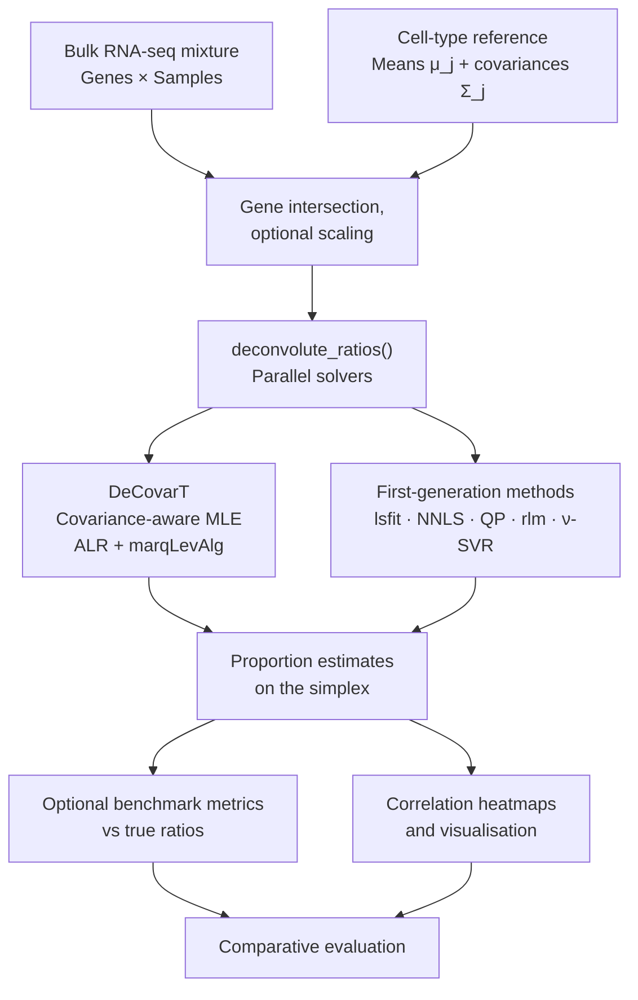
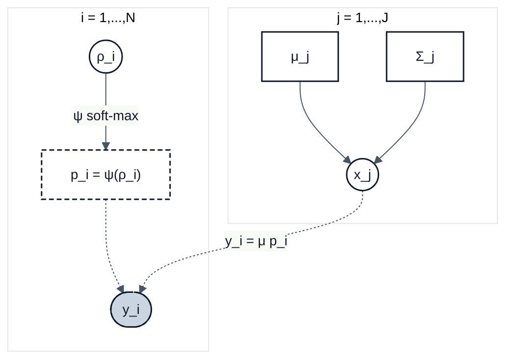

<!-- README.md is generated from README.qmd. Please edit that file. -->

# DeCovarT <a href="https://bastienchassagnol.github.io/DeCovarT/"></a>

<!-- badges: start -->

[](https://www.repostatus.org/#active)
[](https://lifecycle.r-lib.org/articles/stages.html#experimental)
[](https://creativecommons.org/licenses/by/4.0/)
[](https://github.com/bastienchassagnol/DeCovarT)
[](https://github.com/bastienchassagnol/DeCovarT/actions/workflows/R-CMD-check.yaml)
[](https://app.codecov.io/gh/bastienchassagnol/DeCovarT)
<!-- badges: end -->

<p>


</p>

## Overview

**DeCovarT** is an R package for bulk transcriptomic deconvolution that accounts
for gene–gene covariance in purified reference populations. Bulk observations
are modelled as Gaussian convolutions of cell-type means and covariances, with
cellular proportions recovered on the open simplex via an unconstrained
(additive logistic) parametrisation.

The main entry point is `deconvolute_ratios()`, which runs one or more solvers
in parallel and returns estimated proportions plus optional benchmark metrics.

## Pipeline Architecture



> This package combines **Gaussian mixture convolution modelling, simplex
> reparametrisation (ALR / soft-max), analytic likelihood derivatives, and
> classical linear deconvolution baselines** on bulk transcriptomic mixtures.
> Solver outputs remain method-specific; shared evaluation uses standardised
> proportion tables and optional ground-truth ratios from simulations.

### Built-in deconvolution algorithms

| Algorithm | Interface | Notes / upstream |
|:---|:---|:---|
| **DeCovarT** (Marquardt–Levenberg) | `deconvolute_ratios_Marquardt_Levenberg` | Covariance-aware MLE [](https://github.com/bastienchassagnol/DeCovarT) |
| Ordinary least squares (`lsfit`) | `deconvolute_ratios_lsfit` | Abbas / TIMER-style OLS (base R `stats::lsfit`) |
| Non-negative least squares | `deconvolute_ratios_nnls` | Lawson–Hanson NNLS [](https://github.com/cran/nnls) |
| DeconRNASeq-style QP | `deconvolute_ratios_deconrnaseq` | Simplex QP via {limSolve} [](https://github.com/cran/limSolve) |
| Robust linear model (`rlm`) | `deconvolute_ratios_rlm` | ABIS / Monaco-style RLR [](https://github.com/cran/MASS) |
| CIBERSORT-style $\nu$-SVR | `deconvolute_ratios_cibersort` | Linear-kernel SVR via {e1071} [](https://github.com/cran/e1071) |

All of the above ship with the package (no extra method packages required).

### Links to the paper

- [Overleaf repository (shared with Anaïs Baudot)](https://www.overleaf.com/project/697398ed149e81845cb5208e)
- [HAL / arXiv archive](https://arxiv.org/pdf/2309.09557)

## Installation

Install the development version from GitHub with [{pak}](https://pak.r-lib.org/):

``` r
if (!requireNamespace("pak", quietly = TRUE)) {
  install.packages(
    "pak",
    repos = sprintf(
      "https://r-lib.github.io/p/pak/stable/%s/%s/%s",
      .Platform$pkgType,
      R.Version()$os,
      R.Version()$arch
    )
  )
}
pak::pkg_install("bastienchassagnol/DeCovarT")
```

Alternatively with `{remotes}`:

``` r
# install.packages("remotes")
remotes::install_github("bastienchassagnol/DeCovarT")
```

### Developer setup (pre-commit)

Contributors should install [pre-commit](https://pre-commit.com) hooks (Air
formatting, {lintr}, parsable R, README sync). From R:

``` r
# install.packages(c("precommit", "lintr"))
precommit::install_precommit()
precommit::use_precommit()
```

Or from the shell (after `pre-commit` is on `PATH`):

``` bash
pre-commit install
pre-commit run --all-files
```

See [`.github/CONTRIBUTING.MD`](.github/CONTRIBUTING.MD) for the full
contributor guide.

### Continuous integration

GitHub Actions on this repository currently cover:

- **R-CMD-check** — `R CMD check` on push / pull requests
- **pre-commit** — the same local hooks on CI
- **test-coverage** — Codecov reporting
- **pkgdown** — documentation site on GitHub Pages
- **R-hub** — optional Ubuntu + Windows checks (`workflow_dispatch`)
- **version update** — optional DESCRIPTION bumps from commit messages or manual dispatch

## Documentation

Package website: <https://bastienchassagnol.github.io/DeCovarT/>

**Vignettes**

- [Simulating semi-synthetic pseudo-bulk mixtures](https://bastienchassagnol.github.io/DeCovarT/articles/synthetic-scenarios.html)
- [Deconvolution use cases with DeCovarT](https://bastienchassagnol.github.io/DeCovarT/articles/DeCoVart-use-cases.html)
- [Simplex coordinate maps (ALR / additive logistic)](https://bastienchassagnol.github.io/DeCovarT/articles/DeCovarT-numerical-derivatives.html)
- [Softmax and ALR derivatives](https://bastienchassagnol.github.io/DeCovarT/articles/softmax-alr-derivatives.html)

In an R session, use `?DeCovarT::deconvolute_ratios` (or any other exported
function) for help pages.

**Troubleshooting and issues**

- Contributor guidance and common development pitfalls:
  [`.github/CONTRIBUTING.MD`](.github/CONTRIBUTING.MD)
- Bug reports and feature requests:
  [GitHub issues](https://github.com/bastienchassagnol/DeCovarT/issues)

Pull requests are welcome.

## The generative model of DeCovarT

Constrained DeCovarT maps unconstrained coordinates
$\boldsymbol{\rho}_{i}\in\mathbb{R}^{J-1}$ to cellular proportions
$\boldsymbol{p}_{i}$ on the open simplex via a regularised soft-max
$\boldsymbol{\psi}$, then forms the bulk observation as a Gaussian convolution
of cell-type profiles
$\boldsymbol{x}_{j}\sim\mathcal{N}_{G}(\boldsymbol{\mu}_{j},\boldsymbol{\Sigma}_{j})$:

$$
\boldsymbol{y}_{i}\,|\,\cdot
\sim\mathcal{N}_{G}\!\Bigl(
  \boldsymbol{\mu}\boldsymbol{p}_{i},\;
  \sum_{j=1}^{J}p_{ji}^{2}\boldsymbol{\Sigma}_{j}
\Bigr).
$$



Forward map
$\boldsymbol{\psi}:\boldsymbol{\rho}\mapsto\boldsymbol{p}$
($C^{2}$-diffeomorphism):

$$
p_{j}=\frac{e^{\rho_{j}}}{\sum_{k<J}e^{\rho_{k}}+1}\ (j<J),\qquad
p_{J}=\frac{1}{\sum_{k<J}e^{\rho_{k}}+1},\qquad
\boldsymbol{\psi}^{-1}(\boldsymbol{p})=\bigl(\ln(p_{j}/p_{J})\bigr)_{j<J}.
$$

## Compiling the LaTeX article

Source file: `article/main.tex` (bibliography: `article/decovart_library.bib`).
DAG panels in Fig.~DAG-model are drawn with [`tikz-bayesnet`](https://ctan.org/pkg/tikz-bayesnet).

From the repository root, generate `article/main.pdf` with:

``` sh
cd article
latexmk -pdf -interaction=nonstopmode -file-line-error -synctex=1 main.tex
```

In Cursor / VS Code with **LaTeX Workshop**, use the default recipe **latexmk**
(configured in `.vscode/settings.json`), or run **“LaTeX Workshop: Build with recipe”**.

Auxiliaries are removed automatically after a successful build
(`latex-workshop.latex.autoClean.run`: `onSucceeded`). Manual clean: Command Palette
→ **“LaTeX Workshop: Clean up auxiliary files”**.

# Project structure

Package function call graph (DeCovarT → DeCovarT edges only):

``` html
<iframe
  src="output/package_network/decovart_function_network.html"
  title="DeCovarT function call graph"
  width="100%"
  height="720"
  style="border: none;"
></iframe>
```

## Speed up computation with AutoZyme

[AutoZyme](https://autozyme.com/docs/users/usage-guide/) ships drop-in accelerators for common scientific R packages (Seurat, WGCNA, and others in the [patch catalog](https://autozyme.com/docs/users/patch-catalog/)). It is installed locally but **off by default** (`options(autozyme.disabled = TRUE)` → `AUTOZYME_DISABLED=1`).

``` r
# List patches, enable, activate, then check what is bound to the fast path
options(autozyme.disabled = FALSE)
Sys.unsetenv("AUTOZYME_DISABLED")
library(autozyme)
autozyme::list_patches(installed = TRUE)
autozyme::activate(c("seurat", "wgcna"))
autozyme::inspect("seurat")
# Off again: Sys.setenv(AUTOZYME_DISABLED = "1")
#            or autozyme::with_disabled({ ... })  # see usage guide §6
```
