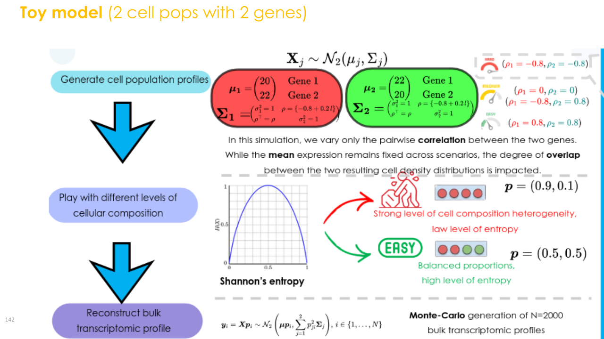
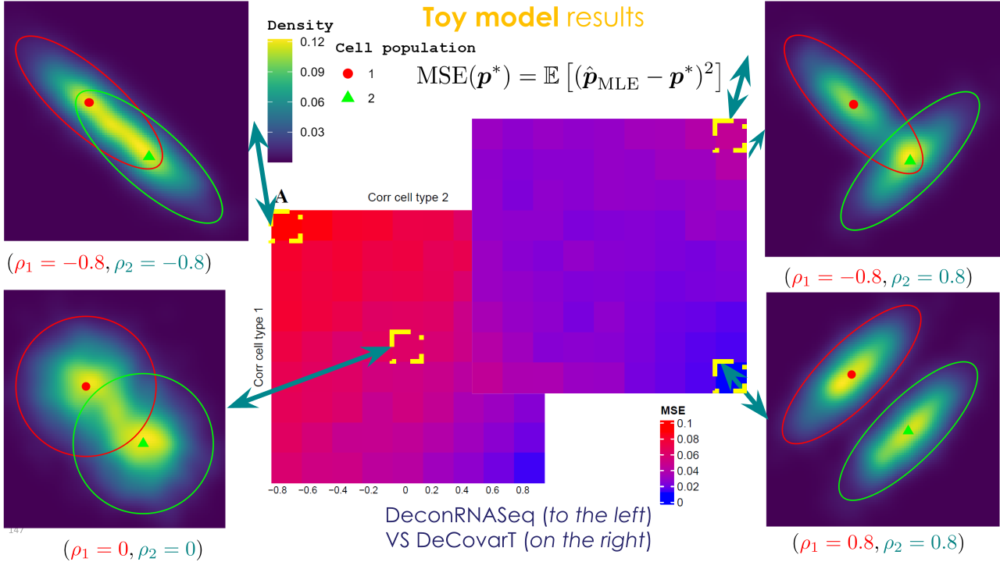
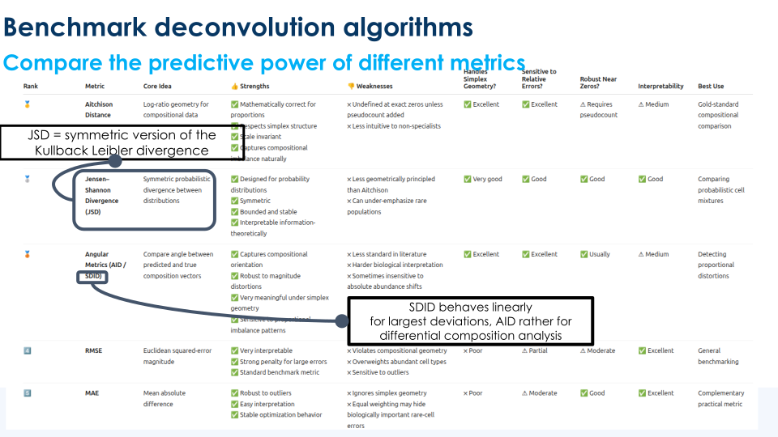
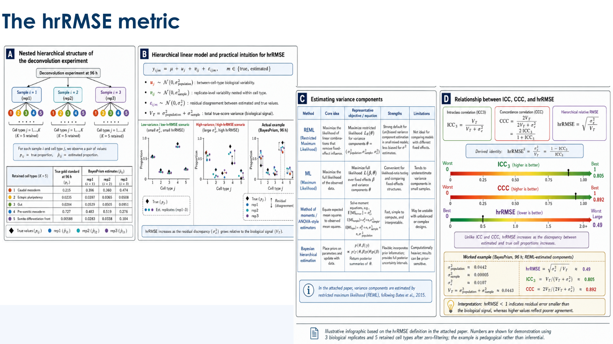
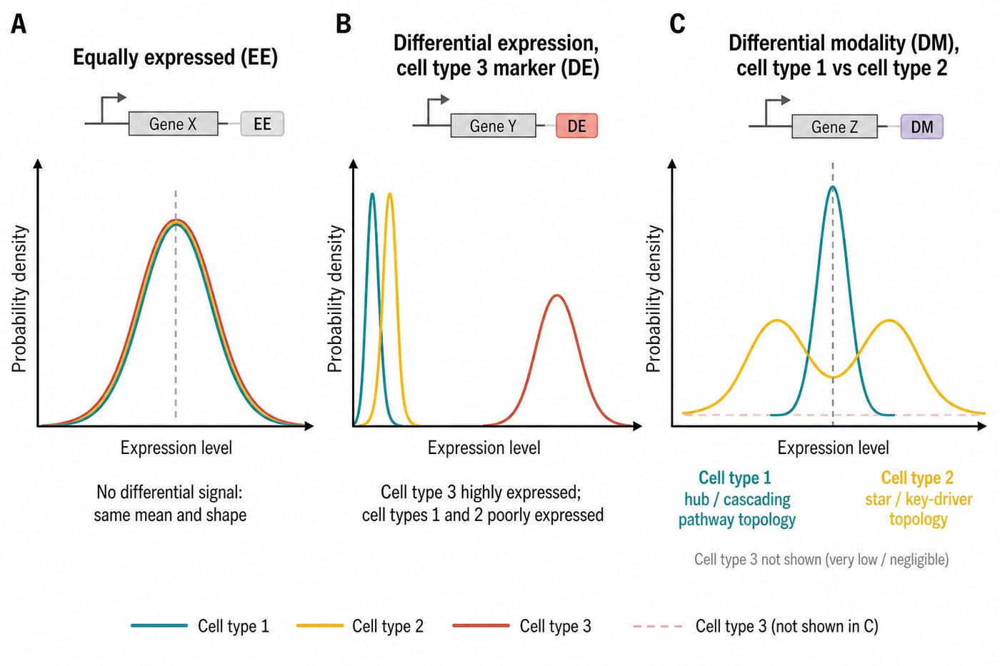

# Manuscript synthetic simulation scenarios

This vignette documents the **synthetic scenarios that enter the methods
paper**: a bivariate Gaussian-convolution toy (G=2, J=2) that isolates
gene–gene correlation, and a high-dimensional hybrid reference (G=50,
J=3) in which two cell types are mean-collinear and must be separated by
network topology.

## Simulation benchmark wrapper

[`run_simulation_benchmark()`](https://bastienchassagnol.github.io/DeCovarT/reference/run_simulation_benchmark.html)
wraps
[`simulate_bulk_mixture()`](https://bastienchassagnol.github.io/DeCovarT/reference/simulate_bulk_mixture.md),
[`deconvolute_ratios()`](https://bastienchassagnol.github.io/DeCovarT/reference/deconvolute_ratios.md),
and
[`compute_benchmark_metrics()`](https://bastienchassagnol.github.io/DeCovarT/reference/compute_benchmark_metrics.md).
Generative grids (proportions, correlation sweeps, mean signatures,
covariance tensors) should be assembled in scripts—see
`scripts/configure_bivariate_toy_scenarios.R` for the bivariate toy
study—and passed as a tibble with a `true_theta` list column.
Deconvolution solvers are supplied as a named list of `FUN` plus
optional `additional_parameters` for
[`do.call()`](https://rdrr.io/r/base/do.call.html). Optional
scenario-level parallelism uses `furrr` and `future` (Suggests), capped
by default at half of detected cores, with per-sample parallelism
disabled inside
[`deconvolute_ratios()`](https://bastienchassagnol.github.io/DeCovarT/reference/deconvolute_ratios.md)
to avoid nested workers.

## Bivariate toy model

The manuscript study is implemented by
[`run_simulation_benchmark()`](https://bastienchassagnol.github.io/DeCovarT/reference/run_simulation_benchmark.md),
with scenario grids built in
`scripts/configure_bivariate_toy_scenarios.R`. Even when mean profiles
are similar, gene–gene correlation can degrade mean-only solvers, and is
partly recovered once \boldsymbol{\Sigma}(\boldsymbol{p})=\sum_j
p_j^2\boldsymbol{\Sigma}\_j enters the likelihood.

With p_1+p_2=1, only one free ALR coordinate is estimated (see
[derivatives under simplex
transforms](https://bastienchassagnol.github.io/DeCovarT/articles/generative-model-derivatives.md)).
[Figure 1](#fig-toy-design) combines the factorial design with a
gene-space density at fixed means, variances, and \boldsymbol{p}.



\(a\) Hyperparameter grid used in the bivariate manuscript study: two
centroid geometries, balanced versus unbalanced \boldsymbol{p}, a
gene–gene correlation sweep, and the first-generation plus DeCovarT
solvers.



\(b\) AI-generated 2D density of the two-gene mixture while only the
pairwise correlation changes, at fixed means, marginal variances, and
composition. The ggplot panel below recomputes the same contrast and
annotates MixSim overlap.

Figure 1: Factorial design (left) and correlation-only 2D densities
(right) for the bivariate toy. {#fig-toy-design}

### Log-likelihood along the simplex

For J=2 the free coordinate is p_1\in(0,1). The listing below evaluates
\ell\_{\boldsymbol{y}\mid\boldsymbol{\zeta}}(p_1,1-p_1) on one bulk draw
(and would feed `plotly` when that Suggests package is installed). It is
not executed during `R CMD build`: Quarto’s Windows CLI starts a new R
process that cannot see the temporary library where the package under
construction was just installed
([quarto-r#217](https://github.com/quarto-dev/quarto-r/issues/217)). The
same likelihood path is checked in `tests/testthat/`.

``` r

set.seed(20260828)
rho <- 0.6
R <- matrix(c(1, rho, rho, 1), nrow = 2)
Sigma <- array(c(R, R), dim = c(2, 2, 2))
dimnames(Sigma) <- list(
  rownames(mu_small),
  rownames(mu_small),
  colnames(mu_small)
)
y_one <- DeCovarT::simulate_bulk_mixture(
  mu_small,
  Sigma,
  p = p_bal,
  n = 1
)$Y[, 1]
p1_grid <- seq(0.02, 0.98, by = 0.01)
ll_grid <- vapply(
  p1_grid,
  function(p1) {
    DeCovarT::loglik_multivariate(c(p1, 1 - p1), y_one, mu_small, Sigma)
  },
  numeric(1)
)
ll_df <- data.frame(p1 = p1_grid, loglik = ll_grid)
gg_ll <- ggplot2::ggplot(ll_df, ggplot2::aes(x = p1, y = loglik)) +
  ggplot2::geom_line(colour = "#1B4F72", linewidth = 0.8) +
  ggplot2::geom_vline(
    xintercept = 0.5,
    linetype = "dashed",
    colour = "grey30"
  ) +
  ggplot2::labs(
    x = "p1 (p2 = 1 - p1)",
    y = "Log-likelihood"
  ) +
  ggplot2::theme_bw(base_size = 11)
gg_ll
```

### How to run the factorial grid

``` r

library(DeCovarT)
source("scripts/configure_bivariate_toy_scenarios.R")

deconvolution_functions <- bivariate_toy_deconvolution_functions(
  itmax = 200L,
  epsilon = 1e-4
)

scenario_config <- build_bivariate_scenario_config(
  proportions = list(
    "balanced" = c(0.5, 0.5),
    "highly unbalanced" = c(0.95, 0.05)
  ),
  signature_matrices = list(
    "small CLD" = matrix(c(20, 22, 22, 20), nrow = 2),
    "large CLD" = matrix(c(20, 40, 40, 20), nrow = 2)
  ),
  corr_sequence = seq(-0.8, 0.8, by = 0.2),
  diagonal_terms = list("homoscedastic" = c(1, 1))
)

bivariate <- run_simulation_benchmark(
  scenario_config = scenario_config,
  deconvolution_functions = deconvolution_functions,
  n = 500,
  cores = 1,
  parallel_scenarios = FALSE
)
```

`config` stores Shannon entropy of \boldsymbol{p} and MixSim overlap;
`simulations` stores per-sample \hat{\boldsymbol{p}} and
[`compute_benchmark_metrics()`](https://bastienchassagnol.github.io/DeCovarT/reference/compute_benchmark_metrics.md).
The article compares DeCovarT with DeconRNASeq / NNLS ([Gong and
Szustakowski 2013](#ref-gongDeconRNASeqStatisticalFramework2013)).

## High-dimensional hybrid scenario

`scripts/generate_random_markov_network.R` (seed `20260807`) builds one
G=50, J=3 reference that mean-only methods cannot fully resolve: types 1
and 2 share a high local cosine on 30 genes and differ only through
\boldsymbol{\Omega}; type 3 has a compact marker block; 10 genes are a
null (`equal_all`) block.

\underbrace{\mathcal{G}\_{12}}\_{30\text{ genes}} \\ \cup\\
\underbrace{\mathcal{G}\_{3}}\_{10\text{ genes}} \\ \cup\\
\underbrace{\mathcal{G}\_{\mathrm{eq}}}\_{10\text{ genes}}, \qquad
\boldsymbol{\Omega}\_j = \mathrm{blockdiag}\bigl(
\boldsymbol{\Omega}\_j^{(\mathcal{G}\_{12})},\\
\boldsymbol{\Omega}\_j^{(\mathcal{G}\_{3})},\\
\boldsymbol{\Omega}\_j^{(\mathcal{G}\_{\mathrm{eq}})} \bigr).

\boldsymbol{\mu} uses two calls to
[`generate_mean_signature_matrix()`](https://bastienchassagnol.github.io/DeCovarT/reference/generate_mean_signature_matrix.md)
([mean signature
construction](https://bastienchassagnol.github.io/DeCovarT/articles/synthetic-scenarios.html#sec-lr-block-mu)):
\rho\_{12}=0.95 on \mathcal{G}\_{12}, then \rho\_{3}=0.05 on a marker
pool for type 3. Local topologies follow the BLGGM two-scale pattern
([Table 1](#tbl-hybrid-topology-design); [GGM
networks](https://bastienchassagnol.github.io/DeCovarT/articles/synthetic-scenarios.html#sec-ggm-networks)).

| Gene block | \# genes | Cell type 1 | Cell type 2 | Cell type 3 |
|----|----|----|----|----|
| `shared_12_vs_3` | 30 | SBM (hub-like modules) | star (one driver) | Erdős–Rényi |
| `marker_3` | 10 | Erdős–Rényi | Erdős–Rényi | scale-free |
| `equal_all` | 10 | Erdős–Rényi | Erdős–Rényi | Erdős–Rényi |

Table 1: Local topology per (gene block, cell type); block-diagonal
precision support.

| pair                     | cosine | Euclidean |
|:-------------------------|-------:|----------:|
| celltype_1 vs celltype_2 |  0.973 |     2.765 |
| celltype_1 vs celltype_3 |  0.562 |    11.219 |
| celltype_2 vs celltype_3 |  0.562 |    11.219 |

Table 2: Realised pairwise geometry of the 50\times 3 mean signature
(seed 20260807).

| cell type | topology | \lambda\_{\min} | \lambda\_{\max} | \kappa(\Omega) | prop. inhib. |
|:---|:---|---:|---:|---:|---:|
| celltype_1 | SBM | 0.100 | 1.685 | 16.846 | 0.500 |
| celltype_2 | star | 0.100 | 3.331 | 33.311 | 0.489 |
| celltype_3 | scale-free | 0.100 | 2.096 | 20.961 | 0.500 |

Table 3: Precision spectra of each cell type’s \boldsymbol{\Omega}\_j
(seed 20260807).

Types 1 and 2 remain near-collinear on the full G=50 vector (cosine
\approx 0.97). Type 3 is only *moderately* separated (cosine \approx
0.56) because the shared \mathcal{G}\_{12} baseline and the flat
`equal_all` block inflate every pairwise inner product—the finite-J
cosine bias of [asymptotic cosine
control](https://bastienchassagnol.github.io/DeCovarT/articles/synthetic-scenarios.html#sec-asymptotic-cosine).
[Table 3](#tbl-topology-diagnostics) shows that types 1 and 2 still
differ in \boldsymbol{\Omega}.


Figure 2: Cell-type-specific block topologies: SBM/hub-like modules
(type 1) and a star (type 2) on the 30 `shared_12_vs_3` genes;
scale-free wiring (type 3) on `marker_3`. The `equal_all` block is
Erdős–Rényi in every type. Edge colour: precision sign (red inhibitory,
teal activatory).

## Implemented solvers

[Table 4](#tbl-solver-diagnostics) lists the **shipped** algorithms and
their default controls (first-generation linear methods in
`R/03_01_first_generation_deconvolution.R`; covariance-aware maps in
`R/03_03_DeCovarT_estimate_ratios_frequentist.R`). All start from the
open simplex via `.starting_simplex()` unless `initial_p` is supplied.
Reproduce the hybrid comparison with
`source("scripts/deconvolute_simulated_scenario.R")` (N=20 bulks, true
\boldsymbol{p}=(0.4,0.4,0.2)).

| Algorithm | Function | Defaults | Constraint |
|:---|:---|:---|:---|
| \nu-SVR (`CIBERSORT`-style) | `deconvolute_ratios_cibersort` | linear kernel; \nu\in\\0.2,0.5,0.8\\ if G\ge 4, else \nu=0.5 | clip negatives, [`repair_simplex()`](https://bastienchassagnol.github.io/DeCovarT/reference/repair_simplex.md) |
| OLS | `deconvolute_ratios_lsfit` | `stats::lsfit(..., intercept = FALSE)` | [`repair_simplex()`](https://bastienchassagnol.github.io/DeCovarT/reference/repair_simplex.md) |
| Robust linear (`ABIS`-style) | `deconvolute_ratios_rlm` | `MASS::rlm(..., method = "M")` | [`repair_simplex()`](https://bastienchassagnol.github.io/DeCovarT/reference/repair_simplex.md) |
| NNLS | `deconvolute_ratios_nnls` | [`nnls::nnls()`](https://rdrr.io/pkg/nnls/man/nnls.html) | [`repair_simplex()`](https://bastienchassagnol.github.io/DeCovarT/reference/repair_simplex.md) |
| QP (`DeconRNASeq`-style) | `deconvolute_ratios_deconrnaseq` | [`limSolve::lsei()`](https://rdrr.io/pkg/limSolve/man/lsei.html) with \mathbf{1}^{\mathsf{T}}\boldsymbol{p}=1, \boldsymbol{p}\ge\mathbf{0} | simplex equality / inequality |
| Marquardt–Levenberg | `deconvolute_ratios_Marquardt_Levenberg` | `epsilon = 1e-4`, `itmax = 200`, ALR | ALR \to open simplex |
| Newton–Raphson | `deconvolute_ratios_Newton_Raphson` | `nlminb`; `rel.tol = x.tol = 1e-4`, `iter.max = 200` | ALR |
| L-BFGS-B | `deconvolute_ratios_L_BFGS_B` | box \[0,1\]^J; `maxit = 200`; then p/\sum p | box + closure |
| BFGS (ALR) | `deconvolute_ratios_gradient_descent` | `method = "BFGS"`, `maxit = 200` | ALR |
| Simulated annealing | `deconvolute_ratios_simulated_annealing` | `method = "SANN"`, `maxit = 200` | ALR |

Table 4: Shipped deconvolution algorithms and default hyperparameters.

## Benchmark metrics

When true \boldsymbol{p}^{\star} is known,
[`compute_benchmark_metrics()`](https://bastienchassagnol.github.io/DeCovarT/reference/compute_benchmark_metrics.md)
currently returns MSE, RMSE, MAE, a pseudo-R^{2}, and Pearson
correlation between \hat{\boldsymbol{p}} and \boldsymbol{p}^{\star}.
Reconstruction-only scores (no \boldsymbol{p}^{\star}) compare
\hat{\boldsymbol{y}}=\boldsymbol{\mu}\hat{\boldsymbol{p}} with
\boldsymbol{y}. [Figure 3](#fig-metrics-families) summarises the broader
families used in recent bulk and spatial benchmarks.



\(a\) Simplex geometry of L_1, L_2, L\_{\infty}, Aitchison, and angular
discrepancies between \boldsymbol{p}^{\star} and \hat{\boldsymbol{p}}.


\(b\) How those distances behave near the centre versus near a vertex of
the simplex.

Figure 3: Compositional error metrics for \boldsymbol{p} on the simplex.



Figure 4: Hierarchical relative RMSE (hrRMSE) used when some reference
types are missing: residual error is scaled by the biological variance
of \boldsymbol{p}^{\star} rather than by raw proportion units ([Ba et
al. 2026](#ref-baWhenLessNot2026)).

Notation matches the article: \boldsymbol{p} on \Delta^{J-1},
\hat{\boldsymbol{p}} the estimator, \boldsymbol{y} the bulk, and
\boldsymbol{\mu} the mean signature.

| Family | Metrics | Role for bulk \boldsymbol{p} |
|:---|:---|:---|
| Implemented now | MSE, RMSE, MAE, Pearson r, pseudo-R^{2} | [`compute_benchmark_metrics()`](https://bastienchassagnol.github.io/DeCovarT/reference/compute_benchmark_metrics.md) |
| Simplex / compositional | L_1, L_2, L\_{\infty}, KL, Aitchison, Jensen–Shannon | HADACA3 error family ([Barbot and Richard 2026](#ref-barbotPromisesLimitsMultimodal2026)); L_p and KL also appear in `imply` / RNA-Sieve evaluations ([Meng et al. 2024](#ref-mengImplyImprovingCelltype2024); [Erdmann-Pham et al. 2021](#ref-erdmann-phamLikelihoodbasedDeconvolutionBulk2021)) |
| Concordance | Lin CCC, sample- and type-wise Pearson / Spearman | Scale-free agreement; hrRMSE is the relative counterpart ([Ba et al. 2026](#ref-baWhenLessNot2026)) |
| Spatial reconstruction | RMSE, PCC, JSD, SSIM, cosine similarity, average ranking score | DANST-style spot reconstruction ([Commun. Biol.](https://www.nature.com/articles/s42003-026-09659-y#Sec9)); SSIM is image-valued and is not a simplex metric |
| Uncertainty | Wald / profile / bootstrap coverage of \boldsymbol{p} | Only when \boldsymbol{p}^{\star} is known (simulations) |

Table 5: Metric families for comparing \hat{\boldsymbol{p}} with
\boldsymbol{p}^{\star} (or \hat{\boldsymbol{y}} with \boldsymbol{y}).

> **Note 1: Which metric to report**
>
> RMSE and MAE remain the default scalar scores in the package. Add an
> L_1 / Aitchison / JSD panel when rare types matter (vertices of the
> simplex), Lin CCC or type-wise correlation when a scale-free ranking
> is needed, and interval coverage whenever the simulation knows
> \boldsymbol{p}^{\star}. Do not treat SSIM as a drop-in replacement for
> simplex L_p scores.

### Related literature (`muscat` / `scDD`)

Pseudobulk tools such as `muscat` ([Crowell et al.
2020](#ref-crowellMuscatDetectsSubpopulationspecific2020)) aggregate
single-cell counts across samples. `scDD` ([Korthauer et al.
2016](#ref-korthauerStatisticalApproachIdentifying2016)) partitions
genes into EE, DE, DP, DM, and DB patterns. The hybrid scenario is a
network-level analogue of three of these ([Figure 5](#fig-dd-taxonomy)):
`equal_all` is EE; `marker_3` is DE for type 3; `shared_12_vs_3` has
**no mean shift between types 1 and 2**, only a precision-topology
contrast (DM-like for deconvolution, not scDD’s original single-gene
modality test).



Figure 5: Schematic EE / DE / DM-like taxonomy for the three gene
blocks.

## References

Ba, Kalidou, Rodolphe Thiébaut, Xavier Hinaut, and Boris Hejblum. 2026.
*When Less Is Not More: DICEPro Mitigates the Impact of Incomplete
Reference Matrices on Cellular Frequency Deconvolution*. bioRxiv.
<https://doi.org/10.64898/2026.06.17.732876>.

Barbot, Hugo, and Magali Richard. 2026. ‘On the Promises and Limits of
Multimodal Integration for Deconvolution: The HADACA3 Benchmark’.
*NeurIPS*.

Crowell, Helena L., Charlotte Soneson, Pierre-Luc Germain, et al. 2020.
‘Muscat Detects Subpopulation-Specific State Transitions from
Multi-Sample Multi-Condition Single-Cell Transcriptomics Data’. *Nature
Communications* 11: 6077. <https://doi.org/10.1038/s41467-020-19894-4>.

Erdmann-Pham, Dan D., Jonathan Fischer, Justin Hong, and Yun S. Song.
2021. ‘Likelihood-Based Deconvolution of Bulk Gene Expression Data Using
Single-Cell References’. *Genome Research* 31 (10): 1794–806.
<https://doi.org/10.1101/gr.272344.120>.

Gong, Ting, and Joseph D. Szustakowski. 2013. ‘DeconRNASeq: A
Statistical Framework for Deconvolution of Heterogeneous Tissue Samples
Based on mRNA-Seq Data’. *Bioinformatics (Oxford, England)* 29.
<https://doi.org/10.1093/bioinformatics/btt090>.

Korthauer, Keegan D., Li-Fang Chu, Michael A. Newton, et al. 2016. ‘A
Statistical Approach for Identifying Differential Distributions in
Single-Cell RNA-seq Experiments’. *Genome Biology* 17: 222.
<https://doi.org/10.1186/s13059-016-1077-y>.

Meng, Guanqun, Yue Pan, Wen Tang, et al. 2024. ‘Imply: Improving
Cell-Type Deconvolution Accuracy Using Personalized Reference Profiles’.
*Genome Medicine* 16 (1): 65.
<https://doi.org/10.1186/s13073-024-01338-z>.
