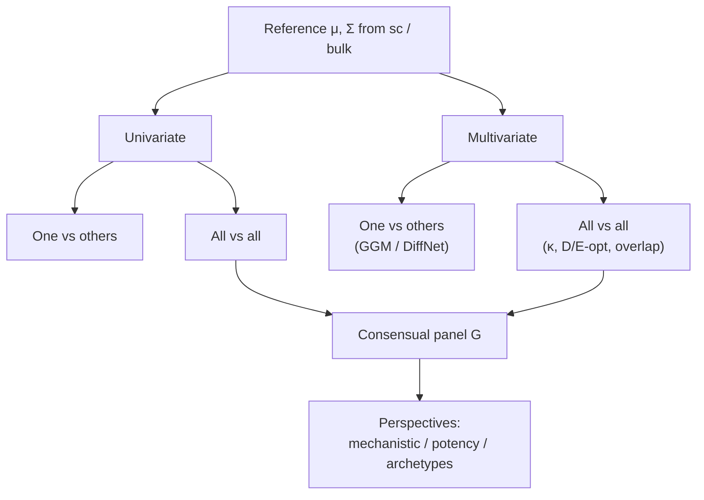
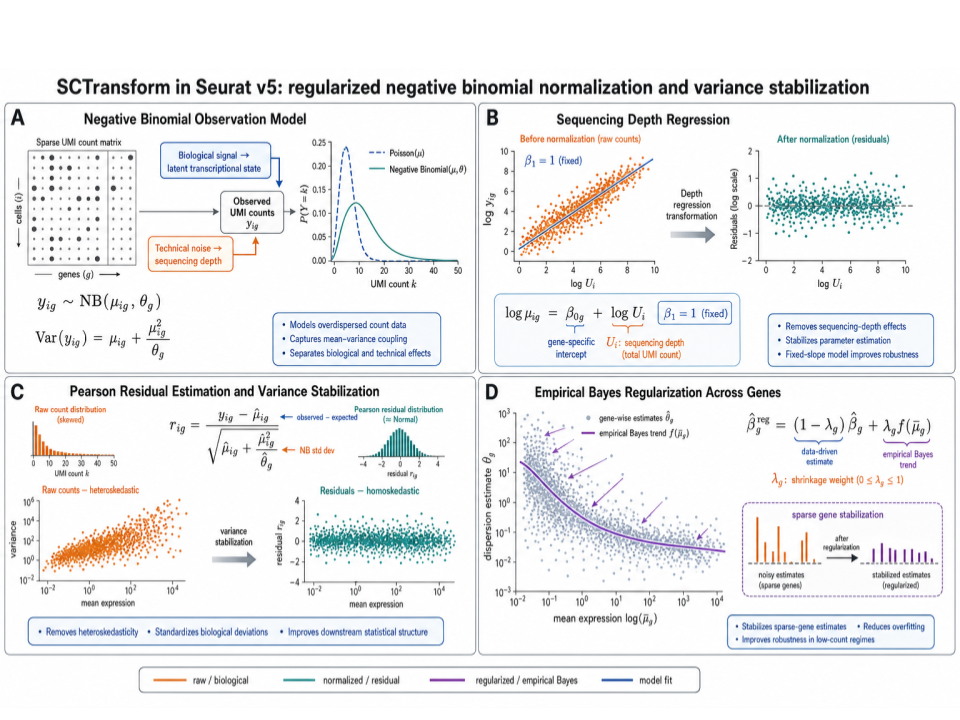
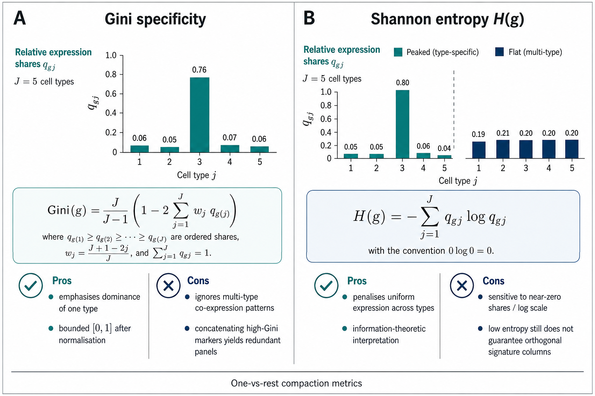
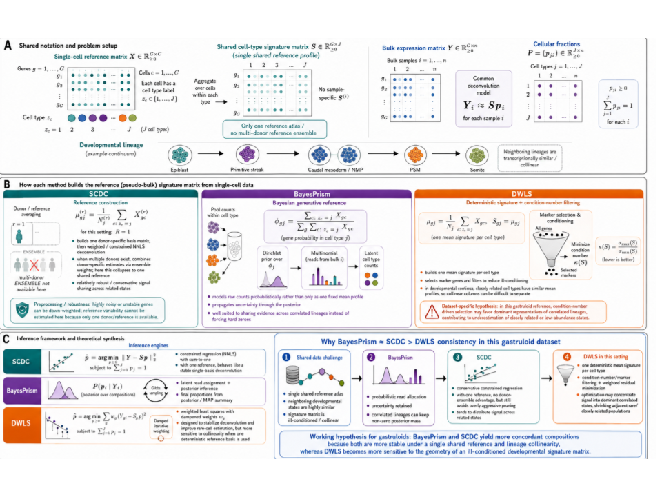
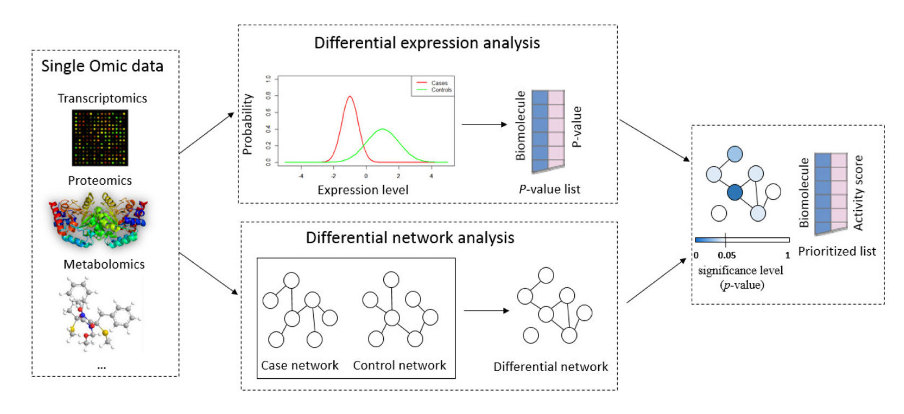
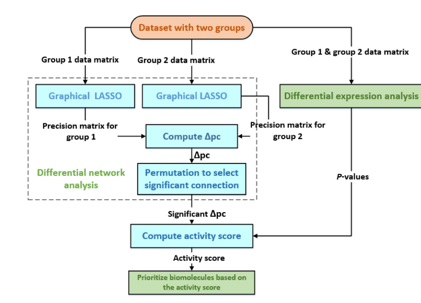
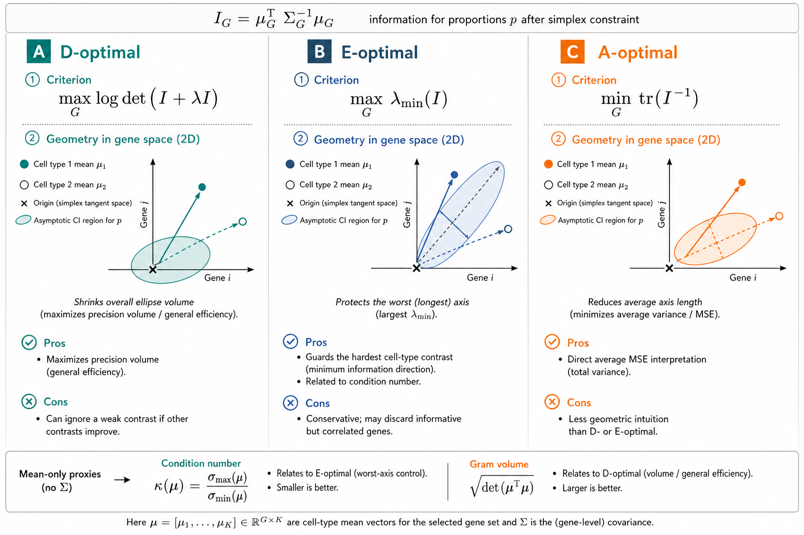

# Feature selection for reference-based deconvolution

## 1 Scope

This vignette surveys **feature selection for reference-based
(signature-based) deconvolution**—methods that recover cellular
proportions \boldsymbol{p} from a bulk mixture using a purified
expression design matrix ([Gaspard-Boulinc et al.
2025](#ref-gaspard-boulincCelltypeDeconvolutionMethods2025); [Avila
Cobos et al.
2018](#ref-avilacobosComputationalDeconvolutionTranscriptomics2018);
[Sturm et al.
2019](#ref-sturmComprehensiveEvaluationTranscriptomebased2019)). Feature
selection itself is a classical pre-modelling filter ([Guyon and
Elisseeff 2003](#ref-guyonIntroductionVariableFeature2003)). We
deliberately exclude **marker-based** abundance scoring (enrichment /
GSEA-style modules), which returns proxies of presence rather than a
consensual gene panel suited to linear or probabilistic mixture models
([Aran et al. 2017](#ref-aranXCellDigitallyPortraying2017); [Zhang et
al. 2017](#ref-zhang_etal17)).

The focus is **second-generation** signatures built from single-cell
pseudobulks (CIBERSORTx, MuSiC, DWLS, Kassandra and related pipelines)
([Newman et al. 2019](#ref-newmanDeterminingCellType2019); [Wang et al.
2019](#ref-wangBulkTissueCell2019); [Tsoucas et al.
2019](#ref-tsoucasAccurateEstimationCelltype2019); [Zaitsev et al.
2022](#ref-zaitsevPreciseReconstructionTME2022)), where the selected
genes must discriminate **all** cell types in the signature jointly, not
only one-versus-rest markers. Correlation-aware compact panels such as
DUBStepR illustrate the same goal from a single-cell feature-selection
angle ([Ranjan et al.
2021](#ref-ranjanDUBStepRScalableCorrelationbased2021)).

Interactive signature refinement utilities (zero filtering, specificity
binning, Gini / entropy compaction) are implemented in
[DeconvExplorer](https://github.com/omnideconv/deconvExplorer)
(omnideconv ecosystem; cite as software once added to `packages.bib`).

Figure 1: Layout of this vignette: univariate and multivariate
selection, each split into one-versus-others then all-versus-all,
followed by perspectives for continuous cell states.

Sections are cross-linked below: [Section 3](#sec-preprocess) builds
moments; [Section 4](#sec-univariate) and [Section 5](#sec-multivariate)
score genes; [Section 6](#sec-wrapper) and [Section 7](#sec-recommended)
assemble a pipeline; [Section 8](#sec-perspectives) covers continua and
Markov blankets.

## 2 Notation

We align notation with the DeCovarT generative model. Let G genes and J
cell types index the purified means
\boldsymbol{\mu}=(\boldsymbol{\mu}\_{.j})\_{j=1}^{J}\in\mathbb{R}^{G\times
J} and (optional) covariances \\\boldsymbol{\Sigma}\_{j}\\\_{j=1}^{J}. A
bulk observation obeys

\boldsymbol{y}\mid(\boldsymbol{\zeta},\boldsymbol{p}) \sim
\mathcal{N}\_{G}\\\left( \boldsymbol{\mu}\boldsymbol{p},\\
\sum\_{j=1}^{J}p\_{j}^{2}\boldsymbol{\Sigma}\_{j} \right), \quad
\boldsymbol{p}\in\Delta^{J-1}, \tag{1}

with \boldsymbol{\zeta}=(\boldsymbol{\mu},\\\boldsymbol{\Sigma}\_{j}\\)
and simplex \Delta^{J-1}=\\\boldsymbol{p}:p\_{j}\ge
0,\sum\_{j}p\_{j}=1\\. For a gene subset
\mathcal{G}\subseteq\\1,\ldots,G\\, write
\boldsymbol{\mu}\_{\mathcal{G}} for the corresponding rows. The
condition number of a design matrix \boldsymbol{X} is

\kappa(\boldsymbol{X}) =
\frac{\lambda\_{\max}(\boldsymbol{X})}{\lambda\_{\min}(\boldsymbol{X})},
\tag{2}

with large \kappa indicating multicollinearity and numerical instability
([Gong and Szustakowski
2013](#ref-gongDeconRNASeqStatisticalFramework2013); [Newman et al.
2015](#ref-newmanRobustEnumerationCell2015)). Singular-value form
\kappa_2(\boldsymbol{X})=\sigma\_{\max}(\boldsymbol{X})/\sigma\_{\min}(\boldsymbol{X})
is used interchangeably when \boldsymbol{X} is rectangular (see also the
[synthetic
scenarios](https://bastienchassagnol.github.io/DeCovarT/articles/synthetic-scenarios.html#sec-geometric-score)
vignette).

## 3 Preprocessing shared by all strategies

Before scoring genes:

- ① Aggregate **donor-level** cell-type pseudobulks (not individual
  cells as independent replicates). Pseudobulking reduces sparsity and
  avoids treating cells as independent biological replicates in
  differential testing ([Squair et al.
  2021](#ref-squairConfrontingFalseDiscoveries2021)).
- ② Estimate gene–cell-type means \mu\_{gj} and variance components on a
  **linear** scale (counts, CPM, or TPM). Log-space breaks the mixture
  linearity in [Equation 1](#eq-mixture). Variance stabilisation for
  *single-cell* QC is handled separately below (see
  [Section 3.1](#sec-sctransform)).
- ③ Filter genes with poor bulk detectability, extreme zero inflation
  after pseudobulking, strong donor instability, or systematic sc–bulk
  discordance.
- ④ When the biological target is **cell number** rather than RNA mass,
  correct transcriptome-size differences across cell types ([Lu et al.
  2025](#ref-luTranscriptomeSizeMatters2025)).
- ⑤ Apply the **same** normalisation to bulk and signature ([Jin and Liu
  2021](#ref-jinBenchmarkRNAseqDeconvolution2021); [Racle et al.
  2017](#ref-racleSimultaneousEnumerationCancer2017)).

### 3.1 Variance stabilisation and highly variable genes

Single-cell count matrices mix **technical** depth noise with
**biological** cell-type variability. Regularised negative-binomial
regression as in `Seurat::SCTransform` / `sctransform` separates the two
via **Pearson residuals** ([Hafemeister and Satija
2019](#ref-hafemeisterNormalizationVarianceStabilization2019)):

1.  Infer a depth-aware mean \hat{\mu}\_{ig} for cell i and gene g
    (library size enters as an offset; optional covariates can be
    included in the design).
2.  Infer a gene-wise dispersion \hat{\theta}\_{g} with empirical-Bayes
    shrinkage and a local mean–dispersion trend across genes.
3.  Form Pearson residuals r\_{ig} = \frac{y\_{ig}-\hat{\mu}\_{ig}}
    {\sqrt{\hat{\mu}\_{ig}+\hat{\mu}\_{ig}^{2}/\hat{\theta}\_{g}}},
    \tag{3} which are approximately homoscedastic and closer to Gaussian
    than raw counts—useful for PCA / HVG ranking, **not** as the linear
    mixture scale in [Equation 1](#eq-mixture).

[Figure 2](#fig-sc-transform) summarises the negative-binomial
observation model, depth regression, residualisation, and
empirical-Bayes shrinkage.

Figure 2: SCTransform workflow: negative-binomial mean–variance model,
depth regression, Pearson residuals, and empirical-Bayes regularisation
across genes.

After residualisation, retain a compact **highly variable gene (HVG)**
universe before signature scoring. A practical design that emphasises
cell-type structure (rather than a global intercept) is

\sim\\ \texttt{CellType}

**without intercept**, so the estimated coefficients contrast each
labelled type against the **global mean expression across cell types and
samples**. Rank genes by residual variance (or the corresponding model F
/ deviance explained) and keep the top 2{,}000 HVGs as the working
universe for the selectors in [Section 4](#sec-univariate) and
[Section 5](#sec-multivariate). Downstream deconvolution still uses
**linear-scale** \mu\_{gj} on that gene set ([Sturm et al.
2019](#ref-sturmComprehensiveEvaluationTranscriptomebased2019)).

> **Tip 1: ℹ️ Sanity check after SCTransform**
>
> Per gene, residual histograms and mean–variance plots of r\_{ig}
> should look roughly Gaussian and flat. Strong remaining depth trends
> or heavy tails indicate that the offset / covariate design is
> misspecified before any marker ranking.

## 4 Univariate approaches

Univariate selectors score each gene marginally (or with a simple
contrast) and ignore partial correlations among genes.

### 4.1 One versus others

Classical signature pipelines score gene g for cell type j against the
remaining types, then concatenate per-type shortlists ([Abbas et al.
2009](#ref-abbasDeconvolutionBloodMicroarray2009); [Newman et al.
2015](#ref-newmanRobustEnumerationCell2015); [Finotello et al.
2019](#ref-finotello_etal19)).

#### 4.1.1 Differential expression and fold-change ranks

Limma–voom, edgeR and DESeq2 remain the workhorses for one-versus-rest
contrasts ([Ritchie et al.
2015](#ref-ritchieLimmaPowersDifferential2015a); [Robinson et al.
2010](#ref-robinsonEdgeRBioconductorPackage2010); [Love et al.
2014](#ref-loveModeratedEstimationFold2014a)). CIBERSORT retains genes
with adjusted p\le 0.3 ordered by decreasing fold-change before a global
condition-number prune ([Newman et al.
2015](#ref-newmanRobustEnumerationCell2015)). Abbas et al. keep genes
that exceed the second- and third-ranked cell types, then choose the
panel with smallest \kappa ([Abbas et al.
2009](#ref-abbasDeconvolutionBloodMicroarray2009)). quanTIseq /
xCell-style filters further drop non-haematopoietic contaminants
([Finotello et al. 2019](#ref-finotello_etal19); [Aran et al.
2017](#ref-aranXCellDigitallyPortraying2017)).

#### 4.1.2 ANOVA F-test

Wang et al. rank genes by the nested-model F statistic comparing a
cell-type factor to an intercept-only model ([Wang et al.
2010](#ref-wangSilicoEstimatesTissue2010)). For gene g with expression
x\_{gi} in sample i and cell-type labels z\_{i}\in\\1,\ldots,J\\,

F\_{g} = \frac{ \bigl(\mathrm{SSR}\_{0}-\mathrm{SSR}\_{1}\bigr)/(J-1) }{
\mathrm{SSR}\_{1}/(n-J) }, \tag{4}

where \mathrm{SSR}\_{0}=\sum\_{i}(x\_{gi}-\bar{x}\_{g})^{2} and
\mathrm{SSR}\_{1}=\sum\_{j}\sum\_{i:z\_{i}=j}(x\_{gi}-\bar{x}\_{gj})^{2}.
Large F\_{g} indicates that cell-type means explain a substantial share
of gene variance.

Classical ANOVA inference for [Equation 4](#eq-anova-f) assumes, among
other things:

- independent observations (hence donor-level pseudobulks rather than
  cells as replicates; [Section 3](#sec-preprocess));
- roughly **Gaussian conditional residuals** x\_{gi}\mid
  z\_{i}=j\sim\mathcal{N}(\mu\_{gj},\sigma\_{g}^{2}) with common
  within-type variance (homoscedasticity);
- no strong outliers or unmodelled batch structure.

When residuals are heavy-tailed or variance scales with the mean, prefer
a GLM / limma–voom pipeline ([Ritchie et al.
2015](#ref-ritchieLimmaPowersDifferential2015a)) and treat F\_{g} as a
ranking score rather than a calibrated p-value.

#### 4.1.3 Gini and entropy specificity

BioQC and DeconvExplorer compact signatures with Gini or entropy scores
over the row \boldsymbol{\mu}\_{g\cdot} ([Zhang et al.
2017](#ref-zhang_etal17)). Write non-negative mean expression as
relative **shares**

q\_{gj} = \frac{\mu\_{gj}}{\sum\_{\ell=1}^{J}\mu\_{g\ell}}, \qquad
\sum\_{j}q\_{gj}=1, \tag{5}

so \boldsymbol{q}\_{g} is a discrete distribution over cell types. The
**Gini coefficient** of inequality among ordered shares
q\_{g(1)}\le\cdots\le q\_{g(J)} and the **Shannon entropy** are

\mathrm{Gini}(g) = \frac{J}{J-1} \left( 1-2\sum\_{j=1}^{J}
\frac{J-j+\tfrac{1}{2}}{J}\\q\_{g(j)} \right), \quad H(g) =
-\sum\_{j=1}^{J}q\_{gj}\log q\_{gj}. \tag{6}

High Gini (or low entropy) flags genes whose mass concentrates on few
types—useful for one-versus-rest compaction.
[Figure 3](#fig-gini-entropy) contrasts the two scores.

Figure 3: Gini versus Shannon entropy for cell-type specificity:
formulas, simplified share plots, and panel-wise pros/cons for
one-versus-rest compaction.

“Redundancy when panels are concatenated” means the following. A gene
with high Gini for type A and another with high Gini for type B may
still be **nearly collinear** as rows of \boldsymbol{\mu} if both types
co-express correlated programmes (shared lineage, activation axis).
Concatenating the top-k genes per type therefore inflates
\|\mathcal{G}\| without improving the geometry of
\boldsymbol{\mu}\_{\mathcal{G}}: \kappa(\boldsymbol{\mu}\_{\mathcal{G}})
stays large and NNLS / SVR / GLS remain unstable ([Newman et al.
2015](#ref-newmanRobustEnumerationCell2015)). That is why
[Section 4.1](#sec-univ-one-vs-others) must be followed by an
all-versus-all stage (see [Section 4.2](#sec-univ-all-vs-all),
[Section 5.3](#sec-multi-all-vs-all)).

> **Warning 2: ⚠️ Limitation of one-versus-rest concatenation**
>
> Union of per-type markers often yields a multicollinear
> \boldsymbol{\mu}\_{\mathcal{G}} that is still too large for stable
> NNLS / SVR / GLS ([Newman et al.
> 2015](#ref-newmanRobustEnumerationCell2015); [Avila Cobos et al.
> 2018](#ref-avilacobosComputationalDeconvolutionTranscriptomics2018)).
> A global all-versus-all refinement is therefore required (see
> [Section 5.3](#sec-multi-all-vs-all)).

### 4.2 All versus all

#### 4.2.1 Genetic algorithms (AutoGeneS)

AutoGeneS searches gene subsets with a multi-objective genetic algorithm
that **minimises inter-population correlation** while **maximising
centroid distance** ([Aliee and Theis
2021](#ref-alieeAutoGeneSAutomaticGene2021)). Related multi-objective
genetic searches appear in network module discovery (e.g. MOGAMUN)
([Novoa-del-Toro et al.
2021](#ref-novoa-del-toroMultiobjectiveGeneticAlgorithm2021)). AutoGeneS
is explicitly all-versus-all: the loss is defined on the full J-column
signature rather than on independent one-versus-rest lists.

DeCovarT replaces that dual objective with a single **global overlap**
criterion on the Gaussian mixture
\\(p\_{j},\boldsymbol{\mu}\_{.j},\boldsymbol{\Sigma}\_{j})\\ (see
[Equation 13](#eq-overlap) and 1).

## 5 Multivariate approaches

Multivariate selectors use joint dependence—covariance, precision, or
information matrices—so that a gene is scored by how it improves
identifiability of \boldsymbol{p} under [Equation 1](#eq-mixture).

### 5.1 Limitations of mean-only condition numbers

Condition-number pruning (see [Equation 2](#eq-condition-number))
operates almost exclusively on the **mean** signature
\boldsymbol{\mu}\_{\mathcal{G}}. It does not see covariance rewiring:
two closely related types can share nearly collinear means yet differ in
their precision graphs
\boldsymbol{\Omega}\_{j}=\boldsymbol{\Sigma}\_{j}^{-1}. In
**continua**—gastruloids, differentiation trajectories, activation
gradients—neighbouring states are transcriptionally similar by
construction, so \kappa(\boldsymbol{\mu}) is intrinsically large.
Aggressive \kappa-minimisation then tends to keep a few dominant lineage
representatives and drop genes that separate neighbours only through
**network rewiring** rather than large mean fold-changes ([Tsoucas et
al. 2019](#ref-tsoucasAccurateEstimationCelltype2019); [Wang et al.
2019](#ref-wangBulkTissueCell2019)).

[Figure 4](#fig-kappa-gastruloid) illustrates this failure mode for a
gastruloid lineage continuum: mean-conditioned DWLS-style selection can
under-represent adjacent or low-abundance states relative to methods
that retain softer, covariance-aware allocation.

Figure 4: Condition-number pruning on correlated developmental cell
types (gastruloid continuum). Mean-only \kappa filtering can concentrate
signal in dominant collinear lineages and shrink closely related states.

> **Important 3: ⚠️ When \kappa(\boldsymbol{\mu}) is not enough**
>
> Use \kappa as a **diagnostic** of mean geometry, not as the sole
> selector, whenever cell states form a continuum or when discriminatory
> signal lives in \boldsymbol{\Sigma}\_{j} (see
> [Section 5.2.1](#sec-indeed) and
> [Section 5.3.2](#sec-optimal-design)). Pair it with overlap (see
> [Equation 13](#eq-overlap)), Fisher information (see
> [Equation 10](#eq-fisher)), or differential-network candidates.

### 5.2 One versus others

Univariate DGE ignores gene–gene interactions and therefore requires
aggressive multiple-testing correction without modelling network
rewiring. Differential-network and GGM methods address that gap.

#### 5.2.1 Differential networks (INDEED and related)

INDEED combines mean (fold-change) evidence with tests of changes in
**partial correlation**, ranking genes that both shift in mean **and**
rewire neighbourhood structure ([Zuo et al.
2016](#ref-zuoINDEEDIntegratedDifferential2016)).
[Figure 5](#fig-indeed) summarises the graphical abstract and
computational pipeline.

\(a\) INDEED graphical abstract: parallel differential expression and
differential-network tracks merged into an activity-ranked biomarker
list (adapted from Zuo et al.
([2016](#ref-zuoINDEEDIntegratedDifferential2016))).

\(b\) INDEED pipeline: group-wise graphical lasso, differential partial
correlations \Delta\mathrm{pc} with permutation filtering, DE p-values,
and activity-score prioritisation (adapted from Zuo et al.
([2016](#ref-zuoINDEEDIntegratedDifferential2016))).

Figure 5: INDEED integrates differential expression with differential
network structure to prioritise biomolecules.

For groups k\in\\1,2\\ (e.g. focal cell type versus the rest), let
\boldsymbol{\Omega}^{(k)} be a sparse precision estimate from graphical
lasso. Partial correlations are

\mathrm{pc}\_{gg'}^{(k)} = -\frac{\omega\_{gg'}^{(k)}}
{\sqrt{\omega\_{gg}^{(k)}\\\omega\_{g'g'}^{(k)}}}, \qquad
\Delta\mathrm{pc}\_{gg'} =
\mathrm{pc}\_{gg'}^{(1)}-\mathrm{pc}\_{gg'}^{(2)}. \tag{7}

Significant edges are retained after a permutation (or bootstrap) null
on \Delta\mathrm{pc}\_{gg'}. With a differential-expression p-value
p\_{g}^{\mathrm{DE}} for gene g, INDEED forms an **activity score** that
multiplies mean evidence by differential connectivity, schematically

\mathrm{AS}\_{g} = \bigl(-\log p\_{g}^{\mathrm{DE}}\bigr) \sum\_{g'\neq
g} \bigl\lvert\Delta\mathrm{pc}\_{gg'}\bigr\rvert \\
\mathbf{1}\\\left\\\Delta\mathrm{pc}\_{gg'}\\
\text{significant}\right\\, \tag{8}

and ranks genes by \mathrm{AS}\_{g} ([Zuo et al.
2016](#ref-zuoINDEEDIntegratedDifferential2016)). Relative to pure DGE,
this favours genes whose local **undirected** neighbourhood (Markov
boundary in the GGM sense; [Section 8.3](#sec-markov-seeds)) differs
between the focal type and the rest. Related ideas appear in weighted
graphical-lasso pipelines with PPI priors and differential-network
scores (DNS).

#### 5.2.2 Sparse GGMs and cooperative penalties

Cell-type precision matrices
\boldsymbol{\Omega}\_{j}=\boldsymbol{\Sigma}\_{j}^{-1} estimated by
graphical lasso are shrunk; non-zero partial correlations are typically
underestimated. A practical mitigation is to take the gLasso **support**
as topological constraints and re-estimate by constrained MLE when the
graph is chordal (otherwise the mapping is non-trivial) ([Dahl et al.
2005](#ref-dahlMaximumLikelihoodEstimation2005)). Cooperative /
sign-coherent group lasso penalties can encode pathway modules and
PPI-informed edge weights ([Chiquet et al.
2012](#ref-chiquetSparsitySigncoherentGroups2012)). PPI priors also
shrink the combinatorial space of undirected graphs explored per cell
type.

> **Warning 4: ⚠️ From one-versus-others networks to a panel**
>
> Network-based one-versus-others lists still concatenate into a
> redundant design (see [Note 2](#nte-ovr-concat)). Treat them as
> **candidate generators** for the all-versus-all stage in
> [Section 5.3](#sec-multi-all-vs-all).

### 5.3 All versus all

#### 5.3.1 Variance-weighted condition number

With gene-specific uncertainties \tau\_{g}^{2} (biological + sampling +
optional sc–bulk discordance), standardise rows and evaluate
conditioning in the (J-1)-dimensional contrast space induced by
\sum\_{j}p\_{j}=1:

\widetilde{\mu}\_{gj} = \frac{\mu\_{gj}-\bar{\mu}\_{g}}{\tau\_{g}},
\qquad \kappa\\\left(
\boldsymbol{W}\_{\mathcal{G}}^{1/2}\boldsymbol{\mu}\_{\mathcal{G}}\boldsymbol{C}
\right), \tag{9}

where \boldsymbol{W}\_{\mathcal{G}}=\mathrm{diag}(1/\tau\_{g}^{2}) and
\boldsymbol{C} removes the common-expression direction. Unweighted
\kappa(\boldsymbol{\mu}\_{\mathcal{G}}) alone can favour quiet but
biased genes ([Gong and Szustakowski
2013](#ref-gongDeconRNASeqStatisticalFramework2013)); see also
[Section 5.1](#sec-kappa-limits).

#### 5.3.2 D- / E- / A-optimal design

Under approximately Gaussian errors
\boldsymbol{y}\_{\mathcal{G}}\mid\boldsymbol{p}
\sim\mathcal{N}(\boldsymbol{\mu}\_{\mathcal{G}}\boldsymbol{p},
\boldsymbol{\Sigma}\_{\mathcal{G}}), the **Fisher information** for the
proportions (after removing the simplex null direction) is the J\times J
Gram matrix of the whitened means

\mathcal{I}\_{\mathcal{G}} = \boldsymbol{\mu}\_{\mathcal{G}}^{\top}
\boldsymbol{\Sigma}\_{\mathcal{G}}^{-1} \boldsymbol{\mu}\_{\mathcal{G}}
\in\mathbb{R}^{J\times J}. \tag{10}

Here \boldsymbol{\Sigma}\_{\mathcal{G}} is the bulk (or pseudobulk)
covariance on genes \mathcal{G}—diagonal or shrinkage estimators are
typical in practice. Large eigenvalues of \mathcal{I}\_{\mathcal{G}}
correspond to well-informed contrasts of \boldsymbol{p}; a vanishing
\lambda\_{\min}(\mathcal{I}\_{\mathcal{G}}) means at least one cell-type
contrast is unidentifiable from the panel.

Classical alphabetical criteria ([Atkinson and Donev
1992](#ref-atkinsonOptimumExperimentalDesigns1992); [Pukelsheim
2006](#ref-pukelsheimOptimalDesignExperiments2006)) are

\max\_{\mathcal{G}}\log\det(\mathcal{I}\_{\mathcal{G}}+\lambda\boldsymbol{I})
\quad\text{(D)}, \qquad
\max\_{\mathcal{G}}\lambda\_{\min}(\mathcal{I}\_{\mathcal{G}})
\quad\text{(E)}, \qquad
\min\_{\mathcal{G}}\operatorname{tr}(\mathcal{I}\_{\mathcal{G}}^{-1})
\quad\text{(A)}. \tag{11}

[Figure 6](#fig-dea-design) recalls the three criteria geometrically.

Figure 6: D-, E- and A-optimal design for gene-panel selection: shared
Fisher information \mathcal{I}\_{\mathcal{G}}, confidence-ellipse
intuition, and links to condition number / Gram volume.

> **Note 5: ℹ️ Pros and cons of D / E / A**
>
> - **D-optimality** (\log\det): shrinks the volume of the asymptotic
>   confidence ellipsoid for \boldsymbol{p}. Efficient in an average
>   sense; can still leave one weak contrast if other directions
>   improve.
> - **E-optimality** (\lambda\_{\min}): protects the **worst** contrast.
>   Closest in spirit to minimising \kappa(\mathcal{I}\_{\mathcal{G}})
>   or maximising \lambda\_{\min}/\lambda\_{\max}. Conservative when
>   several contrasts are already strong.
> - **A-optimality** (\operatorname{tr}\mathcal{I}^{-1}): minimises
>   average parameter variance (MSE under the Gaussian approximation).
>   Interpretable, but less geometric than D/E.
>
> In practice prefer shrinkage \boldsymbol{\Sigma}\_{\mathcal{G}} and a
> ridge \lambda\boldsymbol{I} for D when \|\mathcal{G}\| is moderate and
> J is not tiny.

**Relation to \kappa and the Gram volume.** If one pretends
\boldsymbol{\Sigma}\_{\mathcal{G}}=\boldsymbol{I}, then
\mathcal{I}\_{\mathcal{G}}=\boldsymbol{\mu}\_{\mathcal{G}}^{\top}\boldsymbol{\mu}\_{\mathcal{G}}
and D-optimality maximises
\log\det(\boldsymbol{\mu}\_{\mathcal{G}}^{\top}\boldsymbol{\mu}\_{\mathcal{G}}),
i.e. the log **Gram volume** of the mean columns. E-optimality maximises
\lambda\_{\min} of that Gram matrix and is therefore a direct cousin of
minimising \kappa_2(\boldsymbol{\mu}\_{\mathcal{G}}) (see
[Equation 2](#eq-condition-number)). The [synthetic
scenarios](https://bastienchassagnol.github.io/DeCovarT/articles/synthetic-scenarios.html#sec-geometric-score)
vignette discusses the same objects as AutoGeneS-style scalar summaries
of \boldsymbol{\mu} (Gram determinant V(\boldsymbol{\mu}) and reciprocal
condition number \kappa_2(\boldsymbol{\mu})^{-1}). Weighted /
information-optimal criteria here extend those mean-only scores by
inserting \boldsymbol{\Sigma}\_{\mathcal{G}}^{-1}.

**Relation to overlap and Wasserstein geometry.** The MixSim-style
**average overlap** \overline{\Omega} (see [Equation 13](#eq-overlap))
is a *probabilistic* separation score for the purified Gaussians
\mathcal{N}(\boldsymbol{\mu}\_{.j},\boldsymbol{\Sigma}\_{j}): it answers
how often a MAP rule confuses type j with \ell. D/E/A instead optimise
**estimation** of \boldsymbol{p} under a single bulk covariance. They
need not agree: a panel can have small confidence ellipsoids for
\boldsymbol{p} yet still high pairwise overlap if priors p\_{j} or
class-conditional covariances differ. A related geometric alternative is
the **2-Wasserstein** distance between purified Gaussians,

W\_{2}^{2}\bigl(
\mathcal{N}(\boldsymbol{\mu}\_{.j},\boldsymbol{\Sigma}\_{j}),
\mathcal{N}(\boldsymbol{\mu}\_{.\ell},\boldsymbol{\Sigma}\_{\ell})
\bigr) =
\lVert\boldsymbol{\mu}\_{.j}-\boldsymbol{\mu}\_{.\ell}\rVert\_{2}^{2} +
\mathfrak{B}^{2}(\boldsymbol{\Sigma}\_{j},\boldsymbol{\Sigma}\_{\ell}),
\tag{12}

with \mathfrak{B}^{2} the Bures metric on covariances. W\_{2} (and
overlap) treat each purified law symmetrically; Fisher information
treats the mixture regression for \boldsymbol{p}. Use D/E/A for panel
design under [Equation 1](#eq-mixture), and overlap / W\_{2} as
interpretable monitors of class separation ([Melnykov et al.
2024](#ref-R-MixSim); [Aliee and Theis
2021](#ref-alieeAutoGeneSAutomaticGene2021)).

#### 5.3.3 Global overlap (DeCovarT proposal)

AutoGeneS optimises correlation and centroid distance separately ([Aliee
and Theis 2021](#ref-alieeAutoGeneSAutomaticGene2021)). We instead
minimise the **average pairwise overlap** of the purified Gaussians,
which folds mean separation **and** covariance structure into one
interpretable probability: the chance of mis-assigning a draw under a
MAP rule. With MixSim-style pairwise misclassification masses
\Omega\_{jl} ([Melnykov et al. 2024](#ref-R-MixSim)),

\overline{\Omega} = \frac{2}{J(J-1)} \sum\_{1\le j\<\ell\le J}
\bigl(p\_{j}\Omega\_{j\ell}+p\_{\ell}\Omega\_{\ell j}\bigr). \tag{13}

Package helper
[`compute_average_overlap()`](https://bastienchassagnol.github.io/DeCovarT/reference/compute_average_overlap.md)
implements [Equation 13](#eq-overlap). Lower \overline{\Omega}
corresponds to better-separated purified profiles and, empirically, to
more accurate recovery of \boldsymbol{p}.

## 6 Wrapper optimisation on pseudo-bulks and matched bulks

When matched sc/bulk aliquots exist (e.g. Kassandra-style benchmarks)
([Zaitsev et al. 2022](#ref-zaitsevPreciseReconstructionTME2022)),
evaluate candidate panels by running the **intended** deconvolution
algorithm on held-out mixtures and scoring RMSE / worst-type error /
rare-cell recall under nested **donor-level** cross-validation. Use the
one-standard-error rule to prefer the smallest panel statistically
indistinguishable from the best. Wrappers overfit the mixture simulator
if real matched bulks are omitted ([Sturm et al.
2019](#ref-sturmComprehensiveEvaluationTranscriptomebased2019); [Jin and
Liu 2021](#ref-jinBenchmarkRNAseqDeconvolution2021)).

| Stage | Examples | Role |
|:---|:---|:---|
| Univariate 1 vs others | DE / F-test / Gini entropy | Candidate generation |
| Univariate all vs all | AutoGeneS | Panel compaction |
| Multivariate 1 vs others | INDEED; sparse GGM | Network-aware candidates |
| Multivariate all vs all | Weighted \<U+03BA\>; D/E/A-opt; overlap | Identifiability of p |
| Wrapper | Nested CV on matched bulks | Empirical size selection |

Table 1: Compact map from selection strategy to typical role in a
reference-based pipeline.

## 7 Recommended pipeline

- ① **Reference moments** (see [Section 3](#sec-preprocess)).
  Donor-level pseudobulks; estimate \boldsymbol{\mu} and variance
  components on a linear scale; optional SCTransform / top-2{,}000 HVGs
  (see [Section 3.1](#sec-sctransform)) to define the gene universe.
- ② **Reliability filter.** Drop unstable / undetectable / discordant
  genes; optionally inflate \tau\_{g}^{2} by observed sc–bulk
  discrepancy.
- ③ **Candidates.** Union of stable one-versus-others DE (see
  [Section 4.1](#sec-univ-one-vs-others)), high Gini / low entropy (see
  [Section 4.1.3](#sec-gini-entropy)), and (optionally)
  differential-network hits (see [Section 5.2.1](#sec-indeed)) → roughly
  10^{2}–10^{3} genes.
- ④ **Information-optimal subset.** Greedy D- or E-optimal selection
  (see [Equation 11](#eq-optimal-design)) or weighted \kappa (see
  [Equation 9](#eq-weighted-kappa)), with overlap (see
  [Equation 13](#eq-overlap)) as a secondary monitor; heed
  [Section 5.1](#sec-kappa-limits) on continua.
- ⑤ **Wrapper prune** (see [Section 6](#sec-wrapper)). Evaluate panel
  sizes along the path under nested donor CV and matched bulks; keep the
  smallest competitive panel.

The distinctive contribution for DeCovarT-style second-generation models
is a **bulk-calibrated, variance-weighted information criterion plus
overlap**, exploiting paired sc/bulk designs when available.

## 8 Perspectives

### 8.1 Mechanistic priors

PPI / TF networks and pathway modules can regularise both GGM estimation
and cooperative penalties ([Chiquet et al.
2012](#ref-chiquetSparsitySigncoherentGroups2012); [Zuo et al.
2016](#ref-zuoINDEEDIntegratedDifferential2016)), shrinking the search
toward biologically plausible supports rather than purely statistical
markers.

### 8.2 Continuous states, potency and archetypes

Many tissues are better described by **continua** (differentiation
trajectories, activation gradients) than by discrete labels. In that
regime, a finite J-column signature is a piecewise approximation of an
archetype geometry ([Hart et al.
2015](#ref-hartInferringBiologicalTasks2015)) or a potency axis ([Gulati
et al. 2020](#ref-gulatiSinglecellTranscriptionalDiversity2020)): genes
should separate extreme vertices **and** resolve interior mixtures along
trajectories. Open directions include replacing hard one-versus-others
contrasts with scores along inferred latent axes, and evaluating overlap
/ Fisher information on continuous rather than categorical components.
Until such methods mature, hierarchical discrete panels (lineage →
subtype) remain a pragmatic compromise ([Wang et al.
2019](#ref-wangBulkTissueCell2019)). See also
[Section 5.1](#sec-kappa-limits).

### 8.3 Seeds and undirected Markov boundaries

A complementary panel-expansion strategy starts from a small set of
**seeds**—genes that are already highly discriminatory for
\boldsymbol{p} under [Equation 1](#eq-mixture) or
[Equation 8](#eq-indeed-as)—then grows each seed by its **Markov
boundary** in a cell-type (or differential) GGM.

In an undirected graphical model, a Markov blanket of gene g is any set
S such that g is conditionally independent of all other genes given S; a
**Markov boundary** is a minimal such set ([Pearl
1988](#ref-pearlProbabilisticReasoningIntelligent1988)). For a Gaussian
Markov random field / GGM, the Markov boundary of g coincides with its
graph neighbours: the indices g' with \omega\_{gg'}\neq 0 in
\boldsymbol{\Omega} ([Bolin et al.
2026](#ref-bolinExplicitLinkGraphical2026)). Expanding seeds by these
neighbours therefore adds genes that are **not** redundant once the seed
is conditioned on—they carry residual information about the local
dependency structure.

> **Important 6: ⚠️ Undirected (U) separation, not d-separation**
>
> This construction uses the **undirected** Markov property
> (conditioning on neighbours in \boldsymbol{\Omega}). Classical
> d-separation applies to **directed** acyclic Gaussian Bayesian
> networks and is the wrong language for GGM / glasso supports. Do not
> treat directed path blocking rules as interchangeable with undirected
> Markov boundaries ([Pearl
> 1988](#ref-pearlProbabilisticReasoningIntelligent1988); [Bolin et al.
> 2026](#ref-bolinExplicitLinkGraphical2026)).

Operational sketch:

- ① Select seeds by mean separation, INDEED activity (see
  [Equation 8](#eq-indeed-as)), or high contribution to
  \mathcal{I}\_{\mathcal{G}} (see [Equation 10](#eq-fisher)).
- ② Estimate \boldsymbol{\Omega}\_{j} (or a differential precision) on
  the HVG universe (see [Section 3.1](#sec-sctransform)).
- ③ For each seed g, add its undirected neighbours
  \\g':\omega\_{gg'}\neq 0\\ (the Markov boundary).
- ④ Re-run all-versus-all compaction (see
  [Section 5.3.2](#sec-optimal-design),
  1.  so that boundary expansion does not reintroduce mean-collinear
      bulk (see [Note 2](#nte-ovr-concat)).

## 9 Software notes

- Variance stabilisation / Pearson residuals: `sctransform` /
  `Seurat::SCTransform` ([Hafemeister and Satija
  2019](#ref-hafemeisterNormalizationVarianceStabilization2019)).
- Signature QC / compaction patterns: DeconvExplorer
  (`removePercentZeros`, `removeUnspecificGenes`, `selectGenesByScore`
  with Gini or entropy).
- Gold-standard reference-based estimators for downstream validation:
  CIBERSORT / CIBERSORTx, EPIC, quanTIseq, ABIS, MuSiC, DWLS ([Newman et
  al. 2015](#ref-newmanRobustEnumerationCell2015); [Newman et al.
  2019](#ref-newmanDeterminingCellType2019); [Racle et al.
  2017](#ref-racleSimultaneousEnumerationCancer2017); [Finotello et al.
  2019](#ref-finotello_etal19); [Monaco et al.
  2019](#ref-monacoRNASeqSignaturesNormalized2019); [Wang et al.
  2019](#ref-wangBulkTissueCell2019); [Tsoucas et al.
  2019](#ref-tsoucasAccurateEstimationCelltype2019)).
- Optimal-design background: ([Atkinson and Donev
  1992](#ref-atkinsonOptimumExperimentalDesigns1992); [Pukelsheim
  2006](#ref-pukelsheimOptimalDesignExperiments2006)).

Abbas, Alexander R., Kristen Wolslegel, Dhaya Seshasayee, Zora Modrusan,
and Hilary F. Clark. 2009. ‘Deconvolution of Blood Microarray Data
Identifies Cellular Activation Patterns in Systemic Lupus
Erythematosus’. *PloS One* 4.
<https://doi.org/10.1371/journal.pone.0006098>.

Aliee, Hananeh, and Fabian J. Theis. 2021. ‘AutoGeneS: Automatic Gene
Selection Using Multi-Objective Optimization for RNA-seq Deconvolution’.
*Cell Systems* 12. <https://doi.org/10.1016/j.cels.2021.05.006>.

Aran, Dvir, Zicheng Hu, and Atul Butte. 2017. ‘xCell: Digitally
Portraying the Tissue Cellular Heterogeneity Landscape’. *Genome
Biology* 18. <https://doi.org/10.1186/s13059-017-1349-1>.

Atkinson, A C, and A N Donev. 1992. *Optimum Experimental Designs*.
Oxford University Press.
<https://doi.org/10.1093/oso/9780198522546.001.0001>.

Avila Cobos, Francisco, Jo Vandesompele, Pieter Mestdagh, and Katleen De
Preter. 2018. ‘Computational Deconvolution of Transcriptomics Data from
Mixed Cell Populations’. *Bioinformatics (Oxford, England)* 34.
<https://doi.org/10.1093/bioinformatics/bty019>.

Bolin, David, Alexandre B. Simas, and Jonas Wallin. 2026. ‘An Explicit
Link Between Graphical Models and Gaussian Markov Random Fields on
Metric Graphs’. *Stochastic Processes and Their Applications* 196:
104925. <https://doi.org/10.1016/j.spa.2026.104925>.

Chiquet, Julien, Yves Grandvalet, and Camille Charbonnier. 2012.
‘Sparsity with Sign-Coherent Groups of Variables via the
Cooperative-Lasso’. *The Annals of Applied Statistics* 6.
<https://doi.org/10.1214/11-aoas520>.

Dahl, Joachim, Vwani Roychowdhury, and Lieven Vandenberghe. 2005.
*Maximum Likelihood Estimation of Gaussian Graphical Models: Numerical
Implementation and Topology Selection*. University of California, Los
Angeles.

Finotello, Francesca, Clemens Mayer, Christina Plattner, et al. 2019.
‘Molecular and Pharmacological Modulators of the Tumor Immune Contexture
Revealed by Deconvolution of RNA-seq Data’. *Genome Medicine* 11.
<https://doi.org/10.1186/s13073-019-0638-6>.

Gaspard-Boulinc, Lucie C., Luca Gortana, Thomas Walter, Emmanuel
Barillot, and Florence M. G. Cavalli. 2025. ‘Cell-Type Deconvolution
Methods for Spatial Transcriptomics’. *Nature Reviews Genetics* 26.
<https://doi.org/10.1038/s41576-025-00845-y>.

Gong, Ting, and Joseph D. Szustakowski. 2013. ‘DeconRNASeq: A
Statistical Framework for Deconvolution of Heterogeneous Tissue Samples
Based on mRNA-Seq Data’. *Bioinformatics (Oxford, England)* 29.
<https://doi.org/10.1093/bioinformatics/btt090>.

Gulati, Gunsagar S., Shaheen S. Sikandar, Daniel J. Wesche, et al. 2020.
‘Single-Cell Transcriptional Diversity Is a Hallmark of Developmental
Potential’. *Science* 367 (6476): 405–11.
<https://doi.org/10.1126/science.aax0249>.

Guyon, Isabelle, and André Elisseeff. 2003. ‘An Introduction to Variable
and Feature Selection’. *Journal of Machine Learning Research* 3:
1157–82.

Hafemeister, Christoph, and Rahul Satija. 2019. ‘Normalization and
Variance Stabilization of Single-Cell RNA-Seq Data Using Regularized
Negative Binomial Regression’. *Genome Biology* 20 (1): 296.
<https://doi.org/10.1186/s13059-019-1874-1>.

Hart, Yuval, Hila Sheftel, Jean Hausser, et al. 2015. ‘Inferring
Biological Tasks Using Pareto Analysis of High-Dimensional Data’.
*Nature Methods* 12 (3): 233–35. <https://doi.org/10.1038/nmeth.3254>.

Jin, Haijing, and Zhandong Liu. 2021. ‘A Benchmark for RNA-seq
Deconvolution Analysis Under Dynamic Testing Environments’. *Genome
Biology* 22. <https://doi.org/10.1186/s13059-021-02290-6>.

Love, Michael I., Wolfgang Huber, and Simon Anders. 2014. ‘Moderated
Estimation of Fold Change and Dispersion for RNA-seq Data with DESeq2’.
*Genome Biology* 15. <https://doi.org/10.1186/s13059-014-0550-8>.

Lu, Songjian, Jiyuan Yang, Lei Yan, et al. 2025. ‘Transcriptome Size
Matters for Single-Cell RNA-seq Normalization and Bulk Deconvolution’.
*Nature Communications* 16 (1).
<https://doi.org/10.1038/s41467-025-56623-1>.

Melnykov, Volodymyr, Wei-Chen Chen, and Ranjan Maitra. 2024. *MixSim:
Simulating Data to Study Performance of Clustering Algorithms*.

Monaco, Gianni, Bernett Lee, Weili Xu, et al. 2019. ‘RNA-Seq Signatures
Normalized by mRNA Abundance Allow Absolute Deconvolution of Human
Immune Cell Types’. *Cell Reports* 26.
<https://doi.org/10.1016/j.celrep.2019.01.041>.

Newman, Aaron M., Chloé B. Steen, Chih Long Liu, et al. 2019.
‘Determining Cell Type Abundance and Expression from Bulk Tissues with
Digital Cytometry’. *Nature Biotechnology* 37.
<https://doi.org/10.1038/s41587-019-0114-2>.

Newman, Aaron, Chih Liu, Michael Green, et al. 2015. ‘Robust Enumeration
of Cell Subsets from Tissue Expression Profiles’. *Nature Methods* 12.
<https://doi.org/10.1038/nmeth.3337>.

Novoa-del-Toro, Elva María, Efrén Mezura-Montes, Matthieu Vignes, et al.
2021. ‘A Multi-Objective Genetic Algorithm to Find Active Modules in
Multiplex Biological Networks’. *PLOS Computational Biology* 17 (8):
e1009263. <https://doi.org/10.1371/journal.pcbi.1009263>.

Pearl, Judea. 1988. *Probabilistic Reasoning in Intelligent Systems:
Networks of Plausible Inference*. Morgan Kaufmann.

Pukelsheim, Friedrich. 2006. *Optimal Design of Experiments*. Society
for Industrial; Applied Mathematics.
<https://doi.org/10.1137/1.9780898719109>.

Racle, Julien, Kaat de Jonge, Petra Baumgaertner, Daniel E Speiser, and
David Gfeller. 2017. ‘Simultaneous Enumeration of Cancer and Immune Cell
Types from Bulk Tumor Gene Expression Data’. *eLife* 6.
<https://doi.org/10.7554/elife.26476>.

Ranjan, Bobby, Wenjie Sun, Jinyu Park, et al. 2021. ‘DUBStepR Is a
Scalable Correlation-Based Feature Selection Method for Accurately
Clustering Single-Cell Data’. *Nature Communications* 12 (1).
<https://doi.org/10.1038/s41467-021-26085-2>.

Ritchie, Matthew E., Belinda Phipson, Di Wu, et al. 2015. ‘Limma Powers
Differential Expression Analyses for RNA-sequencing and Microarray
Studies’. *Nucleic Acids Research* 43.
<https://doi.org/10.1093/nar/gkv007>.

Robinson, Mark D., Davis J. McCarthy, and Gordon K. Smyth. 2010. ‘edgeR:
A Bioconductor Package for Differential Expression Analysis of Digital
Gene Expression Data’. *Bioinformatics* 26.
<https://doi.org/10.1093/bioinformatics/btp616>.

Squair, Jordan W., Matthieu Gautier, Claudia Kathe, et al. 2021.
‘Confronting False Discoveries in Single-Cell Differential Expression’.
*Nature Communications* 12 (1).
<https://doi.org/10.1038/s41467-021-25960-2>.

Sturm, Gregor, Francesca Finotello, Florent Petitprez, et al. 2019.
‘Comprehensive Evaluation of Transcriptome-Based Cell-Type
Quantification Methods for Immuno-Oncology’. *Bioinformatics (Oxford,
England)* 35. <https://doi.org/10.1093/bioinformatics/btz363>.

Tsoucas, Daphne, Rui Dong, Haide Chen, Qian Zhu, Guoji Guo, and
Guo-Cheng Yuan. 2019. ‘Accurate Estimation of Cell-Type Composition from
Gene Expression Data’. *Nature Communications* 10.
<https://doi.org/10.1038/s41467-019-10802-z>.

Wang, Xuran, Jihwan Park, Katalin Susztak, Nancy R. Zhang, and Mingyao
Li. 2019. ‘Bulk Tissue Cell Type Deconvolution with Multi-Subject
Single-Cell Expression Reference’. *Nature Communications* 10.
<https://doi.org/10.1038/s41467-018-08023-x>.

Wang, Yipeng, Xiao-Qin Xia, Zhenyu Jia, et al. 2010. ‘In Silico
Estimates of Tissue Components in Surgical Samples Based on Expression
Profiling Data’. *Cancer Research* 70.
<https://doi.org/10.1158/0008-5472.can-10-0021>.

Zaitsev, Aleksandr, Maksim Chelushkin, Daniiar Dyikanov, et al. 2022.
‘Precise Reconstruction of the TME Using Bulk RNA-seq and a Machine
Learning Algorithm Trained on Artificial Transcriptomes’. *Cancer Cell*
40. <https://doi.org/10.1016/j.ccell.2022.07.006>.

Zhang, Jitao David, Klas Hatje, Gregor Sturm, et al. 2017. ‘Detect
Tissue Heterogeneity in Gene Expression Data with BioQC’. *BMC Genomics*
18. <https://doi.org/10.1186/s12864-017-3661-2>.

Zuo, Yiming, Yi Cui, Cristina Di Poto, et al. 2016. ‘INDEED: Integrated
Differential Expression and Differential Network Analysis of Omic Data
for Biomarker Discovery’. *Methods (San Diego, Calif.)* 111.
<https://doi.org/10.1016/j.ymeth.2016.08.015>.
