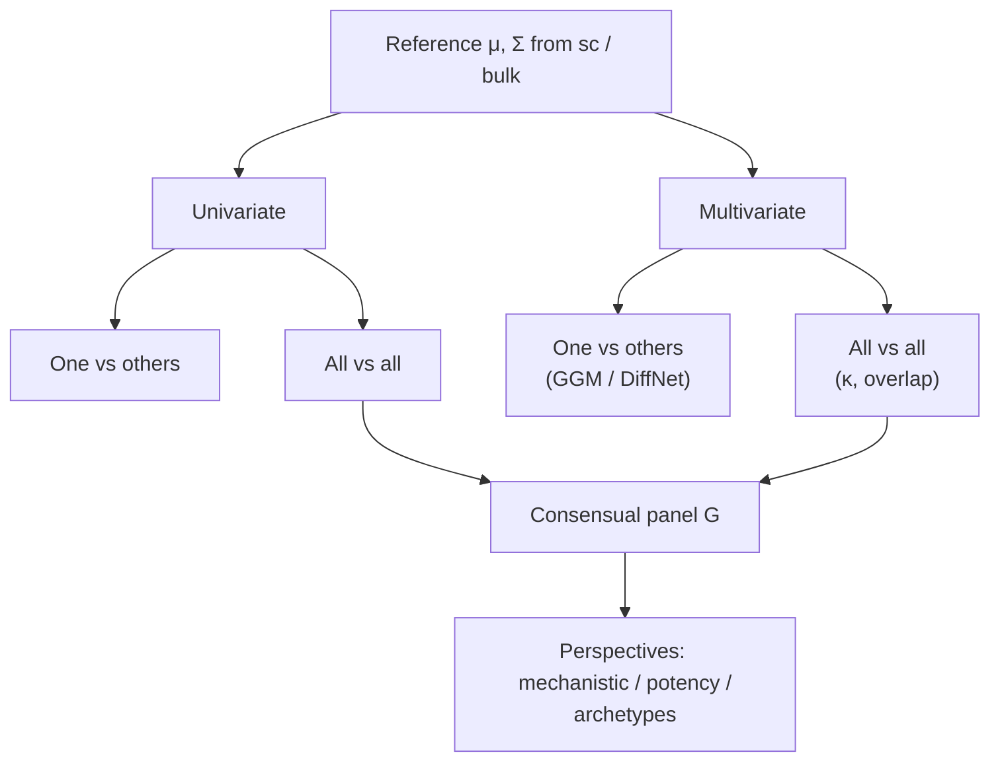
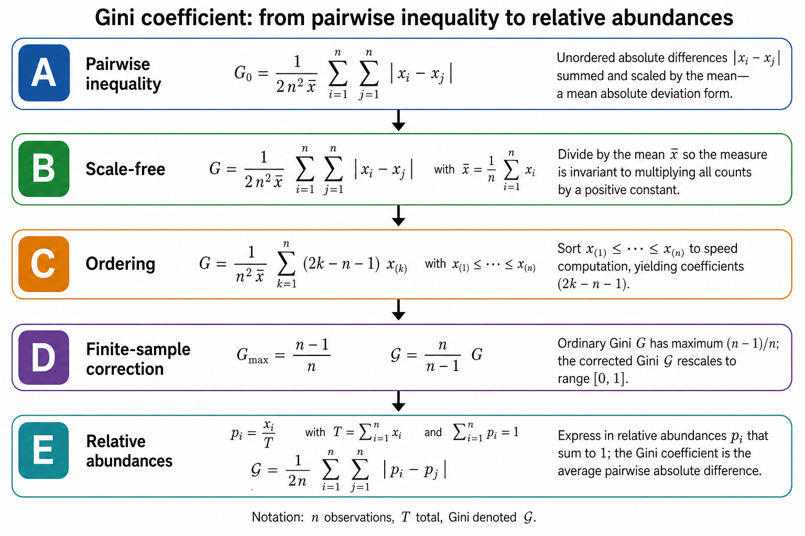
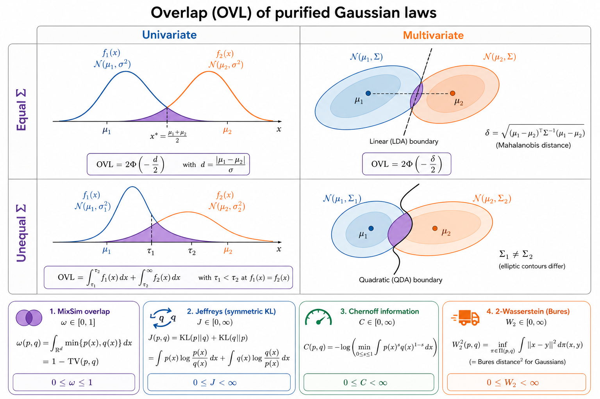
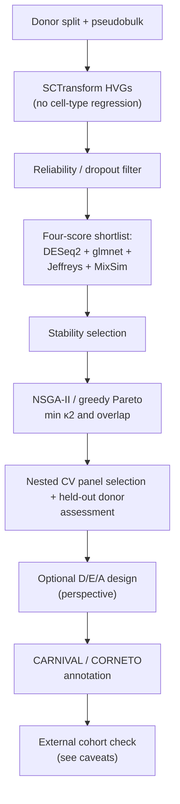
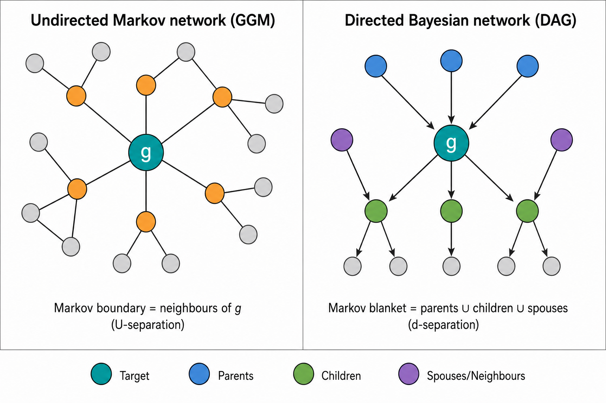
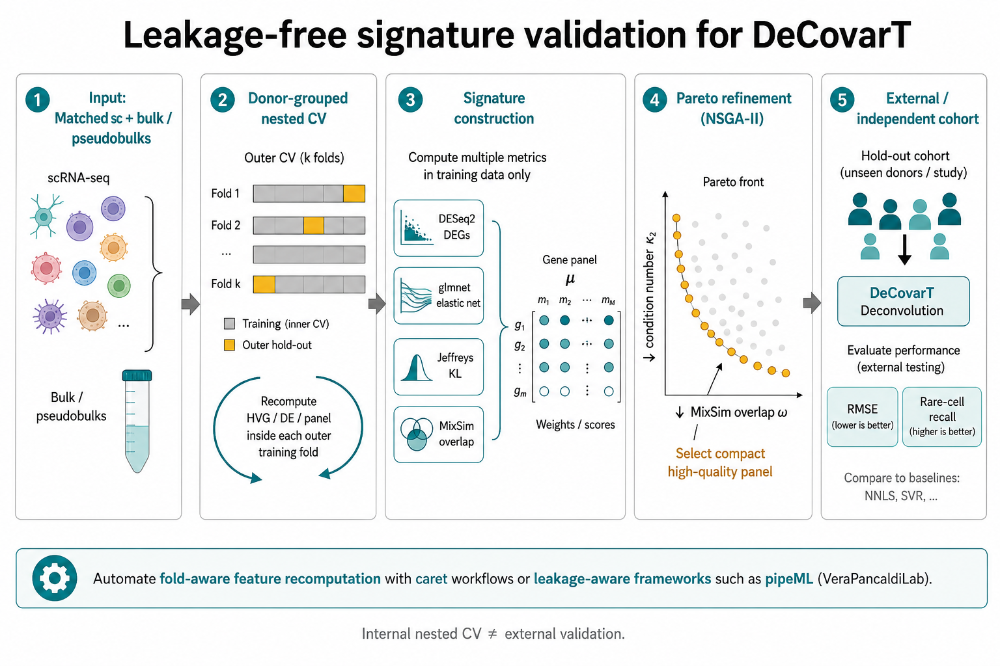

# Feature selection for reference-based deconvolution

This vignette surveys **feature selection for reference-based
(signature-based) deconvolution**—methods that recover cellular
proportions \boldsymbol{p} from a bulk mixture using a purified
expression design matrix ([Gaspard-Boulinc et al.
2025](#ref-gaspard-boulincCelltypeDeconvolutionMethods2025); [Avila
Cobos et al.
2018](#ref-avilacobosComputationalDeconvolutionTranscriptomics2018);
[Sturm et al.
2019](#ref-sturmComprehensiveEvaluationTranscriptomebased2019)). Feature
selection itself is a classical pre-modelling filter ([Guyon and
Elisseeff 2003](#ref-guyonIntroductionVariableFeature2003)). We
deliberately exclude **marker-based** abundance scoring (enrichment /
GSEA-style modules), which returns proxies of presence rather than a
consensual gene panel suited to linear or probabilistic mixture models
([Aran et al. 2017](#ref-aranXCellDigitallyPortraying2017); [Zhang et
al. 2017](#ref-zhang_etal17)).

The focus is **second-generation** signatures built from single-cell
pseudobulks (CIBERSORTx, MuSiC, DWLS, Kassandra and related pipelines)
([Newman et al. 2019](#ref-newmanDeterminingCellType2019); [Wang et al.
2019](#ref-wangBulkTissueCell2019); [Tsoucas et al.
2019](#ref-tsoucasAccurateEstimationCelltype2019); [Zaitsev et al.
2022](#ref-zaitsevPreciseReconstructionTME2022)), where the selected
genes must discriminate **all** cell types in the signature jointly, not
only one-versus-rest markers. Correlation-aware compact panels such as
DUBStepR illustrate the same goal from a single-cell feature-selection
angle ([Ranjan et al.
2021](#ref-ranjanDUBStepRScalableCorrelationbased2021)).

Interactive signature refinement utilities (zero filtering, specificity
binning, Gini / entropy compaction) are implemented in
[`DeconvExplorer`](https://github.com/omnideconv/deconvExplorer)
(omnideconv ecosystem; cite as software once added to `packages.bib`).



Figure 1: Layout of this vignette: univariate and multivariate
selection, each split into one-versus-others then all-versus-all,
followed by perspectives for continuous cell states.

Sections are cross-linked below: [Section 2](#sec-preprocess) builds
moments; **?@sec-precision-timing** places sparse
\boldsymbol{\Omega}\_{j} estimation after gene filtering;
[Section 3](#sec-univariate) and [Section 4](#sec-multivariate) score
genes; [Section 4.4](#sec-four-scores) and
[Section 5](#sec-pareto-panel) assemble a working panel;
[Section 6.5.1](#sec-cv-selection) and [Section 5.1](#sec-recommended)
assemble a pipeline; [Section 6](#sec-perspectives) covers continua,
Markov blankets, mechanistic priors (see
[Section 6.1](#sec-mechanistic)), information-optimal design as an
extension (see [Section 6.2](#sec-optimal-design)), and caveats (see
[Section 6.5](#sec-caveats)).

## 1 Notation

We align notation with the DeCovarT generative model. Let G genes and J
cell types index the purified means
\boldsymbol{\mu}=(\boldsymbol{\mu}\_{.j})\_{j=1}^{J}\in\mathbb{R}^{G\times
J} and (optional) covariances \\\boldsymbol{\Sigma}\_{j}\\\_{j=1}^{J}. A
bulk observation obeys

\boldsymbol{y}\mid(\boldsymbol{\zeta},\boldsymbol{p}) \sim
\mathcal{N}\_{G}\\\left( \boldsymbol{\mu}\boldsymbol{p},\\
\sum\_{j=1}^{J}p\_{j}^{2}\boldsymbol{\Sigma}\_{j} \right), \quad
\boldsymbol{p}\in\Delta^{J-1}, \tag{1}

with \boldsymbol{\zeta}=(\boldsymbol{\mu},\\\boldsymbol{\Sigma}\_{j}\\)
and simplex \Delta^{J-1}=\\\boldsymbol{p}:p\_{j}\ge
0,\sum\_{j}p\_{j}=1\\. For a gene subset
\mathcal{G}\subseteq\\1,\ldots,G\\, write
\boldsymbol{\mu}\_{\mathcal{G}} for the corresponding rows. The
condition number of a (possibly rectangular) design matrix
\boldsymbol{X} is defined via singular values

\kappa_2(\boldsymbol{X}) =
\frac{\sigma\_{\max}(\boldsymbol{X})}{\sigma\_{\min}(\boldsymbol{X})},
\tag{2}

with large \kappa_2 indicating multicollinearity and numerical
instability ([Gong and Szustakowski
2013](#ref-gongDeconRNASeqStatisticalFramework2013); [Newman et al.
2015](#ref-newmanRobustEnumerationCell2015)). For a Gram matrix one has
\kappa_2(\boldsymbol{X}^{\top}\boldsymbol{X})=\kappa_2(\boldsymbol{X})^{2},
so do not conflate the condition number of a signature with that of its
Gram matrix. Eigenvalue ratios apply directly only to an appropriate
symmetric positive-definite matrix (see also the [synthetic
scenarios](https://bastienchassagnol.github.io/DeCovarT/articles/synthetic-scenarios.html#sec-geometric-score)
vignette).

## 2 Preprocessing shared by all strategies

Before scoring genes:

1.  Aggregate **donor-level** cell-type pseudobulks (not individual
    cells as independent replicates). Pseudobulking reduces sparsity and
    avoids treating cells as independent biological replicates in
    differential testing ([Squair et al.
    2021](#ref-squairConfrontingFalseDiscoveries2021)).
2.  Estimate gene–cell-type means \mu\_{gj} and variance components on a
    **linear** scale (counts, CPM, or TPM). Log-space breaks the mixture
    linearity in [Equation 1](#eq-mixture). Variance stabilisation for
    *single-cell* QC is handled separately below (see
    [Section 2.1](#sec-sctransform)).
3.  Filter genes with poor bulk detectability, extreme zero inflation
    after pseudobulking, strong donor instability, or systematic sc–bulk
    discordance.
4.  When the biological target is **cell number** rather than RNA mass,
    correct transcriptome-size differences across cell types ([Lu et al.
    2025](#ref-luTranscriptomeSizeMatters2025)).
5.  Apply the **same** normalisation to bulk and signature matrices
    ([Jin and Liu 2021](#ref-jinBenchmarkRNAseqDeconvolution2021);
    [Racle et al. 2017](#ref-racleSimultaneousEnumerationCancer2017)).

### 2.1 Variance stabilisation and highly variable genes

Single-cell count matrices mix **technical** depth noise with
**biological** cell-type variability. Regularised negative-binomial
regression as in `Seurat::SCTransform` / `sctransform` separates the two
via **Pearson residuals** ([Hafemeister and Satija
2019](#ref-hafemeisterNormalizationVarianceStabilization2019)):

1.  Infer a depth-aware mean \hat{\mu}\_{ig} for cell i and gene g
    (library size enters as an offset; optional covariates can be
    included in the design).
2.  Infer a gene-wise dispersion \hat{\theta}\_{g} with empirical-Bayes
    shrinkage and a local mean–dispersion trend across genes.
    Empirical-Bayes pooling across genes is especially relevant after
    **donor-level pseudobulk aggregation**, when the number of
    biological replicates per cell type is small and per-gene dispersion
    estimates are unstable; sharing strength with genes of similar mean
    expression stabilises \hat{\theta}\_{g} in that low-n regime.
3.  Compute Pearson residuals with formula
    [Equation 3](#eq-pearson-residual) r\_{ig} =
    \frac{y\_{ig}-\hat{\mu}\_{ig}}
    {\sqrt{\hat{\mu}\_{ig}+\hat{\mu}\_{ig}^{2}/\hat{\theta}\_{g}}},
    \tag{3} which are approximately homoscedastic and closer to Gaussian
    than raw counts—useful for PCA / HVG ranking, **not** as the linear
    mixture scale in [Equation 1](#eq-mixture).

[Figure 2](#fig-sc-transform) summarises the negative-binomial
observation model, depth regression, residualisation, and
empirical-Bayes shrinkage.


Figure 2: `SCTransform` workflow: negative-binomial mean–variance model,
depth regression, Pearson residuals, and empirical-Bayes regularisation
across genes.

After residualisation, retain a compact **highly variable gene (HVG)**
universe before signature scoring. `SCTransform` / Pearson residuals
correct for sequencing depth while **preserving** biological
heterogeneity ([Hafemeister and Satija
2019](#ref-hafemeisterNormalizationVarianceStabilization2019)). Do
**not** regress out cell type at this HVG stage: that would remove
exactly the inter-type signal the panel is meant to capture. A practical
design that emphasises cell-type structure (rather than a global
intercept) is

\sim\\ \texttt{CellType}

**without intercept**, so the estimated coefficients contrast each
labelled type against the **global mean expression across cell types and
samples**. Rank genes by residual variance (or the corresponding model F
/ deviance explained) and keep the top 2{,}000 HVGs as the working
universe for the selectors in [Section 3](#sec-univariate) and
[Section 4](#sec-multivariate). Downstream deconvolution still uses
**linear-scale** \mu\_{gj} on that gene set ([Sturm et al.
2019](#ref-sturmComprehensiveEvaluationTranscriptomebased2019)).

> **Tip 1: ℹ️ Sanity check after `SCTransform`**
>
> Per gene, residual histograms and mean–variance plots of r\_{ig}
> should look roughly Gaussian and flat. Strong remaining depth trends
> or heavy tails indicate that the offset / covariate design is
> misspecified before any marker ranking.

> **Note 2: ℹ️ When to estimate sparse precision matrices**
>
> Sparse cell-type precision matrices \boldsymbol{\Omega}\_{j} are
> inputs to multivariate selectors. However, they should **not** be
> estimated on the full transcriptome first, since even high dimensional
> techniques, such as graphical lasso is computationally heavy an
> unstable when G\gg n.
>
> Instead, it is recommended to **filter and subset first**, then
> estimate networks.

## 3 Univariate approaches

Univariate selectors score each gene marginally (or with a simple
contrast) and ignore partial correlations among genes.

### 3.1 One versus others

Classical signature pipelines score gene g for cell type j against the
remaining types, then concatenate per-type shortlists ([Abbas et al.
2009](#ref-abbasDeconvolutionBloodMicroarray2009); [Newman et al.
2015](#ref-newmanRobustEnumerationCell2015); [Finotello et al.
2019](#ref-finotello_etal19)).

#### 3.1.1 Differential expression and fold-change ranks

`limma`–voom, `edgeR` and `DESeq2` remain the workhorses for
one-versus-rest contrasts ([Ritchie et al.
2015](#ref-ritchieLimmaPowersDifferential2015a); [Robinson et al.
2010](#ref-robinsonEdgeRBioconductorPackage2010); [Love et al.
2014](#ref-loveModeratedEstimationFold2014a)). CIBERSORT retains genes
with adjusted p\le 0.3 ordered by decreasing fold-change before a global
condition-number prune ([Newman et al.
2015](#ref-newmanRobustEnumerationCell2015)). Abbas et al. keep genes
that exceed the second- and third-ranked cell types, then choose the
panel with smallest \kappa ([Abbas et al.
2009](#ref-abbasDeconvolutionBloodMicroarray2009)). quanTIseq /
xCell-style filters further drop non-haematopoietic contaminants
([Finotello et al. 2019](#ref-finotello_etal19); [Aran et al.
2017](#ref-aranXCellDigitallyPortraying2017)).

#### 3.1.2 ANOVA F-test

Wang et al. rank genes by the nested-model F statistic comparing a
cell-type factor to an intercept-only model ([Wang et al.
2010](#ref-wangSilicoEstimatesTissue2010)). For gene g with expression
x\_{gi} in sample i and cell-type labels z\_{i}\in\\1,\ldots,J\\,

F\_{g} = \frac{ \bigl(\mathrm{SSR}\_{0}-\mathrm{SSR}\_{1}\bigr)/(J-1) }{
\mathrm{SSR}\_{1}/(n-J) }, \tag{4}

where \mathrm{SSR}\_{0}=\sum\_{i}(x\_{gi}-\bar{x}\_{g})^{2} and
\mathrm{SSR}\_{1}=\sum\_{j}\sum\_{i:z\_{i}=j}(x\_{gi}-\bar{x}\_{gj})^{2}.
Large F\_{g} indicates that cell-type means explain a substantial share
of gene variance.

Classical ANOVA inference for [Equation 4](#eq-anova-f) assumes, among
other things:

- independent observations (hence donor-level pseudobulks rather than
  cells as replicates; [Section 2](#sec-preprocess));
- roughly **Gaussian conditional residuals** x\_{gi}\mid
  z\_{i}=j\sim\mathcal{N}(\mu\_{gj},\sigma\_{g}^{2}) with common
  within-type variance (homoscedasticity);
- no strong outliers (leverage effect) or unmodelled batch structure
  (latent variable).

When residuals are heavy-tailed or variance scales with the mean, prefer
a GLM / `limma`–voom pipeline ([Ritchie et al.
2015](#ref-ritchieLimmaPowersDifferential2015a)) and treat F\_{g} as a
ranking score rather than a calibrated p-value.

#### 3.1.3 Gini and entropy specificity

`BioQC` and `DeconvExplorer` compact signatures with Gini or entropy
scores over the row \boldsymbol{\mu}\_{g\cdot} ([Zhang et al.
2017](#ref-zhang_etal17)). Write non-negative mean expression of gene g
across the J cell types as **relative abundances** (a discrete
probability distribution over types)

p\_{gj} = \frac{\mu\_{gj}}{\sum\_{j=1}^{J}\mu\_{gj}}, \qquad
\sum\_{j=1}^{J}p\_{gj}=1, \tag{5}

so \boldsymbol{p}\_{g}=(p\_{g1},\ldots,p\_{gJ}) lies on the simplex.
Both specificity scores are functions of these probabilities.

**Shannon entropy** measures diversity / uncertainty of the type
distribution:

H(g) = -\sum\_{j=1}^{J}p\_{gj}\log p\_{gj}, \tag{6}

with the convention 0\log 0=0. Low H means a few types dominate; high H
means mass is spread more evenly. With natural log the unit is nats;
with \log_2, bits. The maximum over supports of size J\_{+} (nonzero
p\_{gj}) is \log J\_{+}, so the normalised entropy
H\_{\mathrm{norm}}(g)=H(g)/\log J\_{+} lies in \[0,1\].

**Gini coefficient.** Denote the coefficient by \mathcal{G} (to avoid
clash with the gene count G) and write n=J for the number of type
shares. Starting from pairwise absolute differences \|p\_{gi}-p\_{gj}\|
(a mean absolute deviation over ordered pairs), dividing by the mean to
obtain a scale-free index, ordering the shares p\_{g(1)}\le\cdots\le
p\_{g(n)} for an O(n) formula, and optionally applying the finite-sample
factor n/(n-1) so that the corrected index reaches 1, one obtains

\mathcal{G}(g) = \frac{1}{2n} \sum\_{i=1}^{n} \sum\_{j=1}^{n} \lvert
p\_{gi}-p\_{gj}\rvert = \frac{1}{n} \sum\_{k=1}^{n} (2k-n-1)\\p\_{g(k)},
\qquad \mathcal{G}\_{\mathrm{corr}}(g) = \frac{n}{n-1}\\\mathcal{G}(g)
\quad (n\>1). \tag{7}

[Figure 3](#fig-gini-derivation) summarises this derivation; the
uncorrected empirical maximum is (n-1)/n, not 1. After the finite-sample
correction, \mathcal{G}\_{\mathrm{corr}}\in\[0,1\] with 0 for equal
shares and 1 when a single type carries all mass.

High Gini (or low entropy) flags genes whose probability mass
concentrates on few types—useful for one-versus-rest compaction. After
normalisation both scores live on \[0,1\] with **reciprocal**
interpretation: high \mathcal{G}\_{\mathrm{corr}} / low
H\_{\mathrm{norm}} means concentrated (specific); low
\mathcal{G}\_{\mathrm{corr}} / high H\_{\mathrm{norm}} means diffuse.
There is no universal one-to-one map between them ([Zhang et al.
2017](#ref-zhang_etal17)). [Figure 4](#fig-gini-entropy) contrasts the
two scores.



Figure 3: Derivation of the Gini coefficient: pairwise absolute
differences, scale-free normalisation by the mean, sorted-data formula,
finite-sample correction to \[0,1\], and expression in relative
abundances p\_{j}.


Figure 4: Gini versus Shannon entropy for cell-type specificity:
formulas, simplified share plots, and panel-wise pros/cons for
one-versus-rest compaction.

“Redundancy when panels are concatenated” means the following. High Gini
markers are specific, but not automatically non-redundant: a gene with
high Gini for type A and another with high Gini for type B need not be
collinear if they separate *different* contrasts, yet they **can** be
nearly collinear as rows of \boldsymbol{\mu} when both types co-express
correlated programmes (shared lineage, activation axis). Redundancy
arises mainly when multiple markers reflect the same contrast.
Concatenating the top-k genes per type therefore often inflates
\|\mathcal{G}\| without improving the geometry of
\boldsymbol{\mu}\_{\mathcal{G}}:
\kappa_2(\boldsymbol{\mu}\_{\mathcal{G}}) stays large and NNLS / SVR /
GLS remain unstable ([Newman et al.
2015](#ref-newmanRobustEnumerationCell2015)). Likewise, edges in a
partial-correlation graph flag candidate influences, not assured
independence. That is why [Section 3.1](#sec-univ-one-vs-others) must be
followed by an all-versus-all stage (see
[Section 3.2](#sec-univ-all-vs-all) and
[Section 4.3](#sec-multi-all-vs-all)).

> **Warning 3: ⚠️ Limitation of one-versus-rest concatenation**
>
> Union of per-type markers often yields a multicollinear
> \boldsymbol{\mu}\_{\mathcal{G}} that is still too large for stable
> NNLS / SVR / GLS ([Newman et al.
> 2015](#ref-newmanRobustEnumerationCell2015); [Avila Cobos et al.
> 2018](#ref-avilacobosComputationalDeconvolutionTranscriptomics2018)).
> A global all-versus-all refinement is therefore required (see
> [Section 4.3](#sec-multi-all-vs-all)).

### 3.2 All versus all

#### 3.2.1 Genetic algorithms (`AutoGeneS`)

`AutoGeneS` searches gene subsets with a multi-objective genetic
algorithm that **minimises inter-population correlation** while
**maximising centroid distance** ([Aliee and Theis
2021](#ref-alieeAutoGeneSAutomaticGene2021)). Related multi-objective
genetic searches appear in network module discovery (e.g. MOGAMUN)
([Novoa-del-Toro et al.
2021](#ref-novoa-del-toroMultiobjectiveGeneticAlgorithm2021)).
`AutoGeneS` is explicitly all-versus-all: the loss is defined on the
full J-column signature rather than on independent one-versus-rest
lists.

## 4 Multivariate approaches

Multivariate selectors use joint dependence—covariance, precision, or
information matrices—so that a gene is scored by how it improves
identifiability of \boldsymbol{p} under [Equation 1](#eq-mixture).

### 4.1 Limitations of mean-only condition numbers

Condition-number pruning (see [Equation 2](#eq-condition-number))
operates almost exclusively on the **mean** signature
\boldsymbol{\mu}\_{\mathcal{G}}. It does not see covariance rewiring:
two closely related types can share nearly collinear means yet differ in
their precision graphs
\boldsymbol{\Omega}\_{j}=\boldsymbol{\Sigma}\_{j}^{-1}. In
**continua**—gastruloids, differentiation trajectories, activation
gradients—neighbouring states are transcriptionally similar by
construction, so \kappa(\boldsymbol{\mu}) is intrinsically large.
Aggressive \kappa-minimisation then tends to keep a few dominant lineage
representatives and drop genes that separate neighbours only through
**network rewiring** rather than large mean fold-changes ([Tsoucas et
al. 2019](#ref-tsoucasAccurateEstimationCelltype2019); [Wang et al.
2019](#ref-wangBulkTissueCell2019)).

[Figure 5](#fig-kappa-gastruloid) illustrates this failure mode for a
gastruloid lineage continuum: mean-conditioned DWLS-style selection can
under-represent adjacent or low-abundance states relative to methods
that retain softer, covariance-aware allocation.


Figure 5: Condition-number pruning on correlated developmental cell
types (gastruloid continuum). Mean-only \kappa filtering can concentrate
signal in dominant collinear lineages and shrink closely related states.

> **Important 4: ⚠️ When \kappa(\boldsymbol{\mu}) is not enough**
>
> Use \kappa as a **diagnostic** of mean geometry, not as the sole
> selector, whenever cell states form a continuum or when discriminatory
> signal lives in \boldsymbol{\Sigma}\_{j} (see
> [Section 4.2.1](#sec-indeed) and [Section 6.2](#sec-optimal-design)).
> Pair it with overlap (see [Equation 12](#eq-overlap)), Fisher
> information (see [Equation 17](#eq-fisher)), or differential-network
> candidates.

### 4.2 One versus others

Univariate DGE ignores gene–gene interactions and therefore requires
aggressive multiple-testing correction without modelling network
rewiring. Differential-network and GGM methods address that gap.

#### 4.2.1 `INDEED`: an ad-hoc approach to Differential networks

`INDEED` combines mean (fold-change) evidence with tests of changes in
**partial correlation**, ranking genes that both shift in mean **and**
rewire neighbourhood structure ([Zuo et al.
2016](#ref-zuoINDEEDIntegratedDifferential2016)).
[Figure 6](#fig-indeed) summarises the graphical abstract and
computational pipeline.


\(a\) `INDEED` graphical abstract: parallel differential expression and
differential-network tracks merged into an activity-ranked biomarker
list (adapted from Zuo et al.
([2016](#ref-zuoINDEEDIntegratedDifferential2016))).


\(b\) `INDEED` pipeline: group-wise graphical lasso, differential
partial correlations \Delta\mathrm{pc} with permutation filtering, DE
p-values, and activity-score prioritisation (adapted from Zuo et al.
([2016](#ref-zuoINDEEDIntegratedDifferential2016))).

Figure 6: `INDEED` integrates differential expression with differential
network structure to prioritise biomolecules.

For groups k\in\\1,2\\ (e.g. focal cell type versus the rest), let
\boldsymbol{\Omega}^{(k)} be a sparse precision estimate from graphical
lasso. Partial correlations are

\mathrm{pc}\_{gg'}^{(k)} = -\frac{\omega\_{gg'}^{(k)}}
{\sqrt{\omega\_{gg}^{(k)}\\\omega\_{g'g'}^{(k)}}}, \qquad
\Delta\mathrm{pc}\_{gg'} =
\mathrm{pc}\_{gg'}^{(1)}-\mathrm{pc}\_{gg'}^{(2)}. \tag{8}

Significant edges are retained after a permutation (or bootstrap) null
on \Delta\mathrm{pc}\_{gg'}. With a differential-expression p-value
p\_{g}^{\mathrm{DE}} for gene g, `INDEED` forms an **activity score**
that multiplies mean evidence by differential connectivity,
schematically

\mathrm{AS}\_{g} = \bigl(-\log p\_{g}^{\mathrm{DE}}\bigr) \sum\_{g'\neq
g} \bigl\lvert\Delta\mathrm{pc}\_{gg'}\bigr\rvert \\
\mathbf{1}\\\left\\\Delta\mathrm{pc}\_{gg'}\\
\text{significant}\right\\, \tag{9}

and ranks genes by \mathrm{AS}\_{g} ([Zuo et al.
2016](#ref-zuoINDEEDIntegratedDifferential2016)). Relative to pure DGE,
this favours genes whose local **undirected** neighbourhood (Markov
boundary in the GGM sense; [Section 6.4](#sec-markov-seeds)) differs
between the focal type and the rest. Related ideas appear in weighted
graphical-lasso pipelines with PPI priors and differential-network
scores (DNS).

#### 4.2.2 Janine and the Cooperative Lasso: a statistically grounded approach to differential networks

Cell-type precision matrices
\boldsymbol{\Omega}\_{j}=\boldsymbol{\Sigma}\_{j}^{-1} estimated by
graphical lasso are shrunk; non-zero partial correlations are typically
underestimated. A practical mitigation is to take the gLasso **support**
as topological constraints and re-estimate by constrained MLE when the
graph is chordal (otherwise the mapping is non-trivial) ([Dahl et al.
2005](#ref-dahlMaximumLikelihoodEstimation2005)). Cooperative /
sign-coherent group lasso penalties can encode pathway modules and
PPI-informed edge weights ([Chiquet et al.
2012](#ref-chiquetSparsitySigncoherentGroups2012)). PPI priors also
shrink the combinatorial space of undirected graphs explored per cell
type.

> **Warning 5: ⚠️ From one-versus-others networks to a panel**
>
> Network-based one-versus-others lists still concatenate into a
> redundant design (see [Note 3](#nte-ovr-concat)). Treat them as
> **candidate generators** for the all-versus-all stage in
> [Section 4.3](#sec-multi-all-vs-all).

### 4.3 All versus all

#### 4.3.1 Variance-weighted condition number

With gene-specific uncertainties \tau\_{g}^{2} (biological + sampling +
optional sc–bulk discordance), standardise rows and evaluate
conditioning in the (J-1)-dimensional contrast space induced by
\sum\_{j}p\_{j}=1:

\widetilde{\mu}\_{gj} = \frac{\mu\_{gj}-\bar{\mu}\_{g}}{\tau\_{g}},
\qquad \kappa\\\left(
\boldsymbol{W}\_{\mathcal{G}}^{1/2}\boldsymbol{\mu}\_{\mathcal{G}}\boldsymbol{C}
\right), \tag{10}

where \boldsymbol{W}\_{\mathcal{G}}=\mathrm{diag}(1/\tau\_{g}^{2}) and
\boldsymbol{C} removes the common-expression direction. Unweighted
\kappa(\boldsymbol{\mu}\_{\mathcal{G}}) alone can favour quiet but
biased genes ([Gong and Szustakowski
2013](#ref-gongDeconRNASeqStatisticalFramework2013)); see also
[Section 4.1](#sec-kappa-limits).

#### 4.3.2 Sparse classifiers as candidate generators

Beyond geometric scores on \boldsymbol{\mu} and \boldsymbol{\Sigma},
multiclass models that treat cell type as a categorical response are
useful **candidate generators**—not as final deconvolution solvers.
Embed them in **stability selection**: resample at the donor level, tune
penalties inside each resample, and keep genes selected in a high
fraction of replicates ([Meinshausen and Bühlmann
2010](#ref-meinshausenStabilitySelection2010)).

- **Multinomial logistic regression with elastic net.** Combined \ell_1
  / \ell_2 penalties yield sparse class weights while shrinking
  correlated genes jointly ([Zou and Hastie
  2005](#ref-zouRegularizationVariableSelection2005); [Friedman et al.
  2025](#ref-R-glmnet)). Suitable when the number of donor-level
  pseudobulks is moderate to large.
- **Sparse / penalised quadratic discriminant analysis.** Maximises a
  between- / within-class variance ratio with an \ell_1 penalty on
  loadings, favouring a compact, non-redundant discriminant gene set
  ([Witten and Tibshirani
  2011](#ref-wittenPenalizedClassificationUsing2011)).
- **Group and tree-guided lasso.** An \ell_1/\ell_2 group penalty
  selects or drops whole genes or pathways together ([Yuan and Lin
  2006](#ref-yuanModelSelectionEstimation2006)); hierarchical /
  tree-guided variants share strength across related cell-type labels
  when a lineage taxonomy is known.

Treat non-zero coefficients as proposals for
[Section 4.3.4](#sec-overlap), then refine by nested cross-validated
signature selection; see [Section 6.5.1](#sec-cv-selection).

| Method | Role | Caveat |
|----|----|----|
| Multinomial elastic net | Joint classification; \\\ell_1\\ sparsity + \\\ell_2\\ grouping of correlates | May still retain collinear markers unless \\\ell_2\\ is strong |
| Sparse LDA | Direct class-separation criterion with sparse loadings | Needs more observations than pure logistic paths |
| Group / tree lasso | Pathway- or hierarchy-aware block selection | Requires predefined groups or a taxonomy tree |

Table 1: Sparse multiclass methods as panel candidate generators.

#### 4.3.3 Information-optimal panel design (pointer)

D- / E- / A-optimal criteria based on the mixture Fisher information,
including the proportion-dependent bulk covariance
\boldsymbol{V}(\boldsymbol{p}), are developed as a **perspective /
extension** in [Section 6.2](#sec-optimal-design). In the main
multivariate path we prefer overlap and related separation monitors
([Section 4.3.4](#sec-overlap)) together with nested cross-validated
panel selection ([Section 6.5.1](#sec-cv-selection)).

#### 4.3.4 Marker-separation metrics

`AutoGeneS` optimises correlation and centroid distance separately
([Aliee and Theis 2021](#ref-alieeAutoGeneSAutomaticGene2021)).
Probabilistic alternatives fold mean **and** covariance structure into a
single separation score for the purified laws
\mathcal{N}(\boldsymbol{\mu}\_{.j},\boldsymbol{\Sigma}\_{j}).
[Figure 7](#fig-overlap-univ-multi) contrasts geometric overlap
\int\min(f\_{j},f\_{\ell}) for univariate versus multivariate Gaussians
(equal or unequal second moments) and places the four monitors
below—`MixSim` overlap, Jeffreys, Chernoff and W\_{2}—on a common
footing.



Figure 7: Overlap of purified Gaussians: univariate (left) versus
multivariate (right) under equal or unequal covariance, with MixSim
overlap, Jeffreys (symmetric KL), Chernoff information and 2-Wasserstein
/ Bures as companion metrics.

> **Note 6: ℹ️ Probabilistic separation metrics**
>
> **`MixSim` pairwise overlap.** For densities f\_{j} and f\_{\ell}, the
> one-sided directional mass \Omega\_{j\ell}=\Pr\_{X\sim f\_{j}}(X\text{
> classified as }\ell) (Bayes / MAP rule) yields the pairwise overlap
>
> \omega\_{j\ell} = \Omega\_{j\ell}+\Omega\_{\ell j} \in\[0,1\] \tag{11}
>
> (with the equal-prior geometric reading
> \omega\_{j\ell}=\int\min(f\_{j},f\_{\ell}) as a special case), taking
> the value 0 for perfectly separable Gaussians and approaching 1 for
> identical laws ([Melnykov et al.
> 2012](#ref-melnykovMixSimPackageSimulating2012),
> [2024](#ref-R-MixSim)). Mixture proportions \boldsymbol{p} already
> enter the MAP rule inside
> [`MixSim::overlap()`](https://rdrr.io/pkg/MixSim/man/overlap.html);
> they must **not** be multiplied into \Omega\_{j\ell} a second time
> when reporting pairwise overlap (that double-counts the prior and no
> longer matches MixSim’s `BarOmega`).
>
> Package helper
> [`compute_average_overlap()`](https://bastienchassagnol.github.io/DeCovarT/reference/compute_average_overlap.md)
> returns MixSim’s unweighted average of pairwise overlaps,
>
> \overline{\omega} = \frac{2}{J(J-1)} \sum\_{1\le j\<\ell\le J}
> \bigl(\Omega\_{j\ell}+\Omega\_{\ell j}\bigr) = \texttt{BarOmega},
> \tag{12}
>
> which is the natural panel-separation monitor. Lower values correspond
> to better-separated purified profiles.
>
> **Jeffreys (symmetric KL) divergence.** With
> J(f\_{j},f\_{\ell})=D\_{\mathrm{KL}}(f\_{j}\parallel
> f\_{\ell})+D\_{\mathrm{KL}}(f\_{\ell}\parallel f\_{j}) and
> multivariate normals,
>
> \begin{aligned}
> D\_{\mathrm{KL}}(\mathcal{N}\_{j}\parallel\mathcal{N}\_{\ell}) &=
> \tfrac{1}{2}\Bigl\[
> \ln\frac{\lvert\boldsymbol{\Sigma}\_{\ell}\rvert}{\lvert\boldsymbol{\Sigma}\_{j}\rvert}
> -d
> +\operatorname{tr}(\boldsymbol{\Sigma}\_{\ell}^{-1}\boldsymbol{\Sigma}\_{j})
> +(\boldsymbol{\mu}\_{\ell}-\boldsymbol{\mu}\_{j})^{\top}
> \boldsymbol{\Sigma}\_{\ell}^{-1}
> (\boldsymbol{\mu}\_{\ell}-\boldsymbol{\mu}\_{j}) \Bigr\], \\
> J(f\_{j},f\_{\ell}) &= \tfrac{1}{2}\operatorname{tr}\bigl(
> \boldsymbol{\Sigma}\_{\ell}^{-1}\boldsymbol{\Sigma}\_{j}
> +\boldsymbol{\Sigma}\_{j}^{-1}\boldsymbol{\Sigma}\_{\ell}
> -2\boldsymbol{I} \bigr) \\ &\quad
> +\tfrac{1}{2}(\boldsymbol{\mu}\_{j}-\boldsymbol{\mu}\_{\ell})^{\top}
> \bigl(\boldsymbol{\Sigma}\_{j}^{-1}+\boldsymbol{\Sigma}\_{\ell}^{-1}\bigr)
> (\boldsymbol{\mu}\_{j}-\boldsymbol{\mu}\_{\ell}). \end{aligned}
> \tag{13}
>
> J\ge 0 is unbounded; large values flag strong mean or covariance
> mismatch.
>
> **Chernoff information.** The Chernoff information
>
> C(f\_{j},f\_{\ell}) = -\min\_{t\in\[0,1\]} \ln\int
> f\_{j}(x)^{t}f\_{\ell}(x)^{1-t}\\dx \tag{14}
>
> is the best exponential error exponent for distinguishing the two
> laws. For Gaussians the integral is closed in t after substituting
> \boldsymbol{\Sigma}\_{t}=t\boldsymbol{\Sigma}\_{\ell}+(1-t)\boldsymbol{\Sigma}\_{j},
> but t^{\star} is found numerically. Large C implies strong
> separability (P\_{\mathrm{error}}\le e^{-C}).
>
> **2-Wasserstein / Bures geometry.** The squared W\_{2} distance
> between Gaussians is
>
> W\_{2}^{2}\bigl(
> \mathcal{N}(\boldsymbol{\mu}\_{.j},\boldsymbol{\Sigma}\_{j}),
> \mathcal{N}(\boldsymbol{\mu}\_{.\ell},\boldsymbol{\Sigma}\_{\ell})
> \bigr) =
> \lVert\boldsymbol{\mu}\_{.j}-\boldsymbol{\mu}\_{.\ell}\rVert\_{2}^{2} +
> \mathfrak{B}^{2}(\boldsymbol{\Sigma}\_{j},\boldsymbol{\Sigma}\_{\ell}),
> \tag{15}
>
> with \mathfrak{B}^{2} the Bures metric (matrix square-root term). It
> is a true metric and reduces to Euclidean mean distance when
> covariances coincide.

| Metric | Range | Focus | Notes |
|----|----|----|----|
| `MixSim` overlap | \\\[0, 1\]\\ | Bayes misclassification mass | Monte Carlo in `MixSim`; intuitive |
| Jeffreys (sym. KL) | \\\[0, \infty)\\ | Average log-likelihood gap | Closed form for Gaussians |
| Chernoff information | \\\[0, \infty)\\ | Optimal error exponent | Needs a 1-D line search in \\t\\ |
| \\W\_{2}\\ (2-Wasserstein) | \\\[0, \infty)\\ | Geometric mean + covariance shape | Matrix square-root cost \\O(d^{3})\\ |

Table 2: Comparison of purified-Gaussian separation metrics for panel
monitoring.

Overlap / Jeffreys / Chernoff / W\_{2} monitor **class separation** of
purified laws. Information-optimal (D/E/A) criteria in
[Equation 18](#eq-optimal-design) instead target **estimation** of
\boldsymbol{p} under [Equation 1](#eq-mixture)
([Section 6.2](#sec-optimal-design)); the two families need not agree.
Prefer overlap for an interpretable error rate, Jeffreys for a
closed-form divergence, Chernoff when a single discriminability index is
desired, and W\_{2} when covariance shape matters ([Melnykov et al.
2024](#ref-R-MixSim); [Aliee and Theis
2021](#ref-alieeAutoGeneSAutomaticGene2021)).

### 4.4 Conclusion: refined selection of four complementary scores

For a first rough candidate pool we retain **four** complementary
screens rather than the full metric zoo. Two are **label-aware**
selectors on pseudobulks; two are **distributional** discrepancies
between purified Gaussians:

1.  **`DESeq2` DEGs.** Negative-binomial GLM contrasts on donor-level
    pseudobulks flag mean shifts across types ([Love et al.
    2014](#ref-loveModeratedEstimationFold2014a)). They do not encode
    covariance geometry, so they seed the panel rather than finish it.
2.  **`glmnet` multinomial elastic net.** Sparse discriminative
    coefficients for cell-type labels ([Friedman et al.
    2025](#ref-R-glmnet); [Zou and Hastie
    2005](#ref-zouRegularizationVariableSelection2005)). Relative to
    sparse QDA, elastic net is less sensitive to non-Gaussian residuals
    and to poorly estimated type-specific covariances in the G\gg n
    pseudobulk regime; treat non-zeros as proposals (see
    [Section 4.3.2](#sec-sparse-classifiers)).
3.  **Jeffreys (symmetric KL).** Closed-form mean–covariance discrepancy
    J(f\_{j},f\_{\ell}) ([Equation 13](#eq-jeffreys)):
    information-theoretic, unbounded, sensitive to both location and
    second-moment mismatch.
4.  **`MixSim` overlap.** Bayes misclassification mass
    \omega\_{j\ell}\in\[0,1\] ([Equation 11](#eq-pairwise-overlap)): the
    most direct probabilistic reading of confusion between purified laws
    ([Melnykov et al. 2024](#ref-R-MixSim),
    [2012](#ref-melnykovMixSimPackageSimulating2012)).

Jeffreys and MixSim therefore capture **different** aspects of the same
pairwise Gaussian discrepancy—relative entropy versus classification
error—while `DESeq2` and `glmnet` supply orthogonal mean /
discriminative evidence. Take the **union** of top-ranked genes from
each screen (with donor-level stability where possible) as the working
universe \mathcal{G}\_{0} before multi-objective compaction.

## 5 Multi-objective panel refinement

The shortlist \mathcal{G}\_{0} is typically still too large and
collinear for stable deconvolution. Following `AutoGeneS` ([Aliee and
Theis 2021](#ref-alieeAutoGeneSAutomaticGene2021)), refine a binary gene
mask by a **bi-objective** search on the purified moments restricted to
the selected genes:

- minimise the panel condition number
  \kappa_2(\boldsymbol{\mu}\_{\mathcal{G}}) (or a robust surrogate such
  as \log\kappa_2; see [Equation 2](#eq-condition-number));
- minimise average `MixSim` overlap \overline{\omega} (or maximise
  average Jeffreys, if preferred) over type pairs
  ([Section 4.3.4](#sec-overlap)).

These objectives trade off: genes that separate rare types can inflate
\kappa_2, while an aggressively well-conditioned panel can discard the
most discriminatory markers. A **Pareto front** of non-dominated panels
is therefore more informative than a single weighted scalar.

**Search.** Greedy / Fedorov exchange remains a transparent baseline
when the objective is nearly unimodal. For the dual criterion we prefer
a multi-objective genetic algorithm. The CRAN package `mco` implements
**NSGA-II** via `mco::nsga2()`, which returns a population approximating
the Pareto set when the fitness returns a length-two vector to minimise
([Mersmann 2024](#ref-R-mco)). Encode the decision variables as
continuous masks in \[0,1\]^{\|\mathcal{G}\_{0}\|} (thresholded to a
target panel size) or as a lower-dimensional embedding of gene blocks;
evaluate \kappa_2 and \overline{\omega} on the induced panel.

``` r

# Illustrative NSGA-II call (requires {mco}). Replace bi_objective_func
# with panel <U+03BA>2 and MixSim overlap computed from <U+03BC>_G and <U+03A3>_j|G.
bi_objective_func <- function(x) {
  # x: decision variables (e.g. soft gene weights in [0, 1]^d)
  f1 <- x[1]^2 + x[2]^2 # stand-in for <U+03BA>2(<U+03BC>_G)
  f2 <- (x[1] - 1)^2 + x[2]^2 # stand-in for average MixSim overlap
  c(f1, f2)
}

mco_res <- mco::nsga2(
  fn = bi_objective_func,
  idim = 2,
  odim = 2,
  lower.bounds = c(0, 0),
  upper.bounds = c(1, 1),
  popsize = 100,
  generations = 50
)
# Inspect non-dominated panels: mco_res$value (objectives), mco_res$par
```

Scalar alternatives (weighted sums inside `GA` / `GenSA`) remain useful
for auditable single-objective refinement; report several
Pareto-representative panels rather than one arbitrary knee when handing
the signature to nested CV ([Section 6.5.1](#sec-cv-selection)).

### 5.1 Recommended pipeline

1.  **Reference moments** (see [Section 2](#sec-preprocess)).
    Donor-level pseudobulks; estimate \boldsymbol{\mu} and variance
    components on a linear scale; optional `SCTransform` / top-2{,}000
    HVGs (see [Section 2.1](#sec-sctransform)) **without** regressing
    out cell type.
2.  **Reliability filter.** Drop unstable / undetectable / discordant
    genes; optionally inflate \tau\_{g}^{2} by observed sc–bulk
    discrepancy.
3.  **Four-score shortlist** (see [Section 4.4](#sec-four-scores)).
    Union of `DESeq2` DEGs, `glmnet` elastic-net hits, high Jeffreys,
    and low `MixSim` overlap (optionally with Gini / `INDEED` /
    stability selection) → working universe \mathcal{G}\_{0}.
4.  **Pareto panel refinement** (see [Section 5](#sec-pareto-panel)).
    NSGA-II / greedy search minimising
    \kappa_2(\boldsymbol{\mu}\_{\mathcal{G}}) and average overlap; keep
    several non-dominated panels.
5.  **Cross-validated panel selection** (see
    [Section 6.5.1](#sec-cv-selection)). Use donor-grouped nested
    cross-validation on matched bulk aliquots; select the panel and its
    size in the **inner** loop and estimate deconvolution performance in
    the **outer** loop. Heed [Section 6.5](#sec-caveats) on external
    validation.
6.  **Optional extension** (see [Section 6.2](#sec-optimal-design)).
    Information-optimal (D/E/A) subset search over a composition grid if
    Fisher-design criteria are desired beyond overlap monitors.
7.  **Mechanistic annotation** (see [Section 6.1](#sec-mechanistic)).
    Optional `CARNIVAL` / `CORNETO` pathway hypotheses as soft coverage
    constraints.



Figure 8: Recommended reference-based feature-selection pipeline from
donor pseudobulks to validated, mechanistically annotated panels.

The distinctive contribution for DeCovarT-style second-generation models
is a **bulk-calibrated, variance-weighted information criterion plus
overlap**, exploiting paired sc/bulk designs when available.

## 6 Perspectives

### 6.1 Mechanistic priors

PPI / TF networks and pathway modules can regularise both GGM estimation
and cooperative penalties ([Chiquet et al.
2012](#ref-chiquetSparsitySigncoherentGroups2012); [Zuo et al.
2016](#ref-zuoINDEEDIntegratedDifferential2016)), shrinking the search
toward biologically plausible supports rather than purely statistical
markers.

**`CARNIVAL`** contextualises a prior-knowledge network (e.g. OmniPath)
from gene-expression footprints via integer linear programming: TF /
pathway activity scores (DoRothEA and related) are matched to upstream
regulators, yielding directed subnetworks and key mediators for each
cell-type contrast ([Liu et al.
2019](#ref-liuFromExpressionFootprints2019)). For panel design, annotate
candidate markers by membership in (or upstream of) inferred pathways,
or softly prioritise genes that lie on divergent axes between types.
Outputs are hypotheses: they depend on the PKN and activity
discretisation, may be non-unique, and do not prove causality.

**`CORNETO`** casts multi-sample network inference as a joint
mixed-integer programme with structured sparsity, recovering a shared
backbone plus sample- or cell-type-specific edges across directed,
undirected, signed, or hypergraph priors ([Rodriguez-Mier et al.
2025](#ref-rodriguezMierUnifyingMultisample2025)). Cell-specific edges
highlight discriminative modules; shared edges flag core programmes.
After a statistically chosen panel, require coverage of distinct
`CORNETO` modules, or add a soft term that rewards selecting genes from
different subnetworks. Limitations mirror `CARNIVAL`: solver cost, PKN
dependence, and false-positive / missing edges.

Use `CARNIVAL` / `CORNETO` for **annotation and soft constraints**, not
as a replacement for overlap in [Equation 12](#eq-overlap) or Fisher
design in [Equation 18](#eq-optimal-design).

### 6.2 Information-optimal design as a perspective

As a potential extension beyond mean geometry and overlap monitors,
candidate panels can be scored by alphabetical optimality criteria on
the mixture Fisher information. Under the DeCovarT mixture in
[Equation 1](#eq-mixture), write the bulk covariance as

\boldsymbol{V}(\boldsymbol{p}) = \boldsymbol{\Sigma}\_{\mathrm{meas}} +
\sum\_{j=1}^{J}p\_{j}^{2}\boldsymbol{\Sigma}\_{j}. \tag{16}

Unlike ordinary linear regression, \boldsymbol{V} depends on
\boldsymbol{p}. With mean map
\boldsymbol{M}(\boldsymbol{p})=\boldsymbol{\mu}\boldsymbol{p} and
Jacobian columns \boldsymbol{\mu}\_{.j}-\boldsymbol{\mu}\_{.J} in the
(J-1)-dimensional simplex contrast space, the Gaussian Fisher
information is

\mathcal{I}(\boldsymbol{p}) = \boldsymbol{M}'^{\top}
\boldsymbol{V}(\boldsymbol{p})^{-1} \boldsymbol{M}' + \frac{1}{2}
\sum\_{a,b} \operatorname{tr}\\\left(
\frac{\partial\boldsymbol{V}}{\partial p\_{a}}
\boldsymbol{V}(\boldsymbol{p})^{-1}
\frac{\partial\boldsymbol{V}}{\partial p\_{b}}
\boldsymbol{V}(\boldsymbol{p})^{-1} \right), \tag{17}

where \partial\boldsymbol{V}/\partial
p\_{j}=2p\_{j}\boldsymbol{\Sigma}\_{j}. The first term is mean
information; the second captures information from the changing
covariance. For a gene panel \mathcal{G}, restrict rows of
\boldsymbol{\mu} and \boldsymbol{\Sigma}\_{j} accordingly. When
\boldsymbol{V} is treated as fixed (or diagonal / shrinkage on
\mathcal{G}), [Equation 17](#eq-fisher) collapses to the familiar
whitened Gram

\mathcal{I}\_{\mathcal{G}} \approx
\boldsymbol{\mu}\_{\mathcal{G}}^{\top}
\boldsymbol{\Sigma}\_{\mathcal{G}}^{-1} \boldsymbol{\mu}\_{\mathcal{G}}.

Evaluate candidate panels over a **composition grid**
\mathcal{P}\subset\Delta^{J-1} (balanced, rare-cell, sparse,
near-collinear scenarios) and report worst-case and average criteria, so
a design that only works at one corner of the simplex is rejected.

Classical alphabetical criteria ([Atkinson and Donev
1992](#ref-atkinsonOptimumExperimentalDesigns1992); [Pukelsheim
2006](#ref-pukelsheimOptimalDesignExperiments2006)) are

\max\_{\mathcal{G}}\min\_{\boldsymbol{p}\in\mathcal{P}}
\log\det\bigl(\mathcal{I}\_{\mathcal{G}}(\boldsymbol{p})+\epsilon\boldsymbol{I}\bigr)
\quad\text{(robust D)}, \qquad
\max\_{\mathcal{G}}\lambda\_{\min}(\mathcal{I}\_{\mathcal{G}})
\quad\text{(E)}, \qquad
\min\_{\mathcal{G}}\operatorname{tr}(\mathcal{I}\_{\mathcal{G}}^{-1})
\quad\text{(A)}. \tag{18}

[Figure 9](#fig-dea-design) recalls the three criteria geometrically.


Figure 9: D-, E- and A-optimal design for gene-panel selection: shared
Fisher information \mathcal{I}\_{\mathcal{G}}, confidence-ellipse
intuition, and links to condition number / Gram volume.

> **Note 7: ℹ️ Pros and cons of D / E / A**
>
> - **D-optimality** (\log\det): shrinks the volume of the asymptotic
>   confidence ellipsoid for \boldsymbol{p}. Efficient in an average
>   sense; can still leave one weak contrast if other directions
>   improve.
> - **E-optimality** (\lambda\_{\min}): protects the **worst** contrast.
>   Closest in spirit to minimising
>   \kappa_2(\mathcal{I}\_{\mathcal{G}}).
> - **A-optimality** (\operatorname{tr}\mathcal{I}^{-1}): minimises
>   average parameter variance under the Gaussian approximation.
>
> Prefer shrinkage covariances and a small ridge \epsilon\boldsymbol{I}
> when \|\mathcal{G}\| is moderate. For combinatorial search, use a
> greedy / Fedorov exchange as the auditable baseline, and a genetic
> algorithm only when the objective mixes covariance, overlap, or
> mechanistic constraints; see [Section 6.1](#sec-mechanistic).

**Relation to** \kappa and the Gram volume. If
\boldsymbol{\Sigma}\_{\mathcal{G}}=\boldsymbol{I}, then
\mathcal{I}\_{\mathcal{G}}=\boldsymbol{\mu}\_{\mathcal{G}}^{\top}\boldsymbol{\mu}\_{\mathcal{G}}
and D-optimality maximises the log **Gram volume** of the mean columns.
E-optimality maximises \lambda\_{\min} of that Gram matrix and is a
cousin of minimising \kappa_2(\boldsymbol{\mu}\_{\mathcal{G}}) (see
[Equation 2](#eq-condition-number)). The [synthetic
scenarios](https://bastienchassagnol.github.io/DeCovarT/articles/synthetic-scenarios.html#sec-geometric-score)
vignette discusses the same objects as `AutoGeneS`-style scalar
summaries of \boldsymbol{\mu}.

##### 6.2.0.1 Software for D-optimal search in R

For **standard** D-optimal experiments on a candidate factor grid,
`skpr` is a strong general-purpose choice (D / A / E / G / I, blocking,
diagnostics). `AlgDesign::optFederov()` remains a lightweight Fedorov
exchange over a finite candidate set. Neither package natively
implements the proportion-dependent FIM in [Equation 17](#eq-fisher), so
for DeCovarT panels we recommend a **custom objective** plus greedy /
exchange search, with `GA` only as optional refinement.

``` r

# Conventional D-optimal design on a candidate grid (illustration only).
# Requires the skpr package (CRAN); not used at knit time.
candidates <- expand.grid(
  x1 = seq(-1, 1, length.out = 11),
  x2 = seq(-1, 1, length.out = 11)
)
design <- skpr::gen_design(
  candidateset = candidates,
  model = ~ x1 + x2 + I(x1^2) + I(x2^2) + x1:x2,
  trials = 20,
  optimality = "D",
  repeats = 100
)
skpr::get_optimality(design, "D")
```

``` r

candidates <- expand.grid(
  x1 = seq(-1, 1, length.out = 11),
  x2 = seq(-1, 1, length.out = 11)
)
result <- AlgDesign::optFederov(
  formula = ~ x1 + x2 + I(x1^2) + I(x2^2) + x1:x2,
  data = candidates,
  nTrials = 20,
  criterion = "D",
  nRepeats = 100
)
result$D
```

``` r

# Robust D-score for a gene panel over composition scenarios.
# `information_matrices[[s]]` is I_G(p_s) for scenario s (J-1 dim.).
d_objective <- function(selected, information_matrices, ridge = 1e-8) {
  scores <- vapply(information_matrices, function(info_full) {
    info_s <- info_full[selected, selected, drop = FALSE]
    info_s <- info_s + diag(ridge, nrow(info_s))
    as.numeric(determinant(info_s, logarithm = TRUE)$modulus)
  }, numeric(1))
  min(scores)
}
# Optimise the binary selection with a custom exchange / GenSA / GA.
```

### 6.3 Continuous states, potency and archetypes

Many tissues are better described by **continua** (differentiation
trajectories, activation gradients) than by discrete labels. In that
regime, a finite J-column signature is a piecewise approximation of an
archetype geometry ([Hart et al.
2015](#ref-hartInferringBiologicalTasks2015)) or a potency axis ([Gulati
et al. 2020](#ref-gulatiSinglecellTranscriptionalDiversity2020)): genes
should separate extreme vertices **and** resolve interior mixtures along
trajectories. Open directions include replacing hard one-versus-others
contrasts with scores along inferred latent axes, and evaluating overlap
/ Fisher information on continuous rather than categorical components.
Until such methods mature, hierarchical discrete panels (lineage →
subtype) remain a pragmatic compromise ([Wang et al.
2019](#ref-wangBulkTissueCell2019)). See also
[Section 4.1](#sec-kappa-limits).

### 6.4 Seeds and undirected Markov boundaries

A complementary panel-expansion strategy starts from a small set of
**seeds**—genes that are already highly discriminatory for
\boldsymbol{p} under [Equation 1](#eq-mixture) or
[Equation 9](#eq-indeed-as)—then grows each seed by its **Markov
boundary** in a cell-type (or differential) GGM.

In an undirected graphical model, a Markov blanket of gene g is any set
S such that g is conditionally independent of all other genes given S; a
**Markov boundary** is a minimal such set ([Pearl
1988](#ref-pearlProbabilisticReasoningIntelligent1988)). For a Gaussian
Markov random field / GGM, the Markov boundary of g coincides with its
graph neighbours: the indices g' with \omega\_{gg'}\neq 0 in
\boldsymbol{\Omega} ([Bolin et al.
2026](#ref-bolinExplicitLinkGraphical2026)). Expanding seeds by these
neighbours therefore adds genes that are **not** redundant once the seed
is conditioned on—they carry residual information about the local
dependency structure.

> **Important 8: ⚠️ Undirected (U) separation, not d-separation**
>
> This construction uses the **undirected** Markov property
> (conditioning on neighbours in \boldsymbol{\Omega}). Classical
> d-separation applies to **directed** acyclic Gaussian Bayesian
> networks and is the wrong language for GGM / glasso supports. Do not
> treat directed path blocking rules as interchangeable with undirected
> Markov boundaries ([Pearl
> 1988](#ref-pearlProbabilisticReasoningIntelligent1988); [Bolin et al.
> 2026](#ref-bolinExplicitLinkGraphical2026)).
> [Figure 10](#fig-u-vs-dsep) contrasts the undirected Markov boundary
> (neighbours of the target) with the directed Markov blanket (parents,
> children and spouses).
>
> 
>
> Figure 10: Undirected Markov boundary versus directed Markov blanket:
> left, neighbours of target g in a GGM; right, parents, children and
> spouses in a DAG under d-separation.

Operational sketch:

1.  Select seeds by mean separation, `INDEED` activity (see
    [Equation 9](#eq-indeed-as)), or high contribution to
    \mathcal{I}\_{\mathcal{G}} (see [Equation 17](#eq-fisher)).
2.  Estimate \boldsymbol{\Omega}\_{j} (or a differential precision) on
    the HVG universe (see [Section 2.1](#sec-sctransform)).
3.  For each seed g, add its undirected neighbours
    \\g':\omega\_{gg'}\neq 0\\ (the Markov boundary).
4.  Re-run all-versus-all compaction (see
    [Section 6.2](#sec-optimal-design), [Section 4.3.4](#sec-overlap))
    so that boundary expansion does not reintroduce mean-collinear bulk
    (see [Note 3](#nte-ovr-concat)).

### 6.5 Caveats and leakage-free external validation

The screens and multi-objective refinement above are **proposal
generators**, not a finished validation protocol. Three limitations
dominate current practice in this vignette:

1.  **Strong Gaussian modelling.** Overlap, Jeffreys, Chernoff and
    W\_{2} are evaluated under purified laws
    \mathcal{N}(\boldsymbol{\mu}\_{.j},\boldsymbol{\Sigma}\_{j}).
    Pseudobulk means after log / residualisation are closer to Gaussian
    than raw UMI counts, but zero inflation, heavy tails and unmodelled
    batches still bias second-moment metrics. Treat distributional
    scores as rankings, not calibrated probabilities, unless the
    observation model is verified ([Note 1](#nte-sctransform-check)).
2.  **Missing nested cross-validation.** Ranking genes and choosing
    panel size on the **same** donors used to estimate \boldsymbol{\mu}
    and \boldsymbol{\Sigma}\_{j} leaks information and yields optimistic
    deconvolution error. Donor-grouped nested CV
    ([Section 6.5.1](#sec-cv-selection)) must wrap HVG selection, the
    four-score shortlist ([Section 4.4](#sec-four-scores)) and Pareto
    refinement ([Section 5](#sec-pareto-panel)).
3.  **No external validation by default.** Nested CV on one study
    remains **internal**. An independent cohort, laboratory or platform
    is required before claiming transportability. Matched sc/bulk
    aliquots help with platform shift but do not replace an external
    hold-out when available ([Sturm et al.
    2019](#ref-sturmComprehensiveEvaluationTranscriptomebased2019); [Jin
    and Liu 2021](#ref-jinBenchmarkRNAseqDeconvolution2021)).

#### 6.5.1 Nested CV on matched bulks

When matched single-cell and bulk aliquots are available
(e.g. Kassandra-style designs) ([Zaitsev et al.
2022](#ref-zaitsevPreciseReconstructionTME2022)), score candidate
signatures by **out-of-sample** performance of the intended
deconvolution estimator (a wrapper-style assessment of panel utility).
Prefer **donor-grouped nested CV**: in each outer training fold, re-run
all data-dependent steps (normalisation, HVGs, four-score shortlist,
Pareto refinement, deconvolution tuning). Select panel and size in the
**inner** loop (overall RMSE, worst-type error, rare-cell recall;
one-standard-error rule for smaller panels). Refit on the outer training
donors and evaluate once on held-out matched bulks. Prefer experimental
matched bulks over simulator-only mixtures ([Sturm et al.
2019](#ref-sturmComprehensiveEvaluationTranscriptomebased2019); [Jin and
Liu 2021](#ref-jinBenchmarkRNAseqDeconvolution2021)). Nested CV on one
study is still **internal** validation.

Typical stage roles in a reference-based pipeline: univariate
1-vs-others (DE / F-test / Gini–entropy) for candidates; univariate
all-vs-all (`AutoGeneS`) for compaction; multivariate 1-vs-others
(`INDEED`, sparse GGM) for network-aware genes; four-score shortlist
(`DESeq2`, `glmnet`, Jeffreys, `MixSim`) for working universe
\mathcal{G}\_{0}; Pareto refinement (`mco::nsga2` on \kappa_2 and
overlap) for non-dominated panels; nested CV for panel-size selection
and assessment.

[Figure 11](#fig-leakage-free-validation) sketches a leakage-aware
workflow tailored to DeCovarT: recompute data-dependent features inside
each outer training fold, refine the panel on the Pareto front
(\kappa_2,\overline{\omega}), then score deconvolution on held-out
donors and—when possible—an independent cohort. Fold-aware feature
recomputation and custom CV construction can be automated with flexible
`caret`-based pipelines; the R package
[`pipeML`](https://github.com/VeraPancaldiLab/pipeML) is designed
expressly for leakage-free training with custom fold construction in
high-dimensional omics ([Hurtado and Pancaldi 2026](#ref-R-pipeML)).



Figure 11: Leakage-free signature validation for DeCovarT: donor-grouped
nested CV with in-fold HVG / DE / panel construction, four-score
shortlist and NSGA-II Pareto refinement, then external cohort assessment
of deconvolution error.

## 7 Software notes

- Variance stabilisation / Pearson residuals: `sctransform` /
  `Seurat::SCTransform` ([Hafemeister and Satija
  2019](#ref-hafemeisterNormalizationVarianceStabilization2019)).
- Signature QC / compaction patterns: `DeconvExplorer`
  (`removePercentZeros`, `removeUnspecificGenes`, `selectGenesByScore`
  with Gini or entropy).
- Sparse multiclass candidates: `glmnet` multinomial elastic net
  ([Friedman et al. 2025](#ref-R-glmnet); [Zou and Hastie
  2005](#ref-zouRegularizationVariableSelection2005)); group penalties
  following ([Yuan and Lin
  2006](#ref-yuanModelSelectionEstimation2006)); stability selection
  ([Meinshausen and Bühlmann
  2010](#ref-meinshausenStabilitySelection2010)).
- Separation monitors:
  [`MixSim::overlap()`](https://rdrr.io/pkg/MixSim/man/overlap.html)
  ([Melnykov et al. 2024](#ref-R-MixSim),
  [2012](#ref-melnykovMixSimPackageSimulating2012)); Jeffreys via the
  closed form in [Equation 13](#eq-jeffreys).
- Multi-objective panel search: `mco::nsga2()` ([Mersmann
  2024](#ref-R-mco)); optional scalar refinement with `GA` / `GenSA`
  ([Scrucca 2026](#ref-R-GA); [Gubian et al. 2025](#ref-R-GenSA)).
- Leakage-aware CV automation: `caret` workflows;
  [`pipeML`](https://github.com/VeraPancaldiLab/pipeML) for custom fold
  construction ([Hurtado and Pancaldi 2026](#ref-R-pipeML)).
- Conventional D-optimal grids: `skpr::gen_design()`,
  `AlgDesign::optFederov()` ([Wheeler 2025](#ref-R-AlgDesign)) (see
  [Section 6.2](#sec-optimal-design)); custom FIM + exchange / `GenSA` /
  `GA` ([Gubian et al. 2025](#ref-R-GenSA); [Scrucca 2026](#ref-R-GA))
  for proportion-dependent DeCovarT panels.
- Mechanistic annotation: `CARNIVAL` / `CORNETO` ([Liu et al.
  2019](#ref-liuFromExpressionFootprints2019); [Rodriguez-Mier et al.
  2025](#ref-rodriguezMierUnifyingMultisample2025)).
- Gold-standard reference-based estimators for downstream validation:
  CIBERSORT / CIBERSORTx, EPIC, quanTIseq, ABIS, MuSiC, DWLS ([Newman et
  al. 2015](#ref-newmanRobustEnumerationCell2015); [Newman et al.
  2019](#ref-newmanDeterminingCellType2019); [Racle et al.
  2017](#ref-racleSimultaneousEnumerationCancer2017); [Finotello et al.
  2019](#ref-finotello_etal19); [Monaco et al.
  2019](#ref-monacoRNASeqSignaturesNormalized2019); [Wang et al.
  2019](#ref-wangBulkTissueCell2019); [Tsoucas et al.
  2019](#ref-tsoucasAccurateEstimationCelltype2019)).
- Optimal-design background: ([Atkinson and Donev
  1992](#ref-atkinsonOptimumExperimentalDesigns1992); [Pukelsheim
  2006](#ref-pukelsheimOptimalDesignExperiments2006)).

Abbas, Alexander R., Kristen Wolslegel, Dhaya Seshasayee, Zora Modrusan,
and Hilary F. Clark. 2009. ‘Deconvolution of Blood Microarray Data
Identifies Cellular Activation Patterns in Systemic Lupus
Erythematosus’. *PloS One* 4.
<https://doi.org/10.1371/journal.pone.0006098>.

Aliee, Hananeh, and Fabian J. Theis. 2021. ‘AutoGeneS: Automatic Gene
Selection Using Multi-Objective Optimization for RNA-seq Deconvolution’.
*Cell Systems* 12. <https://doi.org/10.1016/j.cels.2021.05.006>.

Aran, Dvir, Zicheng Hu, and Atul Butte. 2017. ‘xCell: Digitally
Portraying the Tissue Cellular Heterogeneity Landscape’. *Genome
Biology* 18. <https://doi.org/10.1186/s13059-017-1349-1>.

Atkinson, A C, and A N Donev. 1992. *Optimum Experimental Designs*.
Oxford University Press.
<https://doi.org/10.1093/oso/9780198522546.001.0001>.

Avila Cobos, Francisco, Jo Vandesompele, Pieter Mestdagh, and Katleen De
Preter. 2018. ‘Computational Deconvolution of Transcriptomics Data from
Mixed Cell Populations’. *Bioinformatics (Oxford, England)* 34.
<https://doi.org/10.1093/bioinformatics/bty019>.

Bolin, David, Alexandre B. Simas, and Jonas Wallin. 2026. ‘An Explicit
Link Between Graphical Models and Gaussian Markov Random Fields on
Metric Graphs’. *Stochastic Processes and Their Applications* 196:
104925. <https://doi.org/10.1016/j.spa.2026.104925>.

Chiquet, Julien, Yves Grandvalet, and Camille Charbonnier. 2012.
‘Sparsity with Sign-Coherent Groups of Variables via the
Cooperative-Lasso’. *The Annals of Applied Statistics* 6.
<https://doi.org/10.1214/11-aoas520>.

Dahl, Joachim, Vwani Roychowdhury, and Lieven Vandenberghe. 2005.
*Maximum Likelihood Estimation of Gaussian Graphical Models: Numerical
Implementation and Topology Selection*. University of California, Los
Angeles.

Finotello, Francesca, Clemens Mayer, Christina Plattner, et al. 2019.
‘Molecular and Pharmacological Modulators of the Tumor Immune Contexture
Revealed by Deconvolution of RNA-seq Data’. *Genome Medicine* 11.
<https://doi.org/10.1186/s13073-019-0638-6>.

Friedman, Jerome, Trevor Hastie, Rob Tibshirani, et al. 2025. *Glmnet:
Lasso and Elastic-Net Regularized Generalized Linear Models*.
<https://glmnet.stanford.edu>.

Gaspard-Boulinc, Lucie C., Luca Gortana, Thomas Walter, Emmanuel
Barillot, and Florence M. G. Cavalli. 2025. ‘Cell-Type Deconvolution
Methods for Spatial Transcriptomics’. *Nature Reviews Genetics* 26.
<https://doi.org/10.1038/s41576-025-00845-y>.

Gong, Ting, and Joseph D. Szustakowski. 2013. ‘DeconRNASeq: A
Statistical Framework for Deconvolution of Heterogeneous Tissue Samples
Based on mRNA-Seq Data’. *Bioinformatics (Oxford, England)* 29.
<https://doi.org/10.1093/bioinformatics/btt090>.

Gubian, Sylvain, Yang Xiang, Brian Suomela, Julia Hoeng, and PMP SA.
2025. *GenSA: R Functions for Generalized Simulated Annealing*.
<https://doi.org/10.32614/CRAN.package.GenSA>.

Gulati, Gunsagar S., Shaheen S. Sikandar, Daniel J. Wesche, et al. 2020.
‘Single-Cell Transcriptional Diversity Is a Hallmark of Developmental
Potential’. *Science* 367 (6476): 405–11.
<https://doi.org/10.1126/science.aax0249>.

Guyon, Isabelle, and André Elisseeff. 2003. ‘An Introduction to Variable
and Feature Selection’. *Journal of Machine Learning Research* 3:
1157–82.

Hafemeister, Christoph, and Rahul Satija. 2019. ‘Normalization and
Variance Stabilization of Single-Cell RNA-Seq Data Using Regularized
Negative Binomial Regression’. *Genome Biology* 20 (1): 296.
<https://doi.org/10.1186/s13059-019-1874-1>.

Hart, Yuval, Hila Sheftel, Jean Hausser, et al. 2015. ‘Inferring
Biological Tasks Using Pareto Analysis of High-Dimensional Data’.
*Nature Methods* 12 (3): 233–35. <https://doi.org/10.1038/nmeth.3254>.

Hurtado, Marcelo, and Vera Pancaldi. 2026. *pipeML: A Flexible and
Modular Machine Learning Framework Designed to Support Leakage-Free
Model Training Through Custom Cross-Validation Fold Construction*.
<https://github.com/VeraPancaldiLab/pipeML>.

Jin, Haijing, and Zhandong Liu. 2021. ‘A Benchmark for RNA-seq
Deconvolution Analysis Under Dynamic Testing Environments’. *Genome
Biology* 22. <https://doi.org/10.1186/s13059-021-02290-6>.

Liu, Anika, Panuwat Trairatphisan, Enio Gjerga, Athanasios Didangelos,
Jonathan Barratt, and Julio Saez-Rodriguez. 2019. ‘From Expression
Footprints to Causal Pathways: Contextualizing Large Signaling Networks
with CARNIVAL’. *Npj Systems Biology and Applications* 5.
<https://doi.org/10.1038/s41540-019-0118-z>.

Love, Michael I., Wolfgang Huber, and Simon Anders. 2014. ‘Moderated
Estimation of Fold Change and Dispersion for RNA-seq Data with DESeq2’.
*Genome Biology* 15. <https://doi.org/10.1186/s13059-014-0550-8>.

Lu, Songjian, Jiyuan Yang, Lei Yan, et al. 2025. ‘Transcriptome Size
Matters for Single-Cell RNA-seq Normalization and Bulk Deconvolution’.
*Nature Communications* 16 (1).
<https://doi.org/10.1038/s41467-025-56623-1>.

Meinshausen, Nicolai, and Peter Bühlmann. 2010. ‘Stability Selection’.
*Journal of the Royal Statistical Society. Series B (Statistical
Methodology)* 72: 417–73.
<https://doi.org/10.1111/j.1467-9868.2010.00740.x>.

Melnykov, Volodymyr, Wei-Chen Chen, and Ranjan Maitra. 2012. ‘MixSim: An
R Package for Simulating Data to Study Performance of Clustering
Algorithms’. *Journal of Statistical Software* 51.
<https://doi.org/10.18637/jss.v051.i12>.

Melnykov, Volodymyr, Wei-Chen Chen, and Ranjan Maitra. 2024. *MixSim:
Simulating Data to Study Performance of Clustering Algorithms*.

Mersmann, Olaf. 2024. *Mco: Multiple Criteria Optimization Algorithms
and Related Functions*. <https://github.com/olafmersmann/mco>.

Monaco, Gianni, Bernett Lee, Weili Xu, et al. 2019. ‘RNA-Seq Signatures
Normalized by mRNA Abundance Allow Absolute Deconvolution of Human
Immune Cell Types’. *Cell Reports* 26.
<https://doi.org/10.1016/j.celrep.2019.01.041>.

Newman, Aaron M., Chloé B. Steen, Chih Long Liu, et al. 2019.
‘Determining Cell Type Abundance and Expression from Bulk Tissues with
Digital Cytometry’. *Nature Biotechnology* 37.
<https://doi.org/10.1038/s41587-019-0114-2>.

Newman, Aaron, Chih Liu, Michael Green, et al. 2015. ‘Robust Enumeration
of Cell Subsets from Tissue Expression Profiles’. *Nature Methods* 12.
<https://doi.org/10.1038/nmeth.3337>.

Novoa-del-Toro, Elva María, Efrén Mezura-Montes, Matthieu Vignes, et al.
2021. ‘A Multi-Objective Genetic Algorithm to Find Active Modules in
Multiplex Biological Networks’. *PLOS Computational Biology* 17 (8):
e1009263. <https://doi.org/10.1371/journal.pcbi.1009263>.

Pearl, Judea. 1988. *Probabilistic Reasoning in Intelligent Systems:
Networks of Plausible Inference*. Morgan Kaufmann.

Pukelsheim, Friedrich. 2006. *Optimal Design of Experiments*. Society
for Industrial; Applied Mathematics.
<https://doi.org/10.1137/1.9780898719109>.

Racle, Julien, Kaat de Jonge, Petra Baumgaertner, Daniel E Speiser, and
David Gfeller. 2017. ‘Simultaneous Enumeration of Cancer and Immune Cell
Types from Bulk Tumor Gene Expression Data’. *eLife* 6.
<https://doi.org/10.7554/elife.26476>.

Ranjan, Bobby, Wenjie Sun, Jinyu Park, et al. 2021. ‘DUBStepR Is a
Scalable Correlation-Based Feature Selection Method for Accurately
Clustering Single-Cell Data’. *Nature Communications* 12 (1).
<https://doi.org/10.1038/s41467-021-26085-2>.

Ritchie, Matthew E., Belinda Phipson, Di Wu, et al. 2015. ‘Limma Powers
Differential Expression Analyses for RNA-sequencing and Microarray
Studies’. *Nucleic Acids Research* 43.
<https://doi.org/10.1093/nar/gkv007>.

Robinson, Mark D., Davis J. McCarthy, and Gordon K. Smyth. 2010. ‘edgeR:
A Bioconductor Package for Differential Expression Analysis of Digital
Gene Expression Data’. *Bioinformatics* 26.
<https://doi.org/10.1093/bioinformatics/btp616>.

Rodriguez-Mier, Pablo, Martin Garrido-Rodriguez, Attila Gabor, and Julio
Saez-Rodriguez. 2025. ‘Unifying Multi-Sample Network Inference from
Prior Knowledge and Omics Data with CORNETO’. *Nature Machine
Intelligence* 7: 1168–86. <https://doi.org/10.1038/s42256-025-01069-9>.

Scrucca, Luca. 2026. *GA: Genetic Algorithms*.
<https://luca-scr.github.io/GA/>.

Squair, Jordan W., Matthieu Gautier, Claudia Kathe, et al. 2021.
‘Confronting False Discoveries in Single-Cell Differential Expression’.
*Nature Communications* 12 (1).
<https://doi.org/10.1038/s41467-021-25960-2>.

Sturm, Gregor, Francesca Finotello, Florent Petitprez, et al. 2019.
‘Comprehensive Evaluation of Transcriptome-Based Cell-Type
Quantification Methods for Immuno-Oncology’. *Bioinformatics (Oxford,
England)* 35. <https://doi.org/10.1093/bioinformatics/btz363>.

Tsoucas, Daphne, Rui Dong, Haide Chen, Qian Zhu, Guoji Guo, and
Guo-Cheng Yuan. 2019. ‘Accurate Estimation of Cell-Type Composition from
Gene Expression Data’. *Nature Communications* 10.
<https://doi.org/10.1038/s41467-019-10802-z>.

Wang, Xuran, Jihwan Park, Katalin Susztak, Nancy R. Zhang, and Mingyao
Li. 2019. ‘Bulk Tissue Cell Type Deconvolution with Multi-Subject
Single-Cell Expression Reference’. *Nature Communications* 10.
<https://doi.org/10.1038/s41467-018-08023-x>.

Wang, Yipeng, Xiao-Qin Xia, Zhenyu Jia, et al. 2010. ‘In Silico
Estimates of Tissue Components in Surgical Samples Based on Expression
Profiling Data’. *Cancer Research* 70.
<https://doi.org/10.1158/0008-5472.can-10-0021>.

Wheeler, Bob. 2025. *AlgDesign: Algorithmic Experimental Design*.
<https://github.com/jvbraun/AlgDesign>.

Witten, Daniela M., and Robert Tibshirani. 2011. ‘Penalized
Classification Using Fisher’s Linear Discriminant’. *Journal of the
Royal Statistical Society. Series B (Statistical Methodology)* 73:
753–72. <https://doi.org/10.1111/j.1467-9868.2011.00783.x>.

Yuan, Ming, and Yi Lin. 2006. ‘Model Selection and Estimation in
Regression with Grouped Variables’. *Journal of the Royal Statistical
Society. Series B (Statistical Methodology)* 68: 49–67.
<https://doi.org/10.1111/j.1467-9868.2005.00532.x>.

Zaitsev, Aleksandr, Maksim Chelushkin, Daniiar Dyikanov, et al. 2022.
‘Precise Reconstruction of the TME Using Bulk RNA-seq and a Machine
Learning Algorithm Trained on Artificial Transcriptomes’. *Cancer Cell*
40. <https://doi.org/10.1016/j.ccell.2022.07.006>.

Zhang, Jitao David, Klas Hatje, Gregor Sturm, et al. 2017. ‘Detect
Tissue Heterogeneity in Gene Expression Data with BioQC’. *BMC Genomics*
18. <https://doi.org/10.1186/s12864-017-3661-2>.

Zou, Hui, and Trevor Hastie. 2005. ‘Regularization and Variable
Selection via the Elastic Net’. *Journal of the Royal Statistical
Society. Series B (Statistical Methodology)* 67.

Zuo, Yiming, Yi Cui, Cristina Di Poto, et al. 2016. ‘INDEED: Integrated
Differential Expression and Differential Network Analysis of Omic Data
for Biomarker Discovery’. *Methods (San Diego, Calif.)* 111.
<https://doi.org/10.1016/j.ymeth.2016.08.015>.
