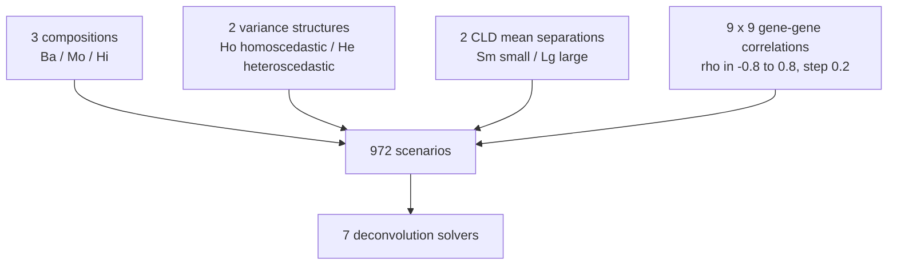
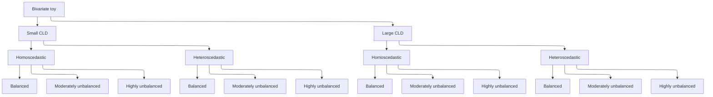

# 2.1 Bivariate toy model (G = 2 genes, J = 2 cell types)

This article is the bivariate Gaussian-convolution toy of the methods
paper (G=2, J=2). It isolates gene–gene correlation from mean
separation. The factorial grid and ADEMP pipeline live in a **single**
script, `scripts/fig02_bivariate_toy.R`. Scenario builders
(`build_bivariate_scenario_config()`,
`bivariate_toy_deconvolution_functions()`) sit at the top of that file.
Sourcing the script from a vignette or from a temp copy in tests defines
those functions without launching the 972-scenario pipeline.

[`run_simulation_benchmark()`](https://bastienchassagnol.github.io/DeCovarT/reference/run_simulation_benchmark.md)
wraps
[`simulate_bulk_mixture()`](https://bastienchassagnol.github.io/DeCovarT/reference/simulate_bulk_mixture.md),
[`deconvolute_ratios()`](https://bastienchassagnol.github.io/DeCovarT/reference/deconvolute_ratios.md),
and
[`compute_benchmark_metrics()`](https://bastienchassagnol.github.io/DeCovarT/reference/compute_benchmark_metrics.md).
Scenario rows are sequential; sample-level workers live only in
[`deconvolute_ratios()`](https://bastienchassagnol.github.io/DeCovarT/reference/deconvolute_ratios.md).
Reporting conventions (ADEMP, Nature Methods, raincloud / forest plots)
are in [how to build synthetic
scenarios](https://bastienchassagnol.github.io/DeCovarT/articles/theory-synthetic-scenarios-mean-covariance.html#sec-ademp).

``` default
%%{init: {"theme": "sandstone"}}%%
flowchart TD
  P["3 compositions<br/>Ba / Mo / Hi"] --> S["972 scenarios"]
  V["2 variance structures<br/>Ho homoscedastic / He heteroscedastic"] --> S
  C["2 CLD mean separations<br/>Sm small / Lg large"] --> S
  R["9 x 9 gene-gene correlations<br/>rho in -0.8 to 0.8, step 0.2"] --> S
  S --> A["7 deconvolution solvers"]
```



Figure 1: Bivariate toy factorial design: three compositions, two
variance structures, two CLD mean separations, a 9-by-9 gene-gene
correlation grid, and seven solvers (3 x 2 x 2 x 9 x 9 = 972 scenarios).

``` default
---
config:
  layout: elk
  theme: sandstone
---
flowchart TB
  ROOT["Bivariate toy"]
  ROOT --> Sm["Small CLD"]
  ROOT --> Lg["Large CLD"]
  Sm --> SmHo["Homoscedastic"]
  Sm --> SmHe["Heteroscedastic"]
  Lg --> LgHo["Homoscedastic"]
  Lg --> LgHe["Heteroscedastic"]
  SmHo --> SmHoBa["Balanced"]
  SmHo --> SmHoMo["Moderately unbalanced"]
  SmHo --> SmHoHi["Highly unbalanced"]
  SmHe --> SmHeBa["Balanced"]
  SmHe --> SmHeMo["Moderately unbalanced"]
  SmHe --> SmHeHi["Highly unbalanced"]
  LgHo --> LgHoBa["Balanced"]
  LgHo --> LgHoMo["Moderately unbalanced"]
  LgHo --> LgHoHi["Highly unbalanced"]
  LgHe --> LgHeBa["Balanced"]
  LgHe --> LgHeMo["Moderately unbalanced"]
  LgHe --> LgHeHi["Highly unbalanced"]
```



Figure 2: Hierarchical reading of the same factorial: small versus large
CLD, then homoscedastic versus heteroscedastic variances, then balanced
/ moderately unbalanced / highly unbalanced compositions (2 x 2 x 3 = 12
meta-scenarios). Each leaf is crossed with the 9-by-9 gene-gene
correlation grid.

## Generative model

With p_1+p_2=1, only one free ILR coordinate is estimated (see
[derivatives under simplex
transforms](https://bastienchassagnol.github.io/DeCovarT/articles/theory-decovart-generative-model.md)).
Even when mean profiles are similar, gene–gene correlation can degrade
mean-only solvers, and is partly recovered once
\boldsymbol{\Sigma}(\boldsymbol{p})=\sum_j p_j^2\boldsymbol{\Sigma}\_j
enters the likelihood.


\(a\) Hyperparameter grid used in the bivariate manuscript study: two
centroid geometries, balanced versus unbalanced \boldsymbol{p}, a
gene–gene correlation sweep, and the first-generation plus DeCovarT
solvers.


\(b\) AI-generated 2D density of the two-gene mixture while only the
pairwise correlation changes, at fixed means, marginal variances, and
composition. The ggplot panel below recomputes the same contrast and
annotates MixSim overlap.

Figure 3: Factorial design (left) and correlation-only 2D densities
(right) for the bivariate toy. {#fig-toy-design}

### Factorial design (972 scenarios)

| Factor | Levels |
|----|----|
| Composition \boldsymbol{p} | balanced (1/2,\\1/2); moderately unbalanced (17/20,\\3/20); highly unbalanced (99/100,\\1/100) |
| Mean separation (CLD) | small: \boldsymbol{\mu}\_{\cdot 1}=(20,22), \boldsymbol{\mu}\_{\cdot 2}=(22,20); large: (20,40), (40,20) |
| Gene–gene corr. CT 1 (\rho_1) | \\-0.8,\\-0.6,\\\ldots,\\0.8\\ — 9 levels |
| Gene–gene corr. CT 2 (\rho_2) | \\-0.8,\\-0.6,\\\ldots,\\0.8\\ — 9 levels |
| Variance structure | homoscedastic \sigma^2 = (1,1); heteroscedastic \sigma^2 = (1,2) |
| **Total scenarios** | 3 \times 2 \times 9 \times 9 \times 2 = \mathbf{972} |

N = 500 Monte Carlo replicates per scenario.

**CLD** is centroid (mean-profile) Euclidean separation
\lVert\boldsymbol{\mu}\_{\cdot 1}-\boldsymbol{\mu}\_{\cdot 2}\rVert_2,
not an Aitchison distance; see [the descriptor
notes](https://bastienchassagnol.github.io/DeCovarT/articles/theory-synthetic-scenarios-mean-covariance.html#nte-desc-cld).
Small CLD uses \boldsymbol{\mu}\_{\cdot 1}=(20,22),
\boldsymbol{\mu}\_{\cdot 2}=(22,20) (d=2\sqrt{2}\approx 2.83, cosine
\approx 0.995). Large CLD uses (20,40) and (40,20) (d=20\sqrt{2}\approx
28.3, cosine 0.8).

#### Scenario ID

Each row is labelled `B{index}_{variance}_{composition}_{CLD}`. The
index is the factorial row number (1–972). Example: `B1_Ho_Ba_Sm` is the
first row, homoscedastic, balanced proportions, small CLD.

| Token | Meaning |
|----|----|
| `B` | Bivariate toy (G=2, J=2) |
| `1`–`972` | Factorial row index |
| `Ho` / `He` | Homoscedastic / heteroscedastic marginal variances |
| `Ba` / `Mo` / `Hi` | Balanced / moderately unbalanced / highly unbalanced \boldsymbol{p} |
| `Sm` / `Lg` | Small / large CLD (Euclidean centroid gap) |

The slim design grid is `output/fig02/bivariate_config.rds` (no
`true_theta`). Geometry, MixSim `BarOmega`, Hellinger, and Jeffreys live
in `bivariate_descriptors.rds`. Convolution parameters are
`bivariate_theta.rds`. ADEMP metrics (`regression`, `monte_carlo`,
`optimisation`, `call`) are `bivariate_benchmark.rds`. All four files
share the `ID` key.
`read_simulation_artefacts(dir, "bivariate", assemble = TRUE)` rejoins
them for plotting.

The Monte Carlo \hat{\boldsymbol{p}} draws themselves are the cell-type
columns of `optimisation` (one row per replicate \times algorithm \times
scenario).
[`pivot_mc_estimates()`](https://bastienchassagnol.github.io/DeCovarT/reference/pivot_mc_estimates.md)
stacks those columns into long form. Interior Wald intervals for
convolution-likelihood solvers use
[`vcov_ilr_delta()`](https://bastienchassagnol.github.io/DeCovarT/reference/vcov_ilr_delta.md)
(expected Fisher information through the ILR chart), matching
[`confint.decovart_fit()`](https://bastienchassagnol.github.io/DeCovarT/reference/fit_decovart.md).
Coverage, `mean_model_se`, and `se_sd_ratio` (mean model SE / empirical
SD) are then finite. Mean-only solvers (NNLS, LSEI) leave those Wald
columns missing: they do not maximise the convolution likelihood, so an
ILR interval would not apply.

``` r

library(DeCovarT)
source("scripts/fig02_bivariate_toy.R")

bivariate_config <- build_bivariate_scenario_config()
nrow(bivariate_config)
```

### Log-likelihood along the simplex

For J=2 the free coordinate is p_1\in(0,1). The listing below evaluates
\ell\_{\boldsymbol{y}\mid\boldsymbol{\zeta}}(p_1,1-p_1) on one bulk
draw. It is not executed during `R CMD build`: Quarto’s Windows CLI
starts a new R process that cannot see the temporary library
([quarto-r#217](https://github.com/quarto-dev/quarto-r/issues/217)). The
same likelihood path is checked in `tests/testthat/`.

``` r

set.seed(20260828)
rho <- 0.6
R <- matrix(c(1, rho, rho, 1), nrow = 2)
Sigma <- array(c(R, R), dim = c(2, 2, 2))
dimnames(Sigma) <- list(
  rownames(mu_small),
  rownames(mu_small),
  colnames(mu_small)
)
y_one <- DeCovarT::simulate_bulk_mixture(
  mu_small,
  Sigma,
  p = p_bal,
  n = 1
)$Y[, 1]
p1_grid <- seq(0.02, 0.98, by = 0.01)
ll_grid <- vapply(
  p1_grid,
  function(p1) {
    DeCovarT::loglik_multivariate(c(p1, 1 - p1), y_one, mu_small, Sigma)
  },
  numeric(1)
)
ll_df <- data.frame(p1 = p1_grid, loglik = ll_grid)
ggplot2::ggplot(ll_df, ggplot2::aes(x = p1, y = loglik)) +
  ggplot2::geom_line(colour = "#1B4F72", linewidth = 0.8) +
  ggplot2::geom_vline(
    xintercept = 0.5,
    linetype = "dashed",
    colour = "grey30"
  ) +
  ggplot2::labs(
    x = "p1 (p2 = 1 - p1)",
    y = "Log-likelihood"
  ) +
  ggplot2::theme_bw(base_size = 11)
```

## Inference

Seven solvers are evaluated on each scenario:

| Solver | Description |
|----|----|
| `NNLS` | Lawson–Hanson non-negative least squares ([Dessole et al. 2023](#ref-dessoleLawsonHansonAlgorithmDeviation2023)) |
| `DeconRNASeq` | NNLS via `lsei` ([Gong and Szustakowski 2013](#ref-gongDeconRNASeqStatisticalFramework2013)) |
| `L-BFGS-B` | Quasi-Newton on box-constrained simplex |
| `gradient` | Projected gradient descent in ILR |
| `Newton-Raphson` | Second-order in ILR |
| `Marquardt-Levenberg` | Damped Newton via `marqLevAlg` |
| `SA` | Simulated annealing |

Performance is summarised using the ADEMP framework ([Morris et al.
2019](#ref-morrisUsingSimulationStudies2019)): **bias**, **RMSE**,
**coverage** of ILR Wald intervals (Wilson intervals on the coverage
*rate*), **SE/SD**, and optimiser **failure rate**. Mean-only baselines
have no convolution Wald SE.

``` r

N_REPLICATES <- as.integer(Sys.getenv("N_REPLICATES", unset = "500"))
deconvolution_functions <- bivariate_toy_deconvolution_functions(
  itmax = 200L,
  epsilon = 1e-4
)
bivariate <- run_simulation_benchmark(
  scenario_config = bivariate_config,
  deconvolution_functions = deconvolution_functions,
  n = N_REPLICATES,
  cores = 1L
)
```

`config` on the in-memory benchmark still carries Shannon entropy of
\boldsymbol{p} and MixSim overlap for tests. Saved artefacts split that
information: `optimisation` stores per-sample \hat{\boldsymbol{p}},
elapsed time, and memory; `regression` and `monte_carlo` are the
composition and ADEMP blocks from
[`compute_benchmark_metrics()`](https://bastienchassagnol.github.io/DeCovarT/reference/compute_benchmark_metrics.md).

## Visualisations

Figures are written from the split RDS (no ADEMP refit). Density books
go to `output/fig02/density_visualisations/`; RMSE / MAE / Aitchison
tiles, raincloud, forest, similarity, solver-dot, runtime, and memory
books go to `output/fig02/performance_visualisations/`. Tile heatmaps
([`ggplot2::geom_tile()`](https://ggplot2.tidyverse.org/reference/geom_tile.html))
show RMSE, MAE, and Aitchison distance on the (\rho_1,\rho_2) plane: one
PDF per metric, one page per meta-scenario (CLD () variance ()
composition), seven solver panels. Scenario factors are relevelled
(small then large CLD; homoscedastic then heteroscedastic; balanced,
moderately unbalanced, highly unbalanced) when artefacts are read, and
solvers follow `nnls`, `lsei`, `SA`, `gradient`, `LBFGS`,
`Newton-Raphson`, `Marquardt-Levenberg`. Density and performance books
share the four correlation corners
(\rho_1,\rho_2)\in\\(0,0),(-0.8,-0.8),(0.8,0.8),(-0.8,0.8)\\ (2\times
2\times 3=12 pages). Similarity heatmaps compute Pearson (r) of paired
() **within each corner**, with Ward D2 clustering of (1-r) and Ward
merge heights on the right dendrogram. Wald forests drop NNLS, LSEI, and
SA; solid whiskers are (1.96) times the expected-Fisher Wald SE at the
true composition, dashed whiskers use the empirical Monte Carlo SD, and
coloured `geom_label` boxes (one per cell type, matching fig03) report
RMSE and coverage. The native-space log-likelihood surface uses a log10
colour scale of the relative likelihood (L/L) so boundary peaks are
visible. Rainclouds plot (p) with solver fill **and** stroke, using the
same vertical spacing as this 12-page book. Runtime and memory
rainclouds use one page per meta-scenario, the four correlation corners
on the x-axis, and a log10 y-axis. Solver-dot pages use the same 9-by-9
((\_1,\_2)) grid as the RMSE heatmaps: colour is mean RMSE and size is
mean Aitchison distance, with horizontal y-axis labels. ggplot `data`
tables are saved under `output/fig02/ggplot_rds/`.

### Likelihood geometry and solver behaviour

The factorial heatmaps remain the right *design* summary: large CLD and
\rho_j=0 make the mean map injective, so every solver is accurate; small
CLD plus aligned correlations flatten the mean residual and raise RMSE
off the diagonal \rho_1=\rho_2. That saddle is a statement about
**identifiability of \boldsymbol{\mu}\boldsymbol{p}**, not about which
numerical method is used. The pack in `output/fig02/mle_explanation/`
(scenario descriptors, ILR profiles evaluated at
\boldsymbol{y}=\boldsymbol{\mu}\boldsymbol{p}^{\star}, expected-Fisher
Wald standard errors, and Newton versus Marquardt forests) is what
separates three mechanisms that the heatmaps mix: the shape of
\ell(\boldsymbol{p};\boldsymbol{y}), the surrogate each solver actually
minimises, and the chart / stopping rule that walks that surrogate.

#### What is being optimised

Mean-only `NNLS` and `DeconRNASeq` (`lsei` in `limSolve`) minimise a
**convex** quadratic
(\boldsymbol{y}-\boldsymbol{\mu}\boldsymbol{p})^{\top}
(\boldsymbol{y}-\boldsymbol{\mu}\boldsymbol{p}) on the simplex ([Dessole
et al. 2023](#ref-dessoleLawsonHansonAlgorithmDeviation2023); [Gong and
Szustakowski 2013](#ref-gongDeconRNASeqStatisticalFramework2013);
[Soetaert et al. 2026](#ref-R-limSolve)). For a convex objective a local
minimiser is global ([Boyd et al. 2004, ch.
4](#ref-boydConvexOptimization2004)), so those fits are unique solutions
of the *least-squares* problem. They are **not** maximisers of the
convolution log-likelihood: \boldsymbol{\Sigma}(\boldsymbol{p}) never
enters the quadratic. When \boldsymbol{\mu}\_{\cdot 1} and
\boldsymbol{\mu}\_{\cdot 2} are close, that quadratic is a ridge along
the simplex. A strictly feasible QP with bound constraints then has
vertices as KKT candidates, which is why mean-only fits pile up at (1,0)
and (0,1) whenever the residual is uninformative. Simulated annealing
explores the same non-concave \ell as DeCovarT but without curvature, so
it is a robustness check, not an MLE.

The convolution solvers maximise the Gaussian-convolution log-likelihood
of the [MLE properties
article](https://bastienchassagnol.github.io/DeCovarT/articles/theory-DeCovarT-MLE-properties.html)
(that article is pkgdown-only; this vignette is the CRAN-shipped
companion). None of them inherits Boyd’s global certificate, because
that likelihood is not concave. They differ in **coordinates and
damping**:

- `L-BFGS-B` ([`stats::optim`](https://rdrr.io/r/stats/optim.html)) runs
  limited-memory BFGS with box constraints 0\le p_j\le 1 ([Byrd et al.
  1995](#ref-byrdLimitedMemoryAlgorithm1995); [Zhu et al.
  1997](#ref-zhuAlgorithm778LBFGSB1997)), then closes the simplex by
  p/\sum p. The equality \mathbf{1}^{\top}\boldsymbol{p}=1 is **not** a
  constraint of the line search, so \boldsymbol{\Sigma}(\boldsymbol{p})
  can approach singularity mid-iteration; the implementation guards that
  with a finite penalty. Faces of the cube remain admissible, which is
  how a limited-memory quasi-Newton method sits on a simplex face after
  renormalisation.
- `Newton-Raphson`
  ([`stats::nlminb`](https://rdrr.io/r/stats/nlminb.html)) and
  `Marquardt-Levenberg` (`marqLevAlg`; ([Philipps et al.
  2023](#ref-R-marqLevAlg),
  [2021](#ref-philippsRobustEfficientOptimization2021))) work in ILR
  coordinates, so the walk stays in the relative interior until a
  coordinate diverges. Newton uses the analytic Hessian. Marquardt adds
  a Levenberg damping term so that the working matrix stays positive
  definite ([Marquardt
  1963](#ref-marquardtAlgorithmLeastSquaresEstimation1963)) even when
  the Hessian of \ell is indefinite, and stops on the
  relative-distance-to-maximum (RDM) criterion: the ratio of
  *optimisation* error to *statistical* error ([Commenges et al.
  2006](#ref-commengesNewtonLikeAlgorithmLikelihood2006)). On a plateau,
  RDM is a feature — further progress along a flat ridge does not change
  inferential accuracy — and a bias: the iterate can halt nearer the
  barycentre than the true face.

The `gradient` solver is ILR BFGS without a Hessian, so it inherits the
chart but not Newton’s local quadratic rate. Boyd’s Newton analysis
(quadratic convergence in a neighbourhood of a strict local maximiser
with positive-definite Hessian) applies to `nlminb` only when the
realised \ell is locally strongly concave. The bivariate small-CLD
profiles are not.

#### One bulk, N=1

Every Monte Carlo replicate here is a **single** G=2 bulk. The MLE is
therefore the N=1 estimator of [the finite-sample
section](https://bastienchassagnol.github.io/DeCovarT/articles/theory-DeCovarT-MLE-properties.html#sec-finite-sample):
biased at O(1), with Wald SEs that describe the Monte Carlo spread of
that one-observation maximiser, not a sampling experiment with growing
N. Pooling N i.i.d. columns with a shared \boldsymbol{p}^{\star} is what
would make \hat{\boldsymbol{p}}\_N consistent. The ILR profiles in the
pack are evaluated at the *conditional mean*
\boldsymbol{y}=\boldsymbol{\mu}\boldsymbol{p}^{\star}, which isolates
the log-determinant remainder; the forests average over random
\boldsymbol{Y}.

#### Reading the twelve meta-scenarios

Numbers below are from `forest_newton_marquardt.csv`,
`theoretical_wald_se.csv`, and the range of `ilr_loglik_profiles.csv`
(max minus min of \ell(\rho) on the plotting grid).

**Large CLD, balanced, \rho_j=0 (`B567`).** The mean map is well
conditioned. The ILR profile spans about 101 nats and
\mathrm{SE}\_{\rho}=0.071. Newton and Marquardt agree to numerical
noise: bias of p_1 about 0, RMSE 0.024, coverage 0.96, and the empirical
SD matches the expected-Fisher SE (0.025). This is the textbook interior
MLE: strongly concave locally, RDM and Newton stop at the same point.

**Large CLD, balanced, \rho_j=-0.8 (`B487`).** Equal negative
correlation inflates variance along the anti-diagonal of gene space but
does not destroy the mean contrast. Profile range 56,
\mathrm{SE}\_{\rho}=0.095, RMSE 0.033 for both second-order solvers.
Covariance-aware curvature is still enough.

**Small CLD, balanced (`B1`, `B81`).** Means (20,22) versus (22,20)
almost collinear. Profile range drops to 1.2–1.7 nats;
\mathrm{SE}\_{\rho} is 0.95 (both \rho=-0.8) or 0.71 (\rho=0). RMSE of
p_1 is 0.19–0.23 and Wald coverage is conservative (0.98–1). Marquardt
is slightly *less* variable than Newton here (RMSE 0.192 versus 0.234 on
`B1`): damping and RDM cut walks along the ridge, which for a *balanced*
truth is a small bias toward 1/2 that happens to reduce RMSE. Mean-only
QPs see an even flatter residual and are the ones that snap to vertices.

**Highly unbalanced, small CLD (`B325`, `B405`,
p^{\star}=(0.99,0.01)).** The ILR chart sends the rare type to
\rho\to+\infty. Fisher curvature in \rho collapses: \mathrm{SE}\_{\rho}
is 24 (both \rho=-0.8) or 20 (\rho=0), while the profile range on a
finite grid is only 2.4–4.1 nats — a plateau, not a peak. Newton bias
for p_1 is -0.22 and -0.18; Marquardt bias is -0.40 and -0.38. Both
shrink toward the barycentre, Marquardt more so, exactly as RDM predicts
on a flat tail. Coverage stays near 0.92–0.94 because the Wald interval
is already huge. This is the geometry behind chi-bar-square calibration
on a face ([boundary
LRTs](https://bastienchassagnol.github.io/DeCovarT/articles/theory-DeCovarT-MLE-properties.html#sec-boundary)):
the tangent cone is a half-line, Wilks does not apply, and a Wald SE in
ILR is not a calibrated rare-type interval.

**Highly unbalanced, large CLD (`B811`, `B891`).** The profile in \rho
is *not* flat in the raw log-likelihood (range 218–392), because a 1\\
contamination still shifts a well-separated mean. The ILR SE remains
large (3.3 and 2.5) because a small p_2 is a long way out on the chart.
Newton follows that peak: bias -0.017 and -0.010, RMSE 0.035 and 0.026,
coverage 0.97. Marquardt does **not**: bias -0.26 and -0.29, RMSE 0.35
and 0.37, coverage 0.47 and 0.40. The damping / RDM pair stops in ILR
before \|\rho\| is large enough to represent p_2=0.01. A sharp peak in p
can still look like a long walk in \rho; Marquardt’s statistical
stopping rule then under-shoots a rare type even when the convolution
likelihood is informative. That failure is an optimiser-chart
interaction, not a lack of covariance signal.

Moderately unbalanced rows sit between these extremes: small-CLD RMSE
0.23–0.31 with Marquardt again more barycentric; large-CLD RMSE about
0.03–0.04 with the two second-order solvers aligned.

#### What the heatmaps still add

The 9\times 9 (\rho_1,\rho_2) tiles, which are **not** in the twelve-row
explanation pack, remain the place to see mean-only methods lose first
as \|\rho\| grows at small CLD, and to see DeCovarT retain the diagonal
saddle. The pack’s message is narrower and sharper: with N=1, a plateau
in ILR makes every interior solver noisy; Marquardt’s RDM is the right
stop on a balanced ridge and the wrong stop on a rare type; Newton with
a full Hessian tracks p^{\star} once the means separate; convex QPs
solve a different problem and are entitled only to that problem’s unique
minimiser.

### See also

- Variance-driven hybrid (G=20, J=3):
  [§2.2](https://bastienchassagnol.github.io/DeCovarT/articles/fig03-covariance-driven.md)
- Moment generator and ADEMP reporting: [How to build synthetic
  scenarios](https://bastienchassagnol.github.io/DeCovarT/articles/theory-synthetic-scenarios-mean-covariance.md)
- Regular-case MLE checks: [Appendix
  S1](https://bastienchassagnol.github.io/DeCovarT/articles/supp-S1-identifiability.md)

### References

Boyd, Stephen, Stephen P. Boyd, and Lieven Vandenberghe. 2004. *Convex
Optimization*. 1st edn. Cambridge University Press; Cambridge University
Press. <https://doi.org/10.1017/cbo9780511804441>.

Byrd, Richard H., Peihuang Lu, Jorge Nocedal, and Ciyou Zhu. 1995. ‘A
Limited Memory Algorithm for Bound Constrained Optimization’. *SIAM
Journal on Scientific Computing* 16 (5): 1190–208.
<https://doi.org/10.1137/0916069>.

Commenges, Daniel, Helene Jacqmin-Gadda, Cecile Proust, and Jeremie
Guedj. 2006. *A Newton-Like Algorithm for Likelihood Maximization: The
Robust-Variance Scoring Algorithm*. arXiv.
<https://doi.org/10.48550/arxiv.math/0610402>.

Dessole, Monica, Marco Dell’Orto, and Fabio Marcuzzi. 2023. ‘The
Lawson-Hanson Algorithm with Deviation Maximization: Finite Convergence
and Sparse Recovery’. *Numerical Linear Algebra with Applications* 30
(5): e2490. <https://doi.org/10.1002/nla.2490>.

Gong, Ting, and Joseph D. Szustakowski. 2013. ‘DeconRNASeq: A
Statistical Framework for Deconvolution of Heterogeneous Tissue Samples
Based on mRNA-Seq Data’. *Bioinformatics (Oxford, England)* 29.
<https://doi.org/10.1093/bioinformatics/btt090>.

Marquardt, Donald W. 1963. ‘An Algorithm for Least-Squares Estimation of
Nonlinear Parameters’. *Journal of the Society for Industrial and
Applied Mathematics* 11. <https://doi.org/10.1137/0111030>.

Morris, Tim P., Ian R. White, and Michael J. Crowther. 2019. ‘Using
Simulation Studies to Evaluate Statistical Methods’. *Statistics in
Medicine* 38 (11): 2074–102. <https://doi.org/10.1002/sim.8086>.

Philipps, Viviane, Boris P. Hejblum, Mélanie Prague, Daniel Commenges,
and Cécile Proust-Lima. 2021. ‘Robust and Efficient Optimization Using a
Marquardt-Levenberg Algorithm with R Package marqLevAlg’. *The R
Journal* 13. <https://doi.org/10.32614/rj-2021-089>.

Philipps, Viviane, Cecile Proust-Lima, Melanie Prague, Boris Hejblum,
Daniel Commenges, and Amadou Diakite. 2023. *marqLevAlg: A Parallelized
General-Purpose Optimization Based on Marquardt-Levenberg Algorithm*.

Soetaert, Karline, Karel Van den Meersche, and Dick van Oevelen. 2026.
*limSolve: Solving Linear Inverse Models*.

Zhu, Ciyou, Richard H. Byrd, Peihuang Lu, and Jorge Nocedal. 1997.
‘Algorithm 778: L-BFGS-B: Fortran Subroutines for Large-Scale
Bound-Constrained Optimization’. *ACM Transactions on Mathematical
Software* 23 (4): 550–60. <https://doi.org/10.1145/279232.279236>.
