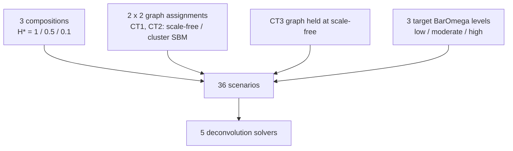
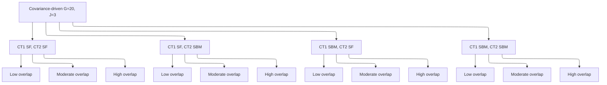

# 2.2 Covariance-driven scenario (G = 20, J = 3)

``` r

library(DeCovarT)
```

The bivariate toy confirms the theoretical benefit of covariance
modelling in a transparent setting but cannot demonstrate realistic
gene-regulatory network (GRN) topology. This scenario uses G = 20 genes
and J = 3 cell types in which types 1 and 2 are **mean-collinear**
(\cos(\boldsymbol{\mu}\_{\cdot 1},\boldsymbol{\mu}\_{\cdot 2})=0.9): the
network topology encoded in \boldsymbol{\Sigma}\_j is the remaining
discriminative signal. Construction, ADEMP benchmark, and the static
network figure live in a **single** script,
`scripts/fig03_variance_driven.R` (seed `20260807`).

``` default
%%{init: {"theme": "sandstone"}}%%
flowchart TD
  P["3 compositions<br/>H* = 1 / 0.5 / 0.1"] --> S["36 scenarios"]
  G["2 x 2 graph assignments<br/>CT1, CT2: scale-free / cluster SBM"] --> S
  C["CT3 graph held at scale-free"] --> S
  K["3 target BarOmega levels<br/>low / moderate / high"] --> S
  S --> A["5 deconvolution solvers"]
```



Figure 1: Covariance-driven factorial: one fixed Gram (cosines 0.9 /
0.1), a 2-by-2 graph assignment on the mean-collinear types (scale-free
versus cluster SBM; type 3 held at scale-free), three target MixSim
average overlaps, three Shannon compositions, and five solvers (4 x 3 x
3 = 36 scenarios).

``` default
---
config:
  layout: elk
  theme: sandstone
---
flowchart TB
  ROOT["Covariance-driven G=20, J=3"]
  ROOT --> SfSf["CT1 SF, CT2 SF"]
  ROOT --> SfSb["CT1 SF, CT2 SBM"]
  ROOT --> SbSf["CT1 SBM, CT2 SF"]
  ROOT --> SbSb["CT1 SBM, CT2 SBM"]
  SfSf --> SfSfLo["Low overlap"]
  SfSf --> SfSfMo["Moderate overlap"]
  SfSf --> SfSfHi["High overlap"]
  SfSb --> SfSbLo["Low overlap"]
  SfSb --> SfSbMo["Moderate overlap"]
  SfSb --> SfSbHi["High overlap"]
  SbSf --> SbSfLo["Low overlap"]
  SbSf --> SbSfMo["Moderate overlap"]
  SbSf --> SbSfHi["High overlap"]
  SbSb --> SbSbLo["Low overlap"]
  SbSb --> SbSbMo["Moderate overlap"]
  SbSb --> SbSbHi["High overlap"]
```



Figure 2: Hierarchical reading of the covariance factorial: 2-by-2 graph
assignment on mean-collinear cell types 1 and 2 (type 3 held at
scale-free), then low / moderate / high target MixSim BarOmega (4 x 3 =
12 covariance draws). Each leaf is crossed with the three Shannon
compositions H\* = 1 / 0.5 / 0.1.

## Generative model

One fixed mean signature \boldsymbol{\mu}\in\mathbb{R}^{G\times J} is
built with
[`generate_mean_signature_matrix()`](https://bastienchassagnol.github.io/DeCovarT/reference/generate_mean_signature_matrix.md)
and an explicit Gram `target_gram` ([mean signature
construction](https://bastienchassagnol.github.io/DeCovarT/articles/theory-synthetic-scenarios-mean-covariance.html#sec-lr-block-mu)).
There is no marker block and no null (`equal_all`) block: uninformative
genes would be removed before deconvolution.

R = \begin{pmatrix} 1 & 0.9 & 0.1 \\ 0.9 & 1 & 0.1 \\ 0.1 & 0.1 & 1
\end{pmatrix}, \qquad \boldsymbol{\mu} = s\mathbf{Q}R^{1/2}, \quad s=10.
\tag{1}

Because \mathbf{Q}^{\mathsf{T}}\mathbf{Q}=\mathbf{I}\_J, the pairwise
cosines of the columns of \boldsymbol{\mu} equal R exactly (up to
rounding). Euclidean gaps follow \lVert\boldsymbol{\mu}\_{\cdot
j}-\boldsymbol{\mu}\_{\cdot k}\rVert =s\sqrt{2(1-R\_{jk})}. The call
uses `nonnegative = TRUE` (disjoint gene-block frame) so that
\boldsymbol{\mu}\ge 0, as required by
[`deconvolute_ratios()`](https://bastienchassagnol.github.io/DeCovarT/reference/deconvolute_ratios.md).

| pair                     | cosine |                  Euclidean |
|:-------------------------|-------:|---------------------------:|
| celltype_1 vs celltype_2 |    0.9 |  10\sqrt{0.2}\approx 4.472 |
| celltype_1 vs celltype_3 |    0.1 | 10\sqrt{1.8}\approx 13.416 |
| celltype_2 vs celltype_3 |    0.1 | 10\sqrt{1.8}\approx 13.416 |

Table 1: Exact pairwise geometry of the 20\times 3 mean signature
(`target_gram`, `mean_scale` =10).

Each of the mean-collinear types (CT1, CT2) independently draws an
undirected skeleton from one of two generators, then completes a signed
precision with
[`build_normalised_precision()`](https://bastienchassagnol.github.io/DeCovarT/reference/build_normalised_precision.md)
([GGM
networks](https://bastienchassagnol.github.io/DeCovarT/articles/theory-synthetic-scenarios-mean-covariance.html#sec-ggm-networks);
topology families in [the topology
table](https://bastienchassagnol.github.io/DeCovarT/articles/theory-synthetic-scenarios-mean-covariance.html#tbl-topologies)):

- **Scale-free** (`graph_model = "scale_free"`): Barabási–Albert
  preferential attachment (`power = 1`, `edges_per_node = 1`).
- **Cluster / stochastic block model**
  (`graph_model = "stochastic_block_model"`): three blocks with
  probabilities (0.5,0.25,0.25), p\_{\mathrm{within}}=0.25,
  p\_{\mathrm{between}}=0.01.

Erdős–Rényi is not used. Type 3, already separated by the Gram
(R\_{13}=R\_{23}=0.1), is held at scale-free, so the topology factorial
is 2^{2}=4 assignments on CT1 and CT2. Those generator names and
parameter lists are stored on every row of `hybrid_config.rds` as
`graph_ct1` / `graph_ct2` / `graph_ct3` and the list-column
`graph_generators`, and again inside each `true_theta`.

The spectral cushion u used at completion is now a **fixed** engineering
constant (`PRECISION_SHIFT_BASE = 0.2`) so that each graph has one SPD
precision. The experimental knob is a global covariance scale s:
\boldsymbol{\Sigma}\_j\mapsto s\boldsymbol{\Sigma}\_j keeps every
structural zero of \boldsymbol{\Omega}\_j because
\boldsymbol{\Omega}\_j(s)=\boldsymbol{\Omega}\_j/s.
[`scale_covariances_to_overlap()`](https://bastienchassagnol.github.io/DeCovarT/reference/scale_covariances_to_overlap.md)
searches s so that MixSim `BarOmega` matches a target in
\\0.02,0.08,0.20\\ (low / moderate / high), using Sobol Monte Carlo for
G=20 ([overlap
note](https://bastienchassagnol.github.io/DeCovarT/articles/theory-distance-covariance.html#sec-fig03-scale)).
This is the graph-constrained analogue of MixSim / FSDA average-overlap
simulation ([CRAN
MixSim](https://cran.r-project.org/web/packages/MixSim/refman/MixSim.html#MixSim);
([Melnykov et al. 2012](#ref-melnykovMixSimPackageSimulating2012);
[Riani et al. 2015](#ref-rianiSimulatingMixturesMultivariate2015))): we
do **not** call `MixSim()` as a generator, because it cannot take a
precision support as input.

Larger s also raises the covariance-information fraction
f\_{\mathrm{cov}} (mean Fisher scales as 1/s; the covariance block is
scale-invariant). See the [tangent-Fisher
callout](https://bastienchassagnol.github.io/DeCovarT/articles/theory-synthetic-scenarios-mean-covariance.html#nte-desc-fisher).

| Factor                 | Levels                                   |
|------------------------|------------------------------------------|
| Graph model (CT1, CT2) | scale-free; cluster SBM                  |
| Graph model (CT3)      | scale-free (fixed)                       |
| Target `BarOmega`      | low (0.02); moderate (0.08); high (0.20) |
| Topology assignments   | 2^{2}=\mathbf{4}                         |
| Covariance draws       | 4\times 3=\mathbf{12}                    |

Table 2: Covariance factorial (graphs \times target average overlap).

[`describe_simulation_scenario()`](https://bastienchassagnol.github.io/DeCovarT/reference/describe_simulation_scenario.md)
records the realised `BarOmega`, f\_{\mathrm{cov}},
\kappa\\\boldsymbol{\Sigma}(\boldsymbol{p})\\, and pairwise AIRM
distance of the \boldsymbol{\Sigma}\_j on every row. The overlap target
is matched at the **balanced** composition; unbalanced \boldsymbol{p}
change MixSim’s MAP weights, so realised `BarOmega` is higher there.
AIRM is invariant to the global scale s (it scores topology / shape).
f\_{\mathrm{cov}} rises with s.


Figure 3: Two generator examples on G=20 nodes (scale-free, cluster
SBM). Mean-collinear cell types 1 and 2 are each assigned one of these
families; type 3 is held at scale-free.

Two generators were considered but not adopted:

- **Toeplitz covariances**: encode only local (banded) dependencies;
  cannot model cell-type-specific sparse precision.
- **`MixSim()` as a mixture generator**: draws unconstrained means and
  covariances for a target average overlap; no graph-constrained
  precision input. DeCovarT keeps the graphs and matches `BarOmega` by
  scaling \boldsymbol{\Sigma}\_j instead.

## Inference

Compositions are one-dominant vectors from
[`composition_from_entropy()`](https://bastienchassagnol.github.io/DeCovarT/reference/composition_from_entropy.md)
targeting normalised Shannon entropy H^{\star}\in\\1,0.5,0.1\\
(balanced; moderately unbalanced; highly unbalanced). All DeCovarT
solvers start at the barycentre (`initial_p = "barycentre"`). Other
initialisation strategies are reserved for separate scenarios.

| Factor | Levels |
|----|----|
| Composition \boldsymbol{p} | H^{\star}=1; H^{\star}=0.5; H^{\star}=0.1 |
| Algorithms | DeconRNASeq (`lsei`), CIBERSORT, L-BFGS-B, Newton–Raphson, Marquardt–Levenberg |
| **Total scenarios** | 4\times 3\times 3=\mathbf{36} |

N = 50 Monte Carlo replicates per scenario.

| Algorithm | Function | Constraint |
|:---|:---|:---|
| QP (`DeconRNASeq`-style) | `deconvolute_ratios_deconrnaseq` | simplex equality / inequality |
| CIBERSORT-style \nu-SVR | `deconvolute_ratios_cibersort` | non-negative then [`repair_simplex()`](https://bastienchassagnol.github.io/DeCovarT/reference/repair_simplex.md) |
| L-BFGS-B | `deconvolute_ratios_L_BFGS_B` | ILR \to open simplex |
| Newton–Raphson | `deconvolute_ratios_Newton_Raphson` | ILR / `nlminb` |
| Marquardt–Levenberg | `deconvolute_ratios_Marquardt_Levenberg` | ILR \to open simplex |

Table 3: Solvers used in the covariance-driven comparison.

Mean-only baselines (LSEI, CIBERSORT) ignore \boldsymbol{\Sigma}\_j. The
three DeCovarT maps use the same convolution likelihood. The shipped
catalogue (robust linear model, GLS, BFGS, simulated annealing) is
listed in
[`deconvolute_ratios()`](https://bastienchassagnol.github.io/DeCovarT/reference/deconvolute_ratios.md).

``` r

N_REPLICATES <- as.integer(Sys.getenv("N_REPLICATES", unset = "50"))
ALGORITHMS <- c(
  "lsei",
  "cibersort",
  "LBFGS",
  "Newton-Raphson",
  "Marquardt-Levenberg"
)
# Full pipeline: Rscript scripts/fig03_variance_driven.R
```

## Visualisations

| Output | Description |
|----|----|
| `output/fig03/density_visualisations/mean_signature.pdf` | Unscaled () heatmap |
| `output/fig03/density_visualisations/latent_projections.pdf` | 16-page 2D latent-space book (Thomson / MCFA / `MclustDR`) |
| `output/fig03/density_visualisations/loglik_rgl.pdf` | 3D ALR log-likelihood (`rgl`, (\_1,\_2,)) |
| `output/fig03/density_visualisations/network_topologies.pdf` | Graph skeletons, one page per MixSim overlap |
| `output/fig03/performance_visualisations/heatmap_rmse.pdf` | RMSE tiles |
| `output/fig03/performance_visualisations/heatmap_aitchison.pdf` | Aitchison tiles |
| `output/fig03/performance_visualisations/raincloud.pdf` | Monte Carlo () rainclouds |
| `output/fig03/performance_visualisations/forest.pdf` | ADEMP Wald forest |
| `output/fig03/performance_visualisations/runtime.pdf` | Solver wall-clock (log10 seconds) |
| `output/fig03/performance_visualisations/memory.pdf` | Peak memory (log10 MiB) |

Redraw with
`FIG03_POSTPROCESS_ONLY=1 Rscript scripts/fig03_variance_driven.R` (no
ADEMP refit). ggplot `data` tables go under `output/fig03/ggplot_rds/`.

### Two-dimensional projections of a Gaussian convolution

With (G=20) the purified Gaussians and the bulk convolution are no
longer drawable in the gene plane. The 16-page book
`latent_projections.pdf` therefore maps each selected scenario to a 2D
latent display. Pages keep the **lowest and highest** MixSim overlap
(low / high; the moderate arm is omitted) and the **highest and lowest**
Shannon entropy of () (balanced versus highly unbalanced), crossed with
the four CT1/CT2 graph assignments ((2=16)). Each page is a (3) of
scatterplots with 95% Gaussian ellipses, cell-type colour, axis labels
that report the share of variability on the first two coordinates, a
transparent cowplot scree inset of the first ten scaled eigenvalues, and
a six-line footnote for panels A–F. Square panels use a unit aspect
ratio (not `coord_equal`), so unequal factor-score ranges no longer
squash the shared-plane row.

The three routes below all return an ordered set of eigenvalues that
summarise how much variability sits in the plotted plane. They are
**not** interchangeable with the DeCovarT likelihood: the bulk profile
is a **convolution** of Gaussians, not a Gaussian mixture.

> **Warning 1**
>
> A J-type bulk draw is
> Y\mid\boldsymbol{p}\sim\mathcal{N}\bigl(\boldsymbol{\mu}(\boldsymbol{p}),\boldsymbol{\Sigma}(\boldsymbol{p})\bigr)
> with \boldsymbol{\mu}(\boldsymbol{p})=\sum_j
> p_j\boldsymbol{\mu}\_{\cdot j} and
> \boldsymbol{\Sigma}(\boldsymbol{p})=\sum_j
> p_j^2\boldsymbol{\Sigma}\_j. Every observation is a weighted sum of
> **all** types
> ([`simulate_bulk_mixture()`](https://bastienchassagnol.github.io/DeCovarT/reference/simulate_bulk_mixture.md)).
> A finite mixture instead draws a latent label and then one component,
> f(\boldsymbol{y})=\sum_k\pi_k\\\phi(\boldsymbol{y};\boldsymbol{\mu}\_k,\boldsymbol{\Sigma}\_k),
> with mixing weights () (not (^2)). `MclustDR` and mixtures of factor
> analysers target that mixture. Their (\_k) are not cell-type
> proportions, and their component densities are not the convolution law
> used for deconvolution.

#### Independent factor analyses per cell type

The top row fits a two-factor Gaussian factor model **separately** to
purified draws from each type
([`stats::factanal()`](https://rdrr.io/r/stats/factanal.html), Thomson /
regression scores ([Thomson
1938](#ref-thomsonMethodsEstimatingMental1938))). The orthogonal-factor
model is
\boldsymbol{x}=\boldsymbol{\mu}+\Lambda\boldsymbol{f}+\boldsymbol{\varepsilon}
with \boldsymbol{f}\sim N(\boldsymbol{0},I) and diagonal uniquenesses
\Psi, so \boldsymbol{\Sigma}=\Lambda\Lambda^\top+\Psi. Thomson scores
are the posterior mean
\hat{\boldsymbol{f}}\_R=E\[\boldsymbol{f}\mid\boldsymbol{x}\]=\Lambda^\top\boldsymbol{\Sigma}^{-1}(\boldsymbol{x}-\boldsymbol{\mu}).
That is the natural probabilistic answer to “where does this 20-gene
profile sit in the plane?”. Bartlett scores (uniqueness- weighted GLS)
remain a `factanal(..., scores = "Bartlett")` sensitivity check and are
not plotted. Gene-wise marginal variances are comparable after the
global MixSim scale, so uniquenesses are less heterogeneous than in a
typical psychometric battery. Independent per-type fits do **not** share
a loading matrix: the three planes are not superimposed.

``` r

fit <- stats::factanal(
  X,
  factors = 2,
  rotation = "none",
  scores = "regression"
)
scores <- as.data.frame(fit$scores)
ggplot2::ggplot(scores, ggplot2::aes(Factor1, Factor2)) +
  ggplot2::geom_point() +
  ggplot2::coord_equal() +
  ggplot2::theme_classic()
```

#### Shared MCFA plane (`EMMIXmfa`)

The bottom-left and bottom-centre panels use mixtures of common factor
analysers ([McLachlan and Peel 2000](#ref-MixturesFactorAnalyzers2000);
[Rathnayake et al. 2024](#ref-R-EMMIXmfa)): a shared loading matrix A
with \boldsymbol{\mu}\_i=A\boldsymbol{\xi}\_i and
\boldsymbol{\Sigma}\_i=A\Omega_i A^\top+D, so that posterior factor
means live in **one** q=2 plane. The eigenvalues of
A\bar{\Omega}A^\top+D are the scree inset.

- **Convolution (panel D).** Bulk columns come from
  [`simulate_bulk_mixture()`](https://bastienchassagnol.github.io/DeCovarT/reference/simulate_bulk_mixture.md)
  (covariance weights p_j^2). MCFA is fitted to those unlabelled bulk
  draws, then the *latent* purified slices () from the same simulation
  are scored into that shared plane and coloured by true type.
- **Unsupervised mixture (panel E).** Each draw is from **one**
  component with probability p_j (not p_j^2). MCFA does not use the
  labels; colour is the generating type, so the plot shows how well the
  shared factors recover overlap.

#### Supervised `MclustDR` plane

The bottom-right panel takes the same labelled mixture draws and fits
`mclust::MclustDA(..., modelType = "EDDA")` then
[`mclust::MclustDR()`](https://mclust-org.github.io/mclust/reference/MclustDR.html)
([Fraley et al. 2026](#ref-R-mclust); [Scrucca
2010](#ref-scruccaDimensionReductionModelbased2010a),
[2015](#ref-scruccaGraphicalToolsModelbased2015)). See the [`MclustDR`
reference](https://mclust-org.github.io/mclust/reference/MclustDR.html).
The kernel blends between-class mean separation with covariance
differences (`lambda = 1` emphasises separation). The generalised
eigenvalues (`evalues`) are the scree inset: they are cluster-relevant
variability, not ordinary PCA variance. This is the right 2D plot **if**
class labels are known. On bulk convolution draws a one-component
Gaussian is the truth, so `Mclust` would split a single ellipsoid; that
misspecified fit is not shown.

### Solver runtime and memory

`runtime.pdf` and `memory.pdf` use the same composition order as the
other performance books (balanced, then moderately unbalanced, then
highly unbalanced): **one page per** (). Each page facets the three
MixSim overlap levels, puts CT1/CT2 topology on the x-axis (`SF/SF`,
`SF/SBM`, `SBM/SF`, `SBM/SBM`), and maps solver to colour, fill, and
grouping. The geometry is a vertical ggdist half-eye (raincloud) of the
per-sample `optimisation$elapsed_sec` or `memory_bytes` (converted to
MiB), with a left-side `geom_rug()` of the raw Monte Carlo draws and a
log10 y-axis.

### Likelihood geometry and solver behaviour

Cell types 1 and 2 share cosine 0.9, so the mean map
\boldsymbol{\mu}\boldsymbol{p} is close to singular in the (p_1,p_2)
plane: type 3 is the only well-separated mean. MixSim \bar\omega then
sets how much of the remaining signal lives in
\\\boldsymbol{\Sigma}\_j\\. The pack in `output/fig03/mle_explanation/`
(descriptors, ILR slices of \ell at
\boldsymbol{y}=\boldsymbol{\mu}\boldsymbol{p}^{\star}, expected-Fisher
SEs, Newton/Marquardt forests on **balanced** compositions, and a
quantile-sampled raincloud across all H^{\star}) is the numerical
reading of that geometry. As in the bivariate toy, three layers must be
kept apart: the convolution \ell, the surrogate each solver optimises,
and the chart / KKT / stopping rule.

#### Surrogates versus the convolution

`lsei` (`limSolve`) is again a convex QP for
\\\boldsymbol{y}-\boldsymbol{\mu}\boldsymbol{p}\\\_2^2 on the simplex
([Soetaert et al. 2026](#ref-R-limSolve); [Gong and Szustakowski
2013](#ref-gongDeconRNASeqStatisticalFramework2013); [Dessole et al.
2023](#ref-dessoleLawsonHansonAlgorithmDeviation2023); [Boyd et al.
2004](#ref-boydConvexOptimization2004)). With two nearly collinear
signature columns the QP is under-determined in the (p_1,p_2) direction;
the equality \sum p_j=1 plus bounds then put mass on a face. `CIBERSORT`
replaces squares by a \nu-SVR hinge ([Newman et al.
2015](#ref-newmanRobustEnumerationCell2015)). The dual is a convex
quadratic programme solved by sequential working-set methods ([Fan et
al. 2005](#ref-fanWorkingSetSelection2005)). The wrapper does **not**
constrain coefficients to the simplex during the fit: negatives are
clipped to zero and the remainder is renormalised. Clipping is a
Euclidean projection onto the positive orthant, not a constrained MLE,
so a support vector that overshoots becomes a vertex of \Delta^{2}.
Neither method sees p_j^2\boldsymbol{\Sigma}\_j.

DeCovarT solvers maximise the Gaussian convolution. `Newton-Raphson` and
`Marquardt-Levenberg` do so in ILR, with a full Hessian versus Marquardt
damping plus RDM ([Marquardt
1963](#ref-marquardtAlgorithmLeastSquaresEstimation1963); [Commenges et
al. 2006](#ref-commengesNewtonLikeAlgorithmLikelihood2006); [Philipps et
al. 2021](#ref-philippsRobustEfficientOptimization2021),
[2023](#ref-R-marqLevAlg)). `L-BFGS-B` uses a limited-memory inverse
Hessian with box constraints on p, then p/\sum p ([Byrd et al.
1995](#ref-byrdLimitedMemoryAlgorithm1995); [Zhu et al.
1997](#ref-zhuAlgorithm778LBFGSB1997)). The same caveats as in [the
bivariate
interpretation](https://bastienchassagnol.github.io/DeCovarT/articles/fig02-bivariate-toy.html#sec-bivariate-findings)
apply: Boyd’s local-quadratic Newton rate needs a locally strongly
concave \ell; RDM stops when further ILR steps are smaller than
statistical error; box-constrained BFGS may sit on a face after
renormalisation. All of this is still N=1 per bulk ([finite-sample
MLE](https://bastienchassagnol.github.io/DeCovarT/articles/theory-DeCovarT-MLE-properties.html#sec-finite-sample)).

#### Balanced compositions (forest + Fisher)

The Newton/Marquardt forest in the pack is restricted to H^{\star}=1
(p^{\star}=(1/3,1/3,1/3)). On that slice the two second-order solvers
are interchangeable. At low overlap (`V1`, both graphs scale-free) RMSE
for p_1 is 0.113, bias 0.012, empirical SD 0.113, coverage 0.99. At high
overlap (`V7`) RMSE rises only to 0.124 and coverage stays 0.99. Median
RMSE for p_1 across the four graph assignments is 0.122 (low
\bar\omega), 0.134 (moderate), 0.147 (high); type 3, whose mean is not
collinear, stays easier at low overlap (median RMSE 0.064) and catches
up as overlap grows (0.130). Expected-Fisher ILR standard errors in
`theoretical_wald_se.csv` tell the same story: \mathrm{SE}\_{\rho_1}
goes from 0.63 (`V1`) to 0.97 (`V7`), and the condition number of the
ILR information drops from 6.8 to 1.7 — not because the problem becomes
better posed, but because *both* eigenvalues shrink and the ellipsoid
becomes a large, round disk. Graph assignment (scale-free versus cluster
SBM) moves those SEs by a smaller amount than \bar\omega does. Topology
is visible; **average overlap is the dominant knob**, matching the
design claim, for *balanced* p^{\star} and for *second-order convolution
MLEs*.

#### Boundary pile-up (raincloud, all H^{\star})

The sampled raincloud (`raincloud_sampled.csv`) includes moderately and
highly unbalanced Shannon targets. Among non-missing point estimates,
76\\ of `CIBERSORT` values lie at 0 or 1. At the scenario-wise median
(`sample_role = q50`), type 3 is exactly zero in 35 of 36 scenarios
(mean \hat p_3=0.0008). That is the clip-and-renormalise step, not a
convolution mode on a face. `lsei` sits on a bound in 42\\ of sampled
cells overall and in 58\\ of highly unbalanced cells; `LBFGS` in 26\\
and 36\\; Marquardt in 10\\ and 17\\; Newton in 4\\ and 12\\. On
balanced raincloud rows Newton and Marquardt never hit \\0,1\\; LSEI
still does (21\\). Mean-only and SVR methods convert a collinear mean
map into a **hard** boundary estimate; ILR convolution methods convert
it into a **soft** interior mode, until p^{\star} itself is a rare-type
vertex.

Median absolute error of the q\_{50} p_1 fit across scenarios is 0.048
(Newton), 0.100 (`lsei`), 0.114 (`LBFGS`), 0.142 (Marquardt), 0.159
(`CIBERSORT`). The Marquardt figure is not a contradiction of the
balanced forest: on the highly unbalanced scenario `V3`
(p^{\star}\approx(0.980,0.010,0.010)) the q\_{50} estimates are 0.92
(Newton), 0.93 (`lsei`), 1.00 (`CIBERSORT`), 0.82 (`LBFGS`), and 0.78
(Marquardt). LSEI is closer to the vertex because the QP *wants* a
vertex; Marquardt is pulled toward the barycentre because RDM refuses a
long ILR walk, the same mechanism as `B811` in the bivariate pack.
Covariance information therefore helps only if the solver actually
follows the convolution ridge to the rare-type coordinate. A mean-only
vertex can beat a damped interior MLE on raw p_1 error when the truth is
already a vertex; it will still report \hat p_3=0 and cannot support a
chi-bar-square test that the type is absent ([boundary
inference](https://bastienchassagnol.github.io/DeCovarT/articles/theory-DeCovarT-MLE-properties.html#sec-boundary)).

#### Ridges in the ILR slices

`ilr_loglik_profiles.csv` slices \ell(\rho_1,\rho_2) at
\boldsymbol{y}=\boldsymbol{\mu}\boldsymbol{p}^{\star}. High \bar\omega
produces ridges along the type-1/type-2 contrast (the collinear mean
direction): many (\rho_1,\rho_2) give almost the same convolution
Gaussian. Newton follows the ridge until the Hessian in the remaining
well-identified direction (type 3 versus \\1,2\\) stops it. Marquardt
stops earlier when RDM sees no inferential gain. `L-BFGS-B`, stepping in
p with only box bounds, can leave the simplex during the line search and
land near a face after p/\sum p, which is the raincloud’s 26\\ bound
rate. None of these paths is the Godambe sandwich or a Firth penalty
([Firth 1993](#ref-firthBiasReductionMaximum1993)); both remain outlook
([perspectives](https://bastienchassagnol.github.io/DeCovarT/articles/theory-decovart-statistical-perspectives.html#sec-firth)).
With N=1, the honest frequentist statement for a rare type is still the
restricted LRT / parametric bootstrap of the MLE article, not a Wald
ellipse from
[`vcov_ilr_delta()`](https://bastienchassagnol.github.io/DeCovarT/reference/vcov_ilr_delta.md).

### See also

- Bivariate toy:
  [§2.1](https://bastienchassagnol.github.io/DeCovarT/articles/fig02-bivariate-toy.md)
- Moment generator: [How to build synthetic
  scenarios](https://bastienchassagnol.github.io/DeCovarT/articles/theory-synthetic-scenarios-mean-covariance.md)
- Overlap and SPD distances: [Distances, overlap, and covariance
  information](https://bastienchassagnol.github.io/DeCovarT/articles/theory-distance-covariance.md)
- Feature-selection on this design: [Appendix
  S6](https://bastienchassagnol.github.io/DeCovarT/articles/supp-S6-feature-selection.md)
- Identifiability of collinear means: [Appendix
  S1](https://bastienchassagnol.github.io/DeCovarT/articles/supp-S1-identifiability.md)

### References

Boyd, Stephen, Stephen P. Boyd, and Lieven Vandenberghe. 2004. *Convex
Optimization*. 1st edn. Cambridge University Press; Cambridge University
Press. <https://doi.org/10.1017/cbo9780511804441>.

Byrd, Richard H., Peihuang Lu, Jorge Nocedal, and Ciyou Zhu. 1995. ‘A
Limited Memory Algorithm for Bound Constrained Optimization’. *SIAM
Journal on Scientific Computing* 16 (5): 1190–208.
<https://doi.org/10.1137/0916069>.

Commenges, Daniel, Helene Jacqmin-Gadda, Cecile Proust, and Jeremie
Guedj. 2006. *A Newton-Like Algorithm for Likelihood Maximization: The
Robust-Variance Scoring Algorithm*. arXiv.
<https://doi.org/10.48550/arxiv.math/0610402>.

Dessole, Monica, Marco Dell’Orto, and Fabio Marcuzzi. 2023. ‘The
Lawson-Hanson Algorithm with Deviation Maximization: Finite Convergence
and Sparse Recovery’. *Numerical Linear Algebra with Applications* 30
(5): e2490. <https://doi.org/10.1002/nla.2490>.

Fan, Rong-En, Pai-Hsuen Chen, and Chih-Jen Lin. 2005. ‘Working Set
Selection Using Second Order Information for Training Support Vector
Machines’. *Journal of Machine Learning Research* 6 (63): 1889–918.

Firth, David. 1993. ‘Bias Reduction of Maximum Likelihood Estimates’.
*Biometrika* 80 (1): 27–38. <https://doi.org/10.1093/biomet/80.1.27>.

Fraley, Chris, Adrian E. Raftery, and Luca Scrucca. 2026. *Mclust:
Gaussian Mixture Modelling for Model-Based Clustering, Classification,
and Density Estimation*. <https://mclust-org.github.io/mclust/>.

Gong, Ting, and Joseph D. Szustakowski. 2013. ‘DeconRNASeq: A
Statistical Framework for Deconvolution of Heterogeneous Tissue Samples
Based on mRNA-Seq Data’. *Bioinformatics (Oxford, England)* 29.
<https://doi.org/10.1093/bioinformatics/btt090>.

Marquardt, Donald W. 1963. ‘An Algorithm for Least-Squares Estimation of
Nonlinear Parameters’. *Journal of the Society for Industrial and
Applied Mathematics* 11. <https://doi.org/10.1137/0111030>.

McLachlan, Geoffrey J., and David Peel. 2000. ‘Mixtures of Factor
Analyzers’. In *Finite Mixture Models*. John Wiley & Sons, Ltd.
<https://doi.org/10.1002/0471721182.ch8>.

Melnykov, Volodymyr, Wei-Chen Chen, and Ranjan Maitra. 2012. ‘MixSim: An
R Package for Simulating Data to Study Performance of Clustering
Algorithms’. *Journal of Statistical Software* 51.
<https://doi.org/10.18637/jss.v051.i12>.

Newman, Aaron, Chih Liu, Michael Green, et al. 2015. ‘Robust Enumeration
of Cell Subsets from Tissue Expression Profiles’. *Nature Methods* 12.
<https://doi.org/10.1038/nmeth.3337>.

Philipps, Viviane, Boris P. Hejblum, Mélanie Prague, Daniel Commenges,
and Cécile Proust-Lima. 2021. ‘Robust and Efficient Optimization Using a
Marquardt-Levenberg Algorithm with R Package marqLevAlg’. *The R
Journal* 13. <https://doi.org/10.32614/rj-2021-089>.

Philipps, Viviane, Cecile Proust-Lima, Melanie Prague, Boris Hejblum,
Daniel Commenges, and Amadou Diakite. 2023. *marqLevAlg: A Parallelized
General-Purpose Optimization Based on Marquardt-Levenberg Algorithm*.

Rathnayake, Suren, Geoff McLachlan, David Peel, and Jangsun Baek. 2024.
*EMMIXmfa: Mixture Models with Component-Wise Factor Analyzers*.
<https://github.com/suren-rathnayake/EMMIXmfa>.

Riani, Marco, Andrea Cerioli, Domenico Perrotta, and Francesca Torti.
2015. ‘Simulating Mixtures of Multivariate Data with Fixed Cluster
Overlap in FSDA Library’. *Advances in Data Analysis and Classification*
9 (4): 461–81. <https://doi.org/10.1007/s11634-015-0223-9>.

Scrucca, Luca. 2010. ‘Dimension Reduction for Model-Based Clustering’.
*Statistics and Computing* 20 (4): 471–84.
<https://doi.org/10.1007/s11222-009-9138-7>.

Scrucca, Luca. 2015. *Graphical Tools for Model-Based Mixture
Discriminant Analysis*. Https://arxiv.org/abs/1508.01695v1.
<https://doi.org/10.1007/s11634-013-0147-1>.

Soetaert, Karline, Karel Van den Meersche, and Dick van Oevelen. 2026.
*limSolve: Solving Linear Inverse Models*.

Thomson, Godfrey H. 1938. ‘Methods of Estimating Mental Factors’.
*Nature* 141 (3562): 246–46. <https://doi.org/10.1038/141246a0>.

Zhu, Ciyou, Richard H. Byrd, Peihuang Lu, and Jorge Nocedal. 1997.
‘Algorithm 778: L-BFGS-B: Fortran Subroutines for Large-Scale
Bound-Constrained Optimization’. *ACM Transactions on Mathematical
Software* 23 (4): 550–60. <https://doi.org/10.1145/279232.279236>.
