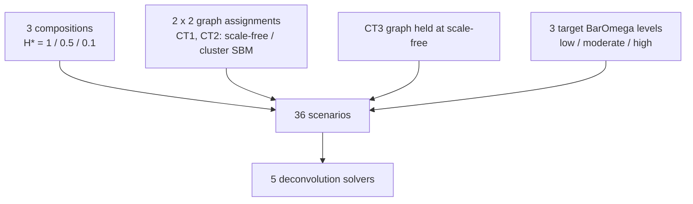
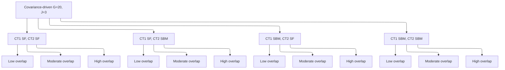

# 2.2 Covariance-driven scenario (G = 20, J = 3)

``` r

library(DeCovarT)
```

The bivariate toy confirms the theoretical benefit of covariance
modelling in a transparent setting but cannot demonstrate realistic
gene-regulatory network (GRN) topology. This scenario uses G = 20 genes
and J = 3 cell types in which types 1 and 2 are **mean-collinear**
(\cos(\boldsymbol{\mu}\_{\cdot 1},\boldsymbol{\mu}\_{\cdot 2})=0.9): the
network topology encoded in \boldsymbol{\Sigma}\_j is the remaining
discriminative signal. Construction, ADEMP benchmark, and the static
network figure live in a **single** script,
`scripts/fig03_variance_driven.R` (seed `20260807`).

``` default
%%{init: {"theme": "sandstone"}}%%
flowchart TD
  P["3 compositions<br/>H* = 1 / 0.5 / 0.1"] --> S["36 scenarios"]
  G["2 x 2 graph assignments<br/>CT1, CT2: scale-free / cluster SBM"] --> S
  C["CT3 graph held at scale-free"] --> S
  K["3 target BarOmega levels<br/>low / moderate / high"] --> S
  S --> A["5 deconvolution solvers"]
```



Figure 1: Covariance-driven factorial: one fixed Gram (cosines 0.9 /
0.1), a 2-by-2 graph assignment on the mean-collinear types (scale-free
versus cluster SBM; type 3 held at scale-free), three target MixSim
average overlaps, three Shannon compositions, and five solvers (4 x 3 x
3 = 36 scenarios).

``` default
---
config:
  layout: elk
  theme: sandstone
---
flowchart TB
  ROOT["Covariance-driven G=20, J=3"]
  ROOT --> SfSf["CT1 SF, CT2 SF"]
  ROOT --> SfSb["CT1 SF, CT2 SBM"]
  ROOT --> SbSf["CT1 SBM, CT2 SF"]
  ROOT --> SbSb["CT1 SBM, CT2 SBM"]
  SfSf --> SfSfLo["Low overlap"]
  SfSf --> SfSfMo["Moderate overlap"]
  SfSf --> SfSfHi["High overlap"]
  SfSb --> SfSbLo["Low overlap"]
  SfSb --> SfSbMo["Moderate overlap"]
  SfSb --> SfSbHi["High overlap"]
  SbSf --> SbSfLo["Low overlap"]
  SbSf --> SbSfMo["Moderate overlap"]
  SbSf --> SbSfHi["High overlap"]
  SbSb --> SbSbLo["Low overlap"]
  SbSb --> SbSbMo["Moderate overlap"]
  SbSb --> SbSbHi["High overlap"]
```



Figure 2: Hierarchical reading of the covariance factorial: 2-by-2 graph
assignment on mean-collinear cell types 1 and 2 (type 3 held at
scale-free), then low / moderate / high target MixSim BarOmega (4 x 3 =
12 covariance draws). Each leaf is crossed with the three Shannon
compositions H\* = 1 / 0.5 / 0.1.

## Generative model

One fixed mean signature \boldsymbol{\mu}\in\mathbb{R}^{G\times J} is
built with
[`generate_mean_signature_matrix()`](https://bastienchassagnol.github.io/DeCovarT/reference/generate_mean_signature_matrix.md)
and an explicit Gram `target_gram` ([mean signature
construction](https://bastienchassagnol.github.io/DeCovarT/articles/theory-synthetic-scenarios-mean-covariance.html#sec-lr-block-mu)).
There is no marker block and no null (`equal_all`) block: uninformative
genes would be removed before deconvolution.

R = \begin{pmatrix} 1 & 0.9 & 0.1 \\ 0.9 & 1 & 0.1 \\ 0.1 & 0.1 & 1
\end{pmatrix}, \qquad \boldsymbol{\mu} = s\mathbf{Q}R^{1/2}, \quad s=10.
\tag{1}

Because \mathbf{Q}^{\mathsf{T}}\mathbf{Q}=\mathbf{I}\_J, the pairwise
cosines of the columns of \boldsymbol{\mu} equal R exactly (up to
rounding). Euclidean gaps follow \lVert\boldsymbol{\mu}\_{\cdot
j}-\boldsymbol{\mu}\_{\cdot k}\rVert =s\sqrt{2(1-R\_{jk})}. The call
uses `nonnegative = TRUE` (disjoint gene-block frame) so that
\boldsymbol{\mu}\ge 0, as required by
[`deconvolute_ratios()`](https://bastienchassagnol.github.io/DeCovarT/reference/deconvolute_ratios.md).

| pair                     | cosine |                  Euclidean |
|:-------------------------|-------:|---------------------------:|
| celltype_1 vs celltype_2 |    0.9 |  10\sqrt{0.2}\approx 4.472 |
| celltype_1 vs celltype_3 |    0.1 | 10\sqrt{1.8}\approx 13.416 |
| celltype_2 vs celltype_3 |    0.1 | 10\sqrt{1.8}\approx 13.416 |

Table 1: Exact pairwise geometry of the 20\times 3 mean signature
(`target_gram`, `mean_scale` =10).

Each of the mean-collinear types (CT1, CT2) independently draws an
undirected skeleton from one of two generators, then completes a signed
precision with
[`build_normalised_precision()`](https://bastienchassagnol.github.io/DeCovarT/reference/build_normalised_precision.md)
([GGM
networks](https://bastienchassagnol.github.io/DeCovarT/articles/theory-synthetic-scenarios-mean-covariance.html#sec-ggm-networks);
topology families in [the topology
table](https://bastienchassagnol.github.io/DeCovarT/articles/theory-synthetic-scenarios-mean-covariance.html#tbl-topologies)):

- **Scale-free** (`graph_model = "scale_free"`): Barabási–Albert
  preferential attachment (`power = 1`, `edges_per_node = 1`).
- **Cluster / stochastic block model**
  (`graph_model = "stochastic_block_model"`): three blocks with
  probabilities (0.5,0.25,0.25), p\_{\mathrm{within}}=0.25,
  p\_{\mathrm{between}}=0.01.

Erdős–Rényi is not used. Type 3, already separated by the Gram
(R\_{13}=R\_{23}=0.1), is held at scale-free, so the topology factorial
is 2^{2}=4 assignments on CT1 and CT2. Those generator names and
parameter lists are stored on every row of `hybrid_config.rds` as
`graph_ct1` / `graph_ct2` / `graph_ct3` and the list-column
`graph_generators`, and again inside each `true_theta`.

The spectral cushion u used at completion is now a **fixed** engineering
constant (`PRECISION_SHIFT_BASE = 0.2`) so that each graph has one SPD
precision. The experimental knob is a global covariance scale s:
\boldsymbol{\Sigma}\_j\mapsto s\boldsymbol{\Sigma}\_j keeps every
structural zero of \boldsymbol{\Omega}\_j because
\boldsymbol{\Omega}\_j(s)=\boldsymbol{\Omega}\_j/s.
[`scale_covariances_to_overlap()`](https://bastienchassagnol.github.io/DeCovarT/reference/scale_covariances_to_overlap.md)
searches s so that MixSim `BarOmega` matches a target in
\\0.02,0.08,0.20\\ (low / moderate / high), using Sobol Monte Carlo for
G=20 ([overlap
note](https://bastienchassagnol.github.io/DeCovarT/articles/theory-distance-covariance.html#sec-fig03-scale)).
This is the graph-constrained analogue of MixSim / FSDA average-overlap
simulation ([CRAN
MixSim](https://cran.r-project.org/web/packages/MixSim/refman/MixSim.html#MixSim);
([Melnykov et al. 2012](#ref-melnykovMixSimPackageSimulating2012);
[Riani et al. 2015](#ref-rianiSimulatingMixturesMultivariate2015))): we
do **not** call `MixSim()` as a generator, because it cannot take a
precision support as input.

Larger s also raises the covariance-information fraction
f\_{\mathrm{cov}} (mean Fisher scales as 1/s; the covariance block is
scale-invariant). See the [tangent-Fisher
callout](https://bastienchassagnol.github.io/DeCovarT/articles/theory-synthetic-scenarios-mean-covariance.html#nte-desc-fisher).

| Factor                 | Levels                                   |
|------------------------|------------------------------------------|
| Graph model (CT1, CT2) | scale-free; cluster SBM                  |
| Graph model (CT3)      | scale-free (fixed)                       |
| Target `BarOmega`      | low (0.02); moderate (0.08); high (0.20) |
| Topology assignments   | 2^{2}=\mathbf{4}                         |
| Covariance draws       | 4\times 3=\mathbf{12}                    |

Table 2: Covariance factorial (graphs \times target average overlap).

[`describe_simulation_scenario()`](https://bastienchassagnol.github.io/DeCovarT/reference/describe_simulation_scenario.md)
records the realised `BarOmega`, f\_{\mathrm{cov}},
\kappa\\\boldsymbol{\Sigma}(\boldsymbol{p})\\, and pairwise AIRM
distance of the \boldsymbol{\Sigma}\_j on every row. The overlap target
is matched at the **balanced** composition; unbalanced \boldsymbol{p}
change MixSim’s MAP weights, so realised `BarOmega` is higher there.
AIRM is invariant to the global scale s (it scores topology / shape).
f\_{\mathrm{cov}} rises with s.


Figure 3: Two generator examples on G=20 nodes (scale-free, cluster
SBM). Mean-collinear cell types 1 and 2 are each assigned one of these
families; type 3 is held at scale-free.

Two generators were considered but not adopted:

- **Toeplitz covariances**: encode only local (banded) dependencies;
  cannot model cell-type-specific sparse precision.
- **`MixSim()` as a mixture generator**: draws unconstrained means and
  covariances for a target average overlap; no graph-constrained
  precision input. DeCovarT keeps the graphs and matches `BarOmega` by
  scaling \boldsymbol{\Sigma}\_j instead.

## Inference

Compositions are one-dominant vectors from
[`composition_from_entropy()`](https://bastienchassagnol.github.io/DeCovarT/reference/composition_from_entropy.md)
targeting normalised Shannon entropy H^{\star}\in\\1,0.5,0.1\\
(balanced; moderately unbalanced; highly unbalanced). All DeCovarT
solvers start at the barycentre (`initial_p = "barycentre"`). Other
initialisation strategies are reserved for separate scenarios.

| Factor | Levels |
|----|----|
| Composition \boldsymbol{p} | H^{\star}=1; H^{\star}=0.5; H^{\star}=0.1 |
| Algorithms | DeconRNASeq (`lsei`), CIBERSORT, L-BFGS-B, Newton–Raphson, Marquardt–Levenberg |
| **Total scenarios** | 4\times 3\times 3=\mathbf{36} |

N = 50 Monte Carlo replicates per scenario.

| Algorithm | Function | Constraint |
|:---|:---|:---|
| QP (`DeconRNASeq`-style) | `deconvolute_ratios_deconrnaseq` | simplex equality / inequality |
| CIBERSORT-style \nu-SVR | `deconvolute_ratios_cibersort` | non-negative then [`repair_simplex()`](https://bastienchassagnol.github.io/DeCovarT/reference/repair_simplex.md) |
| L-BFGS-B | `deconvolute_ratios_L_BFGS_B` | ILR \to open simplex |
| Newton–Raphson | `deconvolute_ratios_Newton_Raphson` | ILR / `nlminb` |
| Marquardt–Levenberg | `deconvolute_ratios_Marquardt_Levenberg` | ILR \to open simplex |

Table 3: Solvers used in the covariance-driven comparison.

Mean-only baselines (LSEI, CIBERSORT) ignore \boldsymbol{\Sigma}\_j. The
three DeCovarT maps use the same convolution likelihood. The shipped
catalogue (robust linear model, GLS, BFGS, simulated annealing) is
listed in
[`deconvolute_ratios()`](https://bastienchassagnol.github.io/DeCovarT/reference/deconvolute_ratios.md).

``` r

N_REPLICATES <- as.integer(Sys.getenv("N_REPLICATES", unset = "50"))
ALGORITHMS <- c(
  "lsei",
  "cibersort",
  "LBFGS",
  "Newton-Raphson",
  "Marquardt-Levenberg"
)
# Full pipeline: Rscript scripts/fig03_variance_driven.R
```

## Visualisations

| Output | Description |
|----|----|
| `output/fig03/fig03_raincloud.pdf` | Raincloud of Monte Carlo errors, faceted by composition and overlap label |
| `output/fig03/fig03_forest.pdf` | ADEMP forest plot |
| `output/fig03/fig03_metric_dots.pdf` | Metric dot plot (RMSE, MAE, coverage) |

#### Expected findings

Because CT 1 and CT 2 share cosine 0.9, LSEI and CIBERSORT cannot
separate them from the mean signature alone. DeCovarT (L-BFGS-B,
Newton–Raphson, Marquardt–Levenberg) uses \boldsymbol{\Sigma}\_j.
**Topology** (scale-free versus cluster SBM) still matters, but
**average overlap** is the stronger predictor of error and of Wald
uncertainty: high `BarOmega` scenarios remain hard even when the graphs
differ, whereas low overlap with a large f\_{\mathrm{cov}} is where
covariance-aware solvers should pull ahead of mean-only baselines,
especially at H^{\star}=0.1.

### See also

- Bivariate toy:
  [§2.1](https://bastienchassagnol.github.io/DeCovarT/articles/fig02-bivariate-toy.md)
- Moment generator: [How to build synthetic
  scenarios](https://bastienchassagnol.github.io/DeCovarT/articles/theory-synthetic-scenarios-mean-covariance.md)
- Overlap and SPD distances: [Distances, overlap, and covariance
  information](https://bastienchassagnol.github.io/DeCovarT/articles/theory-distance-covariance.md)
- Feature-selection on this design: [Appendix
  S6](https://bastienchassagnol.github.io/DeCovarT/articles/supp-S6-feature-selection.md)
- Identifiability of collinear means: [Appendix
  S1](https://bastienchassagnol.github.io/DeCovarT/articles/supp-S1-identifiability.md)

### References

Melnykov, Volodymyr, Wei-Chen Chen, and Ranjan Maitra. 2012. ‘MixSim: An
R Package for Simulating Data to Study Performance of Clustering
Algorithms’. *Journal of Statistical Software* 51.
<https://doi.org/10.18637/jss.v051.i12>.

Riani, Marco, Andrea Cerioli, Domenico Perrotta, and Francesca Torti.
2015. ‘Simulating Mixtures of Multivariate Data with Fixed Cluster
Overlap in FSDA Library’. *Advances in Data Analysis and Classification*
9 (4): 461–81. <https://doi.org/10.1007/s11634-015-0223-9>.
