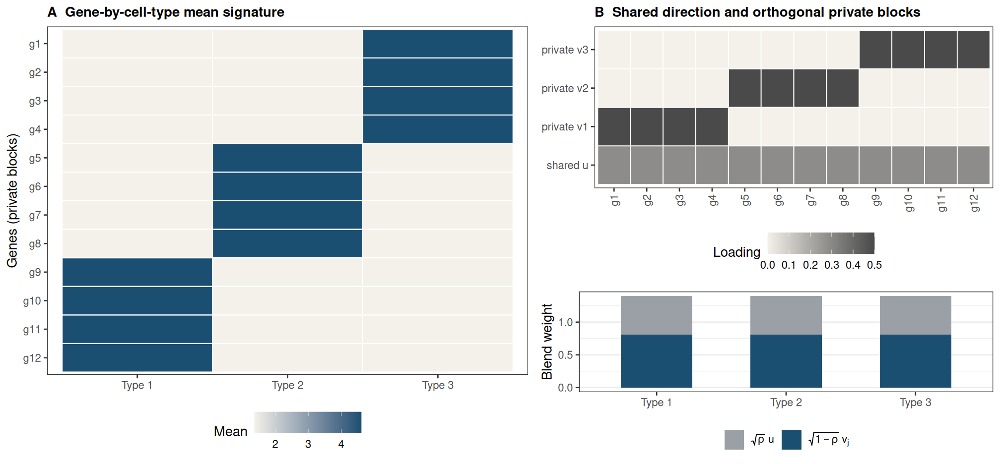
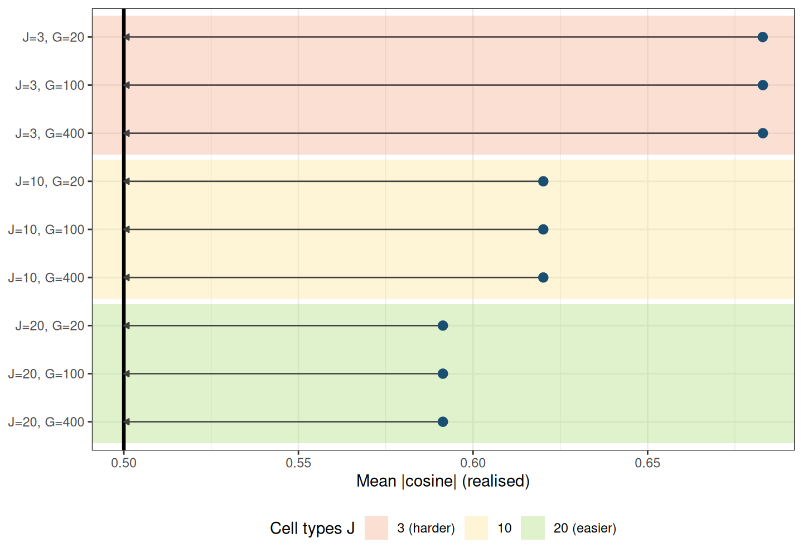
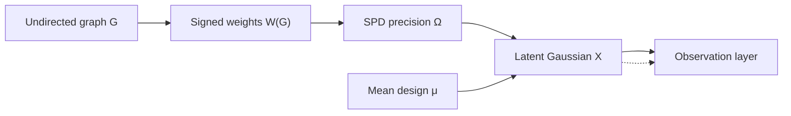
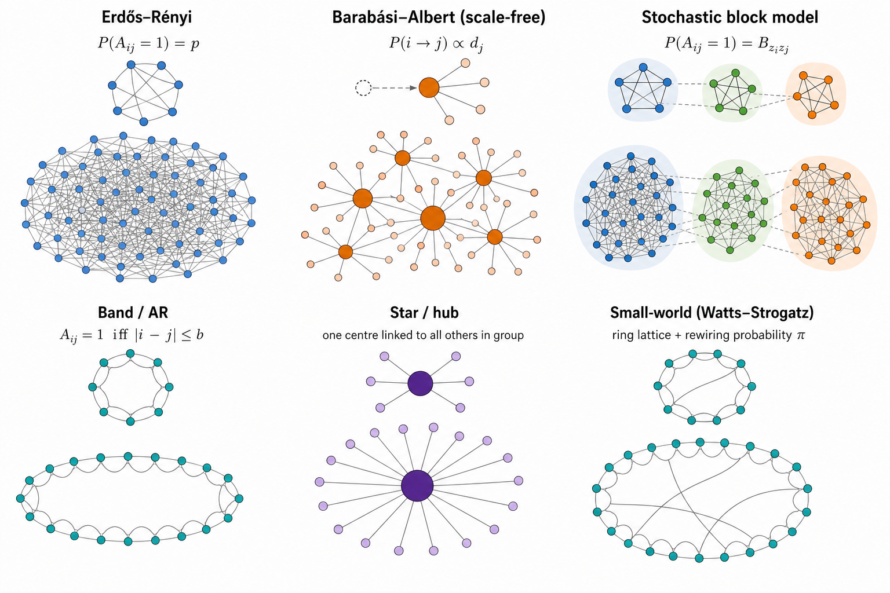
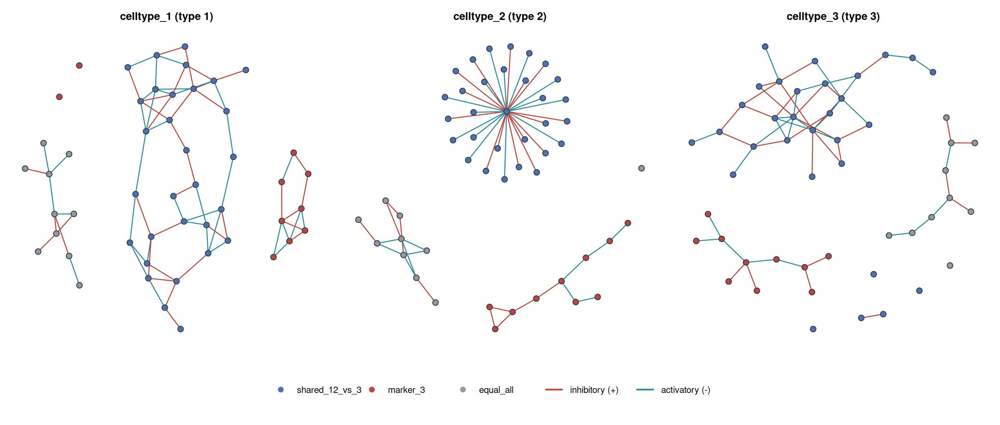
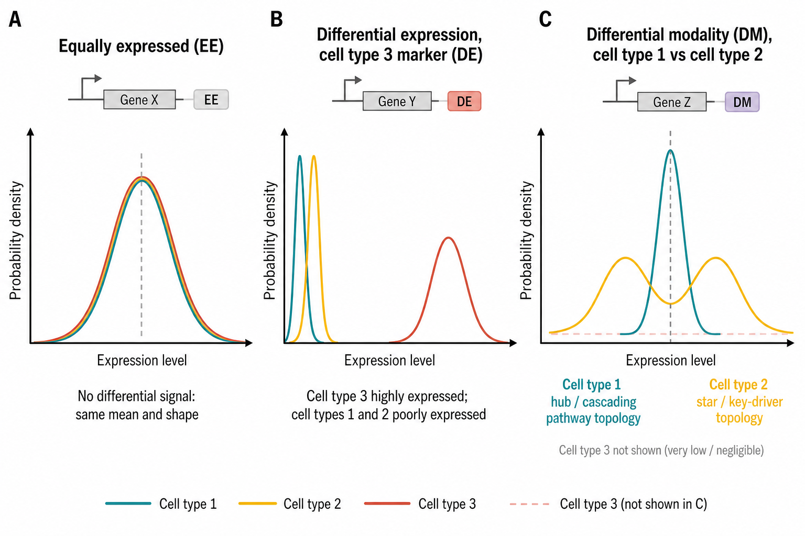

# Simulating semi-synthetic pseudo-bulk mixtures for benchmarking

## Overview

This vignette documents the synthetic first- and second-order moment
generator
[`simulate_hierarchical_grn_moments()`](https://bastienchassagnol.github.io/DeCovarT/reference/simulate_hierarchical_grn_moments.md)
and how its outputs feed bulk mixture simulation. Mean profiles follow
an AutoGeneS-inspired construction ([Aliee and Theis
2021](#ref-alieeAutoGeneSAutomaticGene2021)) in which a single dial \rho
(`target_cosine`) sets pairwise collinearity between cell-type columns
of \boldsymbol{\mu}, while a fixed scale s (`mean_scale`) sets column
norms. Prefer varying \rho across scenarios when precision weights
already control second-order dependence.

Each cell type carries its own graph-constrained signed precision
\boldsymbol{\Omega}\_j, mapped to
\boldsymbol{\Sigma}\_j=\boldsymbol{\Omega}\_j^{-1}. An undirected
Gaussian Markov simulation separates four layers
([Equation 12](#eq-ggm-pipeline)): graph G_j, signed weights W(G_j), SPD
precision \Omega_j, and latent Gaussians (an optional observation layer
can add Poisson–log-normal or zero-inflated counts). The **graph** and
the **precision** must not be conflated: a binary adjacency is almost
never itself positive definite. DeCovarT draws G_j via
[`generate_random_network_skeleton()`](https://bastienchassagnol.github.io/DeCovarT/reference/generate_random_network_skeleton.md),
completes \Omega_j\succ 0 with `build_normalised_precision()`, and
stacks the inverted slices with
`build_covariance_array_from_precision()`.
[Section 4](#sec-ggm-networks) develops the topology, weight, and SPD
design in detail.

## Pipeline API

The exported entry point orchestrates internal helpers and returns
moments that can be passed to
[`simulate_bulk_mixture()`](https://bastienchassagnol.github.io/DeCovarT/reference/simulate_bulk_mixture.md)
and then to any deconvolution routine exposed by
[`deconvolute_ratios()`](https://bastienchassagnol.github.io/DeCovarT/reference/deconvolute_ratios.md).


Figure 1: Pipeline from synthetic moment generation to deconvolution.

``` r

library(DeCovarT)

set.seed(42)
moments <- simulate_hierarchical_grn_moments(
  n_genes = 40L,
  n_celltypes = 3L,
  mean_scale = 10,
  target_cosine = 0.1,
  precision_shift = 0.1,
  precision_scale = 0.3,
  prop_inhibitory = 0.5,
  graph_model = "scale_free"
)

moments$objectives
#> $mean_abs_cosine
#> [1] 0.3315284
#> 
#> $sum_euclidean_distance
#> [1] 34.68786

bulk <- simulate_bulk_mixture(
  signature_matrix = moments$mean_profiles,
  Sigma = moments$covariance_matrices,
  p = c(0.5, 0.3, 0.2),
  n = 20
)
dim(bulk$Y)
#> [1] 40 20
dim(bulk$latent_profiles) # G x J x N latent draws; input mu is shared
#> [1] 40  3 20
```

Selecting genes (or, here, designing \boldsymbol{\mu}) by cosine alone
is insufficient for stable deconvolution ([Aliee and Theis
2021](#ref-alieeAutoGeneSAutomaticGene2021)). In the scenarios of this
package we therefore **hold `mean_scale` fixed** and dial only
`target_cosine`, so first-order scale and second-order precision weights
stay comparable across runs.

## Mathematical roles of the generators

### Mean signature: `generate_mean_signature_matrix()`

Notation: G genes, J cell types indexed by j=1,\ldots,J, and columns
\boldsymbol{\mu}\_{\cdot j}\in\mathbb{R}^{G} of the mean signature. Fix
the column scale s (`mean_scale`, default 10 in the nine-scenario grid)
and dial only the target cosine \rho\in\[0,1\] (`target_cosine`).

Let \boldsymbol{u}=G^{-1/2}\mathbf{1}\_{G} be the shared unit direction
and let \boldsymbol{v}\_{j} be the \ell_2-normalised indicator of the
gene block assigned to type j (disjoint partition of \\1,\ldots,G\\).
Then \boldsymbol{v}\_{j}^{\mathsf{T}}\boldsymbol{v}\_{k}=0 for j\neq k.
Each column is the normalised blend

\tilde{\boldsymbol{\mu}}\_{\cdot j} = \sqrt{\rho}\\\boldsymbol{u}
+\sqrt{1-\rho}\\\boldsymbol{v}\_{j}, \qquad \boldsymbol{\mu}\_{\cdot j}
= s\\ \frac{\tilde{\boldsymbol{\mu}}\_{\cdot j}}{
\\\tilde{\boldsymbol{\mu}}\_{\cdot j}\\\_2 }, \qquad j=1,\ldots,J.
\tag{1}

Stacking the un-normalised columns yields a **rank-one shared term plus
a block-sparse private term**:

\tilde{\boldsymbol{M}} = \bigl\[ \tilde{\boldsymbol{\mu}}\_{\cdot 1}
\mid \cdots \mid \tilde{\boldsymbol{\mu}}\_{\cdot J} \bigr\] =
\sqrt{\rho}\\ \boldsymbol{u}\mathbf{1}\_{J}^{\mathsf{T}} +
\sqrt{1-\rho}\\ \mathbf{V}, \tag{2}

where
\mathbf{V}=\bigl\[\boldsymbol{v}\_{1}\mid\cdots\mid\boldsymbol{v}\_{J}\bigr\]
has **disjoint supports** across columns (each \boldsymbol{v}\_j is
non-zero only on block j). The shared part is rank one; the private part
is block-diagonal in the gene-partition sense. After column
normalisation and scaling,

\boldsymbol{\mu} = s\\\tilde{\boldsymbol{M}}\\ \mathbf{D}^{-1}, \qquad
\mathbf{D}=\mathrm{diag}\bigl( \\\tilde{\boldsymbol{\mu}}\_{\cdot
1}\\\_2, \ldots, \\\tilde{\boldsymbol{\mu}}\_{\cdot J}\\\_2 \bigr),
\tag{3}

so \boldsymbol{\mu} is a low-rank-plus-block construction followed by
per-column calibration. This matches synthetic signature designs that
combine a common baseline with type-specific marker programmes ([Aliee
and Theis 2021](#ref-alieeAutoGeneSAutomaticGene2021); [Schelker et al.
2017](#ref-schelkerEstimationImmuneCell2017); [Ba et al.
2026](#ref-baWhenLessNot2026)).

Expanding the un-normalised inner product for j\neq k gives the exact
identity

\tilde{\boldsymbol{\mu}}\_{\cdot j}^{\mathsf{T}}
\tilde{\boldsymbol{\mu}}\_{\cdot k} = \rho + \sqrt{\rho(1-\rho)}\\
\bigl( \boldsymbol{u}^{\mathsf{T}}\boldsymbol{v}\_{j} +
\boldsymbol{u}^{\mathsf{T}}\boldsymbol{v}\_{k} \bigr), \tag{4}

because \boldsymbol{u}^{\mathsf{T}}\boldsymbol{u}=1 and
\boldsymbol{v}\_{j}^{\mathsf{T}}\boldsymbol{v}\_{k}=0. Block indicators
are **not** orthogonal to the shared direction: if block j contains L_j
genes then

\boldsymbol{u}^{\mathsf{T}}\boldsymbol{v}\_{j} = \sqrt{\frac{L_j}{G}},
\tag{5}

so [Equation 4](#eq-mean-inner) becomes

\tilde{\boldsymbol{\mu}}\_{\cdot j}^{\mathsf{T}}
\tilde{\boldsymbol{\mu}}\_{\cdot k} = \rho + \sqrt{\rho(1-\rho)}\\
c\_{jk}, \qquad c\_{jk} = \sqrt{\tfrac{L_j}{G}} + \sqrt{\tfrac{L_k}{G}}.
\tag{6}

Column-wise renormalisation in [Equation 1](#eq-mean-cosine) maps this
to a realised cosine that is **not** exactly \rho for finite G and J:

\cos\bigl( \boldsymbol{\mu}\_{\cdot j}, \boldsymbol{\mu}\_{\cdot k}
\bigr) = \frac{ \rho + \sqrt{\rho(1-\rho)}\\c\_{jk} }{ 1 +
\sqrt{\rho(1-\rho)}\\c\_{jk} }, \qquad j\neq k. \tag{7}

#### Asymptotic cosine control

For equal blocks (L_j\approx G/J) we have c\_{jk}\approx 2/\sqrt{J}.
Writing the bias relative to the target,

\cos\bigl( \boldsymbol{\mu}\_{\cdot j}, \boldsymbol{\mu}\_{\cdot k}
\bigr) - \rho = \frac{ (1-\rho)\sqrt{\rho(1-\rho)}\\c\_{jk} }{ 1 +
\sqrt{\rho(1-\rho)}\\c\_{jk} } = O\\\bigl(J^{-1/2}\bigr) = o(1)
\quad\text{as }J\to\infty \tag{8}

(with G/J bounded away from zero). Equivalently,

\lim\_{J\to\infty} \cos\bigl( \boldsymbol{\mu}\_{\cdot j},
\boldsymbol{\mu}\_{\cdot k} \bigr) = \rho, \tag{9}

so the cross terms in [Equation 4](#eq-mean-inner) become negligible
relative to \rho and the realised pairwise cosine tracks the dial
asymptotically. The scale s sets column norms without changing angles:
\\\boldsymbol{\mu}\_{\cdot j}-\boldsymbol{\mu}\_{\cdot k}\\\_2\propto s
at fixed \rho. We keep s=10 across scenarios and only vary \rho.
[Figure 3](#fig-cosine-convergence) illustrates the finite-sample
approach to \rho=0.5 on a 3\times 3 grid of (J,G).

[Figure 2](#fig-mean-signature-schematic) gives a toy schematic for J=3
cell types: a uniform shared component, three orthogonal private blocks,
and the resulting mean directions.



Figure 2: Schematic of shared-plus-private mean signature construction
for J=3 cell types. A rank-one shared direction \boldsymbol{u} (grey)
blends with block-sparse private markers \boldsymbol{v}\_j (coloured) at
weights \sqrt{\rho} and \sqrt{1-\rho}; columns are normalised and scaled
to \boldsymbol{\mu}\_{\cdot j}. Illustration generated for this vignette
in a Nature Methods-style layout.

#### Visualising the cosine construction



Figure 3: Realised mean absolute pairwise cosine vs target \rho=0.5 on a
3\times 3 grid: J\in\\3,10,20\\ nested with G\in\\20,100,400\\ (equal
gene blocks). Thick black line: target; coloured bands: harder (red,
small J) to easier (green, large J); arrows: residual to the target.

[Figure 4](#fig-cosine-geometry) visualises the same three operating
points (\rho\in\\0,\\0.3,\\1\\) for G=2 genes and J=2 cell types. Cell
type 1 is fixed along the positive gene-1 axis; only the **angular**
position of cell type 2 is varied so that \rho=0 is exactly orthogonal.
Independent Gaussian noise is added *only in this vignette chunk* around
each centroid (N=20 i.i.d. draws per population) to emulate within-type
dispersion under an independence assumption, without altering the
mean-signature generator itself. Coloured arrows mark each type’s mean
direction; the shaded wedge is the angle between the two means.

This illustration is inspired by panel B in the AutoGeneS paper ([Aliee
and Theis 2021](#ref-alieeAutoGeneSAutomaticGene2021)), but focuses here
on the cosine-angle control induced by [Equation 1](#eq-mean-cosine)
(without modelling centroid-distance optimisation). With only two genes
the cross terms in [Equation 4](#eq-mean-inner) are large, so the
realised cosine from the generator is a warped but strictly increasing
map of \rho; the panels below enforce the target angle geometrically
after generation.


Figure 4: Cosine-control toy for J=2 cell types and G=2 genes. Cell type
1 is fixed on the positive gene-1 axis; only the angular position of
cell type 2 varies (so \rho=0 is orthogonal). Coloured arrows: mean
directions; shaded wedge: angle between means. Labels report the
realised cosine. Points are N=20 i.i.d. Gaussian draws around each
centroid (stars). Styling inspired by panel B of `AutoGeneS` (Aliee and
Theis ([2021](#ref-alieeAutoGeneSAutomaticGene2021))).

#### Related signature constructions

Blending a common baseline with type-specific markers is standard in
deconvolution benchmarking. **`AutoGeneS`** ([Aliee and Theis
2021](#ref-alieeAutoGeneSAutomaticGene2021)) selects genes by jointly
minimising inter-type correlation and maximising centroid distance; its
simulations use a similar shared-plus-private logic to control signature
geometry. **`Schelker et al.`** ([Schelker et al.
2017](#ref-schelkerEstimationImmuneCell2017)) build tumour-derived
reference gene expression profiles from single-cell RNA-seq clusters and
marker genes, then simulate bulk mixtures by combining those
columns—empirically a shared baseline plus distinct marker programmes
per immune cell type.

The **`DICEPro`** framework ([Ba et al. 2026](#ref-baWhenLessNot2026))
targets incomplete reference matrices in supervised deconvolution. Its
simulation engine generates synthetic signature matrices from
multivariate Gaussian (or Poisson) models with a prescribed correlation
structure; a **`bloc=TRUE`** option enforces **block sparsity** by
zeroing expression outside type-specific gene blocks—closely analogous
to the private indicators \boldsymbol{v}\_j in
[Equation 2](#eq-lr-block). DICEPro then optimises reference signatures
when cell types are missing from the matrix, complementing the
controlled \rho-dial we use here for method comparison under known
ground truth.

### Objectives: `compute_mean_profile_objectives()`

For columns of \boldsymbol{\mu},

\overline{\lvert\cos\rvert} = \frac{2}{J(J-1)} \sum\_{1\le j\<k\le J}
\Biggl\| \frac{ \boldsymbol{\mu}\_{\cdot j}^{\mathsf{T}}
\boldsymbol{\mu}\_{\cdot k} }{ \\\boldsymbol{\mu}\_{\cdot j}\\\_2\\
\\\boldsymbol{\mu}\_{\cdot k}\\\_2 } \Biggr\|,

D\_{\mathrm{Euc}} = \sum\_{1\le j\<k\le J} \\\boldsymbol{\mu}\_{\cdot
j}-\boldsymbol{\mu}\_{\cdot k}\\\_2.

AutoGeneS treats the first as a quantity to minimise and the second as a
quantity to maximise ([Aliee and Theis
2021](#ref-alieeAutoGeneSAutomaticGene2021)). Cosine is preferred to
Pearson correlation so that collinear but unequally scaled profiles
remain penalised.

### Perspectives: a single geometric score for \boldsymbol{\mu}

The present API exposes two AutoGeneS-style objectives. A natural
refinement is to replace them by one scalar that jointly rewards large
column norms (and hence Euclidean separation) and penalises alignment.

Two candidates are immediate. The Gram determinant

V(\boldsymbol{\mu}) = \sqrt{ \det\bigl(
\boldsymbol{\mu}^{\mathsf{T}}\boldsymbol{\mu} \bigr) } \tag{10}

is the volume of the parallelepiped spanned by the columns of
\boldsymbol{\mu}. It vanishes under exact collinearity and grows when
columns lengthen or become more orthogonal—precisely the desired MOO
trade-off in one number.

Equivalently, the reciprocal condition number

\kappa_2(\boldsymbol{\mu})^{-1} =
\frac{\sigma\_{\min}(\boldsymbol{\mu})}{\sigma\_{\max}(\boldsymbol{\mu})},
\tag{11}

available in R via `kappa(mean_profiles, exact = TRUE)` (or
`1 / kappa(...)`), measures how ill-posed linear recovery of
\boldsymbol{p} from \boldsymbol{y}\approx\boldsymbol{\mu}\boldsymbol{p}
is. Maximising \kappa_2(\boldsymbol{\mu})^{-1} (or minimising
\kappa_2(\boldsymbol{\mu})) collapses cosine and distance into a
deconvolution-centric criterion without a Pareto front.

A practical next step is to expose an optional
`mean_objective = c("autogenes", "volume", "condition")` in
[`simulate_hierarchical_grn_moments()`](https://bastienchassagnol.github.io/DeCovarT/reference/simulate_hierarchical_grn_moments.md),
keep the constructive (\rho,s) generator for controllable scenarios, and
report the chosen scalar alongside the existing pairwise diagnostics.

## Undirected Gaussian Markov network generation

G \longrightarrow W(G) \longrightarrow \Omega \succ 0 \longrightarrow
X_i \sim \mathcal{N}\_p(\mu_i,\Omega^{-1}) \tag{12}

Here G is an **undirected** graph, W(G) a symmetric weighted matrix with
the same off-diagonal support, \Omega a strictly positive-definite
precision, and X_i an expression profile. This section covers
**undirected** Gaussian Markov / precision-graph simulation only.
[`generate_random_network_skeleton()`](https://bastienchassagnol.github.io/DeCovarT/reference/generate_random_network_skeleton.md)
draws G; `build_normalised_precision()` completes it to \Omega\succ 0 by
an affine spectral shift; `build_covariance_array_from_precision()` maps
each slice \boldsymbol{\Sigma}\_j=\boldsymbol{\Omega}\_j^{-1} (cell
types need not share one network).



Figure 5: Undirected simulation pipeline from topology to observations
(optional observation layer dashed).

### Graph structure generators

\rho\_{jk\mid -\\j,k\\} =
-\frac{\Omega\_{jk}}{\sqrt{\Omega\_{jj}\Omega\_{kk}}} \tag{13}

[Table 1](#tbl-topologies) compares the main **undirected** topology
families used in GGM benchmarks, with R entry points.
[Figure 6](#fig-topologies) sketches the six families most often used in
random-like network structure generation.

| Structure | Definition and controls | R entry points | Advantages | Limitations |
|----|----|----|----|----|
| **Erdős–Rényi** | Each edge present independently with probability q; q=d\_{\mathrm{avg}}/(p-1) targets average degree | `huge::huge.generator(graph="random")` ([Jiang et al. 2026](#ref-R-huge)); `BDgraph::graph.sim(graph="random")` ([Mohammadi and Wit 2025](#ref-R-BDgraph)); DeCovarT `graph_model = "erdos_renyi"` | Exact sparsity control in expectation; few nuisance parameters | Narrow degree distribution; little modular organisation |
| **Band / AR** | Edge j–k if 1\le\lvert j-k\rvert\le b | `huge.generator(graph="band")` ([Jiang et al. 2026](#ref-R-huge)); `BDgraph::bdgraph.sim(graph="AR(1)")` / `"AR(2)"` ([Mohammadi and Wit 2025](#ref-R-BDgraph)) | Local dependence and controlled max degree | Artificial gene ordering; no hubs or modules |
| **Hub / star** | g groups; one centre linked to remaining members | `huge.generator(graph="hub")` ([Jiang et al. 2026](#ref-R-huge)); `graph.sim(graph="hub")` / `"star"` ([Mohammadi and Wit 2025](#ref-R-BDgraph)); DeCovarT `graph_model = "hub"` | Stress-tests high-degree regulators | Pure stars omit cross-talk |
| **Scale-free** | Preferential attachment (e.g. Barabási–Albert with m edges per new node) | `huge.generator(graph="scale-free")` ([Jiang et al. 2026](#ref-R-huge)); DeCovarT `graph_model = "scale_free"` | Heterogeneous degrees | Weak modularity under plain BA growth |
| **Cluster / SBM** | Within-block edge probability exceeds between-block | `huge.generator(graph="cluster")` ([Jiang et al. 2026](#ref-R-huge)); DeCovarT `graph_model = "stochastic_block_model"` | Pathway / module structure | Equal blocks can be unrealistically regular |
| **Small-world / lattice / circle** | High clustering with short paths, or fixed neighbourhoods | DeCovarT `graph_model = "small_world"` (Watts–Strogatz); `BDgraph::graph.sim(graph="smallworld")` ([Mohammadi and Wit 2025](#ref-R-BDgraph)) | Local modules and spatial organisation | Narrow degrees; needs a defensible ordering |

Table 1: Topology families for undirected GGM simulation (R-focused).

### Biological relevance of the six families

Not every topology is equally useful as a **gene-regulatory** prior. The
three simulation studies in [Table 3](#tbl-studies), together with
classical network biology, suggest the following reading.

| Family | Biological reading | Why it matters for DeCovarT |
|----|----|----|
| **Star / hub** | Master-regulator TF with many targets; one-to-many signalling | Stress-tests recovery of a few high-degree hubs that dominate partial correlations ([Wu and Luo 2022](#ref-wuEstimatingHeterogeneousGene2022); [Federico et al. 2023](#ref-federicoStructureLearningGene2023)) |
| **Scale-free (BA)** | Preferential attachment produces a heavy-tailed degree distribution and several hubs ([Barabási and Albert 1999](#ref-barabasiEmergenceScalingRandom1999)) | Standard high-dimensional GGM stress test used by SILGGM via `huge` ([Zhang et al. 2018](#ref-zhangSILGGMExtensivePackage2018)); useful for testing degree heterogeneity, but not a default empirical model of gene regulation |
| **Cluster / SBM** | Co-regulated modules / pathways with dense within-block links | Matches pathway organisation; BLGGM’s global block partition is SBM-like before finer within-block motifs ([Wu and Luo 2022](#ref-wuEstimatingHeterogeneousGene2022)) |
| **Small-world** | High local clustering with short paths (ring + shortcuts) | Local co-expression neighbourhoods plus long-range regulatory shortcuts; useful when modularity is soft rather than hard blocks ([Federico et al. 2023](#ref-federicoStructureLearningGene2023)) |
| **Band / AR** | Ordered local dependence only | Useful numerical control, but gene indices rarely encode a natural order—limited biological fidelity ([Zhang et al. 2018](#ref-zhangSILGGMExtensivePackage2018)) |
| **Erdős–Rényi** | Homogeneous random wiring | Null / baseline sparsity; little pathway or hub structure ([Zhang et al. 2018](#ref-zhangSILGGMExtensivePackage2018)) |

Table 2: Biological interpretability of undirected topology families.

#### The scale-free hypothesis: a useful stress test, not a biological default

The phrase *scale-free network* usually means that the degree
distribution follows a power law, \Pr(K=k)\propto k^{-\alpha}, at least
above a lower cut-off. This statistical statement is distinct from the
Barabási–Albert (BA) growth mechanism. Preferential attachment can
generate a power law, but observing a heavy-tailed degree distribution
does not establish preferential attachment; other mechanisms can produce
similar tails, and variants of preferential attachment need not produce
a pure power law ([Lima-Mendez and van Helden
2009](#ref-lima-mendezPowerfulLawPower2009); [Broido and Clauset
2019](#ref-broidoScalefreeNetworksAre2019)).

Whether biological networks are scale-free has therefore remained
contested. Early claims often relied on approximately straight log–log
degree plots. Such plots are not goodness-of-fit tests: binning, the
plotting scale, a small number of hubs, and incomplete or biased
sampling can all make non-power-law distributions appear linear. The
underlying graph representation matters as well. For example, pool
metabolites can become artificial hubs in metabolic graphs, while
protein-interaction networks depend strongly on the assay and sampling
scheme ([Lima-Mendez and van Helden
2009](#ref-lima-mendezPowerfulLawPower2009)). A power law should instead
be fitted to the discrete degree data, tested for plausibility, and
compared on the same support with alternatives such as log-normal,
exponential, stretched-exponential, and power-law-with-cut-off
distributions.

The evidence is not uniformly negative. Using adjacency-spectrum
distributions rather than degree alone, Takahashi and colleagues
classified eight protein–protein interaction networks as scale-free
([Takahashi et al.
2012](#ref-takahashiDiscriminatingDifferentClasses2012)). Importantly,
this was a relative model-selection result: BA-like networks fitted
better than the two candidate alternatives, Erdős–Rényi and
Watts–Strogatz networks. It did not show that a power law was an
adequate absolute model, that preferential attachment generated the
observed networks, or that unobserved interactions would preserve the
classification. The authors explicitly noted both the restricted
candidate set and possible sampling artefacts.

A broader test of 928 real-world network data sets reached a more
cautious conclusion ([Broido and Clauset
2019](#ref-broidoScalefreeNetworksAre2019)). Across all domains, only 4%
met the strongest scale-free criterion, whereas a log-normal
distribution fitted as well as or better than a power law for 88% of
degree distributions. Among the biological networks, 63% showed neither
direct nor indirect evidence of scale-free structure, although 6% met
the strongest criterion, principally metabolic networks. These
proportions depend on the network corpus and the operational definition
of scale-freeness, but they reject a universal scale-free law rather
than excluding scale-free structure from every biological system.

#### Evidence from the literature

[Table 3](#tbl-studies) summarises how recent simulation studies combine
topology, precision construction, and mean / observation models.

| Source | Graph structures | Precision construction | Mean / observation | Purpose |
|----|----|----|----|----|
| PLNnetwork ([Chiquet et al. 2018](#ref-chiquetVariationalInferenceSparse2018)) | Erdős–Rényi, preferential attachment, affiliation | \Omega = vG + \operatorname{diag}(\lvert\lambda\_{\min}(vG)\rvert + u) | Latent log-abundance XB; compositional / multinomial counts | Count-network estimators under compositionality |
| SILGGM ([Zhang et al. 2018](#ref-zhangSILGGMExtensivePackage2018)) | Band, hub, Erdős–Rényi, scale-free via `huge` | Package covariance / precision simulation | Centred Gaussian; focus on precision entries | Large-p inferential and computational stress tests |
| BLGGM ([Wu and Luo 2022](#ref-wuEstimatingHeterogeneousGene2022)) | Block mixtures of dense, circle, star, signed modules | Module matrices with structured signed off-diagonals | Cell-type-specific \mu_k, \Omega_k; expression-dependent dropout | Joint clustering, heterogeneous networks, zero inflation |

Table 3: Literature survey of undirected graph → precision → observation
designs.

Several conclusions follow.

1.  **Band** is not intrinsically a random-graph model: its support is
    usually deterministic once the bandwidth is fixed (edge weights and
    signs may still be random). Hub constructions are often partly
    deterministic as well. Erdős–Rényi, preferential attachment, and
    stochastic block models are genuinely stochastic.
2.  A positive off-diagonal entry in \Omega encodes a **negative**
    partial correlation ([Equation 13](#eq-partial-cor)). Uniformly
    positive precision weights therefore induce uniformly negative
    edgewise partial correlations; random or signed biological weights
    are needed when activation-like and inhibition-like associations
    matter.
3.  These models target **undirected** conditional dependence. Federico
    and colleagues prefer a Markov-network representation when
    observational data do not justify edge directionality ([Federico et
    al. 2023](#ref-federicoStructureLearningGene2023)).
4.  **BLGGM as a hybrid topology design.** Wu and Luo’s simulation can
    be read as two nested layers ([Wu and Luo
    2022](#ref-wuEstimatingHeterogeneousGene2022)). At the **global**
    scale, genes are partitioned into blocks (a stochastic-block–like
    partition). Within each block, a **finer** local topology is
    specified—dense clique-like modules, circles, stars / hubs, or
    signed dense substructures—so that different blocks can stand for
    distinct regulatory regimes (e.g. dense co-expression programmes,
    cyclic signalling motifs, master-regulator hubs). Signs can also
    differ across modules or cell types. This is richer than a flat ER
    draw, yet still fully undirected.

For DeCovarT, a BA graph should consequently be interpreted as a
deliberately demanding **hub-heterogeneity benchmark**. It tests whether
covariance estimation and deconvolution recover a few high-degree
vertices without claiming that a gene-regulatory network grew by
preferential attachment. Results should be compared with density-matched
SBM, small-world, star, and Erdős–Rényi scenarios. Conclusions that
depend only on the BA scenario should be labelled topology-specific; hub
recovery, robustness to vertex removal, and biological realism do not
follow from a fitted heavy tail alone.

**BLGGM as a hybrid.** Wu and Luo combine an SBM-like **global** gene
partition with **local** dense, circle, star, or signed modules inside
blocks ([Wu and Luo 2022](#ref-wuEstimatingHeterogeneousGene2022)).
Distinct local motifs can stand for distinct processes
(e.g. master-regulator stars vs dense co-expression programmes).
DeCovarT’s exported generators currently expose the three families most
useful as standalone benchmarks: `scale_free`, `stochastic_block_model`,
and `small_world`.



Figure 6: Six undirected topology families used in GGM simulation:
Erdős–Rényi, Barabási–Albert (preferential attachment / scale-free),
stochastic block (cluster), band / AR, star / hub, and small-world
(Watts–Strogatz).  
  

### Weight design and random signs

Topology generators return a binary undirected support E. **Signs and
magnitudes** are a separate design layer W(G) in
[Equation 12](#eq-ggm-pipeline): they are assigned *after* (or jointly
with) the skeleton, then completed to an SPD precision. Remember that

\operatorname{sign}(\rho\_{jk\mid -\\j,k\\}) =
-\operatorname{sign}(\Omega\_{jk}) \tag{14}

see [Equation 13](#eq-partial-cor), so a positive precision weight is an
inhibitory partial correlation. [Table 4](#tbl-weights) contrasts three
standard undirected strategies.

| Approach | What is randomised | How \Omega is obtained | When to use |
|----|----|----|----|
| **i.i.d. edge signs** | For each \\j,k\\\in E, draw s\_{jk}\in\\-1,+1\\ (e.g. fair coin or \mathbb{P}(+)=\pi) and magnitude m\_{jk}\>0; set W\_{jk}=W\_{kj}=s\_{jk}m\_{jk} | Support-preserving SPD map of W (spectral shift, diagonal dominance, …) | Simple signed ER / hub / SBM benchmarks; explicit control of the inhibitory fraction |
| **Partial-correlation scaling** | Fill a symmetric matrix R with R\_{jk}=0 off E and R\_{jk}\in(-1,1) (signed) on E; ensure \rho(R)\<1 | \Omega = D^{1/2}(I-R)D^{1/2} ([Equation 17](#eq-partial-scale)) | Direct control of partial-correlation signs and strengths |
| **G-Wishart** (`BDgraph::rgwish()`) | Continuous random \Omega on the fixed graph zeros | \Omega\sim W_G(b,D) already SPD ([Mohammadi and Wit 2025](#ref-R-BDgraph), [2019](#ref-BDgraph2019)) | Heterogeneous random weights without hand-tuned magnitudes; Bayesian-style replicates |

Table 4: Three undirected strategies for signed / random edge weights
after a fixed skeleton.

#### i.i.d. signs on a fixed skeleton

Draw G (ER, band, hub, …). Independently for each undirected edge,

W\_{jk}=W\_{kj}=s\_{jk}\\m\_{jk}, \qquad s\_{jk}\in\\-1,+1\\, \quad
m\_{jk}\>0, \tag{15}

then apply a support-preserving SPD completion (next section). Uniform
positive loadings W=vG are the special case s\_{jk}\equiv +1 used by
PLN-style and many `huge` simulations ([Chiquet et al.
2018](#ref-chiquetVariationalInferenceSparse2018))—all partial
correlations then share the same sign. DeCovarT uses i.i.d. signs with
inhibitory fraction `prop_inhibitory` and magnitude v
(`precision_scale`) baked into \boldsymbol{W} before the spectral SPD
completion.

#### Partial-correlation scaling and why I-R

In a Gaussian Markov model the **matrix of partial correlations** (with
ones on the diagonal) relates to the precision by a diagonal congruence.
Write the off-diagonal partial correlations as a symmetric matrix R with

R\_{jj}=0, \qquad R\_{jk} = \begin{cases} \rho\_{jk\mid -\\j,k\\} &
\\j,k\\\in E,\\ 0 & \\j,k\\\notin E, \end{cases} \tag{16}

and choose magnitudes so that the spectral radius satisfies \rho(R)\<1.
Then

\Omega = D^{1/2}(I-R)D^{1/2} \tag{17}

for a positive diagonal D (often D=I after standardising margins).

#### G-Wishart draws on a fixed graph

Given adjacency G, `BDgraph::rgwish()` samples \Omega\sim W_G(b,D)
already positive definite and with \Omega\_{jk}=0 whenever (j,k)\notin E
([Mohammadi and Wit 2025](#ref-R-BDgraph), [2019](#ref-BDgraph2019)).
Signs and magnitudes arise from the continuous distribution rather than
from an explicit coin-flip layer. This is the most “automatic”
signed-weight generator once the skeleton is fixed; the trade-off is
less direct control of the inhibitory fraction than
[Equation 15](#eq-iid-signs) or [Equation 17](#eq-partial-scale).

### Positive-definiteness strategies

[Table 5](#tbl-pd) contrasts constructions that turn a weighted support
W (or a partial-correlation design) into \Omega\succ 0. DeCovarT’s
`build_normalised_precision()` implements the uniform spectral shift
below, with diagonal cushion u (`precision_shift`):

\boldsymbol{\Omega} = \boldsymbol{W} + \bigl(
\lvert\lambda\_{\min}(\boldsymbol{W})\rvert + u \bigr) \mathbf{I}.

| Construction | Formula | SPD? | Preserves exact support? | Behaviour |
|----|----|---:|---:|----|
| Uniform spectral shift | \Omega=W+\max(0,\varepsilon-\lambda\_{\min}(W))I | Yes | Yes | Same shift on every eigenvalue; off-diagonals (hence signs) unchanged |
| `huge` / PLN-style loading | Diagonal load from \lvert\lambda\_{\min}\rvert, baseline, and u | Yes | Yes | v sets edge magnitude; loading sets conditioning ([Chiquet et al. 2018](#ref-chiquetVariationalInferenceSparse2018)) |
| Partial-correlation scaling | \Omega=D^{1/2}(I-R)D^{1/2} with \rho(R)\<1 | Yes | Yes | Signs and strengths set on the partial-correlation scale ([Equation 17](#eq-partial-scale)) |
| Graph Laplacian / M-matrix | \Omega=L_G+\varepsilon I | Yes | Yes | Off-diagonals non-positive ⇒ all edgewise partial correlations positive |
| G-Wishart | \Omega\sim W_G(b,D) | Yes | Yes | Heterogeneous random weights; `BDgraph::rgwish()` ([Mohammadi and Wit 2025](#ref-R-BDgraph)) |
| Eigenvalue clipping | Clip \Lambda then reconstruct Q\Lambda Q^{\top} | Yes | **No** | Fills structural zeros |
| Nearest PD projection | e.g. [`Matrix::nearPD()`](https://rdrr.io/pkg/Matrix/man/nearPD.html) ([Bates et al. 2025](#ref-R-Matrix)) | Yes | **No** (in general) | Repair tool, not a support-preserving truth |

Table 5: Positive-definiteness constructions for graph-constrained
precisions.

#### Why the uniform spectral shift is attractive

If W=Q\Lambda Q^{\top}, then ([Equation 18](#eq-spectral-shift))

W+cI = Q(\Lambda+cI)Q^{\top}. \tag{18}

Every eigenvalue increases by c, while every off-diagonal of W is
unchanged, so the edge set

E=\\(j,k):j\<k,\\ \Omega\_{jk}\neq 0\\ \tag{19}

is identical before and after loading—and **signs of** W are preserved.

The floor \varepsilon also controls the condition number

\kappa(\Omega)=\frac{\lambda\_{\max}(\Omega)}{\lambda\_{\min}(\Omega)}.
\tag{20}

Large loading yields a well-conditioned but weakly dependent network;
loading only slightly above -\lambda\_{\min} strengthens dependence but
can make estimation fragile. Benchmarks should report
partial-correlation distributions and \kappa(\Omega), not only the
adjacency.

### Cell-type covariances: `build_covariance_array_from_precision()`

By default each cell type has its own precision (and thus covariance),

\boldsymbol{\Sigma}\_j = \boldsymbol{\Omega}\_j^{-1}, \qquad
j=1,\ldots,J,

stacked as an array in \mathcal{M}\_{G\times G\times J}. Shared networks
remain available by supplying the same adjacency (or the same graph
model seed path) for every type. Downstream bulk simulation uses the
Gaussian convolution
\boldsymbol{y}\mid(\boldsymbol{\zeta},\boldsymbol{p})\sim
\mathcal{N}\_{G}(\boldsymbol{\mu}\boldsymbol{p}, \sum_j
p_j^{2}\boldsymbol{\Sigma}\_j).

### Conclusions

> DeCovarT draws `scale_free`, `stochastic_block_model`, and
> `small_world` skeletons with , then i.i.d. signed weights
> (`prop_inhibitory`) and a spectral shift to guarantee \Omega\succ 0.

#### Further high-dimensional designs

Beyond the families in [Table 1](#tbl-topologies):

- **Degree-prescribed / configuration** graphs separate degree
  heterogeneity from preferential-attachment *mechanisms*.
- **Spatial / geometric** graphs suit spatial transcriptomics or
  chromatin neighbourhoods.
- **Differential networks:**
  - Start from a shared base G_0
  - Control the differential shift \Omega_k=\Omega_0+\Delta_k
  - Ensure the SPD step
  - Alternatively, vary the *support, weight, and sign* separately
    ([Federico et al. 2023](#ref-federicoStructureLearningGene2023); [Wu
    and Luo 2022](#ref-wuEstimatingHeterogeneousGene2022)).
- **Other distributions,** using the GGM layer as a parameter:
  - **Latent-variable GGMs** — sparse \Omega_S plus low-rank confounding
    Bf_i.
  - **Nonparanormal / Gaussian-copula** margins on a latent Gaussian
    graph.
  - **Poisson–log-normal / compositional** observation layers on latent
    log-abundances ([Chiquet et al.
    2018](#ref-chiquetVariationalInferenceSparse2018)).
  - **Zero-inflated mixture GGMs** with cell-type-specific
    (\mu_k,\Omega_k) and expression-dependent dropout ([Wu and Luo
    2022](#ref-wuEstimatingHeterogeneousGene2022)).

#### Recommended benchmark specification

Use one pipeline for every topology ([Equation 21](#eq-benchmark-pipe),
[Figure 5](#fig-ggm-pipeline)):

\text{topology} \rightarrow \text{signed weights} \rightarrow \text{SPD
precision} \rightarrow \text{mean design} \rightarrow \text{latent
Gaussian} \rightarrow \text{observation model} \tag{21}

| Axis | Suggested levels |
|----|----|
| Dimension, namely number of variables (here, genes) | p \in \\100,500,1000\\ |
| Topology | ER, band, hub, scale-free, SBM, small-world |
| Expected degree | \approx 2,4,8 (keep graphs sparse) |
| Edge weights | Constant; i.i.d. signed; partial-correlation scaling; G-Wishart |
| Conditioning | Report \lambda\_{\min}, \lambda\_{\max}, \kappa(\Omega) |
| Means | Zero; sparse group shifts, driven by cell-type; joint \mu–\Omega heterogeneity, for example playing on the *cosine similarity*, or the *condition number*, of the mean profile |

Table 6: Compact factorial axes for a reproducible undirected GGM
simulation study.

**Main insights.** Prefer the uniform spectral shift
([Equation 18](#eq-spectral-shift)) or partial-correlation scaling
([Equation 17](#eq-partial-scale)) when support and signs must be exact;
add the mean layer **independently** of graph generation.

## Synthetic simulation design: a hybrid multi-topology reference scenario

The earlier factorial design swept one topology and one cosine level at
a time, keeping a single **shared** covariance across all J cell types
([`simulate_hierarchical_grn_moments()`](https://bastienchassagnol.github.io/DeCovarT/reference/simulate_hierarchical_grn_moments.md);
[Section 4](#sec-ggm-networks)).
`scripts/generate_random_markov_network.R` instead builds **one**
scenario that stresses several axes of the feature-selection pipeline
simultaneously: two cell types that are unrecoverable from
\boldsymbol{\mu} alone and must be told apart from **topology**, a third
cell type set apart by a compact marker block, and a null block that
should survive every selection stage as *discarded*. Notation matches
the manuscript: G=50 genes, J=3 cell types, N bulk samples for
\boldsymbol{Y}\in\mathcal{M}\_{G\times N}.

### Gene and cell-type design

The G=50 genes are partitioned into three blocks, and each cell type
gets its **own** G\times G precision \boldsymbol{\Omega}\_j (not a
shared one):

\underbrace{\mathcal{G}\_{12}}\_{30\text{ genes}} \\ \cup\\
\underbrace{\mathcal{G}\_{3}}\_{10\text{ genes}} \\ \cup\\
\underbrace{\mathcal{G}\_{\mathrm{eq}}}\_{10\text{ genes}}, \qquad
\boldsymbol{\Omega}\_j = \mathrm{blockdiag}\bigl(
\boldsymbol{\Omega}\_j^{(\mathcal{G}\_{12})},\\
\boldsymbol{\Omega}\_j^{(\mathcal{G}\_{3})},\\
\boldsymbol{\Omega}\_j^{(\mathcal{G}\_{\mathrm{eq}})} \bigr), \qquad
j=1,2,3.

\boldsymbol{\mu} is built by **two** iterative calls to
[`generate_mean_signature_matrix()`](https://bastienchassagnol.github.io/DeCovarT/reference/generate_mean_signature_matrix.md)
([Equation 1](#eq-mean-cosine)): first on \mathcal{G}\_{12} for the pair
(cell type 1, cell type 2) with a **high** target cosine \rho\_{12}=0.95
(near-collinear, per [Section 3.1](#sec-lr-block-mu)); then on a pool of
2\times10 genes for the pair (merged \\1,2\\, cell type 3) with a
**low** target cosine \rho\_{3}=0.05 (near-orthogonal), keeping only the
10 genes whose private block belongs to cell type 3.
\mathcal{G}\_{\mathrm{eq}} gets a flat baseline directly (identical mean
in all three types by construction). Only \mathcal{G}\_{12} and
\mathcal{G}\_3 carry a mean signal; cell types 1 and 2 are, by design,
mean-indistinguishable on \mathcal{G}\_{12}.

Following the BLGGM hybrid design ([Section 4](#sec-ggm-networks)), each
block’s **local** topology is set independently per cell type, with no
edges between blocks:

| Gene block | \# genes | Cell type 1 | Cell type 2 | Cell type 3 |
|----|----|----|----|----|
| `shared_12_vs_3` | 30 | stochastic block model (hub-like modules) | star (single key-driver gene) | Erdős–Rényi (background) |
| `marker_3` | 10 | Erdős–Rényi (background) | Erdős–Rényi (background) | scale-free |
| `equal_all` | 10 | Erdős–Rényi | Erdős–Rényi | Erdős–Rényi |

Table 7: Local topology assigned to each (gene block, cell type) pair;
no edges connect different blocks (block-diagonal precision support).

Cell types 1 and 2 therefore differ **only** on `shared_12_vs_3`, and
only through \boldsymbol{\Omega}: hub/stochastic-block modules
(cascading-pathway-like) for cell type 1 versus a single star (one
key-driver gene) for cell type 2. `equal_all` is wired identically
(Erdős–Rényi) in every cell type, matching its complete lack of mean
signal.

| pair                     | cosine | euclidean |
|--------------------------|--------|-----------|
| celltype_1 vs celltype_2 | 0.973  | 2.76      |
| celltype_1 vs celltype_3 | 0.562  | 11.22     |
| celltype_2 vs celltype_3 | 0.562  | 11.22     |

Table 8: Realised pairwise cosine and Euclidean distance of the 50 x 3
mean signature, over the full G = 50 genes.

| cell type | topology | \$\lambda\_{\min}\$ | \$\lambda\_{\max}\$ | \$\kappa(\Omega)\$ | prop inhib |
|----|----|----|----|----|----|
| celltype_1 | SBM (hub-like modules) | 0.1 | 1.68 | 16.8 | 0.5 |
| celltype_2 | star (single key driver) | 0.1 | 3.33 | 33.3 | 0.489 |
| celltype_3 | scale-free (marker genes) | 0.1 | 2.1 | 21 | 0.5 |

Table 9: Per-cell-type precision spectrum for the 50 x 50
hybrid-topology Omega_j.

Column guide: \lambda\_{\min}, \lambda\_{\max}, and
\kappa(\boldsymbol{\Omega})=\lambda\_{\max}/\lambda\_{\min} summarise
the precision spectrum of each cell type’s *own* \boldsymbol{\Omega}\_j;
`prop_inhib` is the realised fraction of inhibitory precision edges.
[Table 8](#tbl-mean-geometry) shows cell types 1 and 2 near-collinear
(cosine \approx 0.97), tracking the local target \rho\_{12}=0.95 used on
`shared_12_vs_3`. Cell type 3, however, sits at only a *moderate* cosine
(\approx0.56) from the other two—well above the local target
\rho\_{3}=0.05 used on the `marker_3` pool. The gap is exactly the
finite-sample effect of [Section 3.1.1](#sec-asymptotic-cosine): the
flat `celltype_12_merged` background on `shared_12_vs_3` and the
identical `equal_all` baseline both contribute a strictly positive term
to *every* pairwise inner product over the full G=50 vector, diluting
the block-local orthogonality of `marker_3` alone.
[Table 9](#tbl-topology-diagnostics) shows that, despite the shared mean
on `shared_12_vs_3`, cell types 1 and 2 carry distinct, well-conditioned
precision spectra—exactly the topology-only separation the scenario is
designed to require.

[Figure 7](#fig-network-topologies) renders the three realised networks
with `igraph`, coloured by gene block and by precision-edge sign.



Figure 7: Cell-type-specific block topologies for the 50-gene hybrid
scenario: a stochastic-block/hub-like module structure for cell type 1,
restricted to the 30 `shared_12_vs_3` genes; a single star (one
key-driver gene) for cell type 2 on the same 30 genes; and a scale-free
network for cell type 3 restricted to its own 10 `marker_3` genes. The
`equal_all` block (grey) is wired as Erdős–Rényi in every cell type.
Edge colour encodes the sign of the precision entry (red = inhibitory,
teal = activatory); node colour encodes the gene block.

The full pipeline built on this scenario—mean signature, per-cell-type
topologies, N=200 bulk simulation, and the pre-selection / NSGA-II
feature-selection stages it stresses—is reproduced end-to-end in
`scripts/generate_random_markov_network.R`.

### Related literature

Pseudobulk simulation tools such as **`muscat`** ([Crowell et al.
2020](#ref-crowellMuscatDetectsSubpopulationspecific2020)) aggregate
single-cell counts across samples and conditions for differential-state
testing; **`scDD`** ([Korthauer et al.
2016](#ref-korthauerStatisticalApproachIdentifying2016)) partitions
genes, relative to a reference condition, into five
differential-distribution (DD) patterns: equivalent expression (**EE**),
differential expression (**DE**, a mean shift with one mode preserved
per condition), differential proportion (**DP**, a shift in the mixing
weights of a shared bimodal pattern), differential modality (**DM**, a
change in the number of modes without necessarily shifting the overall
mean), and differential expression **and** modality combined (**DB**).

The hybrid scenario above instantiates a loose, network-level analogue
of three of these patterns, tailored to deconvolution rather than to
single-cell distribution testing directly
([Figure 8](#fig-dd-taxonomy)):

- the 10 `equal_all` genes are **EE**: identical mean and identically
  Erdős–Rényi-wired second-order structure in every cell type;
- the 10 `marker_3` genes are **DE** against the merged \\1,2\\
  background: a mean shift confined to cell type 3, layered on a
  scale-free local topology;
- the 30 `shared_12_vs_3` genes are **DE** against cell type 3 but,
  between cell types 1 and 2 specifically, carry **no mean shift at
  all**—only the precision-matrix topology
  ([Table 7](#tbl-hybrid-topology-design)) differs. This is not scDD’s
  original single-gene DM test (unimodal versus bimodal *marginal*
  densities within one gene), but it plays a structurally similar role
  here: two populations a mean-only model cannot separate, which a
  covariance-aware model such as DeCovarT is designed to exploit.



Figure 8: Schematic differential-distribution taxonomy for the three
gene blocks: equivalent expression (EE, `equal_all`), differential
expression marking cell type 3 (DE, `marker_3`), and a
differential-modality-like contrast between cell types 1 and 2 that is
invisible at the mean level and only resolved by network topology
(DM-like, `shared_12_vs_3`).

DeCovarT’s generator is narrower—it fixes \boldsymbol{\mu} through
[Equation 1](#eq-mean-cosine) and [Equation 2](#eq-lr-block) rather than
estimating signatures from real scRNA-seq—but the same
low-rank-plus-block intuition underpins many reference-matrix
constructions cited above.

## References

Aliee, Hananeh, and Fabian J. Theis. 2021. ‘AutoGeneS: Automatic Gene
Selection Using Multi-Objective Optimization for RNA-seq Deconvolution’.
*Cell Systems* 12. <https://doi.org/10.1016/j.cels.2021.05.006>.

Ba, Kalidou, Rodolphe Thiébaut, Xavier Hinaut, and Boris Hejblum. 2026.
*When Less Is Not More: DICEPro Mitigates the Impact of Incomplete
Reference Matrices on Cellular Frequency Deconvolution*. bioRxiv.
<https://doi.org/10.64898/2026.06.17.732876>.

Barabási, Albert-László, and Réka Albert. 1999. ‘Emergence of Scaling in
Random Networks’. *Science* 286.
<https://doi.org/10.1126/science.286.5439.509>.

Bates, Douglas, Martin Maechler, and Mikael Jagan. 2025. *Matrix: Sparse
and Dense Matrix Classes and Methods*.
<https://Matrix.R-forge.R-project.org>.

Broido, Anna D., and Aaron Clauset. 2019. ‘Scale-Free Networks Are
Rare’. *Nature Communications* 10.
<https://doi.org/10.1038/s41467-019-08746-5>.

Chiquet, Julien, Mahendra Mariadassou, and Stéphane Robin. 2018.
*Variational Inference for Sparse Network Reconstruction from Count
Data*. arXiv. <https://doi.org/10.48550/arxiv.1806.03120>.

Crowell, Helena L., Charlotte Soneson, Pierre-Luc Germain, et al. 2020.
‘Muscat Detects Subpopulation-Specific State Transitions from
Multi-Sample Multi-Condition Single-Cell Transcriptomics Data’. *Nature
Communications* 11: 6077. <https://doi.org/10.1038/s41467-020-19894-4>.

Federico, Anthony, Joseph Kern, Xaralabos Varelas, and Stefano Monti.
2023. ‘Structure Learning for Gene Regulatory Networks’. *PLOS
Computational Biology* 19.
<https://doi.org/10.1371/journal.pcbi.1011118>.

Jiang, Haoming, Xinyu Fei, Han Liu, et al. 2026. *Huge: High-Dimensional
Undirected Graph Estimation*. <https://github.com/Gatech-Flash/huge>.

Korthauer, Keegan D., Li-Fang Chu, Michael A. Newton, et al. 2016. ‘A
Statistical Approach for Identifying Differential Distributions in
Single-Cell RNA-seq Experiments’. *Genome Biology* 17: 222.
<https://doi.org/10.1186/s13059-016-1077-y>.

Lima-Mendez, Gipsi, and Jacques van Helden. 2009. ‘The Powerful Law of
the Power Law and Other Myths in Network Biology1’. *Molecular
BioSystems(MBS)* 5. <https://doi.org/10.1039/b908681a>.

Mohammadi, Reza, and Ernst Wit. 2019. ‘BDgraph: An R Package for
Bayesian Structure Learning in Graphical Models’. *Journal of
Statistical Software* 89 (3): 1–30.
<https://doi.org/10.18637/jss.v089.i03>.

Mohammadi, Reza, and Ernst Wit. 2025. *BDgraph: Bayesian Structure
Learning in Graphical Models Using Birth-Death MCMC*.
<https://www.uva.nl/profile/a.mohammadi>.

Schelker, Max, Sonia Feau, Jinyan Du, et al. 2017. ‘Estimation of Immune
Cell Content in Tumour Tissue Using Single-Cell RNA-seq Data’. *Nature
Communications* 8 (1): 2032.
<https://doi.org/10.1038/s41467-017-02289-3>.

Takahashi, Daniel Yasumasa, João Ricardo Sato, Carlos Eduardo Ferreira,
and André Fujita. 2012. ‘Discriminating Different Classes of Biological
Networks by Analyzing the Graphs Spectra Distribution’. *PLOS ONE* 7.
<https://doi.org/10.1371/journal.pone.0049949>.

Wu, Qiuyu, and Xiangyu Luo. 2022. ‘Estimating Heterogeneous Gene
Regulatory Networks from Zero-Inflated Single-Cell Expression Data’.
*The Annals of Applied Statistics* 16.
<https://doi.org/10.1214/21-aoas1582>.

Zhang, Rong, Zhao Ren, and Wei Chen. 2018. ‘SILGGM: An Extensive R
Package for Efficient Statistical Inference in Large-Scale Gene
Networks’. *PLOS Computational Biology* 14.
<https://doi.org/10.1371/journal.pcbi.1006369>.
