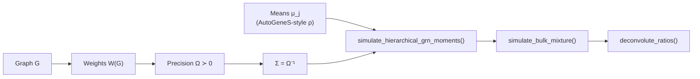
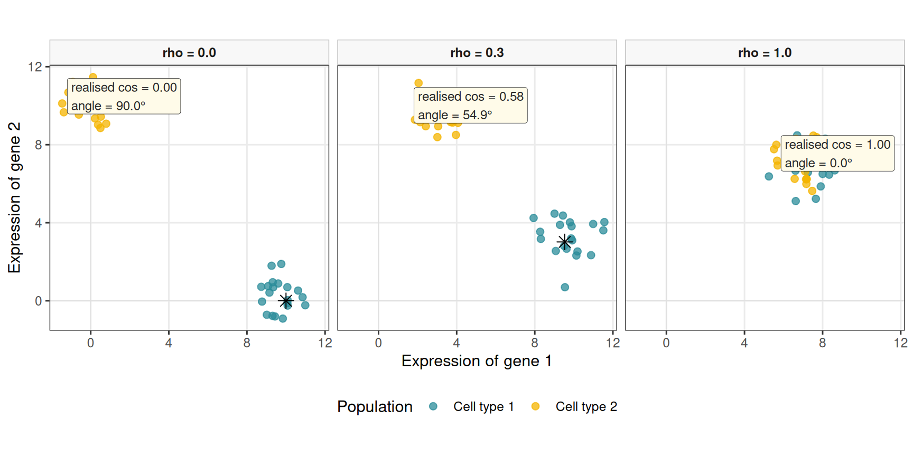

# Simulating semi-synthetic pseudo-bulk mixtures for benchmarking

## Overview

This vignette documents the synthetic first- and second-order moment
generator
[`simulate_hierarchical_grn_moments()`](https://bastienchassagnol.github.io/DeCovarT/reference/simulate_hierarchical_grn_moments.md)
and how its outputs feed bulk mixture simulation. Mean profiles follow
an AutoGeneS-inspired construction ([Aliee and Theis
2021](#ref-alieeAutoGeneSAutomaticGene2021)) in which a single dial \rho
(`target_cosine`) sets pairwise collinearity between cell-type columns
of \boldsymbol{\mu}, while a fixed scale s (`mean_scale`) sets column
norms. Prefer varying \rho across scenarios when precision weights
already control second-order dependence. Covariances share a
graph-constrained signed precision \boldsymbol{\Omega}, mapped to
\boldsymbol{\Sigma}\_j=\boldsymbol{\Omega}^{-1}.

## Pipeline API

The exported entry point orchestrates internal helpers and returns
moments that can be passed to
[`simulate_bulk_mixture()`](https://bastienchassagnol.github.io/DeCovarT/reference/simulate_bulk_mixture.md)
and then to any deconvolution routine exposed by
[`deconvolute_ratios()`](https://bastienchassagnol.github.io/DeCovarT/reference/deconvolute_ratios.md).



``` r

library(DeCovarT)

set.seed(42)
moments <- simulate_hierarchical_grn_moments(
  n_genes = 40L,
  n_celltypes = 3L,
  mean_scale = 10,
  target_cosine = 0.1,
  precision_shift = 0.1,
  precision_scale = 0.3,
  prop_inhibitory = 0.5,
  graph_model = "scale_free"
)

moments$objectives
#> $mean_abs_cosine
#> [1] 0.3315284
#> 
#> $sum_euclidean_distance
#> [1] 34.68786

bulk <- simulate_bulk_mixture(
  signature_matrix = moments$mean_profiles,
  Sigma = moments$covariance_matrices,
  p = c(0.5, 0.3, 0.2),
  n = 20
)
dim(bulk$Y)
#> [1] 40 20
```

Selecting genes (or, here, designing \boldsymbol{\mu}) by cosine alone
is insufficient for stable deconvolution ([Aliee and Theis
2021](#ref-alieeAutoGeneSAutomaticGene2021)) when centroids also
collapse toward the origin. In the scenarios of this package we
therefore **hold `mean_scale` fixed** and dial only `target_cosine`, so
that Euclidean norms (and second-order precision weights) stay
comparable across runs.

## Mathematical roles of the generators

### Mean signature: `generate_mean_signature_matrix()`

Notation: G genes, J cell types indexed by j=1,\ldots,J, and columns
\boldsymbol{\mu}\_{\cdot j}\in\mathbb{R}^{G} of the mean signature. Fix
the column scale s (`mean_scale`, default 10 in the nine-scenario grid)
and dial only the target cosine \rho\in\[0,1\] (`target_cosine`).

Let \boldsymbol{u}=G^{-1/2}\mathbf{1}\_{G} be the shared unit direction
and let \boldsymbol{v}\_{j} be the \ell_2-normalised indicator of the
gene block assigned to type j (disjoint partition of \\1,\ldots,G\\).
Then \boldsymbol{v}\_{j}^{\mathsf{T}}\boldsymbol{v}\_{k}=0 for j\neq k.
Each column is the normalised blend

\tilde{\boldsymbol{\mu}}\_{\cdot j} = \sqrt{\rho}\\\boldsymbol{u}
+\sqrt{1-\rho}\\\boldsymbol{v}\_{j}, \qquad \boldsymbol{\mu}\_{\cdot j}
= s\\ \frac{\tilde{\boldsymbol{\mu}}\_{\cdot j}}{
\\\tilde{\boldsymbol{\mu}}\_{\cdot j}\\\_2 }, \qquad j=1,\ldots,J.
\tag{1}

Expanding the un-normalised inner product for j\neq k gives the exact
identity

\tilde{\boldsymbol{\mu}}\_{\cdot j}^{\mathsf{T}}
\tilde{\boldsymbol{\mu}}\_{\cdot k} = \rho + \sqrt{\rho(1-\rho)}\\
\bigl( \boldsymbol{u}^{\mathsf{T}}\boldsymbol{v}\_{j} +
\boldsymbol{u}^{\mathsf{T}}\boldsymbol{v}\_{k} \bigr), \tag{2}

because \boldsymbol{u}^{\mathsf{T}}\boldsymbol{u}=1 and
\boldsymbol{v}\_{j}^{\mathsf{T}}\boldsymbol{v}\_{k}=0. The cross terms
\boldsymbol{u}^{\mathsf{T}}\boldsymbol{v}\_{j} equal the (positive) mass
of the shared direction on block j; they vanish in the idealised case
where each \boldsymbol{v}\_{j} is taken orthogonal to \boldsymbol{u}, in
which [Equation 2](#eq-mean-inner) collapses to \rho and, since
\\\tilde{\boldsymbol{\mu}}\_{\cdot j}\\\_2=1, the cosine of
\boldsymbol{\mu} equals \rho exactly. With block indicators the cross
terms are of order J^{-1/2}, so after the column renormalisation in
[Equation 1](#eq-mean-cosine) the realised pairwise cosine tracks \rho
closely once each block contains many genes.

The scale s sets column norms without changing angles:
\\\boldsymbol{\mu}\_{\cdot j}-\boldsymbol{\mu}\_{\cdot k}\\\_2\propto s
at fixed \rho. We keep s=10 across scenarios and only vary \rho.

#### Toy illustration: J=2 cell types, G=2 genes

Take equal blocks so \boldsymbol{v}\_{1}=(1,0)^{\mathsf{T}},
\boldsymbol{v}\_{2}=(0,1)^{\mathsf{T}}, and
\boldsymbol{u}=2^{-1/2}(1,1)^{\mathsf{T}}. Then
\boldsymbol{u}^{\mathsf{T}}\boldsymbol{v}\_{j}=2^{-1/2} and
[Equation 2](#eq-mean-inner) becomes

\tilde{\boldsymbol{\mu}}\_{\cdot 1}^{\mathsf{T}}
\tilde{\boldsymbol{\mu}}\_{\cdot 2} = \rho + \sqrt{2\rho(1-\rho)}.

After renormalisation the cosine of (\boldsymbol{\mu}\_{\cdot 1},
\boldsymbol{\mu}\_{\cdot 2}) still rises monotonically with \rho. The
chunk below reports the realised cosine at the three operating points
used in the nine-scenario grid (\rho\in\\0,\\0.3,\\1\\; intermediate
collinearity near 0.3):

``` r

rhos <- c(low = 0, mid = 0.3, high = 1)
toy <- lapply(rhos, function(rho) {
  mu <- DeCovarT:::generate_mean_signature_matrix(
    n_genes = 2L,
    n_celltypes = 2L,
    mean_scale = 10,
    target_cosine = rho,
    gene_names = c("g1", "g2"),
    celltype_names = c("j=1", "j=2")
  )
  cos_12 <- sum(mu[, 1] * mu[, 2]) /
    sqrt(sum(mu[, 1]^2) * sum(mu[, 2]^2))
  data.frame(
    rho_target = rho,
    cos_realised = cos_12,
    mu_j1_g1 = mu[1, 1],
    mu_j1_g2 = mu[2, 1],
    mu_j2_g1 = mu[1, 2],
    mu_j2_g2 = mu[2, 2]
  )
})
do.call(rbind, toy)
#>      rho_target cos_realised  mu_j1_g1 mu_j1_g2 mu_j2_g1  mu_j2_g2
#> low         0.0    0.0000000 10.000000 0.000000 0.000000 10.000000
#> mid         0.3    0.5752618  9.534069 3.016875 3.016875  9.534069
#> high        1.0    1.0000000  7.071068 7.071068 7.071068  7.071068
```

With only two genes the cross terms in [Equation 2](#eq-mean-inner) are
large, so the realised cosine is a warped but strictly increasing map of
\rho (near 0 when \rho=0, intermediate near \rho=0.3, and 1 when
\rho=1). In the G=80 simulation grid the same dial sits much closer to
the nominal target.

[Figure 1](#fig-cosine-geometry) makes the construction geometric for
the same three operating points (the cosine levels shared by scenarios
A1–C1, A2–C2 and A3–C3). In the plane of the two genes, each panel
draws:

1.  the shared unit direction \boldsymbol{u} and the private markers
    \boldsymbol{v}\_{1}, \boldsymbol{v}\_{2};
2.  the un-normalised blends \tilde{\boldsymbol{\mu}}\_{\cdot
    j}=\sqrt{\rho}\\\boldsymbol{u}+\sqrt{1-\rho}\\\boldsymbol{v}\_{j}
    (dashed);
3.  the final columns \boldsymbol{\mu}\_{\cdot j} after
    \ell_2-normalisation and scaling by s (solid), with the angle
    between them labelled by the realised cosine.

The sequence
\boldsymbol{v}\_{j}\rightarrow\tilde{\boldsymbol{\mu}}\_{\cdot
j}\rightarrow\boldsymbol{\mu}\_{\cdot j} is the one-shot constructive
counterpart of AutoGeneS-style search for a target collinearity: rather
than iterating a multi-objective optimiser,
[Equation 1](#eq-mean-cosine) places the two cell-type profiles at a
controlled angle in a single pass ([Aliee and Theis
2021](#ref-alieeAutoGeneSAutomaticGene2021)).



Figure 1: Constructive cosine dial for J=2 cell types and G=2 genes.
Panels correspond to the three scenario levels \rho\in\\0,\\0.3,\\1\\
(suffixes 1–3 in A1–C3). Shared direction \boldsymbol{u} (grey), private
markers \boldsymbol{v}\_{j} (open arrows), blends
\tilde{\boldsymbol{\mu}}\_{\cdot j} (dashed), and scaled profiles
\boldsymbol{\mu}\_{\cdot j} (solid).

### Objectives: `compute_mean_profile_objectives()`

For columns of \boldsymbol{\mu},

\overline{\lvert\cos\rvert} = \frac{2}{J(J-1)} \sum\_{1\le j\<k\le J}
\Biggl\| \frac{ \boldsymbol{\mu}\_{\cdot j}^{\mathsf{T}}
\boldsymbol{\mu}\_{\cdot k} }{ \\\boldsymbol{\mu}\_{\cdot j}\\\_2\\
\\\boldsymbol{\mu}\_{\cdot k}\\\_2 } \Biggr\|,

D\_{\mathrm{Euc}} = \sum\_{1\le j\<k\le J} \\\boldsymbol{\mu}\_{\cdot
j}-\boldsymbol{\mu}\_{\cdot k}\\\_2.

AutoGeneS treats the first as a quantity to minimise and the second as a
quantity to maximise ([Aliee and Theis
2021](#ref-alieeAutoGeneSAutomaticGene2021)). Cosine is preferred to
Pearson correlation so that collinear but unequally scaled profiles
remain penalised.

### Network skeleton: `generate_random_network_skeleton()`

A binary adjacency \boldsymbol{A}\in\\0,1\\^{G\times G} is drawn from
one of three undirected families via : scale-free preferential
attachment
([`igraph::sample_pa()`](https://r.igraph.org/reference/sample_pa.html)),
a stochastic block model
([`igraph::sample_sbm()`](https://r.igraph.org/reference/sample_sbm.html)),
or Watts–Strogatz small-world
([`igraph::sample_smallworld()`](https://r.igraph.org/reference/sample_smallworld.html))
([Csárdi et al. 2026](#ref-R-igraph); [Barabási and Albert
1999](#ref-barabasiEmergenceScalingRandom1999)). Edges encode presence
of partial-correlation links, not their strengths. i.i.d. signs with
inhibitory fraction `prop_inhibitory` then form the weighted matrix
\boldsymbol{W} before the spectral SPD completion.

### Positive-definite precision: `build_normalised_precision()`

Signed edge weights enter through an affine spectral shift of
\boldsymbol{W},

\boldsymbol{\Omega} = \boldsymbol{W} + \bigl(
\lvert\lambda\_{\min}(\boldsymbol{W})\rvert + u \bigr) \mathbf{I},

with magnitude v (`precision_scale`) baked into \boldsymbol{W} and
diagonal cushion u (`precision_shift`). The shift preserves off-diagonal
signs and support while guaranteeing \boldsymbol{\Omega}\succ 0.

### Shared covariances: `build_shared_covariance_array()`

Cell types share the same second-order structure,

\boldsymbol{\Sigma}\_j = \boldsymbol{\Omega}^{-1}, \qquad j=1,\ldots,J,

stacked as an array in \mathcal{M}\_{G\times G\times J}. Downstream bulk
simulation uses the Gaussian convolution
\boldsymbol{y}\mid(\boldsymbol{\zeta},\boldsymbol{p})\sim
\mathcal{N}\_{G}(\boldsymbol{\mu}\boldsymbol{p}, \sum_j
p_j^{2}\boldsymbol{\Sigma}\_j).

## Perspectives: a single geometric score for \boldsymbol{\mu}

The present API exposes two AutoGeneS-style objectives. A natural
refinement is to replace them by one scalar that jointly rewards large
column norms (and hence Euclidean separation) and penalises alignment.

Two candidates are immediate. The Gram determinant

V(\boldsymbol{\mu}) = \sqrt{ \det\bigl(
\boldsymbol{\mu}^{\mathsf{T}}\boldsymbol{\mu} \bigr) }

is the volume of the parallelepiped spanned by the columns of
\boldsymbol{\mu}. It vanishes under exact collinearity and grows when
columns lengthen or become more orthogonal—precisely the desired MOO
trade-off in one number.

Equivalently, the reciprocal condition number

\kappa_2(\boldsymbol{\mu})^{-1} =
\frac{\sigma\_{\min}(\boldsymbol{\mu})}{\sigma\_{\max}(\boldsymbol{\mu})},

available in R via `kappa(mean_profiles, exact = TRUE)` (or
`1 / kappa(...)`), measures how ill-posed linear recovery of
\boldsymbol{p} from \boldsymbol{y}\approx\boldsymbol{\mu}\boldsymbol{p}
is. Maximising \kappa_2(\boldsymbol{\mu})^{-1} (or minimising
\kappa_2(\boldsymbol{\mu})) collapses cosine and distance into a
deconvolution-centric criterion without a Pareto front.

A practical next step is to expose an optional
`mean_objective = c("autogenes", "volume", "condition")` in
[`simulate_hierarchical_grn_moments()`](https://bastienchassagnol.github.io/DeCovarT/reference/simulate_hierarchical_grn_moments.md),
keep the constructive (\rho,s) generator for controllable scenarios, and
report the chosen scalar alongside the existing pairwise diagnostics.

## References

Aliee, Hananeh, and Fabian J. Theis. 2021. ‘AutoGeneS: Automatic Gene
Selection Using Multi-Objective Optimization for RNA-seq Deconvolution’.
*Cell Systems* 12. <https://doi.org/10.1016/j.cels.2021.05.006>.

Barabási, Albert-László, and Réka Albert. 1999. ‘Emergence of Scaling in
Random Networks’. *Science* 286.
<https://doi.org/10.1126/science.286.5439.509>.

Csárdi, Gábor, Tamás Nepusz, Vincent Traag, et al. 2026. *Igraph:
Network Analysis and Visualization*. <https://r.igraph.org/>.
