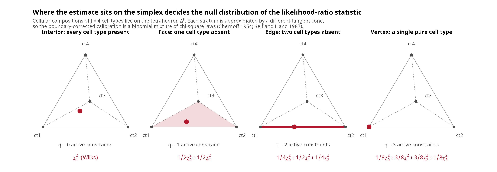

# MLE properties and asymptotic inference for the DeCovarT log-likelihood

DeCovarT estimates a composition \boldsymbol{p}\in\Delta^{J-1} by
maximising the Gaussian-convolution log-likelihood

\ell\_{\boldsymbol{y}\mid\boldsymbol{\zeta}}(\boldsymbol{p}) =
-\tfrac{1}{2}\log\det\boldsymbol{\Sigma}(\boldsymbol{p}) -\tfrac{1}{2}
(\boldsymbol{y}-\boldsymbol{\mu}\boldsymbol{p})^{\top}
\boldsymbol{\Sigma}(\boldsymbol{p})^{-1}
(\boldsymbol{y}-\boldsymbol{\mu}\boldsymbol{p}) +C, \qquad
\boldsymbol{\Sigma}(\boldsymbol{p})=\sum\_{j=1}^{J}p_j^{2}\boldsymbol{\Sigma}\_j
. \tag{1}

The derivatives of [Eq. 1](#eq-loglik) are collected in the [derivatives
vignette](https://bastienchassagnol.github.io/DeCovarT/articles/theory-decovart-generative-model.md).
This companion article asks what the resulting estimator is actually
entitled to claim. Two answers are uncomfortable and worth stating
plainly: the realised log-likelihood is **not** concave and its
maximiser **need not be unique**, and the Wald intervals of
[`confint.decovart_fit()`](https://bastienchassagnol.github.io/DeCovarT/reference/fit_decovart.md)
are **undefined** on a simplex face. Both have concrete remedies,
implemented in
[`lrt_decovart()`](https://bastienchassagnol.github.io/DeCovarT/reference/lrt_decovart.md),
[`confint_profile_decovart()`](https://bastienchassagnol.github.io/DeCovarT/reference/confint_profile_decovart.md),
[`bootstrap_decovart()`](https://bastienchassagnol.github.io/DeCovarT/reference/bootstrap_decovart.md)
and
[`reference_bootstrap_decovart()`](https://bastienchassagnol.github.io/DeCovarT/reference/reference_bootstrap_decovart.md).

## Theoretical properties of the DeCovarT MLE

### Identifiability

**Proposition 1 (Identifiability of the composition)** The
parameter-to-distribution map is

\boldsymbol{p} \longmapsto \bigl( \boldsymbol{\mu}\boldsymbol{p},\\
\boldsymbol{\Sigma}(\boldsymbol{p})
=\textstyle\sum\_{j}p\_{j}^{2}\boldsymbol{\Sigma}\_{j} \bigr). \tag{2}

Two compositions induce the same law
\mathcal{N}\_G(\boldsymbol{\mu}\boldsymbol{p},
\boldsymbol{\Sigma}(\boldsymbol{p})) only if they coincide, **provided
that map is injective**. Full column rank of \boldsymbol{\mu}
(\operatorname{rank}(\boldsymbol{\mu})=J, equivalently linearly
independent contrast columns \boldsymbol{\mu}\_{\cdot
j}-\boldsymbol{\mu}\_{\cdot J}) is a convenient **sufficient**
condition, because then the mean map alone is injective on the simplex.
It is **not necessary**. Two cell types may share identical or collinear
mean profiles and remain identifiable when their covariances differ: the
second component of [Eq. 2](#eq-param-map) still separates
\boldsymbol{p}. Conversely, identical means *and* proportional
covariances (\boldsymbol{\Sigma}\_{2}=c\boldsymbol{\Sigma}\_{1}) make
the Gaussian family non-injective.

Identifiability is a property of the *reference*, not of the bulk
sample: no amount of sequencing rescues a pair of types that agree in
both mean and covariance. The mean-based condition number
\kappa(\boldsymbol{\mu}) is therefore a misleading diagnostic in the
covariance-only regime DeCovarT targets (see the [feature-selection
vignette](https://bastienchassagnol.github.io/DeCovarT/articles/supp-S6-feature-selection.html#sec-weighted-kappa)).
Near-collinear *means* are still reported as a warning by
[`fit_decovart()`](https://bastienchassagnol.github.io/DeCovarT/reference/fit_decovart.md);
that warning does not by itself imply that \boldsymbol{p} is
unidentifiable. Numerical illustrations live in the [appendix
simulations](https://bastienchassagnol.github.io/DeCovarT/articles/supp-S1-identifiability.md).

### Existence

**Proposition 2 (Existence of a maximiser)** If every
\boldsymbol{\Sigma}\_j is symmetric positive definite, then
\boldsymbol{\Sigma}(\boldsymbol{p})=\sum_j p_j^{2}\boldsymbol{\Sigma}\_j
is positive definite for every \boldsymbol{p}\in\Delta^{J-1}, since at
least one p_j\>0 on the simplex. Hence [Eq. 1](#eq-loglik) is finite and
continuous on the **compact** set \Delta^{J-1}, and attains its
supremum.

Two practical consequences. First, positive definiteness is preserved
even when some proportions are exactly zero, which is what allows the
restricted maximisation of
[`restricted_mle_decovart()`](https://bastienchassagnol.github.io/DeCovarT/reference/restricted_mle_decovart.md)
to represent a null such as p_j=0 exactly instead of pushing it through
a logarithm. Second, the maximiser may lie on the **boundary** of the
compact set, so first-order conditions \nabla\ell=\boldsymbol{0} are
necessary only at interior optima.

### Uniqueness fails for one observed sample

Existence is not uniqueness. The DeCovarT likelihood is a
*heteroscedastic* Gaussian model: the noise covariance depends on the
same parameter as the mean, so [Eq. 1](#eq-loglik) is not the concave
objective of an ordinary linear regression. Even in the isotropic case
\boldsymbol{\Sigma}\_1=\boldsymbol{\Sigma}\_2=\mathbf{I}\_G with J=2 and
without the simplex constraint,

\ell(\boldsymbol{p}) = -\frac{G}{2}\log(p_1^{2}+p_2^{2}) -
\frac{\lVert\boldsymbol{y}-\boldsymbol{\mu}\boldsymbol{p}\rVert^{2}}
{2(p_1^{2}+p_2^{2})} +C , \tag{3}

whose variance term moves with the coefficients. A single evaluation of
the analytic Hessian settles the question.

``` r

mean_signature <- matrix(c(2, 1, 1, 1, 2, 6 / 5), nrow = 3)
colnames(mean_signature) <- c("ct1", "ct2")
rownames(mean_signature) <- paste0("gene_", 1:3)
Sigma_iso <- array(c(diag(3), diag(3)), dim = c(3, 3, 2))
bulk <- drop(mean_signature %*% c(0.5, 0.5))

hessian_interior <- hessian_loglik_unconstrained(
  p = c(1 / 5, 3 / 10),
  y = bulk,
  mean_signature_matrix = mean_signature,
  Sigma = Sigma_iso
)
round(hessian_interior, 4)
#>           [,1]      [,2]
#> [1,] -208.8794 -342.2303
#> [2,] -342.2303 -391.7123
c(
  determinant = det(hessian_interior),
  eigen(hessian_interior, symmetric = TRUE)$values
)
#>  determinant                           
#> -35300.95781     53.93367   -654.52539
```

Every entry of \boldsymbol{y} and \boldsymbol{\mu} is strictly positive,
\operatorname{rank}(\boldsymbol{\mu})=2, G=3\>J=2, and both covariances
are positive definite. Yet the Hessian at the strictly interior point
\boldsymbol{p}=(1/5,3/10) has one positive and one negative eigenvalue.

> **Important 1: One indefinite Hessian disproves global concavity**
>
> A negative determinant at a single admissible point is a
> counterexample, so the unconstrained DeCovarT log-likelihood is **not
> globally concave** under the stated positivity and rank assumptions.
> The same conclusion transfers to the isometric log-ratio chart,
> because a C^{2} diffeomorphism preserves the existence of directions
> of positive curvature. Consequently:
>
> - a converged optimiser certifies a **local** maximum at best;
> - several starts may reach different modes (see
>   [Sec. 3](#sec-diagnostics));
> - convex-optimisation guarantees — a unique global optimum reachable
>   by descent, and duality certificates — do not apply ([Boyd et al.
>   2004](#ref-boydConvexOptimization2004)). The Marquardt–Levenberg
>   damping of `marqLevAlg` ([Philipps et al. 2023](#ref-R-marqLevAlg),
>   [2021](#ref-philippsRobustEfficientOptimization2021)) and the
>   relative-distance-to-minimum criterion of Commenges et al.
>   ([2006](#ref-commengesNewtonLikeAlgorithmLikelihood2006)) buy
>   robustness against saddle points, not global optimality.

### Population consistency and efficiency

The failure of concavity is a statement about *one realised* data set.
The population criterion behaves much better. Let \boldsymbol{p}\_0 be
the truth and define Q(\boldsymbol{p};\boldsymbol{p}\_0)
=\mathbb{E}\_{\boldsymbol{p}\_0}\\\ell\_{\boldsymbol{Y}}(\boldsymbol{p})\\.

**Theorem 1 (Population uniqueness through the Kullback–Leibler
divergence)**
Q(\boldsymbol{p}\_0;\boldsymbol{p}\_0)-Q(\boldsymbol{p};\boldsymbol{p}\_0)
= D\_{\mathrm{KL}}\bigl(
P\_{\boldsymbol{p}\_0}\\\Vert\\P\_{\boldsymbol{p}} \bigr) \\ \ge\\ 0 ,
\tag{4}

with equality if and only if P\_{\boldsymbol{p}}=P\_{\boldsymbol{p}\_0}.
Under [Proposition 1](#prp-identifiability) that happens only at
\boldsymbol{p}=\boldsymbol{p}\_0, so \boldsymbol{p}\_0 is the **unique**
maximiser of the expected log-likelihood.

[Eq. 4](#eq-kl) is an identifiability statement, not a curvature
statement: it survives the non-concavity of [Note 1](#nte-nonconcave).
It is also the engine of the usual asymptotics — consistency, asymptotic
normality and efficiency of the MLE ([Vaart
2000](#ref-vaartAsymptoticStatistics2000)) — because the local geometry
of the divergence *is* the Fisher information. By the [Fisher
information metric
theorem](https://en.wikipedia.org/wiki/Kullback%E2%80%93Leibler_divergence#Fisher_information_metric_theorem),

D\_{\mathrm{KL}}\bigl(
P\_{\boldsymbol{p}\_0}\\\Vert\\P\_{\boldsymbol{p}\_0+\boldsymbol{d}}
\bigr) = \tfrac{1}{2}\\
\boldsymbol{d}^{\top}I(\boldsymbol{p}\_0)\\\boldsymbol{d} +
o(\lVert\boldsymbol{d}\rVert^{2}) , \tag{5}

with I the expected information of
[`expected_fisher_unconstrained()`](https://bastienchassagnol.github.io/DeCovarT/reference/expected_fisher_unconstrained.md);
the Gaussian case is treated in information-geometric terms by Malago
and Pistone ([2015](#ref-malagoInformationGeometryGaussian2015)). The
identity is worth checking numerically, since it ties the plug-in `vcov`
of a DeCovarT fit to the divergence that makes the MLE consistent.

``` r

kl_gaussian_convolution <- function(p_ref, p_alt, mu, Sigma) {
  mean_ref <- drop(mu %*% p_ref)
  mean_alt <- drop(mu %*% p_alt)
  cov_ref <- .compute_global_variance(p_ref, Sigma)
  cov_alt <- .compute_global_variance(p_alt, Sigma)
  precision_alt <- solve(cov_alt)
  shift <- mean_alt - mean_ref
  0.5 *
    (sum(diag(precision_alt %*% cov_ref)) -
      nrow(cov_ref) +
      drop(t(shift) %*% precision_alt %*% shift) +
      as.numeric(determinant(cov_alt, logarithm = TRUE)$modulus) -
      as.numeric(determinant(cov_ref, logarithm = TRUE)$modulus))
}

p_reference <- c(0.4, 0.6)
information <- expected_fisher_unconstrained(
  p_reference,
  mean_signature,
  Sigma_iso
)
steps <- c(1e-2, 1e-3, 1e-4)
data.frame(
  step = steps,
  kullback_leibler = vapply(
    steps,
    function(h) {
      kl_gaussian_convolution(
        p_reference,
        p_reference + c(h, -h / 2),
        mean_signature,
        Sigma_iso
      )
    },
    numeric(1)
  ),
  quadratic_form = vapply(
    steps,
    function(h) {
      d <- c(h, -h / 2)
      0.5 * drop(t(d) %*% information %*% d)
    },
    numeric(1)
  )
)
#>    step kullback_leibler quadratic_form
#> 1 1e-02     2.432446e-04   2.428254e-04
#> 2 1e-03     2.428691e-06   2.428254e-06
#> 3 1e-04     2.428298e-08   2.428254e-08
```

The two columns agree to the order of \lVert\boldsymbol{d}\rVert^{3}, as
[Eq. 5](#eq-fisher-metric) predicts.

### Equivariance: affine yes, logarithmic no

**Proposition 3 (Gene-wise affine equivariance)** Let
D=\operatorname{diag}(s_1,\ldots,s_G) with s_g\neq 0 and
\boldsymbol{m}\in\mathbb{R}^{G}. Applying the **same** gene-wise map to
all three inputs,

\boldsymbol{y}^{\star}=D^{-1}(\boldsymbol{y}-\boldsymbol{m}), \quad
\boldsymbol{\mu}^{\star}
=D^{-1}(\boldsymbol{\mu}-\boldsymbol{m}\mathbf{1}\_J^{\top}), \quad
\boldsymbol{\Sigma}\_j^{\star}=D^{-1}\boldsymbol{\Sigma}\_j D^{-1},

leaves the MLE unchanged, because \mathbf{1}\_J^{\top}\boldsymbol{p}=1
makes the recentring cancel and the Mahalanobis residual is invariant.

A z-score computed **once per gene from \boldsymbol{\mu}** is such a
map, which is why `fit_decovart(standardise = TRUE)` is safe.
Per-cell-type or per-sample scaling is not, and neither is a logarithm:
\log is concave, so Jensen’s inequality shifts both moments and
\log(\boldsymbol{\mu}\boldsymbol{p})
\neq(\log\boldsymbol{\mu})\boldsymbol{p}. Reference-based deconvolution
therefore expects a non-log linear scale ([Newman et al.
2015](#ref-newmanRobustEnumerationCell2015)): **keep raw counts** (or a
linear normalisation such as CPM/TPM) rather than \log_2 values.
Monotonicity of \log preserves gene-wise rankings, but not the
convolution MLE. The numerical demonstration lives in the [appendix
simulations](https://bastienchassagnol.github.io/DeCovarT/articles/supp-S1-identifiability.html#sec-affine).

## Asymptotic inference

### Where the estimate sits decides the null distribution

The admissible set is a polytope, and a composition can sit in its
interior or on a stratum of its boundary. With J=4 cell types \Delta^{3}
is a tetrahedron whose strata are the interior, four triangular faces,
six edges and four vertices, corresponding to q=0,1,2 or 3 proportions
equal to zero ([Figure 1](#fig-simplex-strata)).



Figure 1: Strata of the tetrahedron \Delta^{3} for J=4 cell types.
Vertices are pure populations, edges and faces are compositions with two
or one absent cell types, and the interior holds compositions with every
type present. Dashed lines are the edges hidden behind the far vertex
`ct3`. Below each panel, q counts the constraints active at the estimate
and the red expression is the resulting null law of the likelihood-ratio
statistic: the ordinary \chi^2_1 of Wilks
([1938](#ref-wilksLargeSampleDistributionLikelihood1938)) in the
interior, and binomially weighted chi-square mixtures on the boundary
strata ([Chernoff 1954](#ref-hermanDistributionLikelihoodRatio1954);
[Self and Liang 1987](#ref-selfAsymptoticPropertiesMaximum1987)).

The reason the calibration changes is geometric. Self and Liang
([1987](#ref-selfAsymptoticPropertiesMaximum1987)) show that the
boundary problem is asymptotically equivalent to estimating the
**restricted mean** of a single multivariate Gaussian draw: the limiting
law of the normalised MLE is the distribution of the *projection* of a
Gaussian score onto the **tangent cone** that approximates the
admissible set at \boldsymbol{p}\_0. In the interior that cone is the
whole of \mathbb{R}^{J-1} and the projection is the identity, recovering
classical theory; at a face it is a half-space, at an edge a
two-dimensional wedge, and at a vertex a simplicial cone. A visual
introduction to tangent and normal cones is available in these [ESIEE
optimisation
notes](https://perso.esiee.fr/~chierchg/optimization/content/05/normal_cone.html).

### Interior nulls: Wald and profile likelihood

For an interior null H_0:p_j=c with 0\<c\<1, two statistics are
available.

The **Wald** statistic is the cheap one: (\hat{p}\_j-c)/\mathrm{SE}\_j
with \mathrm{SE}\_j the delta-method standard error of
[`vcov_ilr_delta()`](https://bastienchassagnol.github.io/DeCovarT/reference/vcov_ilr_delta.md),
giving the symmetric interval of
[`confint.decovart_fit()`](https://bastienchassagnol.github.io/DeCovarT/reference/fit_decovart.md).
It costs one matrix inversion, but it linearises the isometric log-ratio
chart at \hat{\boldsymbol{p}} ([Oehlert
1992](#ref-oehlertNoteDeltaMethod1992)) and is therefore *not* invariant
to reparametrisation and can place limits outside \[0,1\].

The **profile likelihood-ratio** statistic

D_j(c) = 2\bigl\\ \ell(\hat{\boldsymbol{p}}) -
\max\_{\boldsymbol{p}\in\Delta^{J-1},\\p_j=c}\ell(\boldsymbol{p})
\bigr\\ \\ \rightsquigarrow\\ \chi^{2}\_{1} \tag{6}

concentrates out the other J-2 proportions instead. Because a smooth
bijection leaves likelihood ratios unchanged, [Eq. 6](#eq-lrt) needs
**no** delta method and respects the simplex automatically. Inverting it
gives the asymmetric intervals of
[`confint_profile_decovart()`](https://bastienchassagnol.github.io/DeCovarT/reference/confint_profile_decovart.md).

``` r

signature <- matrix(
  c(20, 40, 15, 40, 20, 25, 25, 30, 35),
  nrow = 3,
  dimnames = list(paste0("gene_", 1:3), paste0("ct", 1:3))
)
Sigma <- array(
  0,
  dim = c(3, 3, 3),
  dimnames = list(
    rownames(signature),
    rownames(signature),
    colnames(signature)
  )
)
for (j in 1:3) {
  Sigma[, , j] <- diag(3) * c(1, 1.5, 1.2)[j]
}

# Eight technical replicates of ONE composition, so the asymptotics of
# Sec. 2.4 are taken in a meaningful direction.
set.seed(11)
replicates <- simulate_bulk_mixture(
  signature_matrix = signature,
  Sigma = Sigma,
  p = c(0.45, 0.35, 0.20),
  n = 8
)$Y

round(
  confint_profile_decovart(
    bulk_expression = replicates,
    mean_signature_matrix = signature,
    Sigma = Sigma
  ),
  4
)
#>     estimate  lower  upper
#> ct1   0.4546 0.4347 0.4749
#> ct2   0.3559 0.3339 0.3777
#> ct3   0.1895 0.1598 0.2182
```

``` r

lrt_decovart(
  bulk_expression = replicates,
  mean_signature_matrix = signature,
  Sigma = Sigma,
  null_value = c(ct1 = 0.30)
)
#>     statistic n_boundary df_interior      p_value loglik_full loglik_null
#> ct1  235.2243          0           1 4.325696e-53  -0.7007644   -118.3129
#>            calibration
#> ct1 chi-square (Wilks)
```

### Boundary nulls: chi-bar-square mixtures

The scientifically interesting null is usually **absence**: H_0:p_j=0
against H_1:p_j\ge 0. Here the parameter may move away from the null in
one direction only, so the local parameter space is a half-line rather
than a vector space, and Wilks’ theorem does not apply.

**Theorem 2 (Boundary calibration)** With q constraints active on the
boundary and s interior constraints tested simultaneously, and the
corresponding information block orthogonal to the nuisance block,

D \\ \rightsquigarrow\\ \bar{\chi}^{2} = \sum\_{i=0}^{q}
\binom{q}{i}2^{-q}\\ \chi^{2}\_{s+i}, \tag{7}

where \chi^{2}\_{0} denotes a point mass at zero ([Self and Liang
1987](#ref-selfAsymptoticPropertiesMaximum1987), Case 9). For a single
active constraint this is the
\tfrac{1}{2}\chi^{2}\_{0}+\tfrac{1}{2}\chi^{2}\_{1} law of Chernoff
([1954](#ref-hermanDistributionLikelihoodRatio1954)), so the correct
one-sided p-value is \tfrac{1}{2}\Pr(\chi^{2}\_{1}\>D) — **half** the
naive value.

[`chi_bar_square_pvalue()`](https://bastienchassagnol.github.io/DeCovarT/reference/chi_bar_square_pvalue.md)
evaluates [Eq. 7](#eq-chibar), and
[`lrt_decovart()`](https://bastienchassagnol.github.io/DeCovarT/reference/lrt_decovart.md)
selects it automatically when a tested value reaches 0 or 1.

``` r

set.seed(11)
replicates_absent <- simulate_bulk_mixture(
  signature_matrix = signature,
  Sigma = Sigma,
  p = c(0.5, 0.5, 0),
  n = 8
)$Y

lrt_decovart(
  bulk_expression = replicates_absent,
  mean_signature_matrix = signature,
  Sigma = Sigma,
  null_value = c(ct3 = 0)
)
#>     statistic n_boundary df_interior p_value loglik_full loglik_null
#> ct3         0          1           0     0.5   -5.922388   -5.922388
#>                     calibration
#> ct3 chi-bar-square (Self-Liang)
```

> **Warning 2: Three caveats on [Eq. 7](#eq-chibar)**
>
> 1.  **Binomial weights are conditional.** They require the active
>     block of the information matrix to be orthogonal to the nuisance
>     block. When several absent cell types share signal, the mixing
>     weights depend on the geometry of the tangent cone; Self and Liang
>     ([1987](#ref-selfAsymptoticPropertiesMaximum1987)) exhibit a
>     configuration (their Case 8, a *nuisance* parameter on the
>     boundary) whose limit is not a chi-square mixture at all. Pass
>     explicit `weights`, or calibrate by simulation
>     ([Sec. 2.5](#sec-bootstrap)).
> 2.  **Do not encode the null in ILR coordinates.** p_j=0 corresponds
>     to an infinite log-ratio, so the chart cannot represent the
>     hypothesis. The restricted fits substitute the constrained value
>     directly.
> 3.  **Wald is unusable here.** The delta-method covariance is
>     undefined on the face;
>     [`vcov_ilr_delta()`](https://bastienchassagnol.github.io/DeCovarT/reference/vcov_ilr_delta.md)
>     returns `NA` with a warning rather than a plausible-looking
>     number.

### Replication is what makes the asymptotics meaningful

[Eq. 6](#eq-lrt) and [Eq. 7](#eq-chibar) are limits as the amount of
information about **one** composition grows. That is a strong
requirement in deconvolution.

For each bulk sample i, DeCovarT observes a single G-vector
\boldsymbol{Y}\_{\cdot i}\sim\mathcal{N}\_G(\boldsymbol{\mu}
\boldsymbol{p}\_{\cdot i},\boldsymbol{\Sigma}(\boldsymbol{p}\_{\cdot
i})) and estimates its own \boldsymbol{p}\_{\cdot i}. Increasing the
number of samples N therefore adds parameters exactly as fast as
observations, and provides **no** extra replication for any single
\boldsymbol{p}\_{\cdot i}. The G genes are not G independent
observations either: their dependence through
\boldsymbol{\Sigma}(\boldsymbol{p}) is the whole point of the model.

> **Important 3: Per-sample intervals are plug-in approximations**
>
> The default per-sample `vcov` and `confint` of a `decovart_fit` are
> one-observation plug-in quantities. Treat them as descriptive
> curvature summaries, not as calibrated frequentist intervals.
>
> Two things restore the asymptotics, and both are implemented:
>
> - **Pool genuine replicates.** Supply several bulk columns that really
>   do share one composition (technical replicates, or aliquots of one
>   tissue) through the `bulk_expression` argument of
>   [`lrt_decovart()`](https://bastienchassagnol.github.io/DeCovarT/reference/lrt_decovart.md)
>   /
>   [`confint_profile_decovart()`](https://bastienchassagnol.github.io/DeCovarT/reference/confint_profile_decovart.md).
>   Those functions maximise the *summed* log-likelihood over the
>   replicates, so the limit is taken in the number of replicates.
> - **Simulate instead of appealing to a limit**
>   ([Sec. 2.5](#sec-bootstrap)).
>
> Reference uncertainty is a third, separate gap: \boldsymbol{\mu} and
> \boldsymbol{\Sigma}\_j are plug-in estimates from purified
> populations, and none of the intervals above propagate their sampling
> variability.
> [`reference_bootstrap_decovart()`](https://bastienchassagnol.github.io/DeCovarT/reference/reference_bootstrap_decovart.md)
> resamples those profiles ([Sec. 2.6](#sec-reference-bootstrap)); see
> Vellame et al.
> ([2023](#ref-vellameUncertaintyQuantificationReferencebased2023)) for
> the analogous accuracy metric in methylation deconvolution.

### Parametric bootstrap calibration

The conditional law of the bulk profile is fully specified, so the
asymptotic mixture can be replaced by simulation.
[`bootstrap_decovart()`](https://bastienchassagnol.github.io/DeCovarT/reference/bootstrap_decovart.md)
draws
\boldsymbol{Y}^{(b)}\sim\mathcal{N}\_G(\boldsymbol{\mu}\boldsymbol{p},
\boldsymbol{\Sigma}(\boldsymbol{p})), refits, and — when `null_value` is
supplied — regenerates under the **restricted** MLE so the
likelihood-ratio statistic is recalibrated without invoking the 50{:}50
weights ([Roch 2024](#ref-rochModernDiscreteProbability2024) reviews the
concentration tools behind such Monte Carlo guarantees).

The atom at zero is directly observable: under a true boundary null,
about half of the replicates should return D=0, because the unrestricted
MLE itself falls on the face.

``` r

set.seed(5)
calibration <- bootstrap_decovart(
  bulk_expression = replicates_absent,
  mean_signature_matrix = signature,
  Sigma = Sigma,
  null_value = c(ct3 = 0),
  n_boot = 150
)
c(
  observed_statistic = calibration$statistic,
  monte_carlo_p = calibration$p_value,
  share_of_zero_statistics = mean(calibration$null_statistics < 1e-8),
  asymptotic_p = chi_bar_square_pvalue(
    calibration$statistic,
    n_boundary = 1L
  )
)
#>       observed_statistic            monte_carlo_p share_of_zero_statistics 
#>                     0.00                     1.00                     0.56 
#>             asymptotic_p 
#>                     0.50
```

The observed share of zero statistics is the empirical counterpart of
the \tfrac{1}{2}\chi^{2}\_{0} atom in [Eq. 7](#eq-chibar). A restricted
bootstrap is still only *approximate* for a composite null, because the
nuisance proportions are held at their restricted estimates rather than
profiled over; it is exact only when \boldsymbol{p}\_0 is fully
specified.

### Reference-sample bootstrap

[`bootstrap_decovart()`](https://bastienchassagnol.github.io/DeCovarT/reference/bootstrap_decovart.md)
treats \boldsymbol{\mu} and \boldsymbol{\Sigma}\_j as known. They are
not: both are estimated from purified profiles.
[`reference_bootstrap_decovart()`](https://bastienchassagnol.github.io/DeCovarT/reference/reference_bootstrap_decovart.md)
resamples the **experimental units of that labelled reference**,
rebuilds the plug-in moments, and refits, so reference uncertainty
appears in the percentile intervals ([Efron
1979](#ref-efronBootstrapMethodsAnother1979)). Cell-type names stay
attached throughout. The three `method` options match
**?@tbl-reference-ops**:

- **`donors`** (default). Cluster bootstrap of donors *within each cell
  type*. A donor drawn twice contributes its purified columns twice.
  This is the favoured option when donor labels exist: it captures
  biological variation in the reference population rather than treating
  cells from one individual as independent.
- **`cells`**. Column resampling within each cell type, for when donor
  labels are unavailable.
- **`dirichlet`**. Draw
  \boldsymbol{p}^{(b)}\sim\mathrm{Dirichlet}(\boldsymbol{\alpha}),
  simulate \boldsymbol{Y}^{(b)} from the Gaussian convolution at the
  original plug-in moments, and refit. This is a composition sweep, not
  a confidence interval for one observed bulk.

By default the observed bulk is held fixed for `donors` and `cells`
(reference uncertainty for a given mixture). Setting
`regenerate_bulk = TRUE` follows the fuller pipeline \text{reference
units}\to S^{(b)}\to Y^{(b)}\to\hat{\boldsymbol{p}}^{(b)}.

A related design point for **simulation studies**, not implemented as an
argument here, is to split reference-building cells from
pseudobulk-generating cells, ideally at the donor level. Using the same
cells, or cells from the same individual, in both the signature and the
artificial bulk makes a benchmark unrealistically easy ([Sturm et al.
2019](#ref-sturmComprehensiveEvaluationTranscriptomebased2019); [Avila
Cobos et al. 2020](#ref-avilacobosBenchmarkingCellType2020); [Zhao et
al. 2026](#ref-zhaoEvaluatingReferencemixtureMatching2026)). Nguyen et
al. ([2024](#ref-nguyenFourteenYearsCellular2024)) review 53 bulk
methods and stress incomplete references and missing cell types; Avila
Cobos et al. ([2020](#ref-avilacobosBenchmarkingCellType2020)) show that
omitted types and the expression scale dominate error on pseudobulk
mixtures. The simulation generator used to evaluate `imply` is a useful
reference-based template: cell-type parameters are drawn from a
multivariate Gaussian, purified-like expression is realised from a Gamma
(negative-binomial-like) law fitted to RNA-seq counts, and bulk mixtures
are then formed from those profiles with Dirichlet compositions ([Meng
et al. 2024](#ref-mengImplyImprovingCelltype2024)). That is distinct
from DeCovarT’s Gaussian convolution of the *bulk*; it is a design for
how to build a labelled S and a synthetic Y with known p.

``` r

set.seed(9)
refs <- lapply(seq_len(ncol(signature)), function(j) {
  draws <- MASS::mvrnorm(
    n = 12L,
    mu = signature[, j],
    Sigma = Sigma[, , j]
  )
  out <- t(draws)
  rownames(out) <- rownames(signature)
  out
})
names(refs) <- colnames(signature)
donor_ids <- lapply(refs, function(x) {
  rep(paste0("d", 1:3), length.out = ncol(x))
})
ref_boot <- reference_bootstrap_decovart(
  bulk_expression = replicates,
  reference_profiles = refs,
  donor_ids = donor_ids,
  method = "donors",
  n_boot = 40,
  itmax = 80
)
ref_boot$interval
#>          2.5%     97.5%
#> ct1 0.4384732 0.4621236
#> ct2 0.3369241 0.3646381
#> ct3 0.1827913 0.2184093
```

[`equivariance_check_decovart()`](https://bastienchassagnol.github.io/DeCovarT/reference/equivariance_check_decovart.md)
is the software counterpart of **?@thm-label-equivariance**: permute the
signature columns, refit, and confirm that \hat{\boldsymbol{p}} merely
relabels. It is not the distribution used for confidence intervals.

``` r

eq_check <- equivariance_check_decovart(
  y = replicates[, 1],
  mean_signature_matrix = signature,
  Sigma = Sigma,
  perm = c(3L, 1L, 2L),
  itmax = 80
)
c(
  max_abs_diff = eq_check$max_abs_diff,
  loglik_diff = eq_check$loglik_diff
)
#> max_abs_diff  loglik_diff 
#> 1.494243e-10 3.552714e-15
```

### RNA-Sieve: CLT likelihood, Fisher and Godambe

Align notation with [Eq. 1](#eq-loglik). `RNA-Sieve` writes M, \alpha
and b for DeCovarT’s \boldsymbol{\mu}, \boldsymbol{p} and \boldsymbol{y}
([Erdmann-Pham et al.
2021](#ref-erdmann-phamLikelihoodbasedDeconvolutionBulk2021)). The bulk
is the sum of n independent cells. A gene-wise central-limit theorem
then supplies a Gaussian likelihood whose variance
s\_{g}^{2}(M,\alpha,S) depends on \alpha. The estimated mean matrix is
itself noisy, \varepsilon\_{M,gk}\sim\mathcal{N}(0,s\_{gk}/c\_{k}), so
the design is an errors-in-variables (total-least-squares) problem, not
a convolution of J latent type profiles. Genes are treated as
independent; coexpression is left for later work.

DeCovarT draws one latent profile per cell type, \boldsymbol{x}\_{\cdot
j}\sim\mathcal{N}\_{G}(\boldsymbol{\mu}\_{\cdot j},
\boldsymbol{\Sigma}\_{j}), and observes the weighted sum
\boldsymbol{y}=\sum\_{j}p\_{j}\boldsymbol{x}\_{\cdot j}, hence
\boldsymbol{y}\sim\mathcal{N}\_{G}(\boldsymbol{\mu}\boldsymbol{p},
\sum\_{j}p\_{j}^{2}\boldsymbol{\Sigma}\_{j}) with a *full* gene–gene
covariance. The plug-in (\boldsymbol{\mu},\\\boldsymbol{\Sigma}\_{j}\\)
is treated as known in the likelihood. RNA-Sieve’s n-cell average is a
univariate CLT on each gene; DeCovarT’s
p\_{j}^{2}\boldsymbol{\Sigma}\_{j} term is a finite-J multivariate
convolution.

The interval constructions differ in the same way. When the CLT model
holds, RNA-Sieve uses the inverse Fisher information of (\hat\alpha,\hat
n) after a simplex reparametrisation, and reports \chi^{2}\_{K-1}
ellipsoids. When protocol shift takes the truth outside the model
family, they replace Fisher by the **Godambe** sandwich, which describes
Gaussian fluctuations around the Kullback–Leibler projection onto the
fitted family. In the correctly specified case the two matrices
coincide. Near-collinear cell types make the information nearly
singular; RNA-Sieve then subsamples genes.

DeCovarT already has the Fisher analogue: the expected information of
the convolution mapped through the ILR ([Sec. 2.2](#sec-interior); the
derivatives vignette). That Wald interval is the cheap interior tool,
and it is **undefined** on a simplex face ([Sec. 2.3](#sec-boundary)).
The Godambe sandwich would be relevant *if* the multivariate Gaussian
convolution is misspecified (counts, protocol shift, omitted types). It
does not replace the chi-bar-square LRT or the restricted parametric
bootstrap on the boundary, and it does not replace
[`reference_bootstrap_decovart()`](https://bastienchassagnol.github.io/DeCovarT/reference/reference_bootstrap_decovart.md),
which is the resampling counterpart of RNA-Sieve’s noisy-M term.
Implementing a Godambe correction for DeCovarT is an outlook item, not a
present interval.

## Convergence and boundary diagnostics

Because [Note 1](#nte-nonconcave) rules out global guarantees, a single
optimiser return code carries less information than it appears to.
[`fit_decovart()`](https://bastienchassagnol.github.io/DeCovarT/reference/fit_decovart.md)
therefore records three logically distinct claims, and refuses to
conflate them:

| Field | Established by | Does **not** establish |
|:---|:---|:---|
| `converged` (`istop` / `code`, `rdm`, `iterations`) | numerical stopping rules met | that the point is a maximum |
| `local_maximum` (small ILR score norm, negative \lambda\_{\max}(\mathbf{H}\_{\boldsymbol{z}})) | stationarity with the right local curvature | global optimality |
| `near_boundary` (\min_j\hat{p}\_j small) | proximity to a simplex face | optimiser failure |
| `multimodal` (spread of log-likelihoods over random starts) | evidence *for* several modes | absence of further modes |

Table 1: What each DeCovarT convergence field does and does not certify.

[`boundary_diagnostics()`](https://bastienchassagnol.github.io/DeCovarT/reference/boundary_diagnostics.md)
computes the first three per sample; they are stored in
`fit$diagnostics`.

``` r

fit <- fit_decovart(
  signature_matrix = signature,
  bulk_expression = replicates[, 1:3],
  Sigma = Sigma,
  itmax = 100
)
do.call(rbind, fit$diagnostics)
#>          boundary_distance near_boundary   score_norm max_eigenvalue
#> sample_1         0.2159583         FALSE 2.383264e-09      -24.48051
#> sample_2         0.1832318         FALSE 5.026328e-05      -18.72244
#> sample_3         0.1682215         FALSE 1.765208e-08      -16.19907
#>          local_maximum
#> sample_1          TRUE
#> sample_2          TRUE
#> sample_3          TRUE
```

Every sample above converged and every curvature is negative, yet
`local_maximum` is not uniformly `TRUE`: one iterate stopped with an ILR
score norm just above the default `score_tol = 1e-4`. That is the
distinction of [Table 1](#tbl-diagnostics) doing its job rather than a
failure — `score_tol` bounds the *score*, whereas the solver’s `epsilon`
bounds the *objective*, so the two should be tightened together.

> **Note 4: Near-boundary is not failure**
>
> Suppose the truth is \boldsymbol{p}\_0=(0,0.3,0.7). A fit returning
> \hat{\boldsymbol{p}}=(10^{-10},0.3001,0.6999) is numerically
> *excellent*: the optimiser is correctly approaching a genuine boundary
> optimum, and an interior ILR solver cannot settle at a finite
> \boldsymbol{z} there. So \min_j\hat{p}\_j\ll 1 should not be read as
> “optimisation failed” but as
>
> > the estimate is close to a simplex face, so ILR coordinates and
> > interior Wald inference may be unreliable.
>
> `boundary_tol` is therefore a **statistical** warning threshold for
> Wald linearisation, deliberately far larger than the machine-precision
> guard that decides whether a logarithm is representable. The two serve
> different purposes and should not share a value.

Multimodality is the one property that restarts address directly.
[`multistart_decovart()`](https://bastienchassagnol.github.io/DeCovarT/reference/multistart_decovart.md)
refits from independent Dirichlet(1,\ldots,1) starts and reports the
spread of attained optima; `fit_decovart(n_starts = )` wires it into the
S3 workflow and keeps the best mode.

``` r

set.seed(3)
restarts <- multistart_decovart(
  y = replicates[, 1],
  mean_signature_matrix = signature,
  Sigma = Sigma,
  n_starts = 6L,
  itmax = 100
)
c(
  loglik_range = restarts$loglik_range,
  multimodal = restarts$multimodal
)
#> loglik_range   multimodal 
#> 6.625949e-10 0.000000e+00
```

A small range is reassuring but not a proof: a converged code, a tiny
relative-distance-to-minimum and a negative-definite local Hessian
together support a **local** maximum, and none of them rules out a
second, equally good or better mode elsewhere on the simplex.

## Recap: which interval or test to report

The procedures below all target the same composition
\boldsymbol{p}\in\Delta^{J-1}, but they rest on different
approximations. [Table 2](#tbl-inference-recap) is the practical
counterpart of the Wald warning in the derivatives vignette: use the
cheapest method that the geometry of the estimate actually supports.

| Procedure | What it returns | Calibration | Simplex faces | Replication | Function |
|:---|:---|:---|:---|:---|:---|
| Wald (ILR delta method) | per-sample CI | \mathrm{N}(\boldsymbol{0},I(\hat{\boldsymbol{z}})^{-1}) mapped by \mathbf{J}\_{\boldsymbol{\psi}} | unusable (`NA`) | one bulk column is a plug-in approximation ([Note 3](#nte-replication)) | [`confint()`](https://rdrr.io/r/stats/confint.html) / [`vcov_ilr_delta()`](https://bastienchassagnol.github.io/DeCovarT/reference/vcov_ilr_delta.md) |
| Profile likelihood | CI in \[0,1\] | Wilks \chi^2_1 on the deviance (Wilks ([1938](#ref-wilksLargeSampleDistributionLikelihood1938))) | stays inside the simplex; endpoints on a face need the next row | pooled replicates, or treat as approximate | [`confint_profile_decovart()`](https://bastienchassagnol.github.io/DeCovarT/reference/confint_profile_decovart.md) |
| Interior LRT | test of p_j=c\in(0,1) | \chi^2_1 | not for c=0 or c=1 | same as profile | [`lrt_decovart()`](https://bastienchassagnol.github.io/DeCovarT/reference/lrt_decovart.md) |
| Boundary LRT | test of p_j=0 | chi-bar-square \tfrac12\chi^2_0+\tfrac12\chi^2_1 ([Chernoff 1954](#ref-hermanDistributionLikelihoodRatio1954); [Self and Liang 1987](#ref-selfAsymptoticPropertiesMaximum1987)) | designed for this | same as profile | [`lrt_decovart()`](https://bastienchassagnol.github.io/DeCovarT/reference/lrt_decovart.md) (automatic) |
| Parametric bootstrap | percentile CI and Monte Carlo p-value | \boldsymbol{Y}^{(b)}\sim\mathcal{N}\_G(\boldsymbol{\mu}\boldsymbol{p},\boldsymbol{\Sigma}(\boldsymbol{p})) at the MLE or restricted MLE | automatic (the \tfrac12\chi^2_0 atom is visible) | known plug-in (\boldsymbol{\mu},\boldsymbol{\Sigma}\_j,\boldsymbol{p}) | [`bootstrap_decovart()`](https://bastienchassagnol.github.io/DeCovarT/reference/bootstrap_decovart.md) |
| Reference-sample bootstrap | percentile CI | resample **donors** (default) or **cells** within each labelled type, rebuild (\boldsymbol{\mu},\boldsymbol{\Sigma}\_j), refit ([Efron 1979](#ref-efronBootstrapMethodsAnother1979)) | automatic | uncertainty in the reference, not in \boldsymbol{Y} unless `regenerate_bulk` | [`reference_bootstrap_decovart()`](https://bastienchassagnol.github.io/DeCovarT/reference/reference_bootstrap_decovart.md) |
| Dirichlet composition sweep | percentile of \hat{\boldsymbol{p}} over random mixtures | \boldsymbol{p}^{(b)}\sim\mathrm{Dirichlet}(\boldsymbol{\alpha}), then simulate \boldsymbol{Y} | automatic | performance over compositions, not a CI for one bulk | `reference_bootstrap_decovart(method = "dirichlet")` |

Table 2: Inferential procedures implemented for DeCovarT proportions.
Wald is the default of `confint.decovart_fit`; everything else is an
explicit alternative.

A short decision rule, in the order the table suggests abandoning the
previous row:

1.  If \hat{\boldsymbol{p}} is interior and several bulk columns share
    one composition, a profile interval or an interior LRT is the
    reparametrisation-invariant upgrade of Wald.
2.  If the scientific null is absence (p_j=0), do not report Wald; use
    the chi-bar-square LRT or a restricted parametric bootstrap.
3.  If the dominant uncertainty is the purified reference, use
    [`reference_bootstrap_decovart()`](https://bastienchassagnol.github.io/DeCovarT/reference/reference_bootstrap_decovart.md)
    with `method = "donors"` when donor labels exist, otherwise
    `method = "cells"`. Do not permute genes or cell-type names:
    **?@thm-label-equivariance** makes a label shuffle vacuous, and a
    gene shuffle is not a sampling model (**?@tbl-reference-ops**). Use
    [`equivariance_check_decovart()`](https://bastienchassagnol.github.io/DeCovarT/reference/equivariance_check_decovart.md)
    only as a software check.
4.  If the question is performance across mixture weights rather than a
    CI for one bulk, use
    `reference_bootstrap_decovart(method = "dirichlet")`.

## Perspectives

> **Tip 5: Beyond first-order asymptotics**
>
> Directions that would strengthen DeCovarT uncertainty quantification,
> in rough order of implementation cost.
>
> - **Godambe sandwich for a misspecified convolution.** `RNA-Sieve`
>   replaces Fisher by the Godambe information when the CLT model is
>   wrong ([Erdmann-Pham et al.
>   2021](#ref-erdmann-phamLikelihoodbasedDeconvolutionBulk2021))
>   ([Sec. 2.7](#sec-rna-sieve)). The same sandwich on DeCovarT’s score
>   would widen Wald intervals under protocol shift without discarding
>   the multivariate covariance. It remains a first-order interior
>   device: faces still need the chi-bar-square LRT or a restricted
>   bootstrap.
> - **Score-test inversion.** Inverting a one-sided score test avoids
>   refitting under every candidate value, so it is cheaper than the
>   profile scan of
>   [`confint_profile_decovart()`](https://bastienchassagnol.github.io/DeCovarT/reference/confint_profile_decovart.md)
>   while keeping the one-sided boundary geometry.
> - **Higher-order likelihood corrections.** Bartlett-type adjustments
>   of the likelihood-ratio statistic, or modified profile likelihoods,
>   improve the \chi^{2} approximation in the small-replication regime
>   that [Note 3](#nte-replication) describes — precisely DeCovarT’s
>   regime.
> - **Bayesian compositional models.** A logistic-normal or Dirichlet
>   prior on \boldsymbol{p} regularises the boundary: the posterior
>   stays proper where the ILR Wald interval degenerates, and credible
>   intervals are usually more stable near a face. A credible interval
>   is of course not an exact frequentist interval, and the prior must
>   be defensible scientifically. This sits naturally alongside the MAP
>   treatment of the latent profiles sketched in the [perspectives
>   vignette](https://bastienchassagnol.github.io/DeCovarT/articles/theory-decovart-statistical-perspectives.md).
> - **Information geometry of the composition.** Treating \Delta^{J-1}
>   with the Fisher–Rao metric of [Eq. 5](#eq-fisher-metric) rather than
>   as a subset of \mathbb{R}^{J} would give natural-gradient updates
>   and reparametrisation-invariant confidence regions ([Malago and
>   Pistone 2015](#ref-malagoInformationGeometryGaussian2015);
>   [Aitchison
>   1982](#ref-aitchisonStatisticalAnalysisCompositional1982)).

## References

Aitchison, J. 1982. ‘The Statistical Analysis of Compositional Data’.
*Journal of the Royal Statistical Society: Series B (Methodological)* 44
(2): 139–60. <https://doi.org/10.1111/j.2517-6161.1982.tb01195.x>.

Avila Cobos, Francisco, José Alquicira-Hernandez, Joseph E. Powell,
Pieter Mestdagh, and Katleen De Preter. 2020. ‘Benchmarking of Cell Type
Deconvolution Pipelines for Transcriptomics Data’. *Nature
Communications* 11 (1): 5650.
<https://doi.org/10.1038/s41467-020-19015-1>.

Boyd, Stephen, Stephen P. Boyd, and Lieven Vandenberghe. 2004. *Convex
Optimization*. 1st edn. Cambridge University Press; Cambridge University
Press. <https://doi.org/10.1017/cbo9780511804441>.

Chernoff, Herman. 1954. ‘On the Distribution of the Likelihood Ratio’.
*The Annals of Mathematical Statistics* 25 (3): 573–78.
<https://doi.org/10.1214/aoms/1177728725>.

Commenges, Daniel, Helene Jacqmin-Gadda, Cecile Proust, and Jeremie
Guedj. 2006. *A Newton-Like Algorithm for Likelihood Maximization: The
Robust-Variance Scoring Algorithm*. arXiv.
<https://doi.org/10.48550/arxiv.math/0610402>.

Efron, B. 1979. ‘Bootstrap Methods: Another Look at the Jackknife’. *The
Annals of Statistics* 7 (1): 1–26.
<https://doi.org/10.1214/aos/1176344552>.

Erdmann-Pham, Dan D., Jonathan Fischer, Justin Hong, and Yun S. Song.
2021. ‘Likelihood-Based Deconvolution of Bulk Gene Expression Data Using
Single-Cell References’. *Genome Research* 31 (10): 1794–806.
<https://doi.org/10.1101/gr.272344.120>.

Malago, Luigi, and Giovanni Pistone. 2015. ‘Information Geometry of the
Gaussian Distribution in View of Stochastic Optimization’. In
*Proceedings of the 2015 ACM Conference on Foundations of Genetic
Algorithms XIII*. Association for Computing Machinery.
<https://doi.org/10.1145/2725494.2725510>.

Meng, Guanqun, Yue Pan, Wen Tang, et al. 2024. ‘Imply: Improving
Cell-Type Deconvolution Accuracy Using Personalized Reference Profiles’.
*Genome Medicine* 16 (1): 65.
<https://doi.org/10.1186/s13073-024-01338-z>.

Newman, Aaron, Chih Liu, Michael Green, et al. 2015. ‘Robust Enumeration
of Cell Subsets from Tissue Expression Profiles’. *Nature Methods* 12.
<https://doi.org/10.1038/nmeth.3337>.

Nguyen, Hung, Ha Nguyen, Duc Tran, Sorin Draghici, and Tin Nguyen. 2024.
‘Fourteen Years of Cellular Deconvolution: Methodology, Applications,
Technical Evaluation and Outstanding Challenges’. *Nucleic Acids
Research* 52 (9): 4761–83. <https://doi.org/10.1093/nar/gkae267>.

Oehlert, Gary W. 1992. ‘A Note on the Delta Method’. *The American
Statistician* 46 (1): 27–29.
<https://doi.org/10.1080/00031305.1992.10475842>.

Philipps, Viviane, Boris P. Hejblum, Mélanie Prague, Daniel Commenges,
and Cécile Proust-Lima. 2021. ‘Robust and Efficient Optimization Using a
Marquardt-Levenberg Algorithm with R Package marqLevAlg’. *The R
Journal* 13. <https://doi.org/10.32614/rj-2021-089>.

Philipps, Viviane, Cecile Proust-Lima, Melanie Prague, Boris Hejblum,
Daniel Commenges, and Amadou Diakite. 2023. *marqLevAlg: A Parallelized
General-Purpose Optimization Based on Marquardt-Levenberg Algorithm*.

Roch, Sebastien. 2024. *Modern Discrete Probability: An Essential
Toolkit*. 1st edn. Cambridge University Press.
<https://doi.org/10.1017/9781009305129>.

Self, Steven G., and Kung-Yee Liang. 1987. ‘Asymptotic Properties of
Maximum Likelihood Estimators and Likelihood Ratio Tests Under
Nonstandard Conditions’. *Journal of the American Statistical
Association* 82 (398): 605–10.
<https://doi.org/10.1080/01621459.1987.10478472>.

Sturm, Gregor, Francesca Finotello, Florent Petitprez, et al. 2019.
‘Comprehensive Evaluation of Transcriptome-Based Cell-Type
Quantification Methods for Immuno-Oncology’. *Bioinformatics (Oxford,
England)* 35. <https://doi.org/10.1093/bioinformatics/btz363>.

Vaart, A. W. van der. 2000. *Asymptotic Statistics*. Cambridge
University Press.

Vellame, Dorothea Seiler, Gemma Shireby, Ailsa MacCalman, et al. 2023.
‘Uncertainty Quantification of Reference-Based Cellular Deconvolution
Algorithms’. *Epigenetics* 18.
<https://doi.org/10.1080/15592294.2022.2137659>.

Wilks, S. S. 1938. ‘The Large-Sample Distribution of the Likelihood
Ratio for Testing Composite Hypotheses’. *The Annals of Mathematical
Statistics* 9 (1): 60–62. <https://doi.org/10.1214/aoms/1177732360>.

Zhao, Yifan, Brian E Vestal, and Camille M Moore. 2026. ‘Evaluating
Reference-Mixture Matching in Cell-Type Deconvolution with Single-Cell
RNA-seq References’. *Briefings in Bioinformatics* 27 (2): bbag184.
<https://doi.org/10.1093/bib/bbag184>.
