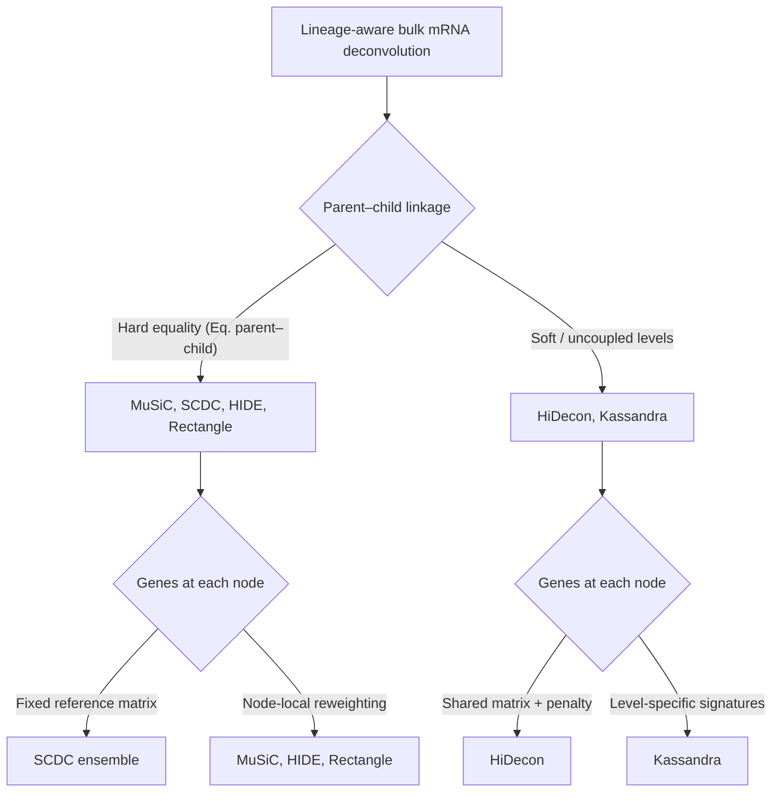
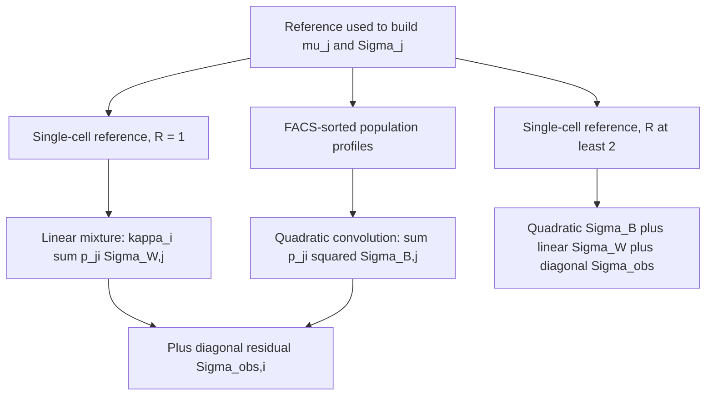
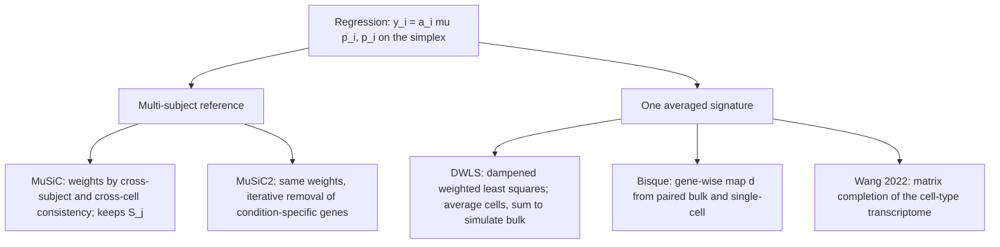
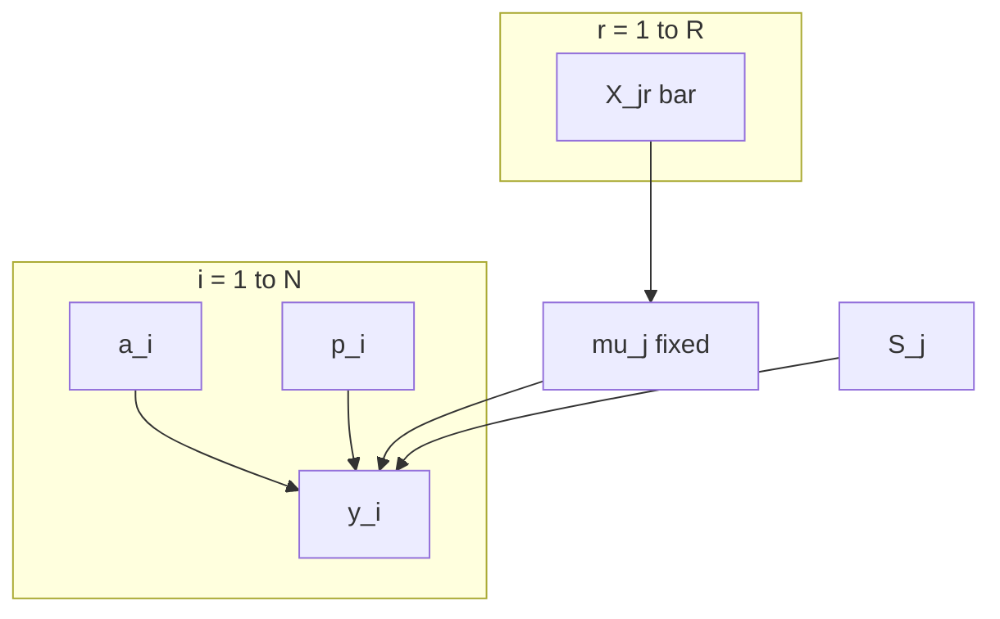
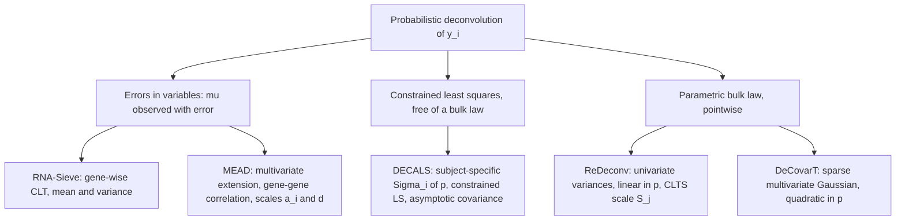
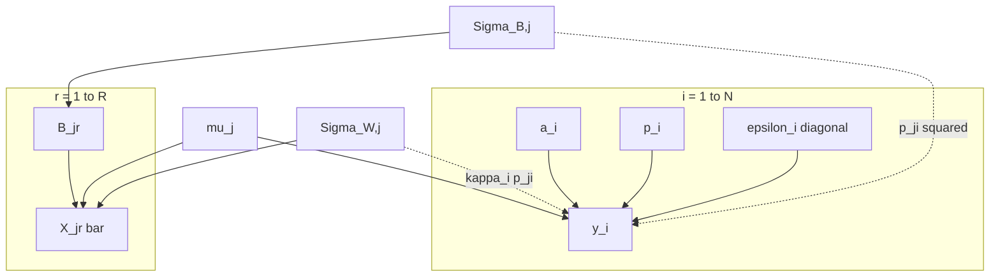
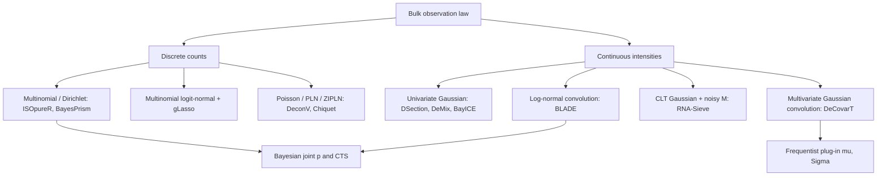
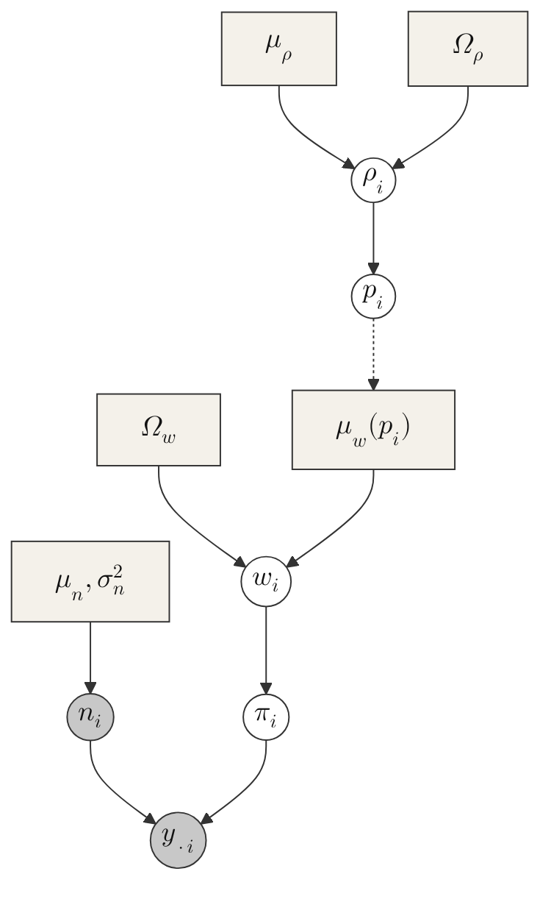

# DeCovarT perspectives

> **Scope**
>
> Outlook on extending DeCovarT beyond the closed-reference Gaussian
> convolution. [Sec. 1](#sec-notation) fixes the index set.
> [Sec. 3](#sec-sc-moments) derives the mean and the three covariance
> layers from single-cell replicates, then compares regression and
> probabilistic engines. Later sections cover Scheffé-type mixture
> structure, alternative observation laws and Bayesian CTS inference,
> sample-level covariates, incomplete references, isoforms, RNA–cell
> uncoupling, weighted / generalised least squares, Firth penalisation
> for few bulk samples, lineage and archetypes, time-resolved
> composition, ensembles, spatial transcriptomics, and multi-omics.
> Compositional reparametrisation is implemented in
> [`additive_logistic()`](https://bastienchassagnol.github.io/DeCovarT/reference/additive_logistic.md)
> and documented numerically in the [derivatives under simplex
> transforms](https://bastienchassagnol.github.io/DeCovarT/articles/theory-decovart-generative-model.md)
> vignette. The same catalogue is tracked in [GitHub issue
> 5](https://github.com/bastienchassagnol/DeCovarT/issues/5).

## Notation

Indices and random objects below are fixed for the rest of this
vignette, including the single-cell extension in
[Sec. 3](#sec-sc-moments). They match the plate diagram in the package
README.

| Symbol | Meaning |
|----|----|
| g=1,\ldots,G | Gene |
| j=1,\ldots,J | Cell type |
| i=1,\ldots,N | Bulk sample |
| r=1,\ldots,R | Independent biological replicate in the single-cell reference |
| c=1,\ldots,C\_{jr} | Cell of type j in replicate r |
| \boldsymbol{y}\_{\cdot i}\in\mathbb{R}^{G} | Bulk profile of sample i |
| \boldsymbol{p}\_{\cdot i}\in\Delta^{J-1} | Cell-number fractions; p\_{ji}\ge 0, \sum_j p\_{ji}=1 |
| \boldsymbol{q}\_{\cdot i} | RNA-mass fractions (see [Sec. 4.5](#sec-uncoupling)) |
| \boldsymbol{\mu}\_{\cdot j}\in\mathbb{R}^{G} | Cross-replicate mean expression of one cell of type j |
| \boldsymbol{X}\_{jrc} | Expression of cell c |
| \boldsymbol{M}\_{jr} | Replicate-specific population mean of type j |
| \boldsymbol{\Sigma}\_{W,j} | Within-replicate cell-to-cell covariance |
| \boldsymbol{\Sigma}\_{B,j} | Between-replicate covariance of \boldsymbol{M}\_{jr} |
| \boldsymbol{\Sigma}\_{\mathrm{obs},i} | Residual bulk noise: diagonal, possibly heteroscedastic, no gene–gene correlation |
| S_j | Mean transcriptome size (RNA content) of type j |
| \boldsymbol{\theta}\_{\cdot j} | Relative abundance inside type j, \sum_g\theta\_{gj}=1, so \boldsymbol{\mu}\_{\cdot j}=S_j\boldsymbol{\theta}\_{\cdot j} |
| a_i\>0 | Sample-wise scale (depth, tissue size). Shared by all genes |
| \boldsymbol{d}\in\mathbb{R}^{G}\_{+} | Optional gene-wise platform scale. Not free inside one bulk fit |

The current DeCovarT convolution ([Eq. 2](#eq-gaussian-convolution)) is
the special case in which each reference is one random population
profile with covariance
\boldsymbol{\Sigma}\_j=\boldsymbol{\Sigma}\_{B,j}, the sample scale is
absorbed into \boldsymbol{y}\_{\cdot i}, and both
\boldsymbol{\Sigma}\_{W,j} and \boldsymbol{\Sigma}\_{\mathrm{obs},i} are
omitted. \boldsymbol{\rho}\_i in the README diagram is the unconstrained
coordinate with \boldsymbol{p}\_{\cdot i}=\psi(\boldsymbol{\rho}\_i) the
soft-max.

Bulk transcriptomic deconvolution is one instance of a **mixture inverse
problem**: a composite signal (tissue expression, a spectrum, a
chromatogram) is observed, and we seek the proportions \boldsymbol{p} of
underlying components. Because \boldsymbol{p} is **compositional**
(parts of a whole), estimates must lie on the simplex
\Delta^{J-1}=\\\boldsymbol{p}\in\[0,1\]^J:\sum_j p_j=1\\. ([Chassagnol
et al. 2023](#ref-chassagnolDeCovarTMultidimensionalProbalistic2023))
model each reference profile as multivariate Gaussian and recover
\boldsymbol{p} by constrained maximum likelihood; classical
deconvolution tools such as `CIBERSORT` assume gene-wise independence
instead ([Newman et al. 2015](#ref-newmanRobustEnumerationCell2015)).

## Mixture design and first-order structure

> **Mixture experiments and compositional data**
>
> DeCovarT—and bulk deconvolution more generally—sits inside the wider
> class of **mixture inverse problems** in formulation science,
> spectroscopy, and designed experiments where component fractions are
> explicit regressors on the simplex. R offers only a handful of
> packages for **designed mixture points** (as opposed to random
> \boldsymbol{p} on \Delta^{J-1}):
>
> - **`AlgDesign`** ([Wheeler 2025](#ref-R-AlgDesign)) — lattice and
>   simplex-centroid mixture designs via `genMixture()` /
>   `gen.mixture()`, plus D-, A-, and I-optimal designs; the closest
>   general substitute for classical mixture DOE.
> - **`skpr`** ([Morgan-Wall and Khoury 2025](#ref-R-skpr)) — optimal
>   mixture designs from a candidate set under \sum_j p_j=1; preferable
>   when optimality criteria matter more than fixed simplex-centroid
>   lattices.
>
> A modular Scheffé-type benchmark would combine `AlgDesign` (or `skpr`)
> to propose \boldsymbol{p}, DeCovarT (or baselines) to invert the
> mixture, and compositional metrics from the simulation vignettes.

In designed mixture experiments (chemistry, food science, formulation),
component proportions are explicit regressors with no free intercept
because \sum_j p_j=1. A Scheffé cubic model for three components reads

y = \beta_1 p_1 + \beta_2 p_2 + \beta_3 p_3 + \beta\_{12} p_1 p_2 +
\beta\_{13} p_1 p_3 + \beta\_{23} p_2 p_3 + \beta\_{123} p_1 p_2 p_3,
\tag{1}

with every p_j\in\[0,1\] and \sum_j p_j=1 ([Brown et al.
2015](#ref-brownGeneralBlendingModels2015); [Aitchison
1982](#ref-aitchisonStatisticalAnalysisCompositional1982)). DeCovarT’s
current release implements only the **first-order** part of
[Eq. 1](#eq-scheffe-cubic) in a probabilistic setting: for cell type j,
reference mean \boldsymbol{\mu}\_j and covariance \boldsymbol{\Sigma}\_j
are given, and the bulk mixture satisfies

\boldsymbol{Y}\mid\boldsymbol{p} \sim \mathcal{N}\\\left(
\sum\_{j=1}^{J} p_j\\\boldsymbol{\mu}\_j,\\ \sum\_{j=1}^{J}
p_j^{2}\\\boldsymbol{\Sigma}\_j \right). \tag{2}

[Eq. 2](#eq-gaussian-convolution) is the Gaussian-convolution likelihood
optimised in
[`deconvolute_ratios()`](https://bastienchassagnol.github.io/DeCovarT/reference/deconvolute_ratios.md);
it extends mean-only linear deconvolution by propagating gene–gene
covariance, not by adding Scheffé interaction monomials.

### Interaction and synergy terms

Synergy or antagonism between components corresponds to **second-order**
terms in [Eq. 1](#eq-scheffe-cubic): a positive \beta\_{12} means the
joint presence of components 1 and 2 raises the response above the
additive prediction \beta_1 p_1+\beta_2 p_2. A natural generative
extension would enrich the mean and, optionally, the covariance:

\mathbb{E}\[\boldsymbol{Y}\] = \sum_j p_j\\\boldsymbol{\mu}\_j +
\sum\_{j\<k} f(p_j,p_k)\\\boldsymbol{\mu}\_{jk} + \cdots, \tag{3}

\boldsymbol{\Sigma}(\boldsymbol{p}) = \sum_j
p_j^{2}\\\boldsymbol{\Sigma}\_j + \sum\_{j\<k}
g(p_j,p_k)\\\boldsymbol{\Sigma}\_{jk} + \cdots, \tag{4}

with f,g often taken as p_j p_k. Allowing \operatorname{Cov}(\boldsymbol
{X}\_j,\boldsymbol{X}\_k)\neq\boldsymbol{0} relaxes DeCovarT’s
independence assumption between components and captures non-additive
mixing. Such a model remains compatible with the same simplex constraint
on \boldsymbol{p} and could still be fitted by constrained MLE, at the
cost of many additional interaction parameters and careful guard against
overfitting.

The present generative framework keeps a **linear** mean map
\boldsymbol{y}=\boldsymbol{\mu}\boldsymbol{p}. When the regression of a
compositional response on Euclidean predictors is itself nonlinear,
flexible simplicial nonparametric models ([Tsagris et al.
2023](#ref-tsagrisFlexibleNonparametricRegression2023)) and folded
\alpha-distributions on the simplex ([Tsagris and Stewart
2020](#ref-tsagrisFoldedModelCompositional2020)) are a natural outlook;
they are not used in the current convolution.

### Lineage-aware hierarchical deconvolution

Flat deconvolution treats every cell type as a sibling on one simplex.
**Hierarchical** methods instead estimate proportions at several
granularities linked by a cell-type tree: broad compartments first, then
closely related subtypes whose mean signatures are collinear at the leaf
level.

We reuse the DeCovarT set-up from the
[article](https://bastienchassagnol.github.io/DeCovarT/article/main.pdf):
gene g=1,\ldots,G; cell type or tree node j; sample i=1,\ldots,N
(independence across i). Slices follow the usual dot notation
(\boldsymbol{\mu}\_{\cdot j}, \boldsymbol{y}\_{\cdot i}).

- \boldsymbol{y}=(y\_{gi})\in\mathbb{R}\_{+}^{G\times N}: bulk
  expression; \boldsymbol{y}\_{\cdot i}\in\mathbb{R}\_{+}^{G} is sample
  i.
- \boldsymbol{\mu}=(\mu\_{gj})\in\mathbb{R}^{G\times J}: mean signature;
  \boldsymbol{\mu}\_{\cdot j}\in\mathbb{R}^{G} is the cross-sample mean
  profile of type j (as in `MuSiC` ([Wang et al.
  2019](#ref-wangBulkTissueCell2019))).
- \boldsymbol{p}=(p\_{ji})\in\\\]0,1\[^{J\times N}: unknown relative
  proportions; \boldsymbol{p}\_{\cdot i}\in\\\]0,1\[^{J} is the
  composition of sample i.

\boldsymbol{y}\_{\cdot i}=\boldsymbol{\mu}\\\boldsymbol{p}\_{\cdot i},
\tag{5}

\sum\_{j=1}^{J} p\_{ji}=1, \qquad p\_{ji}\ge 0 \qquad (i=1,\ldots,N).
\tag{6}

p\_{j,i}=\sum\_{c\in\mathcal{C}(j)} p\_{c,i} \qquad (i=1,\ldots,N).
\tag{7}

At each tree level the bulk mixture satisfies
[Eq. 5](#eq-hierarchical-linear) with each composition on the unit
simplex ([Eq. 6](#eq-simplex-constraint)). For a parent node j with
child set \mathcal{C}(j), coherent hierarchical estimates require
[Eq. 7](#eq-parent-child).

#### Hard versus soft lineage constraints

Despite diverse implementations, hierarchical bulk mRNA deconvolution
methods fall into **two constraint regimes**:

- **Hard constraints** — child lineage ratios are forced to sum exactly
  to the parent estimate ([Eq. 7](#eq-parent-child)). `MuSiC` and `SCDC`
  (tree-guided mode) first fix a parent total \hat{p}\_{j,i}, then fit
  children q\_{c,i} on the within-parent simplex so that
  \hat{p}\_{c,i}=q\_{c,i}\\\hat{p}\_{j,i} ([Wang et al.
  2019](#ref-wangBulkTissueCell2019); [Dong et al.
  2021](#ref-dongSCDCBulkGene2021)). `HIDE` applies the same equality by
  renormalising child estimates after each top-down split ([Völkl et al.
  2025](#ref-voelklHIDEHierarchicalCelltype2025)); `Rectangle`
  propagates coarse cluster fractions as hard bounds on fine-grained
  estimates ([Eder et al. 2026](#ref-ederRectangleRobustScalable2026)).
- **Soft constraints** — parent–child coherence is encouraged but not
  enforced exactly. `HiDecon` adds a squared mismatch penalty to the
  deconvolution loss ([Huang, Cai, Lu, et al.
  2024](#ref-huangAccurateEstimationRare2024)); `Kassandra` trains
  separate predictors at predefined hierarchy levels without an explicit
  parent–child equality ([Zaitsev et al.
  2022](#ref-zaitsevPreciseReconstructionTME2022)).

Hard splitting after fixing the parent ([Eq. 8](#eq-hard-child-split)):

\hat{p}\_{c,i}=q\_{c,i}\\\hat{p}\_{j,i}, \quad q\_{c,i}\ge 0,\\
\sum\_{c\in\mathcal{C}(j)} q\_{c,i}=1. \tag{8}

`HIDE` renormalisation ([Eq. 9](#eq-hide-renorm)):

\hat{p}\_{c,i}\leftarrow \hat{p}\_{c,i}\\
\frac{\hat{p}\_{j,i}}{\sum\_{c'\in\mathcal{C}(j)}\hat{p}\_{c',i}}.
\tag{9}

`HiDecon` soft penalty ([Eq. 10](#eq-soft-penalty)):

\mathcal{L}\_{\mathrm{tot}} = \mathcal{L}\_{\mathrm{deconv}} +
\lambda\sum\_{j}\sum\_{i=1}^{N} \Bigl(
p\_{j,i}-\sum\_{c\in\mathcal{C}(j)} p\_{c,i} \Bigr)^{2}. \tag{10}

Within each regime, methods further differ by whether they reuse a
**single reference signature** at every granularity or **reselect /
reweight genes** locally at each internal node
([Figure 1](#fig-hierarchical-taxonomy)).

Figure 1: Taxonomy of lineage-aware bulk mRNA deconvolution:
parent–child constraint (hard vs soft) and reference-gene strategy
(fixed matrix vs node-local weights).

`xCell` 2.0 ([Angel et al. 2025](#ref-angelXCell20Robust2025)) uses Cell
Ontology ancestry to build signatures and control spillover between
related labels, but its outputs are enrichment scores rather than a
compositional tree; it sits outside the hard/soft fraction taxonomy
above.

| method | constraint | lineage constraint | gene strategy |
|----|----|----|----|
| MuSiC | Hard | Fix \\\hat{p}\_{j,i}\\; \\\hat{p}\_{c,i}=q\_{c,i}\hat{p}\_{j,i}\\, \\\sum_c q\_{c,i}=1\\ | Node-local consistent genes |
| SCDC | Hard (tree-guided) | MuSiC step; \\\hat{p}\_{c,i}=q\_{c,i}\hat{p}\_{j,i}\\ | Full reference; optional node split |
| HIDE | Hard | Fit then renormalise: \\\hat{p}\_{c,i}\leftarrow\hat{p}\_{c,i}\hat{p}\_{j,i}/\sum\_{c'}\hat{p}\_{c',i}\\ | Parent-specific learned weights |
| Rectangle | Hard (multiscale) | Coarse \\\boldsymbol{p}^{(\mathrm{coarse})}\\ bounds fine estimates | Clustered + direct signatures |
| HiDecon | Soft | \\\mathcal{L}\_{\mathrm{tot}}=\mathcal{L}\_{\mathrm{deconv}}+\lambda\sum\_{j,i}(p\_{j,i}-\sum_c p\_{c,i})^2\\ | Shared \$\boldsymbol{\mu}\$; joint penalised fit |
| Kassandra | Soft / uncoupled | Separate models; no parent–child equality | Level-specific trained signatures |
| xCell 2.0 | None (scores) | Ontology spillover control only | Ontology-aware signature generation |

Table 1: Lineage-aware bulk mRNA deconvolution: constraint regime,
enforcing equation, and gene strategy (2019–2026 census).

[Table 1](#tbl-hierarchical-methods) and
[Figure 1](#fig-hierarchical-taxonomy) summarise the landscape aligned
with [Eq. 5](#eq-hierarchical-linear)–[Eq. 7](#eq-parent-child).
**Hard** methods (`MuSiC`, `HIDE`, `Rectangle`) are easier to audit node
by node but inherit upstream bias; **soft** coupling (`HiDecon`) can
stabilise rare subtypes when the tree is credible. **Node-local gene
reweighting** (`MuSiC`, `HIDE`, `Rectangle`) targets collinear siblings;
**fixed or level-specific signatures** (`SCDC`, `Kassandra`) trade
flexibility for simpler reference construction.

A natural DeCovarT extension would combine
[Eq. 2](#eq-gaussian-convolution) with either
[Eq. 8](#eq-hard-child-split) or [Eq. 10](#eq-soft-penalty), node-local
marker panels, and [ALR
optimisation](https://bastienchassagnol.github.io/DeCovarT/articles/theory-decovart-generative-model.html#sec-alr)
when a curated lineage tree is supplied—benchmarked at broad,
intermediate, and terminal resolutions against `HiDecon`, `HIDE`,
tree-guided `MuSiC`, and `Rectangle`. Spatial `HIDF` applies the same
tree idea to spots with an `RCTD` back-end ([Zou et al.
2026](#ref-zouHidfIntegratingTreeStructured2026)); `scDETECT` uses a
lineage prior for differential expression rather than for \boldsymbol{p}
([Xu et al. 2025](#ref-xuScdetectNovelStatisticalModel2025)). Archetypes
and cell states (type versus shared gene-expression programmes) are
taken up in [Sec. 6.1](#sec-archetypes).

## Single-cell moments and population alignment

The signature that enters [Eq. 2](#eq-gaussian-convolution) is a
**population profile**: one mean vector and one covariance per cell
type. Single-cell counts are not that object. This section states how to
build the mean and how the covariance splits, then how to place the
resulting profiles on the same scale as bulk sample i.

Figure 2: Within-sample cell noise, between-replicate biological
covariance, and residual bulk noise.

Figure 3: MuSiC assumptions for library-size normalisation: same
population, conserved cell-size ratios, conserved library-size ratios,
and the stronger A3-prime hypothesis for absolute cell-type fractions.

[Figure 2](#fig-three-variability) is the target decomposition. Panel A
is a purified population profile (quadratic in p\_{ji}). Panel B is one
single-cell reference (linear in p\_{ji}). Panel C is the hierarchical
model once R independent replicates exist.

### Mean: average cells, then average replicates

For a fixed type j, the per-cell mean does not depend on how many cells
were captured. With raw counts on an additive scale,

\bar{\boldsymbol{X}}\_{jr} =
\frac{1}{C\_{jr}}\sum\_{c=1}^{C\_{jr}}\boldsymbol{X}\_{jrc}, \qquad
\hat{\boldsymbol{\mu}}\_{\cdot j} =
\frac{1}{R}\sum\_{r=1}^{R}\bar{\boldsymbol{X}}\_{jr}. \tag{11}

Divide by the **cell count** C\_{jr}, not by the library size.
Library-size weights w_c=L_c/\sum_d L_d are functions of
\boldsymbol{X}\_c itself. Their probability limit is
\boldsymbol{\mu}+\boldsymbol{\Sigma}\mathbf{1}/(\mathbf{1}^{\top}\boldsymbol{\mu}),
so they target an RNA-weighted cell and destroy the exact Gaussian scale
that leaves the precision graph unchanged. Under i.i.d. cells the
arithmetic mean also has the largest effective sample size among
deterministic convex weights.

Pool cells across replicates only after the within-replicate mean. A
replicate with 10\\000 cells must not outweigh a replicate with 500
cells. `MuSiC` is built on that multi-subject split: cross-subject means
and variances, with genes weighted by cross-subject and cross-cell
consistency ([Wang et al. 2019](#ref-wangBulkTissueCell2019)).

When every cell is scaled to a common total, the product
S_j\boldsymbol{\theta}\_{\cdot j} collapses to the arithmetic mean of
the raw counts. `MuSiC` writes the signature as cell size times relative
abundance and then recovers that same per-cell mean. Keep S_j and
\boldsymbol{\theta}\_{\cdot j} as separate factors
([Sec. 3.3](#sec-alignment)). Do not library-weight the raw vectors and
call the result S_j.

> **Warning 1: Summing cells is the wrong signature, and the right
> pseudobulk**
>
> Summing is the correct total for a physical pool of exactly C\_{jr}
> cells, \boldsymbol{T}\_{jr}=\sum_c\boldsymbol{X}\_{jrc}, with mean
> C\_{jr}\boldsymbol{\mu}\_{\cdot j} and covariance
> C\_{jr}\boldsymbol{\Sigma}\_{W,j}. Using \boldsymbol{T}\_{jr} as a
> DeCovarT column inserts the arbitrary capture count into
> \boldsymbol{p}. A type with ten times more reference cells looks ten
> times more abundant.
>
> The same sum is the right input for a different question. Differential
> expression of one cell type across donors needs one count vector per
> donor, then a bulk count model such as `DESeq2` ([Love et al.
> 2014](#ref-loveModeratedEstimationFold2014a)). There the estimand is a
> relative fold change of averaged counts, and the donor is the
> independent unit. Cells from one donor are subsamples. Treating them
> as replicates inflates false discoveries ([Squair et al.
> 2021](#ref-squairConfrontingFalseDiscoveries2021)). That analysis does
> not estimate \boldsymbol{p}\_{\cdot i}.

### Three reference regimes

Write the cell as a sum of a replicate effect and a cell effect,

\boldsymbol{X}\_{jrc} = \boldsymbol{\mu}\_{\cdot
j}+\boldsymbol{B}\_{jr}+\boldsymbol{\varepsilon}\_{jrc}, \tag{12}

with
\boldsymbol{B}\_{jr}\sim\mathcal{N}(\boldsymbol{0},\boldsymbol{\Sigma}\_{B,j})
and
\boldsymbol{\varepsilon}\_{jrc}\sim\mathcal{N}(\boldsymbol{0},\boldsymbol{\Sigma}\_{W,j}),
independent across j given \boldsymbol{p}\_{\cdot i}. The bulk average
per cell in a tissue of N_i cells is

\boldsymbol{A}\_i = \sum_j p\_{ji}(\boldsymbol{\mu}\_{\cdot
j}+\boldsymbol{B}\_{jr(i)}) + \frac{1}{N_i}\sum_j\sum\_{c=1}^{N_i
p\_{ji}}\boldsymbol{\varepsilon}\_{ijc}. \tag{13}

#### FACS-sorted population profiles

Historically the reference was one bulk profile per purified population:
surface-marker sorting, then a pooled microarray or RNA-seq library. The
random object is the whole population vector
\boldsymbol{Z}\_{ij}\sim\mathcal{N}(\boldsymbol{\mu}\_{\cdot
j},\boldsymbol{\Sigma}\_{B,j}), and the bulk is the convolution

\boldsymbol{y}\_{\cdot i} = \sum_j p\_{ji}\boldsymbol{Z}\_{ij}, \qquad
\operatorname{Cov}(\boldsymbol{y}\_{\cdot i}\mid\boldsymbol{p}\_{\cdot
i}) = \sum_j p\_{ji}^{2}\\\boldsymbol{\Sigma}\_{B,j}. \tag{14}

The square appears because one random profile is multiplied by p\_{ji},
not because p\_{ji} cells were added. This is the covariance in
[Eq. 2](#eq-gaussian-convolution). If several types are sorted from the
same donors, cross-type blocks \boldsymbol{\Sigma}\_{B,jk} add terms
p\_{ji}p\_{ki}. Before droplet scRNA-seq, those population profiles came
from FACS- or MACS-purified bulk libraries. Szaniszlo et al. showed that
mixture expression reflects composition and that a minor subset is
recovered only after physical sorting, while also stressing coexpression
among genes inside a purified type ([Szaniszlo et al.
2004](#ref-szaniszloGettingRightCells)). Novershtern et al. profiled 38
marker-defined haematopoietic populations and used coexpression modules
plus promoter *cis*-circuits as the gene–gene structure of each state
([Novershtern et al.
2011](#ref-novershternDenselyInterconnectedTranscriptional2011)). Those
studies are the historical FACS reference that
[Eq. 14](#eq-facs-quadratic) still describes.

#### One single-cell replicate (R=1)

R=1 identifies \boldsymbol{M}\_{j1} and \boldsymbol{\Sigma}\_{W,j}. It
does not identify \boldsymbol{\Sigma}\_{B,j}: extra cells shrink
\boldsymbol{\Sigma}\_{W,j}/C\_{j1} and leave the single draw
\boldsymbol{B}\_{j1} untouched. The coherent bulk covariance is the
**mixture / physical sum**, linear in p\_{ji}:

\operatorname{Cov}(\boldsymbol{A}\_i\mid\boldsymbol{p}\_{\cdot i}) =
\kappa_i\sum_j p\_{ji}\\\boldsymbol{\Sigma}\_{W,j} +
\boldsymbol{\Sigma}\_{\mathrm{obs},i}. \tag{15}

Here \kappa_i is an effective cells-per-bulk scale. The ideal value is
1/N_i. The number of reference cells C\_{j1} is not N_i. A finite-cell
reference mean adds a separate quadratic term \sum_j
p\_{ji}^{2}\boldsymbol{\Sigma}\_{W,j}/C\_{j1}. That term is Monte Carlo
error of \hat{\boldsymbol{\mu}}\_{\cdot j}, not biological between-donor
covariance. Do not drop \boldsymbol{\Sigma}\_{W,j} into the p\_{ji}^{2}
slot of [Eq. 2](#eq-gaussian-convolution).

For a rare type, p\_{ji}=0.01 makes p\_{ji}^{2} a hundred times smaller
than p\_{ji}. A within-cell covariance placed in the quadratic slot is
almost silenced.

#### Enough biological replicates

The smallest R that identifies a variance component is R\ge 2. The
replicate means satisfy

\bar{\boldsymbol{X}}\_{jr} \sim \mathcal{N}\\\left(
\boldsymbol{\mu}\_{\cdot j},\\
\boldsymbol{\Sigma}\_{B,j}+\frac{\boldsymbol{\Sigma}\_{W,j}}{C\_{jr}}
\right). \tag{16}

A method-of-moments contrast is then available. Let
\boldsymbol{S}\_{B,j} be the sample covariance of
\\\bar{\boldsymbol{X}}\_{jr}\\\_{r=1}^{R} and \bar{C}\_j a typical cell
count. Then

\mathbb{E}\[\boldsymbol{S}\_{B,j}\] = \boldsymbol{\Sigma}\_{B,j} +
\overline{\boldsymbol{\Sigma}\_{W,j}/C\_{jr}}, \tag{17}

so
\hat{\boldsymbol{\Sigma}}\_{B,j}=\boldsymbol{S}\_{B,j}-\widehat{\boldsymbol{\Sigma}}\_{W,j}/\bar{C}\_j,
projected onto the positive semidefinite cone. An unstructured G\times G
covariance has G(G+1)/2 free entries. Transcriptome-scale G makes that
matrix unestimable for the R of a normal single-cell study. What R\ge 2
buys is the **scalar separation** of the two layers, or a sparse
precision for \boldsymbol{\Sigma}\_{B,j}, not a dense G\times G matrix.
Reference cohorts in current single-cell deconvolution are small; `MEAD`
states this explicitly ([Xie and Wang
2023](#ref-xieRobustStatisticalInference2023)). Cells from one donor
share genetic and environmental background, so they are subsamples
rather than independent biological units. Zimmerman, Espeland and
Langefeld document that dependence across cell types, and they treat
donor as the random effect when contrasting conditions ([Zimmerman et
al. 2021](#ref-zimmermanPracticalSolutionPseudoreplication2021)). That
within-versus-between split is the same hierarchy as
\boldsymbol{\Sigma}\_{W,j} versus \boldsymbol{\Sigma}\_{B,j} when a
single-cell reference is aligned with bulk.

With that split, the bulk law DeCovarT should use is

\boldsymbol{y}\_{\cdot i}\mid\boldsymbol{p}\_{\cdot i} \sim
\mathcal{N}\\\Big( a_i\sum_j p\_{ji}\boldsymbol{\mu}\_{\cdot j},\\
\sum_j p\_{ji}^{2}\\\boldsymbol{\Sigma}\_{B,j} + \kappa_i\sum_j
p\_{ji}\\\boldsymbol{\Sigma}\_{W,j} +
\boldsymbol{\Sigma}\_{\mathrm{obs},i} \Big). \tag{18}

\boldsymbol{\Sigma}\_{\mathrm{obs},i} is diagonal. Gene–gene correlation
is already inside \boldsymbol{\Sigma}\_{B,j} and
\boldsymbol{\Sigma}\_{W,j}. Heteroscedastic diagonal entries are
allowed. Off-diagonal residual correlation would double-count the
network.

Figure 4: Which covariance terms are identified from the reference
design. FACS profiles supply only the quadratic layer. One single-cell
replicate supplies only the linear layer. R at least 2 separates both,
plus a diagonal bulk residual.

### Aligning reference profiles with bulk sample i

[Eq. 11](#eq-mean-two-stage) is a per-cell mean. Bulk sample i is a
library. Three scales sit between them. Only two belong inside the
estimator.

**Sample scale a_i.** On an absolute molecule scale,
\boldsymbol{y}\_{\cdot i}=a_i\boldsymbol{\mu}\boldsymbol{p}\_{\cdot i}
plus noise. a_i absorbs cell number, sequencing depth, and capture. It
is one positive number per bulk sample. Profile it out, or estimate it
jointly with \boldsymbol{p}\_{\cdot i}. It is not a biological
composition parameter.

**Cell size S_j.** RNA content differs by cell type, so

\boldsymbol{y}\_{\cdot i} = a_i\sum_j p\_{ji}
S_j\boldsymbol{\theta}\_{\cdot j} + \boldsymbol{\varepsilon}\_i.
\tag{19}

`MuSiC` states the same product: cell fraction, average cell size,
relative abundance ([Wang et al. 2019](#ref-wangBulkTissueCell2019)). If
S_j is measured, insert it. Do not re-estimate it. Free S_j and
\boldsymbol{p}\_{\cdot i} are not separately identifiable from
\boldsymbol{y}\_{\cdot i} alone, because only the products p\_{ji}S_j
enter [Eq. 19](#eq-music-mean). The RNA fraction

q\_{ji} = \frac{p\_{ji}S_j}{\sum_k p\_{ki}S_k} \tag{20}

is what a normalised bulk identifies. \boldsymbol{q}\_{\cdot
i}=\boldsymbol{p}\_{\cdot i} when S_j is constant across j. That
constant-efficiency hypothesis is assumption A3' of `MuSiC`: the ratio
of average library size equals the ratio of average cell size,
equivalently a common capture efficiency \gamma_j=L_j/S_j
([Figure 3](#fig-music-assumptions)). Under A3', the arithmetic mean
across cells is the right signature and the fitted weights are cytometry
fractions. If A3' fails, the fitted weights are RNA fractions and a
later division by S_j ([Eq. 27](#eq-rna-to-cell)) is required.

`EPIC` and `quanTIseq` apply that division **after** a linear fit, using
an external RNA-content assay, so the optimiser itself returns
transcriptomic ratios ([Racle et al.
2017](#ref-racleSimultaneousEnumerationCancer2017); [Finotello et al.
2019](#ref-finotello_etal19)). `MMAD` estimates the extraction
efficiencies inside a non-linear conjugate-gradient step ([Liebner et
al. 2014](#ref-liebnerMMADMicroarrayMicrodissection2014)). `ReDeconv`
keeps transcriptome size in the reference by Count-based Linearised
Transcriptome Size (CLTS) normalisation, instead of dividing every cell
by its own total ([Lu et al.
2025](#ref-luTranscriptomeSizeMatters2025)).

**Gene-wise scale \boldsymbol{d}.** A platform shift can be
gene-specific, y\_{gi}\approx d_g a_i\sum_j p\_{ji}\mu\_{gj}. `Bisque`
learns such a map from paired bulk and single-cell measurements when
technical variation between the two assays is large ([Jew et al.
2020](#ref-jewAccurateEstimationCell2020)). Fitting \\d_g\\ on the same
bulk sample that is being deconvolved lets the scale absorb any
residual, and \boldsymbol{p}\_{\cdot i} is then unidentified. Estimate
\boldsymbol{d} on an external paired cohort, or do not estimate it.

#### Normalisation that preserves the linear mixture

The moment identities above are for **raw counts on an additive scale**.
They do not survive a logarithm: \log\boldsymbol{y}\_{\cdot i} is not
\sum_j p\_{ji}\log\boldsymbol{\mu}\_{\cdot j}.

The comparison DeCovarT needs is the **same gene on two technologies**,
not two genes inside one sample. Gene length is a property of the assay.
It cancels for a within-gene contrast and should not be divided out of
the reference unless the bulk was length-normalised in the same way.
`ReDeconv` treats length as a bulk-only TPM/RPKM correction and leaves
UMI single-cell counts uncorrected for length ([Lu et al.
2025](#ref-luTranscriptomeSizeMatters2025)).

| Procedure | What it estimates | Use for \boldsymbol{\mu}\_{\cdot j} |
|----|----|----|
| Arithmetic mean of raw counts | Per-cell mean | Default signature |
| CPM / CP10K | Library-size relative profile | Erases S_j |
| TPM / RPKM / FPKM | Length-adjusted composition | Breaks cross-platform per-gene alignment |
| TMM (`edgeR`) or median-of-ratios (`DESeq2`) | Effective library size for differential expression | Donor-level DE, not the signature ([Robinson et al. 2010](#ref-robinsonEdgeRBioconductorPackage2010); [Love et al. 2014](#ref-loveModeratedEstimationFold2014a)) |
| `SCTransform` | Regularised negative-binomial residuals | Clustering and integration, not an additive mixture mean ([Hafemeister and Satija 2019](#ref-hafemeisterNormalizationVarianceStabilization2019)) |
| CLTS (`ReDeconv`) | Counts rescaled by a linearised transcriptome size | Keeps S_j for deconvolution ([Lu et al. 2025](#ref-luTranscriptomeSizeMatters2025)) |

CPM and CP10K divide by the cell total. That is a relative profile
\boldsymbol{\theta}\_{\cdot j} with S_j discarded. TMM and the `DESeq2`
size factor answer a different question: an effective depth for
between-sample differential expression, under a hypothesis that most
genes are stable ([Robinson et al.
2010](#ref-robinsonEdgeRBioconductorPackage2010); [Love et al.
2014](#ref-loveModeratedEstimationFold2014a)). `SCTransform` models
depth inside a negative binomial; the residuals are not an additive
convolution mean ([Hafemeister and Satija
2019](#ref-hafemeisterNormalizationVarianceStabilization2019)).

### Tracks for a three-layer DeCovarT

Released DeCovarT is the FACS convolution: quadratic
\boldsymbol{\Sigma}\_{B,j}, no \boldsymbol{\Sigma}\_{W,j}, no
\boldsymbol{\Sigma}\_{\mathrm{obs},i}. The extension in
[Eq. 18](#eq-three-layer) adds the two missing layers and the scales a_i
and S_j. Second-generation methods already implement pieces of that
programme. The same symbols are used below. a_i is their sample scale,
S_j their cell size, \boldsymbol{d} their gene-wise platform factor.

#### Regression engines

These methods treat \boldsymbol{\mu} as fixed once it has been averaged,
and solve a simplex-constrained linear regression. They do not put a
sampling law on \boldsymbol{y}\_{\cdot i}.

Figure 5: Regression-based single-cell deconvolution. All five methods
share a linear mean and a simplex constraint. They split on how the
reference is weighted and how the bulk is aligned.

**Reference uncertainty.** `MuSiC` down-weights genes whose
cross-subject variance is large relative to their cross-cell variance,
which is an empirical stand-in for \boldsymbol{\Sigma}\_{B,j} versus
\boldsymbol{\Sigma}\_{W,j} ([Wang et al.
2019](#ref-wangBulkTissueCell2019)). `MuSiC2` keeps that weighting and
iteratively removes genes that are differentially expressed between the
reference condition and the bulk condition ([Fan et al.
2022](#ref-fanMusic2CellTypeDeconvolution2022)). `DWLS` averages cells
to form \boldsymbol{\mu}\_{\cdot j} and dampens high-leverage genes; the
artificial bulk used for weighting is a **sum** of single-cell profiles,
which matches [Note 1](#nte-sum-versus-mean). `Bisque` reduces
single-cell noise by aggregating to a pseudobulk before learning
\boldsymbol{d} ([Jew et al. 2020](#ref-jewAccurateEstimationCell2020)).
The 2022 matrix-completion preprint reconstructs the
cell-type-resolution transcriptome rather than a single
\boldsymbol{\mu}\_{\cdot j}; it is a bulk completion method, not a
covariance model ([Wang et al.
2022](#ref-wangAccurateEstimationCelltype2022)). None of these five
returns \boldsymbol{\Sigma}\_{W,j} as a linear mixture weight. `RCTD` is
the spatial analogue for reference uncertainty: it learns cell-type
profiles from scRNA-seq, then decomposes spatial mixtures while
correcting platform scale ([Cable et al.
2022](#ref-cableRobustDecompositionCell2022a)).

**Alignment.** `MuSiC` and `MuSiC2` keep S_j inside the design and use a
sample-level normalisation so that a_i does not have to be a free
parameter ([Wang et al. 2019](#ref-wangBulkTissueCell2019); [Fan et al.
2022](#ref-fanMusic2CellTypeDeconvolution2022)). `Bisque` is the
explicit \boldsymbol{d} method, estimated from the pairing of assays,
not from the bulk sample alone ([Jew et al.
2020](#ref-jewAccurateEstimationCell2020)). `DWLS` inherits whatever
scale the averaged signature was built on ([Tsoucas et al.
2019](#ref-tsoucasAccurateEstimationCelltype2019)). CLTS is the
normalisation that matches [Eq. 19](#eq-music-mean); CPM does not ([Lu
et al. 2025](#ref-luTranscriptomeSizeMatters2025)).

**Generative model and estimation.** The observation equation is
ordinary or weighted least squares,

\hat{\boldsymbol{p}}\_{\cdot i} =
\arg\min\_{\boldsymbol{p}\in\Delta^{J-1}} \\\boldsymbol{y}\_{\cdot
i}-a_i\boldsymbol{\mu}\boldsymbol{p}\\^{2}\_{W}, \tag{21}

with W a diagonal gene-weight matrix. There is no likelihood, so there
is no Fisher information for \boldsymbol{p}\_{\cdot i}. Interval
estimates, where they exist, come from resampling subjects (`MuSiC`) or
from the regression sandwich, not from a Gaussian convolution.
Assumptions shared by the family: additive scale, fixed library size
after normalisation, \boldsymbol{\mu} independent of
\boldsymbol{p}\_{\cdot i}, and no residual gene–gene covariance inside
the loss.

Figure 6: Plate diagram for a regression engine. Reference replicates
are collapsed to a fixed signature before the bulk plate is fitted.

#### Probabilistic engines, set against DeCovarT

`RNA-Sieve` and `MEAD` are errors-in-variables models: the design
\boldsymbol{\mu} is observed with error, and a regression that ignores
that error is attenuated ([Erdmann-Pham et al.
2021](#ref-erdmann-phamLikelihoodbasedDeconvolutionBulk2021); [Xie and
Wang 2023](#ref-xieRobustStatisticalInference2023)). `DECALS` keeps a
subject-specific covariance but estimates \boldsymbol{p}\_{\cdot i} by
constrained least squares, with an asymptotic covariance that does not
require a Gaussian bulk ([Cai et al.
2024](#ref-caiStatisticalInferenceCelltype2024)). `ReDeconv` and
DeCovarT both put a parametric law on the bulk pointwise, not only in
the large-gene limit. They differ in the law and in the dependence on
\boldsymbol{p}\_{\cdot i}.

`DECALS` and `MEAD` are cited from the second-generation literature
([Cai et al. 2024](#ref-caiStatisticalInferenceCelltype2024); [Xie and
Wang 2023](#ref-xieRobustStatisticalInference2023)), as are `RNA-Sieve`
and `ReDeconv` ([Erdmann-Pham et al.
2021](#ref-erdmann-phamLikelihoodbasedDeconvolutionBulk2021); [Lu et al.
2025](#ref-luTranscriptomeSizeMatters2025)).

Figure 7: Probabilistic deconvolution split by how the bulk law depends
on p. RNA-Sieve and MEAD share an errors-in-variables design. DECALS
uses constrained least squares. ReDeconv and DeCovarT are parametric,
univariate mixture versus sparse multivariate convolution.

**Reference uncertainty.** `RNA-Sieve` estimates a per-gene mean and
variance from the reference cells and treats both the reference moments
and the bulk as noisy. The marginal law of a random cell is a mixture;
the bulk, as a sum of many cells, is handled by a central-limit normal
likelihood. Dependence across genes is not a full
\boldsymbol{\Sigma}\_{W,j} ([Erdmann-Pham et al.
2021](#ref-erdmann-phamLikelihoodbasedDeconvolutionBulk2021)). `MEAD` is
the multivariate extension: the reference enters as a noisy design,
gene–gene correlation is retained, and the model allows a sample scale
and a gene-wise scale ([Xie and Wang
2023](#ref-xieRobustStatisticalInference2023)). `DECALS` estimates
cell-type-specific covariances from the bulk residuals themselves,
because \operatorname{Cov}(\boldsymbol{y}\_{\cdot i}) depends on
\boldsymbol{p}\_{\cdot i}, and then builds a subject-specific
\boldsymbol{\Sigma}\_i ([Cai et al.
2024](#ref-caiStatisticalInferenceCelltype2024)). It argues that the
sandwich covariance used for `MEAD` does not consistently estimate that
subject-specific matrix. `ReDeconv` uses a per-gene, per-type variance
with linear weight p\_{ji}, which is the diagonal of
[Eq. 15](#eq-linear-within), together with CLTS so that S_j is not
normalised away ([Lu et al. 2025](#ref-luTranscriptomeSizeMatters2025)).
DeCovarT estimates a sparse precision per type and inserts it only as
\boldsymbol{\Sigma}\_{B,j}.

**Alignment.** `RNA-Sieve` rescales genes so that reference and bulk
live on a comparable relative scale; the scale is not a free
\boldsymbol{d} inside the simplex fit. `MEAD` writes
\boldsymbol{y}\_{\cdot
i}=a_i\operatorname{diag}(\boldsymbol{d})\boldsymbol{X}\_i\boldsymbol{p}\_{\cdot
i}+\boldsymbol{\varepsilon}\_i and gives identifiability conditions
under which \boldsymbol{p}\_{\cdot i} survives an arbitrary
\boldsymbol{d}. Those conditions are structural constraints on the
signature, not “more bulk samples”. This matches the warning in
[Sec. 3.3](#sec-alignment). `ReDeconv` is the method that refuses CP10K
precisely because it erases S_j ([Lu et al.
2025](#ref-luTranscriptomeSizeMatters2025)).

**Generative model.**

Figure 8: Plate diagram for the three-layer extension of DeCovarT.
Replicate plate r supplies Sigma_B and Sigma_W. Bulk plate i carries
a_i, p_i, and a diagonal residual.

|  | Design error | Bulk law | Weight of type covariance | Scale | Estimator |
|----|----|----|----|----|----|
| `RNA-Sieve` | Yes, gene-wise | Asymptotic normal, genes separate | Variance, not a precision matrix | Relative rescaling | Maximum likelihood, asymptotic regions |
| `MEAD` | Yes, multivariate | Moment conditions, not a full density | Gene–gene correlation retained | a_i and \boldsymbol{d}, with identifiability conditions | Errors-in-variables estimator, delta-method intervals |
| `DECALS` | Through \boldsymbol{\Sigma}\_i(\boldsymbol{p}) | None | Subject-specific \boldsymbol{\Sigma}\_i built from cell-type blocks | Absorbed before regression | Constrained least squares, asymptotic covariance |
| `ReDeconv` | No | Univariate parametric, pointwise | Linear in p\_{ji} | CLTS keeps S_j | Variance-aware regression |
| DeCovarT now | No | Sparse multivariate normal, pointwise | Quadratic in p\_{ji} | a_i profiled, S_j not in the likelihood | Constrained maximum likelihood |
| DeCovarT in [Eq. 18](#eq-three-layer) | Only via \boldsymbol{\Sigma}\_{W,j}/C\_{jr} | Same normal family | Quadratic \boldsymbol{\Sigma}\_{B,j} plus linear \boldsymbol{\Sigma}\_{W,j} plus diagonal \boldsymbol{\Sigma}\_{\mathrm{obs},i} | a_i outside, S_j in the mean | Constrained maximum likelihood |

`RNA-Sieve` and DeCovarT both obtain a normal bulk from a sum of random
contributions. `RNA-Sieve` sums **cells** (linear variances, central
limit, gene by gene). DeCovarT convolves **population profiles**
(quadratic covariances, exact Gaussian, sparse precision). `MEAD` keeps
the multivariate second-moment structure that `RNA-Sieve` drops, and
adds the platform scales. `DECALS` wants the same subject-specific
covariance but will not commit to a density; the price is a
least-squares point estimate whose efficiency depends on how well
\boldsymbol{\Sigma}\_i is estimated. `ReDeconv` is the univariate,
mixture-weighted cousin of the linear term in [Eq. 18](#eq-three-layer).

The practical fork is the reference design, not a choice of optimiser.

- **R=1.** Fit [Eq. 15](#eq-linear-within). Report
  \boldsymbol{q}\_{\cdot i} unless S_j is known, in which case apply
  [Eq. 27](#eq-rna-to-cell) or insert S_j in [Eq. 19](#eq-music-mean).
  Do not publish \boldsymbol{\Sigma}\_{W,j} as a DeCovarT
  \boldsymbol{\Sigma}\_j.
- **R\ge 2 with a sparse or low-rank between-replicate precision.** Fit
  [Eq. 18](#eq-three-layer). The original quadratic term is then
  \boldsymbol{\Sigma}\_{B,j} and has a sampling interpretation.
  \boldsymbol{\Sigma}\_{\mathrm{obs},i} stays diagonal.

## Statistical perspectives

The present estimator is a **closed-reference, continuous, frequentist**
convolution: \boldsymbol{\mu}\_{\cdot j} and \boldsymbol{\Sigma}\_{j}
are plug-in moments, and only \boldsymbol{p}\_{\cdot i} is unknown. The
subsections below change the observation law, the reference, or the
loss, while keeping the simplex constraint
([Eq. 6](#eq-simplex-constraint)).

### Alternative distributions

Split first by the **support of \boldsymbol{y}** (integer counts versus
continuous intensities), then by **frequentist plug-in versus Bayesian
joint inference** of \boldsymbol{p}\_{\cdot i} and sample-level
cell-type-specific (CTS) profiles \boldsymbol{x}\_{\cdot j,i}.

Figure 9: Taxonomy of observation models for bulk deconvolution,
relative to DeCovarT’s multivariate Gaussian convolution.

#### Discrete counts

A multinomial (or Dirichlet–multinomial) model treats
\boldsymbol{y}\_{\cdot i} as integer reads that sum to a library size.
`ISOpureR` implements a hierarchical multinomial–Dirichlet purification
of mixed tumour profiles ([Anghel et al.
2015](#ref-anghelISOpureRImplementationComputational2015)). `BayesPrism`
places a multinomial likelihood on bulk counts with a patient-derived
scRNA-seq prior and jointly infers \boldsymbol{p}\_{\cdot i} and
sample-level CTS expression ([Chu et al.
2022](#ref-chuCellTypeGeneExpression2022)). `DeconV` instead uses
Poisson aggregation from single-cell to bulk (sums of independent
Poissons remain Poisson) and returns interval estimates of
\boldsymbol{p}\_{\cdot i} ([Gynter et al.
2023](#ref-gynterDeconvProbabilisticCellType2023)).

Over-dispersed, correlated counts are the domain of the multivariate
**Poisson–log-normal (PLN)** family: a latent Gaussian vector induces
dependence, and a Poisson observation layer yields integer reads
([Chiquet et al. 2021](#ref-chiquetPoissonLognormalModelVersatile2021),
[2018](#ref-chiquetVariationalInferenceSparse2018)). **ZIPLN** adds a
Bernoulli zero-inflation layer for dropout ([Batardière et al.
2025](#ref-batardiereZeroInflationMultivariatePoisson2025)). A
DeCovarT-style extension would replace [Eq. 2](#eq-gaussian-convolution)
by a PLN (or ZIPLN) convolution on the latent log-abundance scale,
keeping the ALR map on \boldsymbol{p}. A multinomial **logit-normal** on
the *gene* simplex is a different discrete model: it is compositional
association, not a cell-type convolution
([Sec. 4.1.3](#sec-logit-normal-compositional)).

#### Continuous intensities: frequentist versus Bayesian CTS

DeMixT (and DeMix) is the closest published **convolution** to DeCovarT:
a frequentist Gaussian mixture of observed and latent components, but
with **independent genes** and an unknown tumour or stromal profile
([Wang et al.
2018](#ref-wangTranscriptomeDeconvolutionHeterogeneous2018); [Ahn et al.
2013](#ref-ahnDeMixDeconvolutionMixed2013)). DSection is a **Bayesian**
univariate convolution (Normal / Gamma / Dirichlet priors and a
Gibbs–Metropolis sampler) ([Erkkilä et al.
2010](#ref-erkkilaProbabilisticAnalysisGene2010)). DeCovarT is
frequentist, closed-reference, and **multivariate**: plug-in
(\boldsymbol{\mu},\\\boldsymbol{\Sigma}\_{j}\\), no unknown extra
component, and a gene–gene residual network inside each
\boldsymbol{\Sigma}\_{j}.

`RNA-Sieve` is a supervised likelihood, but not that convolution
([Erdmann-Pham et al.
2021](#ref-erdmann-phamLikelihoodbasedDeconvolutionBulk2021)). Their M,
\alpha and b are DeCovarT’s \boldsymbol{\mu}, \boldsymbol{p} and
\boldsymbol{y}. The bulk is modelled as the sum of n cells with a
*gene-wise* central-limit Gaussian, plus measurement error in M
(errors-in-variables). Genes are independent. Wald regions use the
inverse Fisher information, or the Godambe sandwich under protocol
shift. DeCovarT instead uses a full \boldsymbol{\Sigma}(\boldsymbol{p})
and plug-in moments; the resampling counterpart of noisy M is
[`reference_bootstrap_decovart()`](https://bastienchassagnol.github.io/DeCovarT/reference/reference_bootstrap_decovart.md).
A side-by-side comparison is in the [MLE properties
vignette](https://bastienchassagnol.github.io/DeCovarT/articles/theory-DeCovarT-MLE-properties.html#sec-rna-sieve).

`BLADE` replaces the Gaussian with a **gene-wise log-normal**
convolution, jointly purifying CTS profiles by variational inference
([Andrade Barbosa et al.
2021](#ref-andrade-barbosaBayesianLogNormalDeconvolution2021)). `bMIND`
estimates sample-level CTS with an scRNA-seq-derived prior ([Wang et al.
2020](#ref-wangBayesianEstimationCelltypespecific2020)). The
experimental MAP path in `R/03_04_DeCovarT_estimate_CTS_MAP_Bayesian.R`
is the corresponding DeCovarT starting point: recover
\boldsymbol{x}\_{\cdot j,i} given \boldsymbol{y}\_{\cdot i} and
\boldsymbol{p}\_{\cdot i} under [Eq. 2](#eq-gaussian-convolution) rather
than under independent genes.

Zhang et al. benchmark joint \boldsymbol{p} + CTS engines and report
**BayesPrism with DWLS gene weights** as the strongest combination on
pseudobulk and real bulk data ([Zhang et al.
2026](#ref-zhangIntegratedInferenceCellularCompositions2026)). That is a
weighted-likelihood analogue of [Sec. 4.6](#sec-robust-gls).

#### Two simplices without convolution

McGregor et al. model a count vector of D features as **compositional**,
not as a mixture of cell-type Gaussians ([McGregor et al.
2026](#ref-mcgregorProportionalitybasedAssociationMetrics2026)). In
DeCovarT notation the features are the G genes. Sample i has library
size n_i and gene composition \boldsymbol{\pi}\_i\in\Delta^{G-1}. The
observation is multinomial,

\boldsymbol{y}\_{\cdot i}\mid n_i,\boldsymbol{\pi}\_i
\sim\mathrm{Multinomial}(n_i,\boldsymbol{\pi}\_i), \qquad
n_i\sim\mathrm{LogNormal}(\mu_n,\sigma_n^2), \tag{22}

with n_i\perp\boldsymbol{\pi}\_i (read depth is treated as a technical
scale). The composition is logit-normal on the ALR chart that uses gene
G as the reference,

\boldsymbol{w}\_i =\mathrm{alr}(\boldsymbol{\pi}\_i)
=\log(\pi\_{1,i}/\pi\_{G,i},\ldots,\pi\_{G-1,i}/\pi\_{G,i}), \qquad
\boldsymbol{w}\_i\sim\mathcal{N}\_{G-1}(\boldsymbol{\mu}\_w,\boldsymbol{\Sigma}\_w),
\qquad \boldsymbol{\pi}\_i=\psi(\boldsymbol{w}\_i), \tag{23}

where \psi is the additive logistic map already used for cell-type
ratios
([`additive_logistic()`](https://bastienchassagnol.github.io/DeCovarT/reference/additive_logistic.md)).
When G is large relative to the number of bulk samples, McGregor et
al. penalise the Gaussian log-likelihood of the \boldsymbol{w}\_i with a
graphical lasso on the ALR precision
\boldsymbol{\Omega}\_w=\boldsymbol{\Sigma}\_w^{-1} ([Friedman et al.
2008](#ref-friedmanSparseInverseCovariance2008)), or the same \ell_1
penalty on the CLR precision
(\mathbf{G}^{\mathsf{T}}\boldsymbol{\Sigma}\_w\mathbf{G})^{-1}. That
shrinks spurious gene–gene partial correlations. Their target is
proportionality (\phi, \rho, log-ratio variances) on the latent
\boldsymbol{\pi}\_i, because empirical log-ratios of raw counts are
biased by variation in n_i.

This is **not** DeCovarT’s convolution
([Eq. 2](#eq-gaussian-convolution)). There is no mixing \sum_j
p_j\boldsymbol{\mu}\_j of purified profiles, and no
\boldsymbol{\Sigma}(\boldsymbol{p})=\sum_j p_j^2\boldsymbol{\Sigma}\_j.
Current DeCovarT treats \boldsymbol{y}\_{\cdot i} as an unbounded
continuous intensity. Library size is omitted: the counts are not
constrained to sum to n_i.

A fully compositional deconvolution would keep **two** simplices. Cell
ratios \boldsymbol{p}\_i\in\Delta^{J-1} stay on the existing ALR chart
\boldsymbol{\rho}\_i=\mathrm{alr}(\boldsymbol{p}\_i). Gene composition
stays on [Eq. 23](#eq-mln-alr). The two can be coupled by a regression
of the gene-ALR mean on \boldsymbol{p}\_i, for example
\boldsymbol{\mu}\_w(\boldsymbol{p}\_i)=\mathbf{B}\boldsymbol{p}\_i,
still without forming a Gaussian convolution of cell-type covariances.
[Figure 10](#fig-mln-dag) is that joint directed graph: grey circles are
observed, white circles are latent, squares are parameters.

Figure 10: Directed graph for a logit-normal multinomial gene
composition (McGregor et al.) extended with a second simplex for
cell-type ratios. Grey circles are observed. White circles are latent.
Squares are parameters. The dashed arrow from p_i into mu_w is the
optional deconvolution link; it is not a Gaussian convolution of
Sigma_j.

### Sample-level covariates

A condition, tissue, batch, sex or age vector \boldsymbol{z}\_{i} is
indexed by sample i, whereas \boldsymbol{\mu} has genes in rows and cell
types in columns. Covariates therefore cannot be appended as extra
columns of the signature. Two generative extensions are distinct ([Fan
et al. 2022](#ref-fanMusic2CellTypeDeconvolution2022)).

**State model.** Condition alters the reference distribution,

\boldsymbol{x}\_{\cdot j,i}\mid\boldsymbol{z}\_{i} \sim\mathcal{N}\_G
\bigl(\boldsymbol{\mu}\_{j}(\boldsymbol{z}\_{i}),\boldsymbol{\Sigma}\_{j}(\boldsymbol{z}\_{i})\bigr),
\tag{24}

for example
\boldsymbol{\mu}\_{j}(\boldsymbol{z}\_{i})=\boldsymbol{\mu}\_{j}+B\_{j}\boldsymbol{z}\_{i}.
The bulk law is then [Eq. 2](#eq-gaussian-convolution) with those
condition-dependent moments. `MuSiC2` addresses the same mismatch by
iteratively dropping cell-type-specific DE genes between the bulk
condition and the scRNA-seq reference; it remains closed-reference and
cannot invent novel types ([Fan et al.
2022](#ref-fanMusic2CellTypeDeconvolution2022)).

**Composition model.** Condition alters \boldsymbol{p}\_{\cdot i}
through the existing ALR coordinates \boldsymbol{\rho}\_{i},

\boldsymbol{\rho}\_{i}=B\boldsymbol{z}\_{i}+\boldsymbol{u}\_{i}, \qquad
\boldsymbol{p}\_{\cdot i}=\psi(\boldsymbol{\rho}\_{i}), \tag{25}

with \psi the [additive logistic
map](https://bastienchassagnol.github.io/DeCovarT/articles/theory-decovart-generative-model.html#eq-alr-maps).
This is the setting in which a future
[`predict()`](https://rdrr.io/r/stats/predict.html) method on new
\boldsymbol{z} would be meaningful.

A known sequencing exposure s\_{i} is a **multiplicative** scale,
\boldsymbol{y}\_{\cdot
i}\sim\mathcal{N}\_G(s\_{i}\boldsymbol{\mu}\boldsymbol{p}\_{\cdot
i},s\_{i}^{2}\Sigma(\boldsymbol{p}\_{\cdot i})), not an additive `lm`
offset. Cell-type transcriptome size r\_{j} is a different parameter
([Sec. 4.5](#sec-uncoupling)). A gene-wise affine standardisation
applied identically to \boldsymbol{y}, \boldsymbol{\mu} and every
\boldsymbol{\Sigma}\_{j} leaves \hat{\boldsymbol{p}} unchanged in exact
arithmetic; column-wise [`scale()`](https://rdrr.io/r/base/scale.html)
on \boldsymbol{\mu} does not.

### Incomplete references

Closed-reference DeCovarT assumes every abundant type appears as a
column of \boldsymbol{\mu}. An unrepresented population contributes a
structured gene vector \boldsymbol{u}\_{i}, not a scalar intercept:

\boldsymbol{y}\_{\cdot i} =\boldsymbol{\mu}\\\boldsymbol{p}\_{\cdot
i}^{\mathrm{known}}
+p\_{u,i}\boldsymbol{u}\_{i}+\boldsymbol{\varepsilon}\_{i}, \qquad
\sum\_{j}p\_{ji}+p\_{u,i}=1. \tag{26}

`DICEPro` shows that supervised engines remain stable while most types
are present and then collapse as \boldsymbol{\mu} becomes incomplete,
especially when the missing type is abundant; it wraps existing methods
by adjusting reference signatures ([Ba et al.
2026](#ref-baWhenLessNot2026)). `BayICE` is a univariate-Gaussian
Bayesian semi-reference model that estimates known types **and one
unknown type**, with spike-and-slab selection of genes and columns of
\boldsymbol{\mu} ([Tai et al.
2021](#ref-taiBayiceBayesianHierarchicalModel2021)). Montierth et al.
convolve negative binomials for known components plus an unknown tumour
component, assuming proportions shift means but not dispersions
([Montierth et al.
2025](#ref-montierthDeconvolutionSparsecountRNA2025)). `CDState`
reconstructs malignant **states** rather than a single tumour column
([Kraft et al. 2026](#ref-kraftCdstateResolvesMalignantCell2026)).
`EPIC` already includes an uncharacterised compartment in its signature
([Racle et al. 2017](#ref-racleSimultaneousEnumerationCancer2017)).
Semi-CAM uses partial marker information ([Dong et al.
2020](#ref-dongSemiCAMSemisupervisedDeconvolution2020)); `BLEND`
automates reference-panel selection ([Huang, Cai, McKennan, et al.
2024](#ref-huangBLENDProbabilisticCellular2024)).

### Isoform-level observations

Gene-level \boldsymbol{y}\in\mathbb{R}\_{+}^{G} discards differential
isoform usage. Expanding the observation to transcripts t=1,\ldots,T
(short-read quantification or long-read) yields a taller signature
\boldsymbol{\mu}^{\mathrm{iso}}\in\mathbb{R}^{T\times J}. `IsoDeconvMM`
estimates \boldsymbol{p} from isoform-level expression, even from a
single gene, by exploiting differential isoform usage rather than
gene-level DE; full-length long-read or spatial RNA-seq are the natural
sources of cell-type- and isoform-specific references when droplet
scRNA-seq misses isoforms ([Heiling et al.
2023](#ref-heilingEstimatingCellTypeComposition2023)).

### RNA fraction versus cell fraction

DeCovarT, like most linear engines, estimates the **RNA mass fraction**
\boldsymbol{q}\_{\cdot i} of type j, not the cytometric cell fraction
\boldsymbol{p}\_{\cdot i}, unless transcriptome sizes S_j (mean
transcripts per cell; [Sec. 1](#sec-notation)) are homogeneous. With
\hat q\_{j} the RNA-scale estimate,

\hat p\_{j} =\frac{\hat q\_{j}/S\_{j}}{\sum\_{k=1}^{J}\hat
q\_{k}/S\_{k}}. \tag{27}

**Post-correction** treats S_j as measured (or proxied). `EPIC` and
`quanTIseq` rescale \hat{\boldsymbol{q}} using kit-based mRNA content or
housekeeping-gene / proteasome-subunit surrogates ([Racle et al.
2017](#ref-racleSimultaneousEnumerationCancer2017); [Finotello et al.
2019](#ref-finotello_etal19)). `MuSiC` uses average cell-type library
size as a size proxy and warns that TPM can discard the information
needed to recover cell fractions ([Wang et al.
2019](#ref-wangBulkTissueCell2019)). `ReDeconv` separates global
library-size normalisation from cell-type transcriptome size ([Lu et al.
2025](#ref-luTranscriptomeSizeMatters2025)).

**Joint estimation** treats S_j as unknown. `MMAD` estimates extraction
efficiencies by non-linear conjugate gradients, so the mixture is no
longer linear ([Liebner et al.
2014](#ref-liebnerMMADMicroarrayMicrodissection2014)). A DeCovarT
analogue would introduce S_j inside the mean
\sum\_{j}p\_{ji}S\_{j}\boldsymbol{\theta}\_{\cdot j} (with a
product-simplex constraint on (p\_{j}S\_{j})), rather than assuming S_j
known. If S_j is observed, plug it in. Do not estimate a free gene-wise
platform vector \boldsymbol{d} in the same fit
([Sec. 3.3](#sec-alignment)).

### Robust regression, GLS, and gene weights

Let W=\mathrm{diag}(w\_{1},\ldots,w\_{G}) be gene-specific precision
weights (DWLS dampening, voom mean–variance weights, or inverse
leverage). Weighted least squares minimises (\boldsymbol{y}\_{\cdot
i}-\boldsymbol{\mu}\boldsymbol{p}\_{\cdot i})^{\top}
W(\boldsymbol{y}\_{\cdot i}-\boldsymbol{\mu}\boldsymbol{p}\_{\cdot i})
([Tsoucas et al. 2019](#ref-tsoucasAccurateEstimationCelltype2019); [Law
et al. 2014](#ref-lawVoomPrecisionWeights2014)). CIBERSORT’s \nu-SVR
replaces squared error by a robust hinge ([Newman et al.
2015](#ref-newmanRobustEnumerationCell2015)).

**Generalised least squares** uses a single residual covariance W that
does **not** depend on \boldsymbol{p}. With \boldsymbol{\Sigma}\_j
known, the gold-standard competitor is
[`deconvolute_ratios_gls()`](https://bastienchassagnol.github.io/DeCovarT/reference/deconvolute_ratios_gls.md)
([`MASS::lm.gls`](https://rdrr.io/pkg/MASS/man/lm.gls.html),
`inverse = TRUE`): W is a G\times G covariance, typically
[`fixed_gls_covariance()`](https://bastienchassagnol.github.io/DeCovarT/reference/fixed_gls_covariance.md)
\operatorname{diag}\\\sum_j \bar p_j^2\boldsymbol{\Sigma}\_j\\ at \bar
p_j=1/J (or at a known design p^{\star}). Then

\hat{\boldsymbol{p}}^{\mathrm{GLS}}
=(\boldsymbol{\mu}^{\top}W^{-1}\boldsymbol{\mu})^{-1}\boldsymbol{\mu}^{\top}W^{-1}\boldsymbol{y}\_{\cdot
i}, \tag{28}

after which the simplex is imposed by projection. Do **not** copy W into
every DeCovarT tensor slice: \sum_j p_j^2 W=\\p\\\_2^2 W still depends
on p. WLS is the diagonal special case. DeCovarT is strictly richer:
\Sigma(\boldsymbol{p})=\sum\_{j}p\_{ji}^{2}\boldsymbol{\Sigma}\_{j}
depends on the unknown coefficients.
[`nlme::gls()`](https://rdrr.io/pkg/nlme/man/gls.html) is for
*estimating* a structured \Sigma (AR(1), compound symmetry); it is the
wrong tool when W is already known.

A direct extension, following the BayesPrism–DWLS construction ([Zhang
et al. 2026](#ref-zhangIntegratedInferenceCellularCompositions2026)), is
to ingest W into the convolution: transform
\boldsymbol{y}^{\star}=W^{1/2}\boldsymbol{y}\_{\cdot i},
\boldsymbol{\mu}^{\star}=W^{1/2}\boldsymbol{\mu},
\boldsymbol{\Sigma}\_{j}^{\star}=W^{1/2}\boldsymbol{\Sigma}\_{j}W^{1/2}
and run the existing solver — weighted GLS with cell-type-specific
networks retained.

`cellGeometry` estimates uncertainty from gene-wise heteroscedasticity
and the cross-sample variance of each gene, i.e. a **global**
gene/sample covariance rather than \boldsymbol{\Sigma}\_{j} ([Lau et al.
2026](#ref-lauCellGeometryUltrafastSinglecell2026)). `Unico` deconvolves
a 2-D bulk matrix into a 3-D sample \times feature \times cell-type
tensor and explicitly models cell-type-level covariances, including on
methylation ([Chen et al. 2025](#ref-chenUnicoUnifiedModelCell2025)).
Interaction monomials p\_{j}p\_{k} in the mean
([Eq. 3](#eq-interaction-mean)) are the Scheffé / general-linear-model
route; `DecOT` instead changes the discrepancy to an optimal-transport
loss ([Liu et al. 2022](#ref-liuDecotBulkDeconvolutionOptimal2022)).

### Firth penalisation for few bulk samples

Firth penalisation is a third route when only a few bulk columns share
one composition ([Firth 1993](#ref-firthBiasReductionMaximum1993)).
Ordinary MLE bias is O(N^{-1}) ([finite-sample section of the MLE
vignette](https://bastienchassagnol.github.io/DeCovarT/articles/theory-DeCovarT-MLE-properties.html#sec-finite-sample)).
The Jeffreys-invariant adjustment maximises

\ell\_{\mathrm{F}}(\boldsymbol{p}) =
\ell\_{\boldsymbol{y}}(\boldsymbol{p}) +\tfrac12\log\det
I(\boldsymbol{p}), \tag{29}

where I(\boldsymbol{p}) is the expected Fisher information of the
convolution in the working chart (ILR, or the unconstrained p-block
returned by
[`expected_fisher_unconstrained()`](https://bastienchassagnol.github.io/DeCovarT/reference/expected_fisher_unconstrained.md)).
There is no extra tuning parameter: the penalty is the log-volume of the
local information ellipsoid, equivalently a MAP under Jeffreys’ prior
\pi(\boldsymbol{p})\propto\sqrt{\det I(\boldsymbol{p})}. In exponential
families the construction removes the O(N^{-1}) term and leaves an
O(N^{-2}) remainder; it is the standard cure for logistic separation.
For DeCovarT the same geometry is attractive for a different reason.
\det I(\boldsymbol{p}) collapses when cell types are near-collinear or
when \boldsymbol{p} approaches a simplex face, whereas the GLS
competitor of [Eq. 28](#eq-gls) uses a *fixed* W. Adding
\tfrac12\log\det I(\boldsymbol{p}) therefore *discourages* plateaux and
boundary pile-up rather than shrinking coefficients toward zero as ridge
or lasso would. It is not implemented:
[`fit_decovart()`](https://bastienchassagnol.github.io/DeCovarT/reference/fit_decovart.md)
maximises the convolution likelihood of
[Eq. 2](#eq-gaussian-convolution), not [Eq. 29](#eq-firth). A prototype
would add the log-determinant of the ILR information to
[`loglik_multivariate_constrained()`](https://bastienchassagnol.github.io/DeCovarT/reference/loglik_multivariate_constrained.md)
and reuse the existing Marquardt / Newton solvers.

### Time-resolved composition

When J\>G the linear map is under-determined. Elastic-net methods such
as `DCQ` (`glmnet`) select the **support of cell types that change**
between biological states, rather than recovering a full simplex
snapshot ([Altboum et al.
2014](#ref-altboumDigitalCellQuantification2014); [Friedman et al.
2026](#ref-R-glmnet)). Static benchmarks that score these methods as
poor deconvolution miss that target ([Jin and Liu
2021](#ref-jinBenchmarkRNAseqDeconvolution2021)). `DCQ` tracked 213
immune subtypes across ten influenza time points and reported changes in
about 70 types; `ImmQuant` packages a similar pipeline ([Frishberg et
al. 2016](#ref-frishbergImmQuantUserfriendlyTool2016)).

A DeCovarT trajectory would put a temporal prior on ALR coordinates,
e.g. \boldsymbol{\rho}\_{i}(t)=\boldsymbol{\rho}\_{i}(t-1)+\boldsymbol{\eta}\_{t},
as in `ChronoStrain`’s Bayesian strain trajectories ([Kim et al.
2025](#ref-kimLongitudinalProfilingLowAbundance2025)). `scTREND`
supplies an annotation-free single-cell hazard clock for organoid /
gastruloid time courses ([Yuki et al.
2026](#ref-yukiSctrendAnnotationFreeSingle2026)). `SpaDecoder` adds
space–time kernels on spots ([Lobo et al.
2026](#ref-loboSpatiotemporalCellTypeDeconvolution2026)).

### Ensembles

Two operations are easily confused. **Several references, one
algorithm:** `MuSiC` weights subjects and `SCDC` weights scRNA-seq
studies ([Wang et al. 2019](#ref-wangBulkTissueCell2019); [Dong et al.
2021](#ref-dongSCDCBulkGene2021)). **Several algorithms, one consensus
\hat{\boldsymbol{p}}:** `EnsDeconv` fuses 11 bulk engines plus variation
in references, markers and normalisation by cell-type-specific robust
regression, on 4,937 samples with measured fractions ([Cai et al.
2022](#ref-caiRobustAccurateEstimation2022)). `EnDecon` runs 14 spatial
(and bulk) methods and forms a weighted-median consensus, down-weighting
discordant engines ([Tu et al.
2023](#ref-tuEndeconCellTypeDeconvolution2023)). The DREAM community
assessment found that a mean-rank ensemble beat every individual method
([White et al.
2024](#ref-whiteCommunityAssessmentMethodsDeconvolve2024)).

## Spatial transcriptomics

Each spot (or pixel) s is a local mixture \boldsymbol{y}(s) with its own
\boldsymbol{p}(s)\in\Delta^{J-1}. The Gaussian convolution still applies
per location; space enters as dependence among neighbouring
\boldsymbol{p}(s). Sequencing-based surveys classify probabilistic
assumptions and provide practical benchmarks ([Saqib and Kim
2025](#ref-saqibPixelsCellTypes2025); [Gaspard-Boulinc et al.
2025](#ref-gaspard-boulincCelltypeDeconvolutionMethods2025); [Li et al.
2023](#ref-liComprehensiveBenchmarkingPractical2023)). Imaging-based
reconstruction goes the other way: `HistoMap` generates single-cell-like
profiles from bulk with a variational autoencoder and maps them onto
histological coordinates with an H-ViT ([He et al.
2026](#ref-heHistomapReconstructingSpatiallyResolved2026)); `HEDeST`
pairs H&E with spot-level \hat{\boldsymbol{p}}(s) ([Gortana et al.
2026](#ref-gortanaHedestIntegrativeApproachEnhance2026)). `SpaDecoder`
aligns slices, infers neighbourhoods, and uses 3-D Gaussian kernels,
with an explicit simplex constraint and a penalty on the number of types
per spot ([Lobo et al.
2026](#ref-loboSpatiotemporalCellTypeDeconvolution2026)). Under
**cell-type mismatch**, missing types are mostly absorbed by the most
similar column of \boldsymbol{\mu} ([Mahamune et al.
2025](#ref-mahamuneSystematicEvaluationRobustnessDeconvolution2025)) —
the spatial counterpart of [Sec. 4.3](#sec-semi-reference).

## Multi-modal and multi-omics

Bulk deconvolution is one arm of a multi-scale tumour-immune map that
also includes scRNA-seq and spatial assays ([Sun et al.
2026](#ref-sunMultiScaleTranscriptomicsRedefining2026)). `DECODE` trains
a shared deconvolution architecture across omics ([Zhao et al.
2026](#ref-zhaoDecodeDeepLearningBased2026)). Yao et al. reconstruct
cell-type-specific regulatory processes from paired ATAC-seq and bulk
RNA-seq, benchmarking against CIBERSORTx ([Yao et al.
2026](#ref-yaoHighResolutionReconstructionCell2026)).
Proteomics-constrained deconvolution uses protein abundance as a
regulariser on transcriptomic \boldsymbol{p} / CTS ([Işık et al.
2026](#ref-isikProteomicsConstrainedDeconvolutionReveals2026)). `Unico`
already treats expression and DNA methylation under one tensor model
([Chen et al. 2025](#ref-chenUnicoUnifiedModelCell2025)). The HADACA3
community benchmark stresses the limits of naive multimodal
concatenation ([Barbot and Richard
2026](#ref-barbotPromisesLimitsMultimodal2026)).

### Archetypes, states, and potency

A finite J-column signature is a piecewise approximation of within-type
continua. **Archetypal analysis** places cells on a simplicial polytope
whose vertices are extreme programmes, avoiding NMF/ICA rotational
ambiguity ([Hart et al. 2015](#ref-hartInferringBiologicalTasks2015);
[Crowley et al. 2026](#ref-crowleyParetoOptimalityRevealsAtlas2026)).
`ACTION` separates transcriptional identity (cell type) from activity
states (shared gene-expression programmes) and chooses k automatically
([Mohammadi et al.
2020](#ref-mohammadiAMultiresolutionFrameworkCharacterize2020));
`scAAnet` extends that construction with a VAE and a zero-inflated
negative-binomial reconstruction ([Wang and Zhao
2022](#ref-wangNonLinearArchetypalAnalysis2022)). `tissueResolver`
builds a virtual tissue without predefined labels, aiming at fine states
within types ([Simeth et al.
2024](#ref-simethVirtualTissueExpressionAnalysis2024)). Potency and
differentiation scores, as in hypothalamic–pituitary organoids, replace
discrete labels by a continuous axis ([Asano et al.
2024](#ref-asanoADeepLearningApproach2024)). Macrophage M1/M2
polarisation is the standard biological example of a
microenvironment-dependent continuum rather than two extra columns of
\boldsymbol{\mu}.

## Beyond first-order asymptotics

> **Tip 2: Uncertainty quantification beyond Wald**
>
> Directions that would strengthen DeCovarT intervals, in rough order of
> implementation cost.
>
> - **Godambe sandwich for a misspecified convolution.** `RNA-Sieve`
>   replaces Fisher by the Godambe information when the CLT model is
>   wrong ([Erdmann-Pham et al.
>   2021](#ref-erdmann-phamLikelihoodbasedDeconvolutionBulk2021)) ([MLE
>   properties](https://bastienchassagnol.github.io/DeCovarT/articles/theory-DeCovarT-MLE-properties.html#sec-rna-sieve)).
>   The same sandwich on DeCovarT’s score would widen Wald intervals
>   under protocol shift without discarding the multivariate covariance.
>   It remains a first-order *interior* device: faces still need the
>   chi-bar-square LRT or a restricted bootstrap.
> - **Sandwich for a variational estimator is a different object.**
>   Westling and McCormick give the profile M-estimation sandwich for
>   variational approximations in mixture models ([Westling and
>   McCormick 2019](#ref-westlingPredictionFrameworkInference2019)).
>   Batardière, Chiquet and Mariadassou specialise that construction to
>   Poisson-log-normal *variational* parameters ([Batardière et al.
>   2024](#ref-batardiereEvaluatingParameterUncertainty2024)). That
>   estimator is not a maximum-likelihood estimator and does not inherit
>   the usual MLE consistency / \sqrt{n} theory; the sandwich is an
>   M-estimation correction for a surrogate ELBO. DeCovarT’s
>   \hat{\boldsymbol{p}} *is* the MLE of the Gaussian convolution on one
>   bulk column (when the solver reaches a local maximum), so expected
>   Fisher at p^{\star} is the regular-case asymptotic variance. Do not
>   paste their coverage plots onto DeCovarT Wald intervals.
> - **Score-test inversion.** Inverting a one-sided score test avoids
>   refitting under every candidate value, so it is cheaper than the
>   profile scan of
>   [`confint_profile_decovart()`](https://bastienchassagnol.github.io/DeCovarT/reference/confint_profile_decovart.md)
>   while keeping the one-sided boundary geometry.
> - **Higher-order likelihood corrections.** Bartlett-type adjustments
>   of the likelihood-ratio statistic, or modified profile likelihoods,
>   improve the \chi^{2} approximation in the small-replication regime
>   described in the [MLE
>   properties](https://bastienchassagnol.github.io/DeCovarT/articles/theory-DeCovarT-MLE-properties.html#nte-replication)
>   vignette — precisely DeCovarT’s regime.
> - **Bayesian compositional models.** A logistic-normal or Dirichlet
>   prior on \boldsymbol{p} regularises the boundary: the posterior
>   stays proper where the ILR Wald interval degenerates, and credible
>   intervals are usually more stable near a face. A credible interval
>   is not an exact frequentist interval, and the prior must be
>   defensible scientifically.
> - **Information geometry of the composition.** Treating \Delta^{J-1}
>   with the Fisher–Rao metric of the [MLE
>   properties](https://bastienchassagnol.github.io/DeCovarT/articles/theory-DeCovarT-MLE-properties.html#eq-fisher-metric)
>   vignette rather than as a subset of \mathbb{R}^{J} would give
>   natural-gradient updates and reparametrisation-invariant confidence
>   regions ([Malago and Pistone
>   2015](#ref-malagoInformationGeometryGaussian2015); [Aitchison
>   1982](#ref-aitchisonStatisticalAnalysisCompositional1982)).

Ahn, Jaeil, Ying Yuan, Giovanni Parmigiani, et al. 2013. ‘DeMix:
Deconvolution for Mixed Cancer Transcriptomes Using Raw Measured Data’.
*Bioinformatics (Oxford, England)* 29.
<https://doi.org/10.1093/bioinformatics/btt301>.

Aitchison, J. 1982. ‘The Statistical Analysis of Compositional Data’.
*Journal of the Royal Statistical Society: Series B (Methodological)* 44
(2): 139–60. <https://doi.org/10.1111/j.2517-6161.1982.tb01195.x>.

Altboum, Zeev, Yael Steuerman, Eyal David, et al. 2014. ‘Digital Cell
Quantification Identifies Global Immune Cell Dynamics During Influenza
Infection’. *Molecular Systems Biology* 10.
<https://doi.org/10.1002/msb.134947>.

Andrade Barbosa, Bárbara, Saskia D. van Asten, Ji Won Oh, et al. 2021.
‘Bayesian Log-Normal Deconvolution for Enhanced in Silico
Microdissection of Bulk Gene Expression Data’. *Nature Communications*
12 (1). <https://doi.org/10.1038/s41467-021-26328-2>.

Angel, Almog, Loai Naom, Shir Nabet-Levy, and Dvir Aran. 2025. ‘xCell
2.0: Robust Algorithm for Cell Type Proportion Estimation Predicts
Response to Immune Checkpoint Blockade’. *Genome Biology* 26 (1): 335.
<https://doi.org/10.1186/s13059-025-03784-3>.

Anghel, Catalina V, Gerald Quon, Syed Haider, et al. 2015. ‘ISOpureR: An
R Implementation of a Computational Purification Algorithm of Mixed
Tumour Profiles’. *BMC Bioinformatics* 16.
<https://doi.org/10.1186/s12859-015-0597-x>.

Asano, Tomoyoshi, Hidetaka Suga, Hirohiko Niioka, et al. 2024. ‘A Deep
Learning Approach to Predict Differentiation Outcomes in
Hypothalamic-Pituitary Organoids’. *Communications Biology* 7 (1).
<https://doi.org/10.1038/s42003-024-07109-1>.

Ba, Kalidou, Rodolphe Thiébaut, Xavier Hinaut, and Boris Hejblum. 2026.
*When Less Is Not More: DICEPro Mitigates the Impact of Incomplete
Reference Matrices on Cellular Frequency Deconvolution*. bioRxiv.
<https://doi.org/10.64898/2026.06.17.732876>.

Barbot, Hugo, and Magali Richard. 2026. ‘On the Promises and Limits of
Multimodal Integration for Deconvolution: The HADACA3 Benchmark’.
*NeurIPS*.

Batardière, Bastien, Julien Chiquet, François Gindraud, and Mahendra
Mariadassou. 2025. ‘Zero-Inflation in the Multivariate Poisson Lognormal
Family’. *Statistics and Computing* 35 (6).
<https://doi.org/10.1007/s11222-025-10729-0>.

Batardière, Bastien, Julien Chiquet, and Mahendra Mariadassou. 2024.
*Evaluating Parameter Uncertainty in the Poisson Lognormal Model with
Corrected Variational Estimators*. arXiv.
<https://doi.org/10.48550/arxiv.2411.08524>.

Brown, L., A. N. Donev, and A. C. Bissett. 2015. ‘General Blending
Models for Data from Mixture Experiments’. *Technometrics* 57 (4):
449–56. <https://doi.org/10.1080/00401706.2014.947003>.

Cable, Dylan M., Evan Murray, Luli S. Zou, et al. 2022. ‘Robust
Decomposition of Cell Type Mixtures in Spatial Transcriptomics’. *Nature
Biotechnology* 40 (4): 517–26.
<https://doi.org/10.1038/s41587-021-00830-w>.

Cai, Biao, Emma Jingfei Zhang, Hongyu Li, Chang Su, and Hongyu Zhao.
2024. ‘Statistical Inference of Cell-Type Proportions Estimated from
Bulk Expression Data’. *Journal of the American Statistical Association*
119 (548): 2521–32. <https://doi.org/10.1080/01621459.2024.2382435>.

Cai, Manqi, Molin Yue, Tianmeng Chen, et al. 2022. ‘Robust and Accurate
Estimation of Cellular Fraction from Tissue Omics Data via Ensemble
Deconvolution’. *Bioinformatics* 38.
<https://doi.org/10.1093/bioinformatics/btac279>.

Chassagnol, Bastien, Grégory Nuel, and Etienne Becht. 2023. *DeCovarT, a
Multidimensional Probabilistic Model for the Deconvolution of
Heterogeneous Transcriptomic Samples*. arXiv.
<https://doi.org/10.48550/arxiv.2309.09557>.

Chen, Zeyuan Johnson, Elior Rahmani, and Eran Halperin. 2025. ‘Unico: A
Unified Model for Cell-Type Resolution Genomics from Heterogeneous Omics
Data’. *Genome Biology* 26 (1).
<https://doi.org/10.1186/s13059-025-03776-3>.

Chiquet, Julien, Mahendra Mariadassou, and Stéphane Robin. 2018.
*Variational Inference for Sparse Network Reconstruction from Count
Data*. arXiv. <https://doi.org/10.48550/arxiv.1806.03120>.

Chiquet, Julien, Mahendra Mariadassou, and Stéphane Robin. 2021. ‘The
Poisson-Lognormal Model as a Versatile Framework for the Joint Analysis
of Species Abundances’. *Frontiers in Ecology and Evolution* 9.
<https://doi.org/10.3389/fevo.2021.588292>.

Chu, Tinyi, Zhong Wang, Dana Pe’er, and Charles G. Danko. 2022. ‘Cell
Type and Gene Expression Deconvolution with BayesPrism Enables Bayesian
Integrative Analysis Across Bulk and Single-Cell RNA Sequencing in
Oncology’. *Nature Cancer* 3 (4): 505–17.
<https://doi.org/10.1038/s43018-022-00356-3>.

Crowley, George, Uri Alon, and Stephen R. Quake. 2026. ‘Pareto
Optimality Reveals an Atlas of Cellular Archetypes’. *Proceedings of the
National Academy of Sciences* 123 (11).
<https://doi.org/10.1073/pnas.2530194123>.

Dong, Li, Avinash Kollipara, Toni Darville, Fei Zou, and Xiaojing Zheng.
2020. ‘Semi-CAM: A Semi-Supervised Deconvolution Method for Bulk
Transcriptomic Data with Partial Marker Gene Information’. *Scientific
Reports* 10. <https://doi.org/10.1038/s41598-020-62330-2>.

Dong, Meichen, Aatish Thennavan, Eugene Urrutia, et al. 2021. ‘SCDC:
Bulk Gene Expression Deconvolution by Multiple Single-Cell RNA
Sequencing References’. *Briefings in Bioinformatics* 22.
<https://doi.org/10.1093/bib/bbz166>.

Eder, Bernhard, Irene Rigato, Alexander Dietrich, et al. 2026.
*Rectangle: Robust and Scalable Multiscale Deconvolution Informed by
Single-Cell RNA Sequencing Data*. bioRxiv.
<https://doi.org/10.64898/2026.07.07.736950>.

Erdmann-Pham, Dan D., Jonathan Fischer, Justin Hong, and Yun S. Song.
2021. ‘Likelihood-Based Deconvolution of Bulk Gene Expression Data Using
Single-Cell References’. *Genome Research* 31 (10): 1794–806.
<https://doi.org/10.1101/gr.272344.120>.

Erkkilä, Timo, Saara Lehmusvaara, Pekka Ruusuvuori, Tapio Visakorpi,
Ilya Shmulevich, and Harri Lähdesmäki. 2010. ‘Probabilistic Analysis of
Gene Expression Measurements from Heterogeneous Tissues’.
*Bioinformatics* 26. <https://doi.org/10.1093/bioinformatics/btq406>.

Fan, Jiaxin, Yafei Lyu, Qihuang Zhang, Xuran Wang, Mingyao Li, and Rui
Xiao. 2022. ‘MuSiC2: Cell-Type Deconvolution for Multi-Condition Bulk
RNA-seq Data’. *Briefings in Bioinformatics* 23 (6).
<https://doi.org/10.1093/bib/bbac430>.

Finotello, Francesca, Clemens Mayer, Christina Plattner, et al. 2019.
‘Molecular and Pharmacological Modulators of the Tumor Immune Contexture
Revealed by Deconvolution of RNA-seq Data’. *Genome Medicine* 11.
<https://doi.org/10.1186/s13073-019-0638-6>.

Firth, David. 1993. ‘Bias Reduction of Maximum Likelihood Estimates’.
*Biometrika* 80 (1): 27–38. <https://doi.org/10.1093/biomet/80.1.27>.

Friedman, Jerome, Trevor Hastie, Rob Tibshirani, et al. 2026. *Glmnet:
Lasso and Elastic-Net Regularized Generalized Linear Models*.
<https://glmnet.stanford.edu>.

Friedman, Jerome, Trevor Hastie, and Robert Tibshirani. 2008. ‘Sparse
Inverse Covariance Estimation with the Graphical Lasso’. *Biostatistics
(Oxford, England)* 9. <https://doi.org/10.1093/biostatistics/kxm045>.

Frishberg, Amit, Avital Brodt, Yael Steuerman, and Irit Gat-Viks. 2016.
‘ImmQuant: A User-Friendly Tool for Inferring Immune Cell-Type
Composition from Gene-Expression Data’. *Bioinformatics* 32.
<https://doi.org/10.1093/bioinformatics/btw535>.

Gaspard-Boulinc, Lucie C., Luca Gortana, Thomas Walter, Emmanuel
Barillot, and Florence M. G. Cavalli. 2025. ‘Cell-Type Deconvolution
Methods for Spatial Transcriptomics’. *Nature Reviews Genetics* 26.
<https://doi.org/10.1038/s41576-025-00845-y>.

Gortana, Luca, Loïc Chadoutaud, Raphaël Bourgade, Emmanuel Barillot, and
Thomas Walter. 2026. *HEDeST: An Integrative Approach to Enhance Spatial
Transcriptomic Deconvolution with Histology*. bioRxiv.
<https://doi.org/10.64898/2026.01.06.697922>.

Gynter, Artur, Dimitri Meistermann, Harri Lähdesmäki, and Helena
Kilpinen. 2023. *DeconV: Probabilistic Cell Type Deconvolution from Bulk
RNA-sequencing Data*. bioRxiv.
<https://doi.org/10.1101/2023.12.07.570524>.

Hafemeister, Christoph, and Rahul Satija. 2019. ‘Normalization and
Variance Stabilization of Single-Cell RNA-Seq Data Using Regularized
Negative Binomial Regression’. *Genome Biology* 20 (1): 296.
<https://doi.org/10.1186/s13059-019-1874-1>.

Hart, Yuval, Hila Sheftel, Jean Hausser, et al. 2015. ‘Inferring
Biological Tasks Using Pareto Analysis of High-Dimensional Data’.
*Nature Methods* 12 (3): 233–35. <https://doi.org/10.1038/nmeth.3254>.

He, Jia, Yong Cao, Yan Liu, et al. 2026. ‘HistoMap: Reconstructing
Spatially Resolved Single-Cell Profiles from Bulk RNA-Seq to Decipher
the Immune-Excluded Microenvironment in Colon Cancer’. *International
Journal of Molecular Sciences* 27 (12): 5259.
<https://doi.org/10.3390/ijms27125259>.

Heiling, Hillary M., Douglas R. Wilson, Naim U. Rashid, Wei Sun, and
Joseph G. Ibrahim. 2023. ‘Estimating Cell Type Composition Using Isoform
Expression One Gene at a Time’. *Biometrics* 79 (2): 854–65.
<https://doi.org/10.1111/biom.13614>.

Huang, Penghui, Manqi Cai, Xinghua Lu, Chris McKennan, and Jiebiao Wang.
2024. ‘Accurate Estimation of Rare Cell-Type Fractions from Tissue Omics
Data via Hierarchical Deconvolution’. *The Annals of Applied Statistics*
18. <https://doi.org/10.1214/23-aoas1829>.

Huang, Penghui, Manqi Cai, Chris McKennan, and Jiebiao Wang. 2024.
*BLEND: Probabilistic Cellular Deconvolution with Automated Reference
Selection*. bioRxiv. <https://doi.org/10.1101/2024.08.02.606458>.

Işık, Esra Büşra, Michael J. Haley, Ali Hussein Al-Anbaki, et al. 2026.
*Proteomics-Constrained Deconvolution Reveals Spatial Cell-Type Programs
in Tumours*. bioRxiv. <https://doi.org/10.64898/2026.06.01.729268>.

Jew, Brandon, Marcus Alvarez, Elior Rahmani, et al. 2020. ‘Accurate
Estimation of Cell Composition in Bulk Expression Through Robust
Integration of Single-Cell Information’. *Nature Communications* 11.
<https://doi.org/10.1038/s41467-020-15816-6>.

Jin, Haijing, and Zhandong Liu. 2021. ‘A Benchmark for RNA-seq
Deconvolution Analysis Under Dynamic Testing Environments’. *Genome
Biology* 22. <https://doi.org/10.1186/s13059-021-02290-6>.

Kim, Younhun, Colin J. Worby, Sawal Acharya, et al. 2025. ‘Longitudinal
Profiling of Low-Abundance Strains in Microbiomes with ChronoStrain’.
*Nature Microbiology* 10 (5): 1184–97.
<https://doi.org/10.1038/s41564-025-01983-z>.

Kraft, Agnieszka, Josephine Yates, Florian Barkmann, and Valentina
Boeva. 2026. ‘CDState Resolves Malignant Cell Heterogeneity from Bulk
Tumor RNA-Sequencing Data’. *Cancer Research*, ahead of print.
<https://doi.org/10.1158/0008-5472.can-25-4102>.

Lau, Rachel, Cankut Çubuk, Athina Spiliopoulou, et al. 2026.
*cellGeometry: Ultra-Fast Single-Cell Deconvolution of Bulk RNA-Seq
Using a Geometric Solution*. bioRxiv.
<https://doi.org/10.64898/2026.01.24.701240>.

Law, Charity W., Yunshun Chen, Wei Shi, and Gordon K. Smyth. 2014.
‘Voom: Precision Weights Unlock Linear Model Analysis Tools for RNA-seq
Read Counts’. *Genome Biology* 15.
<https://doi.org/10.1186/gb-2014-15-2-r29>.

Li, Haoyang, Juexiao Zhou, Zhongxiao Li, et al. 2023. ‘A Comprehensive
Benchmarking with Practical Guidelines for Cellular Deconvolution of
Spatial Transcriptomics’. *Nature Communications* 14.
<https://doi.org/10.1038/s41467-023-37168-7>.

Liebner, David A., Kun Huang, and Jeffrey D. Parvin. 2014. ‘MMAD:
Microarray Microdissection with Analysis of Differences Is a
Computational Tool for Deconvoluting Cell Type-Specific Contributions
from Tissue Samples’. *Bioinformatics (Oxford, England)* 30.
<https://doi.org/10.1093/bioinformatics/btt566>.

Liu, Gan, Xiuqin Liu, and Liang Ma. 2022. ‘DecOT: Bulk Deconvolution
with Optimal Transport Loss Using a Single-Cell Reference’. *Frontiers
in Genetics* 13. <https://doi.org/10.3389/fgene.2022.825896>.

Lobo, Macrina Maria, Ziqi Zhang, and Xiuwei Zhang. 2026. *Spatiotemporal
Cell Type Deconvolution Leveraging Tissue Structure*. bioRxiv.
<https://doi.org/10.64898/2026.02.10.705204>.

Love, Michael I., Wolfgang Huber, and Simon Anders. 2014. ‘Moderated
Estimation of Fold Change and Dispersion for RNA-seq Data with DESeq2’.
*Genome Biology* 15. <https://doi.org/10.1186/s13059-014-0550-8>.

Lu, Songjian, Jiyuan Yang, Lei Yan, et al. 2025. ‘Transcriptome Size
Matters for Single-Cell RNA-seq Normalization and Bulk Deconvolution’.
*Nature Communications* 16 (1).
<https://doi.org/10.1038/s41467-025-56623-1>.

Mahamune, Utkarsh M., Aldo Jongejan, Antoine H. C. van Kampen, Lisa G.
M. van Baarsen, and Perry D. Moerland. 2025. *Systematic Evaluation of
Robustness of Deconvolution Methods for Spatial Transcriptomics Data in
Case of Cell Type Mismatch*. bioRxiv.
<https://doi.org/10.1101/2025.08.12.669903>.

Malago, Luigi, and Giovanni Pistone. 2015. ‘Information Geometry of the
Gaussian Distribution in View of Stochastic Optimization’. In
*Proceedings of the 2015 ACM Conference on Foundations of Genetic
Algorithms XIII*. Association for Computing Machinery.
<https://doi.org/10.1145/2725494.2725510>.

McGregor, Kevin, Nneka Okaeme, Reihane Khorasaniha, et al. 2026.
‘Proportionality-Based Association Metrics in Count Compositional Data’.
*NAR Genomics and Bioinformatics* 8 (3): lqag102.
<https://doi.org/10.1093/nargab/lqag102>.

Mohammadi, Shahin, Jose Davila-Velderrain, and Manolis Kellis. 2020. ‘A
Multiresolution Framework to Characterize Single-Cell State Landscapes’.
*Nature Communications* 11 (1).
<https://doi.org/10.1038/s41467-020-18416-6>.

Montierth, Matthew D., Hao Yan, Liyang Xie, et al. 2025. *Deconvolution
of Sparse-count RNA Sequencing Data for Tumor Cells Using Embedded
Negative Binomial Distributions*. bioRxiv.
<https://doi.org/10.1101/2025.11.21.689822>.

Morgan-Wall, Tyler, and George Khoury. 2025. *Skpr: Design of
Experiments Suite: Generate and Evaluate Optimal Designs*.
<https://CRAN.R-project.org/package=skpr>.

Newman, Aaron, Chih Liu, Michael Green, et al. 2015. ‘Robust Enumeration
of Cell Subsets from Tissue Expression Profiles’. *Nature Methods* 12.
<https://doi.org/10.1038/nmeth.3337>.

Novershtern, Noa, Aravind Subramanian, Lee N. Lawton, et al. 2011.
‘Densely Interconnected Transcriptional Circuits Control Cell States in
Human Hematopoiesis’. *Cell* 144 (2): 296–309.
<https://doi.org/10.1016/j.cell.2011.01.004>.

Racle, Julien, Kaat de Jonge, Petra Baumgaertner, Daniel E Speiser, and
David Gfeller. 2017. ‘Simultaneous Enumeration of Cancer and Immune Cell
Types from Bulk Tumor Gene Expression Data’. *eLife* 6.
<https://doi.org/10.7554/elife.26476>.

Robinson, Mark D., Davis J. McCarthy, and Gordon K. Smyth. 2010. ‘edgeR:
A Bioconductor Package for Differential Expression Analysis of Digital
Gene Expression Data’. *Bioinformatics* 26.
<https://doi.org/10.1093/bioinformatics/btp616>.

Saqib, Jahanzeb, and Junil Kim. 2025. ‘From Pixels to Cell Types: A
Comprehensive Review of Computational Methods for Spatial
Transcriptomics Deconvolution’. *Genomics & Informatics* 23.
<https://doi.org/10.1186/s44342-025-00055-2>.

Simeth, Jakob, Paul Hüttl, Marian Schön, et al. 2024. ‘Virtual Tissue
Expression Analysis’. *Bioinformatics* 40 (12).
<https://doi.org/10.1093/bioinformatics/btae709>.

Squair, Jordan W., Matthieu Gautier, Claudia Kathe, et al. 2021.
‘Confronting False Discoveries in Single-Cell Differential Expression’.
*Nature Communications* 12 (1).
<https://doi.org/10.1038/s41467-021-25960-2>.

Sun, Jing, Yingxue Xiao, Lingling Xie, et al. 2026. ‘Multi-Scale
Transcriptomics Redefining the Tumor Immune Microenvironment’. *BioTech*
15 (1): 7. <https://doi.org/10.3390/biotech15010007>.

Szaniszlo, Peter, Nan Wang, Mala Sinha, et al. 2004. ‘Getting the Right
Cells to the Array: Gene Expression Microarray Analysis of Cell Mixtures
and Sorted Cells’. *Cytometry. Part A* 59 (2): 191–202.
<https://doi.org/10.1002/cyto.a.20055>.

Tai, An-Shun, George C. Tseng, and Wen-Ping Hsieh. 2021. ‘BayICE: A
Bayesian Hierarchical Model for Semireference-Based Deconvolution of
Bulk Transcriptomic Data’. *The Annals of Applied Statistics* 15 (1).
<https://doi.org/10.1214/20-aoas1376>.

Tsagris, Michail, Abdulaziz Alenazi, and Connie Stewart. 2023. ‘Flexible
Non-Parametric Regression Models for Compositional Response Data with
Zeros’. *Statistics and Computing* 33 (5): 106.
<https://doi.org/10.1007/s11222-023-10277-5>.

Tsagris, Michail, and Connie Stewart. 2020. ‘A Folded Model for
Compositional Data Analysis’. *Australian & New Zealand Journal of
Statistics* 62 (2): 249–77. <https://doi.org/10.1111/anzs.12289>.

Tsoucas, Daphne, Rui Dong, Haide Chen, Qian Zhu, Guoji Guo, and
Guo-Cheng Yuan. 2019. ‘Accurate Estimation of Cell-Type Composition from
Gene Expression Data’. *Nature Communications* 10.
<https://doi.org/10.1038/s41467-019-10802-z>.

Tu, Jia-Juan, Hui-Sheng Li, Hong Yan, and Xiao-Fei Zhang. 2023.
‘EnDecon: Cell Type Deconvolution of Spatially Resolved Transcriptomics
Data via Ensemble Learning’. *Bioinformatics* 39 (1).
<https://doi.org/10.1093/bioinformatics/btac825>.

Völkl, Dennis, Malte Mensching-Buhr, Thomas Sterr, et al. 2025. ‘HIDE:
Hierarchical Cell-Type Deconvolution’. *Bioinformatics* 41
(Supplement_1): i207–16.
<https://doi.org/10.1093/bioinformatics/btaf179>.

Wang, Jiebiao, Kathryn Roeder, and Bernie Devlin. 2020. *Bayesian
Estimation of Cell-Type-Specific Gene Expression Per Bulk Sample with
Prior Derived from Single-Cell Data*. openRxiv; openRxiv.
<https://doi.org/10.1101/2020.08.05.238949>.

Wang, Weixu, Xiaolan Zhou, Jun Yao, et al. 2022. *Accurate Estimation of
Cell-Type Resolution Transcriptome in Bulk Tissue Through Matrix
Completion*. bioRxiv. <https://doi.org/10.1101/2021.06.30.450493>.

Wang, Xuran, Jihwan Park, Katalin Susztak, Nancy R. Zhang, and Mingyao
Li. 2019. ‘Bulk Tissue Cell Type Deconvolution with Multi-Subject
Single-Cell Expression Reference’. *Nature Communications* 10.
<https://doi.org/10.1038/s41467-018-08023-x>.

Wang, Yuge, and Hongyu Zhao. 2022. ‘Non-Linear Archetypal Analysis of
Single-Cell RNA-seq Data by Deep Autoencoders’. *PLOS Computational
Biology* 18 (4): e1010025.
<https://doi.org/10.1371/journal.pcbi.1010025>.

Wang, Zeya, Shaolong Cao, Jeffrey S. Morris, et al. 2018. ‘Transcriptome
Deconvolution of Heterogeneous Tumor Samples with Immune Infiltration’.
*iScience* 9. <https://doi.org/10.1016/j.isci.2018.10.028>.

Westling, Ted, and Tyler H. McCormick. 2019. *Beyond Prediction: A
Framework for Inference with Variational Approximations in Mixture
Models*. arXiv. <https://doi.org/10.48550/arxiv.1510.08151>.

Wheeler, Bob. 2025. *AlgDesign: Algorithmic Experimental Design*.
<https://github.com/jvbraun/AlgDesign>.

White, Brian S., Aurélien de Reyniès, Aaron M. Newman, et al. 2024.
‘Community Assessment of Methods to Deconvolve Cellular Composition from
Bulk Gene Expression’. *Nature Communications* 15 (1).
<https://doi.org/10.1038/s41467-024-50618-0>.

Xie, Dongyue, and Jingshu Wang. 2023. *Robust Statistical Inference for
Cell Type Deconvolution*. arXiv.
<https://doi.org/10.48550/arxiv.2202.06420>.

Xu, Yuhan, Weiwei Zhang, and Hao Wu. 2025. ‘scDETECT: A Novel
Statistical Model Accounting for Cell Type Correlation in Single-Cell
RNA-seq Differential Expression Analysis’. *Briefings in Bioinformatics*
26 (5). <https://doi.org/10.1093/bib/bbaf556>.

Yao, Li, Sagar R. Shah, Abdullah Ozer, et al. 2026. ‘High-Resolution
Reconstruction of Cell-Type-Specific Transcriptional Regulatory
Processes from Bulk Sequencing Samples’. *Nature Biotechnology*, ahead
of print. <https://doi.org/10.1038/s41587-026-03218-w>.

Yuki, Shintaro, Chikara Mizukoshi, Ko Abe, and Teppei Shimamura. 2026.
*scTREND: An Annotation-Free Single-Cell Time-Resolved and
Condition-Dependent Hazard Model*. bioRxiv.
<https://doi.org/10.64898/2026.01.26.701686>.

Zaitsev, Aleksandr, Maksim Chelushkin, Daniiar Dyikanov, et al. 2022.
‘Precise Reconstruction of the TME Using Bulk RNA-seq and a Machine
Learning Algorithm Trained on Artificial Transcriptomes’. *Cancer Cell*
40. <https://doi.org/10.1016/j.ccell.2022.07.006>.

Zhang, Ze, Xu Wang, Fan Hong, Pei Yu, Shengbao Suo, and Ye-Guang Chen.
2026. ‘Integrated Inference of Cellular Compositions and Gene Expression
Programs by Deconvolution’. *Cell Regeneration* 15 (1).
<https://doi.org/10.1186/s13619-026-00299-5>.

Zhao, Tianyi, Renjie Liu, Yuzhi Sun, et al. 2026. ‘DECODE: Deep
Learning-Based Common Deconvolution Framework for Various Omics Data’.
*Nature Methods* 23 (3): 596–608.
<https://doi.org/10.1038/s41592-026-03007-y>.

Zimmerman, Kip D., Mark A. Espeland, and Carl D. Langefeld. 2021. ‘A
Practical Solution to Pseudoreplication Bias in Single-Cell Studies’.
*Nature Communications* 12 (1): 738.
<https://doi.org/10.1038/s41467-021-21038-1>.

Zou, Zhiyi, Yuting Bai, Bo Wang, Wanwan Shi, Xiao Liang, and Jiawei Luo.
2026. ‘HIDF: Integrating Tree‐structured scRNA‐seq Heterogeneity for
Hierarchical Deconvolution of Spatial Transcriptomics’. *Advanced
Science* 13 (12). <https://doi.org/10.1002/advs.202514073>.
