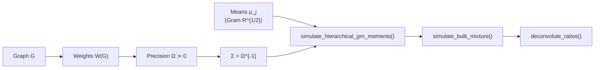
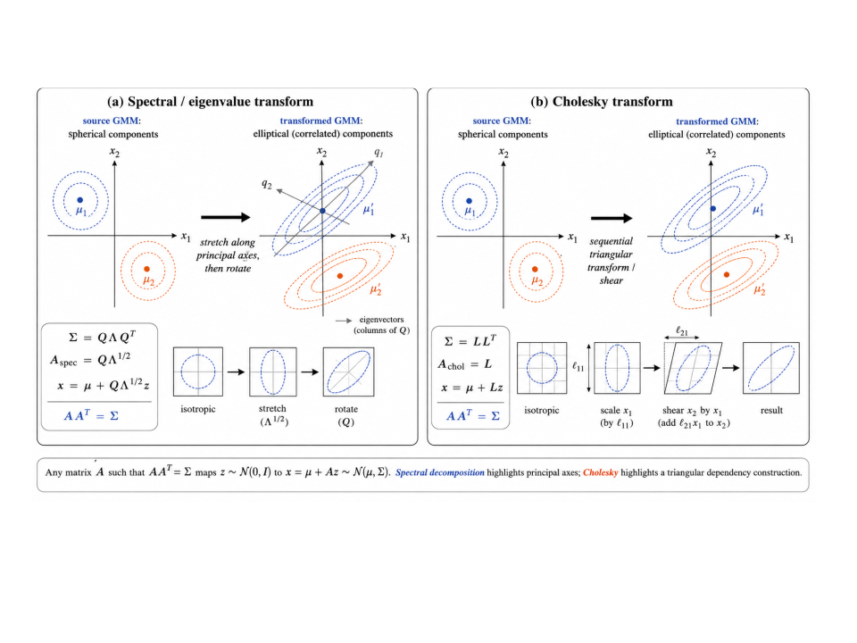
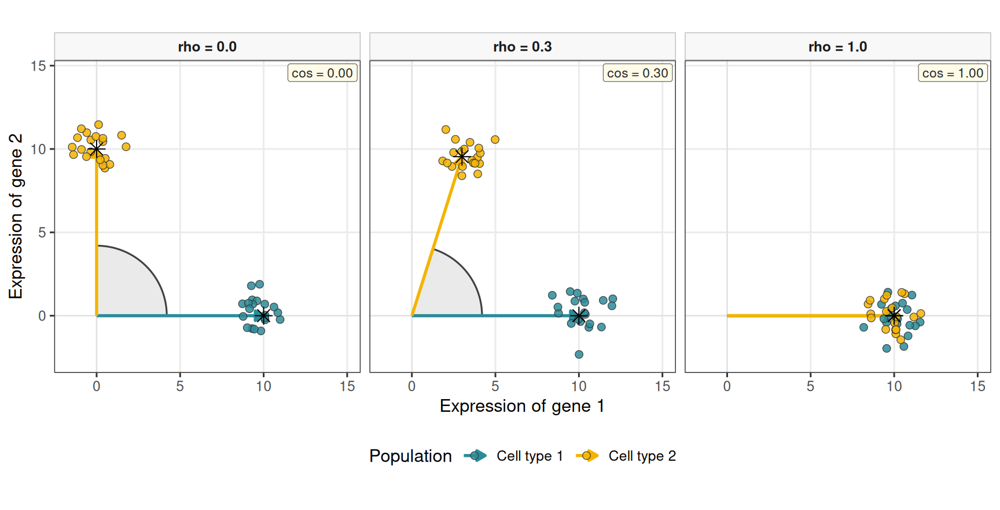
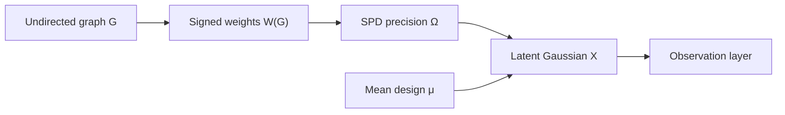
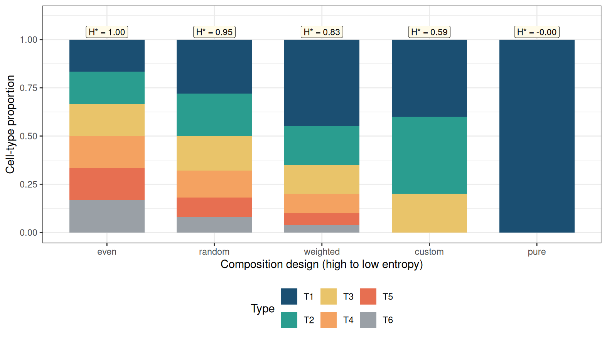

# Simulating synthetic pseudo-bulk mixtures for benchmarking

## Overview

This vignette documents the synthetic first- and second-order moment
generator
[`simulate_hierarchical_grn_moments()`](https://bastienchassagnol.github.io/DeCovarT/reference/simulate_hierarchical_grn_moments.md)
and how its outputs feed bulk mixture simulation. Mean profiles realise
a target Gram matrix of pairwise cosines through the **symmetric square
root** (=sR^{1/2}). The default (R) is equicorrelation at level ()
(`target_cosine`); `target_gram` sets unequal pairs. The scale (s)
(`mean_scale`) sets column norms without changing angles. Prefer varying
the Gram across scenarios when precision weights already control
second-order dependence.

Each cell type carries its own graph-constrained signed precision
\boldsymbol{\Omega}\_j, mapped to
\boldsymbol{\Sigma}\_j=\boldsymbol{\Omega}\_j^{-1}. An undirected
Gaussian Markov simulation separates four layers
([Eq. 6](#eq-ggm-pipeline)): graph G_j, signed weights W(G_j), SPD
precision \Omega_j, and latent Gaussians (an optional observation layer
can add Poisson–log-normal or zero-inflated counts). The **graph** and
the **precision** must not be conflated: a binary adjacency is almost
never itself positive definite. DeCovarT draws G_j via
[`generate_random_network_skeleton()`](https://bastienchassagnol.github.io/DeCovarT/reference/generate_random_network_skeleton.md),
completes \Omega_j\succ 0 with
[`build_normalised_precision()`](https://bastienchassagnol.github.io/DeCovarT/reference/build_normalised_precision.md),
and stacks the inverted slices with
[`build_covariance_array_from_precision()`](https://bastienchassagnol.github.io/DeCovarT/reference/build_covariance_array_from_precision.md).
[Sec. 4](#sec-ggm-networks) develops the topology, weight, and SPD
design in detail.

## Pipeline API

The exported entry point orchestrates internal helpers and returns
moments that can be passed to
[`simulate_bulk_mixture()`](https://bastienchassagnol.github.io/DeCovarT/reference/simulate_bulk_mixture.md).
For end-to-end benchmarking, see the [bivariate
toy](https://bastienchassagnol.github.io/DeCovarT/articles/fig02-bivariate-toy.md)
and [variance-driven
hybrid](https://bastienchassagnol.github.io/DeCovarT/articles/fig03-variance-driven.md);
scenario grids live in `scripts/fig02_bivariate_toy.R`. Direct solver
calls use
[`deconvolute_ratios()`](https://bastienchassagnol.github.io/DeCovarT/reference/deconvolute_ratios.md).



Figure 1: Pipeline from synthetic moment generation to deconvolution.

``` r

library(DeCovarT)

set.seed(42)
moments <- simulate_hierarchical_grn_moments(
  n_genes = 40L,
  n_celltypes = 3L,
  mean_scale = 10,
  target_cosine = 0.1,
  precision_shift = 0.1,
  precision_scale = 0.3,
  prop_inhibitory = 0.5,
  graph_model = "scale_free"
)

moments$objectives
#> $mean_abs_cosine
#> [1] 0.1
#> 
#> $sum_euclidean_distance
#> [1] 40.24922

bulk <- simulate_bulk_mixture(
  signature_matrix = moments$mean_profiles,
  Sigma = moments$covariance_matrices,
  p = c(0.5, 0.3, 0.2),
  n = 20
)
dim(bulk$Y)
#> [1] 40 20
dim(bulk$latent_profiles) # G x J x N latent draws; input mu is shared
#> [1] 40  3 20
```

## Generate mean expression profiles

### Mean signature: `generate_mean_signature_matrix()`

The construction uses one symbol per quantity:

- G: number of genes
- J: number of cell types, indexed by j=1,\ldots,J
- \boldsymbol{\mu}\_{\cdot j}\in\mathbb{R}^{G}: column j of the mean
  signature
- s: column Euclidean scale (`mean_scale`; default 10)
- R\in\mathbb{R}^{J\times J}: target Gram of the *unit* directions
  (pairwise cosines)
- \mathbf{Q}\in\mathbb{R}^{G\times J}: thin orthonormal frame,
  \mathbf{Q}^{\mathsf{T}}\mathbf{Q}=\mathbf{I}\_{J}

The default Gram is equicorrelation at level \rho (`target_cosine`),

R\_{J}(\rho) = (1-\rho)\mathbf{I}\_{J} +
\rho\\\mathbf{1}\mathbf{1}^{\mathsf{T}}, \tag{1}

which is positive semidefinite for \rho\in\[-1/(J-1),1\] and strictly
definite on the open interval. A full `target_gram` replaces
R\_{J}(\rho) when some pairs should be closer than others (for example
two related types at cosine 0.98 and a background at 0.2), provided the
chosen matrix is symmetric and nonnegative-definite.

Columns are obtained from the **symmetric** (spectral) square root
R^{1/2}=U\operatorname{diag}(\sqrt{\lambda})U^{\mathsf{T}},

\boldsymbol{\mu} = s\\ \mathbf{Q} R^{1/2}. \tag{2}

Then \boldsymbol{\mu}^{\mathsf{T}}\boldsymbol{\mu}=s^{2}R exactly (up to
rounding), so pairwise cosines match R and every column has Euclidean
norm s. No cell type is a privileged reference; changing \mathbf{Q} by
an orthogonal factor in \mathbb{R}^{J} does not change the Gram (see
[Theorem 1](#thm-gram-q) and the uniqueness of vector realisations of a
Gram matrix).

> **Note 1: Role of each factor in the equicorrelation Gram**
>
> - \mathbf{I}\_{J} is the unique-variance (cosine-one) part: without
>   it, R would be rank one.
> - \mathbf{1}\mathbf{1}^{\mathsf{T}} is the rank-one all-ones matrix;
>   it is the shared direction that makes every pair equally correlated.
> - \rho scales that shared direction (the target pairwise cosine).
> - 1-\rho is the residual uniqueness: as \rho\to 1, R collapses to rank
>   one (identical columns); as \rho\to 0, R=\mathbf{I}\_{J} (orthogonal
>   columns).
> - s multiplies all columns after the unit embedding, so Euclidean gaps
>   scale with s while angles stay those of R.

> **Note**
>
> **Theorem 1 (Orthonormal frame)** Any thin \mathbf{Q} with
> \mathbf{Q}^{\mathsf{T}}\mathbf{Q}=\mathbf{I}\_{J} yields a valid
> embedding of R into \mathbb{R}^{G} (G\ge J). If
> \mathbf{Q}\_{\star}=\mathbf{Q}U with U^{\mathsf{T}}U=\mathbf{I}\_{J},
> then (\mathbf{Q}\_{\star}R^{1/2})^{\mathsf{T}}
> (\mathbf{Q}\_{\star}R^{1/2})=R still holds. The package default is a
> deterministic QR frame; passing `seed` draws a Gaussian QR (Haar-like)
> frame instead.

[Figure 2](#fig-cholesky-vs-spectral) compares the symmetric square root
used here with the lower-triangular Cholesky factor of the same R. Both
are matrix square roots; they differ by an orthogonal transformation of
the coordinate axes, which is exactly the Gram uniqueness (realisations
are unique up to orthogonal maps of the ambient space).



Figure 2: Symmetric (spectral) square root versus Cholesky factor of a
target Gram. Left: R^{1/2} is symmetric and rotates the standard basis
into an eigenframe. Right: the Cholesky factor L with R=LL^{\mathsf{T}}
is lower triangular, so the first coordinate is aligned with the first
cell type and later types pick up successive residuals. The two
embeddings differ by an orthogonal transformation and realise the same
pairwise cosines.

The common-factor blend of a shared unit \boldsymbol{u} with private
marker blocks (the previous default, closest to `AutoGeneS` ([Aliee and
Theis 2021](#ref-alieeAutoGeneSAutomaticGene2021))) is recorded in
[Sec. 3.3.1](#sec-common-factor). It does **not** hit \rho exactly at
finite J. Cholesky as a Monte Carlo device is in
[Sec. 3.3](#sec-chol-mc).

[Figure 3](#fig-cosine-geometry) visualises three operating points
(\rho\in\\0,\\0.3,\\1\\) for G=2 genes and J=2 cell types. Cell type 1
is fixed along the positive gene-1 axis; only the **angular** position
of cell type 2 is varied so that \rho=0 is exactly orthogonal.
Independent Gaussian noise is added *only in this vignette chunk* around
each centroid (N=20 i.i.d. draws per population) to emulate within-type
dispersion under an independence assumption, without altering the
Gram-matrix generator. Coloured arrows mark each type’s mean direction;
the shaded wedge is the angle between the two means.

This illustration is inspired by panel B in the AutoGeneS paper ([Aliee
and Theis 2021](#ref-alieeAutoGeneSAutomaticGene2021)). It is a
geometric toy for the target *angle*, not a plot of
[Eq. 2](#eq-mean-gram): with G=J=2 the symmetric root and the polar
construction coincide up to a rotation.



Figure 3: Cosine-control toy for J=2 cell types and G=2 genes. Cell type
1 is fixed on the positive gene-1 axis; only the angular position of
cell type 2 varies (so \rho=0 is orthogonal). Coloured arrows: mean
directions; shaded wedge: angle between means. Labels report the
realised cosine. Points are N=20 i.i.d. Gaussian draws around each
centroid (stars). Styling inspired by panel B of `AutoGeneS` (Aliee and
Theis ([2021](#ref-alieeAutoGeneSAutomaticGene2021))).

> **Note 2: Related signature constructions**
>
> Blending a common baseline with type-specific markers is standard in
> deconvolution benchmarking. **`AutoGeneS`** ([Aliee and Theis
> 2021](#ref-alieeAutoGeneSAutomaticGene2021)) selects genes by jointly
> minimising inter-type correlation and maximising centroid distance;
> its simulations use a similar shared-plus-private logic to control
> signature geometry. Schelker and colleagues ([Schelker et al.
> 2017](#ref-schelkerEstimationImmuneCell2017)) build tumour-derived
> reference gene expression profiles from single-cell RNA-seq clusters
> and marker genes, then simulate bulk mixtures by combining those
> columns—empirically a shared baseline plus distinct marker programmes
> per immune cell type.
>
> The **`DICEPro`** framework ([Ba et al. 2026](#ref-baWhenLessNot2026))
> targets incomplete reference matrices in supervised deconvolution. Its
> simulation engine generates synthetic signature matrices from
> multivariate Gaussian (or Poisson) models with a prescribed
> correlation structure; a **`bloc=TRUE`** option enforces **block
> sparsity** by zeroing expression outside type-specific gene blocks—the
> common-factor construction of [Sec. 3.3.1](#sec-common-factor).
> DICEPro then optimises reference signatures when cell types are
> missing from the matrix, complementing the Gram R we use here for
> method comparison under known ground truth.

### Objectives: `compute_mean_profile_objectives()`

For columns of \boldsymbol{\mu},

\overline{\lvert\cos\rvert} = \frac{2}{J(J-1)} \sum\_{1\le j\<k\le J}
\Biggl\| \frac{ \boldsymbol{\mu}\_{\cdot j}^{\mathsf{T}}
\boldsymbol{\mu}\_{\cdot k} }{ \\\boldsymbol{\mu}\_{\cdot j}\\\_2\\
\\\boldsymbol{\mu}\_{\cdot k}\\\_2 } \Biggr\|,

D\_{\mathrm{Euc}} = \sum\_{1\le j\<k\le J} \\\boldsymbol{\mu}\_{\cdot
j}-\boldsymbol{\mu}\_{\cdot k}\\\_2.

AutoGeneS treats the first as a quantity to minimise and the second as a
quantity to maximise ([Aliee and Theis
2021](#ref-alieeAutoGeneSAutomaticGene2021)). Cosine is preferred to
Pearson correlation so that collinear but unequally scaled profiles
remain penalised.

> **Note 3: Perspectives: a single geometric score for
> \boldsymbol{\mu}**
>
> The present API exposes two AutoGeneS-style objectives. A natural
> refinement is to replace them by one scalar that jointly rewards large
> column norms (and hence Euclidean separation) and penalises alignment.
>
> Two candidates are immediate. The Gram determinant
>
> V(\boldsymbol{\mu}) = \sqrt{ \det\bigl(
> \boldsymbol{\mu}^{\mathsf{T}}\boldsymbol{\mu} \bigr) } \tag{3}
>
> is the volume of the parallelepiped spanned by the columns of
> \boldsymbol{\mu}. It vanishes under exact collinearity and grows when
> columns lengthen or become more orthogonal—precisely the desired MOO
> trade-off in one number.
>
> Equivalently, the reciprocal condition number
>
> \kappa_2(\boldsymbol{\mu})^{-1} =
> \frac{\sigma\_{\min}(\boldsymbol{\mu})}{\sigma\_{\max}(\boldsymbol{\mu})},
> \tag{4}
>
> available in R via `kappa(mean_profiles, exact = TRUE)` (or
> `1 / kappa(...)`), measures how ill-posed linear recovery of
> \boldsymbol{p} from
> \boldsymbol{y}\approx\boldsymbol{\mu}\boldsymbol{p} is. Maximising
> \kappa_2(\boldsymbol{\mu})^{-1} (or minimising
> \kappa_2(\boldsymbol{\mu})) collapses cosine and distance into a
> deconvolution-centric criterion without a Pareto front.
>
> A practical next step is to expose an optional
> `mean_objective = c("autogenes", "volume", "condition")` in
> [`simulate_hierarchical_grn_moments()`](https://bastienchassagnol.github.io/DeCovarT/reference/simulate_hierarchical_grn_moments.md),
> keep the constructive Gram generator for controllable scenarios, and
> report the chosen scalar alongside the existing pairwise diagnostics.

### Appendix: Cholesky, uniqueness, and the common-factor blend

Cholesky’s factor R=LL^{\mathsf{T}} is the classical Monte Carlo square
root: if \boldsymbol{z} is standard normal, L\boldsymbol{z} has
covariance R ([Madar 2015](#ref-madarDirectFormulationCholesky2015)).
The same factor embeds J unit vectors as the *rows* of L (padded by
zeros in \mathbb{R}^{G}). The first type is aligned with the first
coordinate; later types pick up successive residuals, so the embedding
is order-dependent. The symmetric root R^{1/2} has no preferred axis.
[Figure 2](#fig-cholesky-vs-spectral) is that distinction. Vector
realisations of a Gram matrix are unique only up to an orthogonal map of
the ambient space: if
\boldsymbol{\mu}^{\mathsf{T}}\boldsymbol{\mu}=s^{2}R, so is
(\mathbf{Q}\boldsymbol{\mu})^{\mathsf{T}} (\mathbf{Q}\boldsymbol{\mu})
for \mathbf{Q}^{\mathsf{T}}\mathbf{Q}= \mathbf{I}. Equicorrelation Grams
used as `target_cosine` are double-constant matrices ([O’Neill
2021](#ref-oneillDoubleConstantMatrixCentering2021)); Mustonen’s
total-variability scalar is a related summary of a multivariate Gaussian
covariance, not a substitute for the Gram construction ([Mustonen
1997](#ref-mustonenMeasureTotalVariability1997)).

#### Common-factor construction

The previous package default blended a shared unit
\boldsymbol{u}=G^{-1/2}\mathbf{1} with private, disjoint marker blocks
\boldsymbol{v}\_{j},

\tilde{\boldsymbol{\mu}}\_{\cdot j} = \sqrt{\rho}\\\boldsymbol{u}
+\sqrt{1-\rho}\\\boldsymbol{v}\_{j}, \tag{5}

then column-normalised. Because \boldsymbol{u} is not orthogonal to the
blocks, the realised cosine exceeds \rho at finite J. That construction
remains the closest analogue of `AutoGeneS` shared-plus-private geometry
([Aliee and Theis 2021](#ref-alieeAutoGeneSAutomaticGene2021)); the
default generator is now [Eq. 2](#eq-mean-gram), which hits R exactly.

## Undirected Gaussian Markov network generation

G \longrightarrow W(G) \longrightarrow \Omega \succ 0 \longrightarrow
X_i \sim \mathcal{N}\_p(\mu_i,\Omega^{-1}) \tag{6}

Here G is an **undirected** graph, W(G) a symmetric weighted matrix with
the same off-diagonal support, \Omega a strictly positive-definite
precision, and X_i an expression profile. This section covers
**undirected** Gaussian Markov / precision-graph simulation only.
[`generate_random_network_skeleton()`](https://bastienchassagnol.github.io/DeCovarT/reference/generate_random_network_skeleton.md)
draws G;
[`build_normalised_precision()`](https://bastienchassagnol.github.io/DeCovarT/reference/build_normalised_precision.md)
completes it to \Omega\succ 0 by an affine spectral shift;
[`build_covariance_array_from_precision()`](https://bastienchassagnol.github.io/DeCovarT/reference/build_covariance_array_from_precision.md)
maps each slice \boldsymbol{\Sigma}\_j=\boldsymbol{\Omega}\_j^{-1} (cell
types need not share one network).



Figure 4: Undirected simulation pipeline from topology to observations
(optional observation layer dashed).

### Graph structure generators

\rho\_{jk\mid -\\j,k\\} =
-\frac{\Omega\_{jk}}{\sqrt{\Omega\_{jj}\Omega\_{kk}}} \tag{7}

[Table 1](#tbl-topologies) compares the main **undirected** topology
families used in GGM benchmarks, with R entry points.
[Figure 5](#fig-topologies) sketches the six families most often used in
random-like network structure generation.

| Structure | Definition and controls | R entry points | Advantages | Limitations |
|----|----|----|----|----|
| **Erdős–Rényi** | Each edge present independently with probability q; q=d\_{\mathrm{avg}}/(p-1) targets average degree | `huge::huge.generator(graph="random")` ([Jiang et al. 2026](#ref-R-huge)); `BDgraph::graph.sim(graph="random")` ([Mohammadi and Wit 2025](#ref-R-BDgraph)); DeCovarT `graph_model = "erdos_renyi"` | Exact sparsity control in expectation; few nuisance parameters | Narrow degree distribution; little modular organisation |
| **Band / AR** | Edge j–k if 1\le\lvert j-k\rvert\le b | `huge.generator(graph="band")` ([Jiang et al. 2026](#ref-R-huge)); `BDgraph::bdgraph.sim(graph="AR(1)")` / `"AR(2)"` ([Mohammadi and Wit 2025](#ref-R-BDgraph)) | Local dependence and controlled max degree | Artificial gene ordering; no hubs or modules |
| **Hub / star** | g groups; one centre linked to remaining members | `huge.generator(graph="hub")` ([Jiang et al. 2026](#ref-R-huge)); `graph.sim(graph="hub")` / `"star"` ([Mohammadi and Wit 2025](#ref-R-BDgraph)); DeCovarT `graph_model = "hub"` | Stress-tests high-degree regulators | Pure stars omit cross-talk |
| **Scale-free** | Preferential attachment (e.g. Barabási–Albert with m edges per new node) | `huge.generator(graph="scale-free")` ([Jiang et al. 2026](#ref-R-huge)); DeCovarT `graph_model = "scale_free"` | Heterogeneous degrees | Weak modularity under plain BA growth |
| **Cluster / SBM** | Within-block edge probability exceeds between-block ([Holland et al. 1983](#ref-hollandStochasticBlockmodelsFirst1983)) | `huge.generator(graph="cluster")` ([Jiang et al. 2026](#ref-R-huge)); DeCovarT `graph_model = "stochastic_block_model"` | Pathway / module structure | Equal blocks can be unrealistically regular |
| **Small-world / lattice / circle** | High clustering with short paths, or fixed neighbourhoods ([Watts and Strogatz 1998](#ref-wattsCollectiveDynamicsSmallworld1998)) | DeCovarT `graph_model = "small_world"` (Watts–Strogatz); `BDgraph::graph.sim(graph="smallworld")` ([Mohammadi and Wit 2025](#ref-R-BDgraph)) | Local modules and spatial organisation | Narrow degrees; needs a defensible ordering |

Table 1: Topology families for undirected GGM simulation (R-focused).


Figure 5: Six undirected topology families used in GGM simulation:
Erdős–Rényi, Barabási–Albert (preferential attachment / scale-free),
stochastic block (cluster), band / AR, star / hub, and small-world
(Watts–Strogatz).

Not every topology is equally useful as a **gene-regulatory** prior. The
three simulation studies in [Table 3](#tbl-studies), together with
classical network biology, suggest the following reading.

| Family | Biological reading | Why it matters for DeCovarT |
|----|----|----|
| **Star / hub** | Master-regulator TF with many targets; one-to-many signalling | Stress-tests recovery of a few high-degree hubs that dominate partial correlations ([Wu and Luo 2022](#ref-wuEstimatingHeterogeneousGene2022); [Federico et al. 2023](#ref-federicoStructureLearningGene2023)) |
| **Scale-free (BA)** | Preferential attachment produces a heavy-tailed degree distribution and several hubs ([Barabási and Albert 1999](#ref-barabasiEmergenceScalingRandom1999)) | Standard high-dimensional GGM stress test used by SILGGM via `huge` ([Zhang et al. 2018](#ref-zhangSILGGMExtensivePackage2018)); useful for testing degree heterogeneity, but not a default empirical model of gene regulation |
| **Cluster / SBM** | Co-regulated modules / pathways with dense within-block links ([Holland et al. 1983](#ref-hollandStochasticBlockmodelsFirst1983)) | Matches pathway organisation; BLGGM’s global block partition is SBM-like before finer within-block motifs ([Wu and Luo 2022](#ref-wuEstimatingHeterogeneousGene2022)) |
| **Small-world** | High local clustering with short paths (ring + shortcuts) ([Watts and Strogatz 1998](#ref-wattsCollectiveDynamicsSmallworld1998)) | Local co-expression neighbourhoods plus long-range regulatory shortcuts; useful when modularity is soft rather than hard blocks ([Federico et al. 2023](#ref-federicoStructureLearningGene2023)) |
| **Band / AR** | Ordered local dependence only | Useful numerical control, but gene indices rarely encode a natural order—limited biological fidelity ([Zhang et al. 2018](#ref-zhangSILGGMExtensivePackage2018)) |
| **Erdős–Rényi** | Homogeneous random wiring | Null / baseline sparsity; little pathway or hub structure ([Zhang et al. 2018](#ref-zhangSILGGMExtensivePackage2018)) |

Table 2: Biological interpretability of undirected topology families.

> **Note 4: The scale-free hypothesis: a useful stress test, not a
> biological default**
>
> The phrase *scale-free network* usually means that the degree
> distribution follows a power law, \Pr(K=k)\propto k^{-\alpha}, at
> least above a lower cut-off. This statistical statement is distinct
> from the Barabási–Albert (BA) growth mechanism. Preferential
> attachment can generate a power law, but observing a heavy-tailed
> degree distribution does not establish preferential attachment; other
> mechanisms can produce similar tails, and variants of preferential
> attachment need not produce a pure power law ([Lima-Mendez and van
> Helden 2009](#ref-lima-mendezPowerfulLawPower2009); [Broido and
> Clauset 2019](#ref-broidoScalefreeNetworksAre2019)).
>
> Whether biological networks are scale-free has therefore remained
> contested. Early claims often relied on approximately straight log–log
> degree plots. Such plots are not goodness-of-fit tests: binning, the
> plotting scale, a small number of hubs, and incomplete or biased
> sampling can all make non-power-law distributions appear linear. The
> underlying graph representation matters as well. For example, pool
> metabolites can become artificial hubs in metabolic graphs, while
> protein-interaction networks depend strongly on the assay and sampling
> scheme ([Lima-Mendez and van Helden
> 2009](#ref-lima-mendezPowerfulLawPower2009)). A power law should
> instead be fitted to the discrete degree data, tested for
> plausibility, and compared on the same support with alternatives such
> as log-normal, exponential, stretched-exponential, and
> power-law-with-cut-off distributions.
>
> The evidence is not uniformly negative. Using adjacency-spectrum
> distributions rather than degree alone, Takahashi and colleagues
> classified eight protein–protein interaction networks as scale-free
> ([Takahashi et al.
> 2012](#ref-takahashiDiscriminatingDifferentClasses2012)). Importantly,
> this was a relative model-selection result: BA-like networks fitted
> better than the two candidate alternatives, Erdős–Rényi and
> Watts–Strogatz networks. It did not show that a power law was an
> adequate absolute model, that preferential attachment generated the
> observed networks, or that unobserved interactions would preserve the
> classification. The authors explicitly noted both the restricted
> candidate set and possible sampling artefacts.
>
> A broader test of 928 real-world network data sets reached a more
> cautious conclusion ([Broido and Clauset
> 2019](#ref-broidoScalefreeNetworksAre2019)). Across all domains, only
> 4% met the strongest scale-free criterion, whereas a log-normal
> distribution fitted as well as or better than a power law for 88% of
> degree distributions. Among the biological networks, 63% showed
> neither direct nor indirect evidence of scale-free structure, although
> 6% met the strongest criterion, principally metabolic networks. These
> proportions depend on the network corpus and the operational
> definition of scale-freeness, but they reject a universal scale-free
> law rather than excluding scale-free structure from every biological
> system.

[Table 3](#tbl-studies) summarises how recent simulation studies combine
topology, precision construction, and mean / observation models.

| Source | Graph structures | Precision construction | Mean / observation | Purpose |
|----|----|----|----|----|
| PLNnetwork ([Chiquet et al. 2018](#ref-chiquetVariationalInferenceSparse2018)) | Erdős–Rényi, preferential attachment, affiliation | \Omega = vG + \operatorname{diag}(\lvert\lambda\_{\min}(vG)\rvert + u) | Latent log-abundance XB; compositional / multinomial counts | Count-network estimators under compositionality |
| SILGGM ([Zhang et al. 2018](#ref-zhangSILGGMExtensivePackage2018)) | Band, hub, Erdős–Rényi, scale-free via `huge` | Package covariance / precision simulation | Centred Gaussian; focus on precision entries | Large-p inferential and computational stress tests |
| BLGGM ([Wu and Luo 2022](#ref-wuEstimatingHeterogeneousGene2022)) | Block mixtures of dense, circle, star, signed modules | Module matrices with structured signed off-diagonals | Cell-type-specific \mu_k, \Omega_k; expression-dependent dropout | Joint clustering, heterogeneous networks, zero inflation |

Table 3: Literature survey of undirected graph → precision → observation
designs.

Several conclusions follow.

1.  **Band** is not intrinsically a random-graph model: its support is
    usually deterministic once the bandwidth is fixed. Hub constructions
    are often partly deterministic as well. Erdős–Rényi, preferential
    attachment, and stochastic block models are genuinely stochastic.
2.  A positive off-diagonal entry in \Omega encodes a **negative**
    partial correlation ([Eq. 7](#eq-partial-cor)). Uniformly positive
    precision weights therefore induce uniformly negative edgewise
    partial correlations; random or signed biological weights are needed
    when activation-like and inhibition-like associations matter.
3.  **BLGGM is a two-scale hybrid** ([Wu and Luo
    2022](#ref-wuEstimatingHeterogeneousGene2022)), shown in
    [Figure 6](#fig-blggm-two-pronged):
    - **Global partition.** Genes are assigned to blocks (a
      stochastic-block–like cut); between-block edges are sparse.
    - **Local motifs.** Inside each block the topology can be a dense
      clique, a circle, a star / hub, or a signed dense module, so
      distinct blocks can stand for distinct regulatory regimes
      (co-expression programmes, cyclic motifs, master-regulator hubs).
      Signs may differ across modules or cell types.

    The construction remains fully undirected, but it is richer than a
    flat Erdős–Rényi draw. DeCovarT’s exported generators currently
    expose the three families most useful as standalone benchmarks:
    `scale_free`, `stochastic_block_model`, and `small_world`.


Figure 6: Two-pronged BLGGM-style topology: a global stochastic-block
partition of genes, then a local motif (dense module, star, or circle)
inside each block ([Wu and Luo
2022](#ref-wuEstimatingHeterogeneousGene2022)).

### Weight design and random signs

Topology generators return a binary undirected support E. **Signs and
magnitudes** are a separate design layer W(G) in
[Eq. 6](#eq-ggm-pipeline): they are assigned *after* (or jointly with)
the skeleton, then completed to an SPD precision. Remember that

\operatorname{sign}(\rho\_{jk\mid -\\j,k\\}) =
-\operatorname{sign}(\Omega\_{jk}) \tag{8}

see [Eq. 7](#eq-partial-cor), so a positive precision weight is an
inhibitory partial correlation. [Table 4](#tbl-weights) contrasts three
standard undirected strategies.

| Approach | What is randomised | How \Omega is obtained | When to use |
|----|----|----|----|
| **i.i.d. edge signs** | For each \\j,k\\\in E, draw s\_{jk}\in\\-1,+1\\ (e.g. fair coin or \mathbb{P}(+)=\pi) and magnitude m\_{jk}\>0; set W\_{jk}=W\_{kj}=s\_{jk}m\_{jk} | Support-preserving SPD map of W (spectral shift, diagonal dominance, …) | Simple signed ER / hub / SBM benchmarks; explicit control of the inhibitory fraction |
| **Partial-correlation scaling** | Fill a symmetric matrix R with R\_{jk}=0 off E and R\_{jk}\in(-1,1) (signed) on E; ensure \rho(R)\<1 | \Omega = D^{1/2}(I-R)D^{1/2} ([Eq. 11](#eq-partial-scale)) | Direct control of partial-correlation signs and strengths |
| **G-Wishart** (`BDgraph::rgwish()`) | Continuous random \Omega on the fixed graph zeros | \Omega\sim W_G(b,D) already SPD ([Mohammadi and Wit 2025](#ref-R-BDgraph), [2019](#ref-BDgraph2019)) | Heterogeneous random weights without hand-tuned magnitudes; Bayesian-style replicates |

Table 4: Three undirected strategies for signed / random edge weights
after a fixed skeleton.

#### i.i.d. signs on a fixed skeleton

Draw G (ER, band, hub, …). Independently for each undirected edge,

W\_{jk}=W\_{kj}=s\_{jk}\\m\_{jk}, \qquad s\_{jk}\in\\-1,+1\\, \quad
m\_{jk}\>0, \tag{9}

then apply a support-preserving SPD completion (next section). Uniform
positive loadings W=vG are the special case s\_{jk}\equiv +1 used by
PLN-style and many `huge` simulations ([Chiquet et al.
2018](#ref-chiquetVariationalInferenceSparse2018))—all partial
correlations then share the same sign. DeCovarT uses i.i.d. signs with
inhibitory fraction `prop_inhibitory` and magnitude v
(`precision_scale`) baked into \boldsymbol{W} before the spectral SPD
completion.

#### Partial-correlation scaling and why I-R

In a Gaussian Markov model the **matrix of partial correlations** (with
ones on the diagonal) relates to the precision by a diagonal congruence.
Write the off-diagonal partial correlations as a symmetric matrix R with

R\_{jj}=0, \qquad R\_{jk} = \begin{cases} \rho\_{jk\mid -\\j,k\\} &
\\j,k\\\in E,\\ 0 & \\j,k\\\notin E, \end{cases} \tag{10}

and choose magnitudes so that the spectral radius satisfies \rho(R)\<1.
Then

\Omega = D^{1/2}(I-R)D^{1/2} \tag{11}

for a positive diagonal D (often D=I after standardising margins).

#### G-Wishart draws on a fixed graph

Given adjacency G, `BDgraph::rgwish()` samples \Omega\sim W_G(b,D)
already positive definite and with \Omega\_{jk}=0 whenever (j,k)\notin E
([Mohammadi and Wit 2025](#ref-R-BDgraph), [2019](#ref-BDgraph2019)).
Signs and magnitudes arise from the continuous distribution rather than
from an explicit coin-flip layer. This is the most “automatic”
signed-weight generator once the skeleton is fixed; the trade-off is
less direct control of the inhibitory fraction than
[Eq. 9](#eq-iid-signs) or [Eq. 11](#eq-partial-scale).

### Positive-definiteness strategies

[Table 5](#tbl-pd) contrasts constructions that turn a weighted support
W (or a partial-correlation design) into \Omega\succ 0. DeCovarT’s
[`build_normalised_precision()`](https://bastienchassagnol.github.io/DeCovarT/reference/build_normalised_precision.md)
implements the uniform spectral shift below, with diagonal cushion u
(`precision_shift`):

\boldsymbol{\Omega} = \boldsymbol{W} + \bigl(
\lvert\lambda\_{\min}(\boldsymbol{W})\rvert + u \bigr) \mathbf{I}.

| Construction | Formula | Support preserved? | Role |
|----|----|:--:|----|
| Spectral / PLN loading | \Omega=W+(\lvert\lambda\_{\min}(W)\rvert+u)I | Yes | DeCovarT default; same affine shift as `huge` / PLN ([Chiquet et al. 2018](#ref-chiquetVariationalInferenceSparse2018)) |
| Partial-correlation scaling | \Omega=D^{1/2}(I-R)D^{1/2}, \rho(R)\<1 | Yes | Signs and strengths set on the partial-correlation scale ([Eq. 11](#eq-partial-scale)) |
| Graph Laplacian / M-matrix | \Omega=L_G+\varepsilon I | Yes | Off-diagonals non-positive ⇒ all edgewise partial correlations positive |
| G-Wishart | \Omega\sim W_G(b,D) | Yes | Heterogeneous random weights; `BDgraph::rgwish()` ([Mohammadi and Wit 2025](#ref-R-BDgraph)) |

Table 5: Support-preserving maps from a weighted graph to \Omega\succ 0.
Eigenvalue clipping (reconstruct Q\Lambda\_{\mathrm{clip}}Q^{\top})
fills structural zeros, so it is omitted from the generative truth;
nearest-PD projections are repair tools, not support-preserving
simulators.

#### Why the uniform spectral shift is attractive

If W=Q\Lambda Q^{\top}, then ([Eq. 12](#eq-spectral-shift))

W+cI = Q(\Lambda+cI)Q^{\top}. \tag{12}

Every eigenvalue increases by c, while every off-diagonal of W is
unchanged, so the edge set

E=\\(j,k):j\<k,\\ \Omega\_{jk}\neq 0\\ \tag{13}

is identical before and after loading—and **signs of** W are preserved.

The floor \varepsilon also controls the condition number

\kappa(\Omega)=\frac{\lambda\_{\max}(\Omega)}{\lambda\_{\min}(\Omega)}.
\tag{14}

Large loading yields a well-conditioned but weakly dependent network;
loading only slightly above -\lambda\_{\min} strengthens dependence but
can make estimation fragile. Benchmarks should report
partial-correlation distributions and \kappa(\Omega), not only the
adjacency.

If a Cholesky factor of \boldsymbol{\Omega} still fails after this
loading,
[`build_normalised_precision()`](https://bastienchassagnol.github.io/DeCovarT/reference/build_normalised_precision.md)
repeats the same affine shift with a larger u until
\boldsymbol{\Omega}\succ 0 strictly. If
\boldsymbol{\Sigma}=\boldsymbol{\Omega}^{-1} then fails to
factor—typical of hub graphs with a tiny
u—[`simulate_hierarchical_grn_moments()`](https://bastienchassagnol.github.io/DeCovarT/reference/simulate_hierarchical_grn_moments.md)
(and
[`build_covariance_array_from_precision()`](https://bastienchassagnol.github.io/DeCovarT/reference/build_covariance_array_from_precision.md))
increases that same diagonal loading on \boldsymbol{\Omega} until both
matrices are strictly positive definite. Off-diagonal support and signs
of W are unchanged.

### Cell-type covariances: `build_covariance_array_from_precision()`

By default each cell type has its own precision (and thus covariance),

\boldsymbol{\Sigma}\_j = \boldsymbol{\Omega}\_j^{-1}, \qquad
j=1,\ldots,J,

stacked as an array in \mathcal{M}\_{G\times G\times J}. Shared networks
remain available by supplying the same adjacency (or the same graph
model seed path) for every type.

> **Note 5: Why the bulk covariance is \sum_j
> p_j^{2}\boldsymbol{\Sigma}\_j**
>
> If each latent profile is \boldsymbol{x}\_{\cdot
> j}\sim\mathcal{N}\_{G}(\boldsymbol{\mu}\_{\cdot
> j},\boldsymbol{\Sigma}\_j) independently, the bulk
> \boldsymbol{y}=\sum_j p_j\boldsymbol{x}\_{\cdot j} is an **affine**
> image of a stacked Gaussian vector. Affine images of multivariate
> Gaussians remain Gaussian, with mean \boldsymbol{\mu}\boldsymbol{p}
> and covariance \sum_j p_j^{2}\boldsymbol{\Sigma}\_j (the p_j^{2}
> factor is the square of the linear coefficient, not a mixture-weight
> identity). That is the conditional law used in the article (Gaussian
> convolution with covariance \sum_j p_j^{2}\boldsymbol{\Sigma}\_j; see
> the log-likelihood derivation in `article/main.tex`) and by
> [`simulate_bulk_mixture()`](https://bastienchassagnol.github.io/DeCovarT/reference/simulate_bulk_mixture.md).
> Downstream bulk simulation therefore uses
>
> \boldsymbol{y}\mid(\boldsymbol{\zeta},\boldsymbol{p}) \sim
> \mathcal{N}\_{G}\bigl(\boldsymbol{\mu}\boldsymbol{p}, \textstyle\sum_j
> p_j^{2}\boldsymbol{\Sigma}\_j\bigr).

### Imbalanced cellular proportions

Topology and mean design fix the *reference* moments \boldsymbol{\zeta}.
Mixture difficulty also depends on how uneven the true composition
\boldsymbol{p} is. DeCovarT summarises that imbalance with the
normalised Shannon entropy
[`compute_shannon_entropy()`](https://bastienchassagnol.github.io/DeCovarT/reference/compute_shannon_entropy.md),

H^{\star}(\boldsymbol{p}) = \frac{-\sum\_{j:p\_{j}\>0}p\_{j}\log
p\_{j}}{\log J} \in\[0,1\], \tag{15}

so H^{\star}=0 for a Dirac mass on one type and H^{\star}=1 for the
uniform vector on J types. Zero masses are dropped only inside the sum;
the normaliser still uses the full panel size J.

A practical grid therefore crosses network / mean axes with a few
composition designs, for example:

| Design | Example \boldsymbol{p} (up to permutation) | Typical H^{\star} |
|:---|:---|:---|
| Pure / near-pure | (1,0,\ldots) or (0.95,0.05,0,\ldots) | near 0 |
| One dominant type | (0.7,0.15,0.15) | low–moderate |
| Two-way balance | (0.5,0.5) or (0.4,0.4,0.2) | moderate–high |
| Uniform | (1/J,\ldots,1/J) | 1 |

Table 6: Composition designs scored by normalised Shannon entropy.

The Bioconductor package `SimBu` ([Dietrich 2024](#ref-R-SimBu)) offers
a complementary pseudo-bulk toolkit with six named fraction scenarios
(`even`, `random`, `mirror_db`, `weighted`, `pure`, `custom`) when
aggregating single-cell profiles; see the [SimBu “Simulate pseudo bulk
datasets”](https://bioconductor.org/packages/release/bioc/vignettes/SimBu/inst/doc/SimBu.html)
section. [Figure 7](#fig-simbu-entropy) shows five of those designs for
J=6 types as stacked compositions, labelled by
H^{\star}(\boldsymbol{p}). High-entropy (`even`) mixtures spread mass
across types; low-entropy (`pure`) mixtures collapse onto one type.
DeCovarT’s Gaussian convolution uses the same idea at the *moment*
layer: supply `p` (or a J\times N matrix of sample-wise ratios) to
[`simulate_bulk_mixture()`](https://bastienchassagnol.github.io/DeCovarT/reference/simulate_bulk_mixture.md),
and report H^{\star} alongside overlap or condition-number diagnostics.
The hybrid J=3 manuscript scenario uses
[`composition_from_entropy()`](https://bastienchassagnol.github.io/DeCovarT/reference/composition_from_entropy.md)
at H^{\star}\in\\1,0.5,0.1\\ ([variance-driven
hybrid](https://bastienchassagnol.github.io/DeCovarT/articles/fig03-variance-driven.html#sec-scenario-grid)).



Figure 7: Illustrative J=6 compositions spanning `SimBu`-style fraction
scenarios, ordered by decreasing normalised Shannon entropy
H^{\star}(\boldsymbol{p}). Each bar is one design; `geom_label` reports
H^{\star}. `mirror_db` is omitted (it copies an empirical atlas rather
than a fixed simplex vector).

### Scenario descriptors collected with the bulk draw

[`describe_simulation_scenario()`](https://bastienchassagnol.github.io/DeCovarT/reference/describe_simulation_scenario.md)
records the convolution parameters
(\boldsymbol{p},\boldsymbol{\mu},\\\boldsymbol{\Sigma}\_j\\) and a
compact geometry table.
[`run_simulation_benchmark()`](https://bastienchassagnol.github.io/DeCovarT/reference/run_simulation_benchmark.md)
returns those objects as `theta_true`, `descriptors`, `supplementary`,
and `call` ([`match.call()`](https://rdrr.io/r/base/match.call.html)).
Kept measures stay in six families ([Note 6](#nte-desc-composition),
[Note 7](#nte-desc-mean), [Note 8](#nte-desc-spd),
[Note 9](#nte-desc-fisher), [Note 10](#nte-desc-network),
[Note 11](#nte-desc-overlap)). MixSim `BarOmega` and averaged pairwise
Hellinger of the purified Gaussians summarise the same convolution
components as the bulk law, so they sit in `descriptors`. Jeffreys /
symmetrised KL is stored in `supplementary`. There is no composite
global score: each column answers a different question.

Compositions on a Shannon grid can be built with
[`composition_from_entropy()`](https://bastienchassagnol.github.io/DeCovarT/reference/composition_from_entropy.md)
(one-dominant family (1-(J-1)q,q,\ldots,q) matching a target H^{\star}).

> **Note 6: Composition**
>
> Let \boldsymbol{p}\in\Delta^{J-1} with the convention 0\log 0=0. The
> normaliser always uses the full panel size J, including zeros.
>
> - Normalised Shannon entropy (Pielou evenness)
>   H^{\star}(\boldsymbol{p})=H(\boldsymbol{p})/\log J,
>   H(\boldsymbol{p})=-\sum_j p_j\log p_j. Zero is a Dirac mass; one is
>   the uniform composition.
> - Effective number of types
>   n\_{\mathrm{eff}}=\exp\\H(\boldsymbol{p})\\. Equals J at the
>   barycentre and 1 at a vertex.
> - Active count n\_{\mathrm{active}}=\\\\j:p_j\>\varepsilon\\ and
>   \min_j p_j among active components: simplex stratum and distance to
>   a face.
> - Concentration \sum_j p_j^2=\lVert\boldsymbol{p}\rVert_2^2. This is
>   the weight that scales the convolution covariance
>   \boldsymbol{\Sigma}(\boldsymbol{p})=\sum_j
>   p_j^2\boldsymbol{\Sigma}\_j.

> **Note 7: Mean geometry**
>
> Columns of \boldsymbol{\mu} are built by
> [`generate_mean_signature_matrix()`](https://bastienchassagnol.github.io/DeCovarT/reference/generate_mean_signature_matrix.md)
> so that the Gram of unit columns equals `target_gram` (or
> equicorrelation at `target_cosine`). Euclidean gaps then scale with
> `mean_scale` s: \lVert\boldsymbol{\mu}\_{\cdot
> j}-\boldsymbol{\mu}\_{\cdot k}\rVert
> =s\sqrt{2(1-\cos(\boldsymbol{\mu}\_{\cdot j},\boldsymbol{\mu}\_{\cdot
> k}))}. Use `nonnegative = TRUE` for a disjoint-support frame when the
> downstream solver requires \boldsymbol{\mu}\ge 0.
>
> - Mean absolute pairwise cosine and the smallest cosine: which types
>   are confusable from first-order signatures alone.
> - Condition number
>   \kappa(\boldsymbol{\mu})=\sigma\_{\max}/\sigma\_{\min} of the
>   singular values of \boldsymbol{\mu}: near-collinearity of the
>   signature parallelepiped.
> - Gram volume \prod\_{\ell}\sigma\_{\ell}(\boldsymbol{\mu}) (zero at
>   rank loss).

> **Note 8: SPD / numerical conditioning of
> \boldsymbol{\Sigma}(\boldsymbol{p})**
>
> These columns describe the *mixture* covariance, not statistical
> identifiability of \boldsymbol{p}. For a Gaussian,
> \kappa\\\boldsymbol{\Sigma}(\boldsymbol{p})\\
> =\lambda\_{\max}/\lambda\_{\min}
> =\kappa\\\boldsymbol{\Theta}(\boldsymbol{p})\\.
>
> - \lambda\_{\min}\\\boldsymbol{\Sigma}(\boldsymbol{p})\\: distance to
>   a singular convolution covariance.
> - `kappa_sigma_p`
>   \kappa\\\boldsymbol{\Sigma}(\boldsymbol{p})\\=\lambda\_{\max}/\lambda\_{\min}:
>   anisotropy of the bulk ellipsoid. Large \kappa makes Cholesky,
>   log-determinants, and analytic gradients sensitive.
> - `kappa_sigma_reciprocal` \lambda\_{\min}/\lambda\_{\max}\in(0,1\]:
>   the same ratio on a bounded scale (one is isotropic).

> **Note 9: Tangent Fisher information (mean versus covariance)**
>
> For a real Gaussian \boldsymbol{y}\mid\boldsymbol{p}\sim
> \mathcal{N}\_{G}(\boldsymbol{\mu}\boldsymbol{p},\boldsymbol{\Sigma}(\boldsymbol{p})),
> the ambient Fisher matrix is the Slepian–Bangs formula with two
> summands: a Mahalanobis (mean) term and a whitened-Frobenius
> (covariance) term. McCulloch ([McCulloch
> 1982](#ref-mccullochSymmetricMatrixDerivatives1982)) derives that
> split for the multivariate normal by treating \boldsymbol{\Sigma} as
> *symmetric* (\mathrm{vech}, not \mathrm{vec}), which supplies the
> factor \tfrac12 on the covariance block. Besson and Abramovich
> ([Besson and Abramovich 2013](#ref-bessonFisherInformationMatrix2013))
> extend Slepian–Bangs to elliptically contoured laws: the two Gaussian
> terms survive, scaled by expectations of the modular variate; the
> Gaussian case recovers the original formula.
>
> DeCovarT is that Gaussian special case, with \boldsymbol{p} in *both*
> the mean \boldsymbol{\mu}\boldsymbol{p} and
> \boldsymbol{\Sigma}(\boldsymbol{p})=\sum_j
> p_j^2\boldsymbol{\Sigma}\_j. The two summands therefore mix in every
> coordinate of I(\boldsymbol{p}). Substituting
> \partial(\boldsymbol{\mu}\boldsymbol{p})/\partial
> p_j=\boldsymbol{\mu}\_{\cdot j} and
> \partial\boldsymbol{\Sigma}(\boldsymbol{p})/\partial
> p_j=2p_j\boldsymbol{\Sigma}\_j yields
>
> I\_{jk}(\boldsymbol{p}) = \underbrace{ \boldsymbol{\mu}\_{\cdot
> j}^{\mathsf{T}} \boldsymbol{\Theta}(\boldsymbol{p})
> \boldsymbol{\mu}\_{\cdot k} }\_{I^{\mathrm{mean}}\_{jk}} +
> \underbrace{ 2 p_j p_k \operatorname{tr}\bigl(
> \boldsymbol{\Theta}\boldsymbol{\Sigma}\_j
> \boldsymbol{\Theta}\boldsymbol{\Sigma}\_k \bigr)
> }\_{I^{\mathrm{cov}}\_{jk}},
>
> with
> \boldsymbol{\Theta}(\boldsymbol{p})=\boldsymbol{\Sigma}(\boldsymbol{p})^{-1}.
> Along a simplex contrast \mathbf{1}^{\mathsf{T}}\boldsymbol{d}=0,
>
> I\_{\mathrm{mean}}(\boldsymbol{d}) =
> (\boldsymbol{\mu}\boldsymbol{d})^{\mathsf{T}} \boldsymbol{\Theta}
> (\boldsymbol{\mu}\boldsymbol{d}), \qquad
> I\_{\mathrm{cov}}(\boldsymbol{d}) = \tfrac12 \bigl\\
> \boldsymbol{\Theta}^{1/2} (D\_{\boldsymbol{d}}\boldsymbol{\Sigma})
> \boldsymbol{\Theta}^{1/2} \bigr\\\_{F}^{2},
>
> where D\_{\boldsymbol{d}}\boldsymbol{\Sigma}=2\sum_j p_j
> d_j\boldsymbol{\Sigma}\_j. The pair contrast
> \boldsymbol{d}=\mathbf{e}\_j-\mathbf{e}\_k is the squared Mahalanobis
> gap of the two mean signatures plus a whitened Frobenius gap of
> p_j\boldsymbol{\Sigma}\_j-p_k\boldsymbol{\Sigma}\_k.
> [`expected_fisher_unconstrained()`](https://bastienchassagnol.github.io/DeCovarT/reference/expected_fisher_unconstrained.md)
> returns I^{\mathrm{mean}}+I^{\mathrm{cov}}; `.fisher_mean_cov_split()`
> exposes the two summands. The tangent matrix is
> I_T=\mathbf{V}^{\mathsf{T}}I\mathbf{V} with Helmert basis \mathbf{V}
> ([`helmert_basis()`](https://bastienchassagnol.github.io/DeCovarT/reference/helmert_basis.md)).
> Elliptical (Student) bulk would only rescale these terms ([Besson and
> Abramovich 2013](#ref-bessonFisherInformationMatrix2013)); the
> descriptors stay Gaussian.
>
> - \lambda\_{\min}(I_T): weakest identifiable simplex contrast.
> - \kappa(I_T)=\lambda\_{\max}(I_T)/\lambda\_{\min}(I_T): ill-posed
>   directions on the simplex.
> - f\_{\mathrm{cov}}=\operatorname{tr}(I^{\mathrm{cov}})/\operatorname{tr}(I):
>   share of ambient information that comes from covariance rather than
>   means. Near one, mean-only solvers (LSEI, CIBERSORT) are
>   under-informed relative to DeCovarT.
> - f\_{\mathrm{cov}}^{\max}: the same fraction along the pairwise
>   contrast \mathbf{e}\_j-\mathbf{e}\_k that maximises it.

> **Note 10: Network sparsity**
>
> When an adjacency array is supplied, density uses that support;
> otherwise the off-diagonal pattern of each \boldsymbol{\Omega}\_j is
> used. Magnitude sparsity is summarised on the bulk correlation matrix
> R=\mathrm{corr}\\\boldsymbol{\Sigma}(\boldsymbol{p})\\, not on the
> binary graph.
>
> - Edge density 2\lvert E\rvert/(G(G-1)) (undirected, no loops) and
>   mean degree 2\lvert E\rvert/G. For fixed G these are equivalent up
>   to the factor G-1.
> - Hoyer sparsity of the M=G(G-1)/2 off-diagonal absolute correlations
>   w_e=\lvert r\_{gh}\rvert: S\_{\mathrm{Hoyer}}=(\sqrt{M}-\lVert
>   w\rVert_1/\lVert w\rVert_2)/(\sqrt{M}-1)\in\[0,1\]. Zero is a flat
>   spectrum of magnitudes; one is a single dominant edge. The index is
>   scale-free and does not assume a topology.

> **Note 11: Component overlap (purified Gaussians)**
>
> These scores describe the J reference Gaussians
> \mathcal{N}(\boldsymbol{\mu}\_{\cdot j},\boldsymbol{\Sigma}\_j) that
> enter the convolution, not the estimator.
>
> - MixSim average pairwise misclassification overlap `BarOmega`
>   ([Melnykov et al. 2012](#ref-melnykovMixSimPackageSimulating2012)).
> - Averaged pairwise Hellinger distance of those Gaussians (closed form
>   through the Bhattacharyya coefficient), weighted by p_j p_k.

Supplementary (not kept as a primary score): Jeffreys divergence.
Cholesky fill-in and sparse-solver timings are *not* reported: the
caller must declare the covariance structure used at fit time; otherwise
the dense Cholesky factor of \Sigma(p) is the default.

## Performance metrics

The descriptors above score the *generative* problem
([`describe_simulation_scenario()`](https://bastienchassagnol.github.io/DeCovarT/reference/describe_simulation_scenario.md),
Shannon evenness in
[`compute_shannon_entropy()`](https://bastienchassagnol.github.io/DeCovarT/reference/compute_shannon_entropy.md),
MixSim overlap). This section scores *estimators*. With known
\boldsymbol{p}^{\star},
[`compute_benchmark_metrics()`](https://bastienchassagnol.github.io/DeCovarT/reference/compute_benchmark_metrics.md)
returns three blocks implemented in `R/utils-metrics.R` and assembled in
`R/04_01_run_benchmark.R`:

- `regression$global`: one row per bulk column (total variation, RMSE,
  MaxAE, angular distance, SDID).
- `regression$cell_type`: one row per cell type across samples (Pearson,
  presence F1, false-positive mass).
- `monte_carlo`: ADEMP summaries of the sampling distribution of \hat
  p_j.
- `optimisation`: per-sample KKT residual, convergence flags,
  log-likelihood regret, elapsed time, and process memory.

There is **no composite global score**. Absolute, angular, association,
inference, and optimisation families answer different questions ([Sturm
et al. 2019](#ref-sturmComprehensiveEvaluationTranscriptomebased2019);
[Avila Cobos et al.
2020](#ref-faComprehensiveBenchmarkingComputational2020)). When
\boldsymbol{p}^{\star} is unknown, the global block switches to
reconstitution of
\hat{\boldsymbol{y}}=\boldsymbol{\mu}\hat{\boldsymbol{p}} against
\boldsymbol{y}. [Sec. 8](#sec-ademp) maps the same columns onto the
ADEMP checklist.

Every distance below is an **error** unless noted (F1, Pearson,
coverage): 0 is ideal whenever a canonical bound exists.
[Figure 8](#fig-metrics-families) shows how L_1, L_2, L\_{\infty},
Aitchison, and angular balls sit on the simplex;
[Note 12](#nte-comp-geometry) reads that geometry.


\(a\) Simplex geometry of L_1, L_2, L\_{\infty}, Aitchison, and angular
discrepancies between \boldsymbol{p}^{\star} and \hat{\boldsymbol{p}}.


\(b\) How those distances behave near the barycentre versus near a
vertex of the simplex.

Figure 8: Compositional error metrics for \boldsymbol{p} on
\Delta^{J-1}.

> **Note 12: Euclidean versus log-ratio geometry on the simplex**
>
> Compositions live on \Delta^{J-1}, not in \mathbb{R}^{J} ([Aitchison
> 1982](#ref-aitchisonStatisticalAnalysisCompositional1982)). The same
> Euclidean vector
> \boldsymbol{e}=\hat{\boldsymbol{p}}-\boldsymbol{p}^{\star} therefore
> has a different meaning at the barycentre than near a vertex
> ([Figure 8 (b)](#fig-comp-interp)).
>
> - **RMSE / MAE / MaxAE** treat a 0.05 miss on a type with p_j=0.50
>   like a 0.05 miss on a type with p_j=0.01. Abundant types dominate.
>   On the simplex the sharp bounds are \\\boldsymbol{e}\\\_1\le 2,
>   \\\boldsymbol{e}\\\_2\le\sqrt{2}, \\\boldsymbol{e}\\\_\infty\le 1
>   (all mass on one type in \boldsymbol{p}^{\star} and on a different
>   type in \hat{\boldsymbol{p}}), not the coordinate-wise bound of one.
> - **Total variation** d\_{\mathrm{TV}}=\tfrac12\\\boldsymbol{e}\\\_1
>   is that L_1 geometry already scaled to \[0,1\]. It is the package
>   default global absolute error (`tv`); MAE is
>   \\\boldsymbol{e}\\\_1/J=2\\d\_{\mathrm{TV}}/J.
> - **Aitchison / CLR** scores *relative* (log-ratio) error, so a
>   two-fold miss on a rare type weighs like a two-fold miss on an
>   abundant type. The distance is unbounded and undefined at exact
>   zeros without a replacement. DeCovarT does **not** return it from
>   [`compute_benchmark_metrics()`](https://bastienchassagnol.github.io/DeCovarT/reference/compute_benchmark_metrics.md)
>   ([Table 8](#tbl-metrics-regression-other)).
> - **Jensen–Shannon** is a bounded, symmetric disagreement of two
>   discrete distributions ([Lin
>   1991](#ref-linDivergenceMeasuresBased1991)). The associated distance
>   \sqrt{\mathrm{JSD}/\log 2} is a metric ([Endres and Schindelin
>   2003](#ref-endresNewMetricProbability2003)). It is gentler than
>   Aitchison on rare types and finite with zeros after a standard
>   convention 0\log 0=0. It is likewise not a primary package column.
> - **Angular / SDID** ignore amplitude along a ray. On the simplex the
>   total mass is already one, so they mainly capture whether the two
>   compositions point the same way (including near-orthogonal spills
>   onto the wrong vertex).

### Composition and regression scores

Global scores are computed **per bulk column**. Cell-type Pearson, F1,
and false-positive mass are aggregated **across samples** for each type;
they are not the within-sample correlation of the length-J vectors,
which is unstable for small J.

| Metric | Formula | Bounds | Captures | Pros_cons |
|----|----|----|----|----|
| Absolute error | Absolute error | Absolute error | Absolute error | Absolute error |
| Total variation / nMAE (`tv`) | \\d\_{\mathrm{TV}}=\tfrac12\\e\\\_1\\ | \\\[0,1\]\\ (equals \\\\e\\\_1/2\\) | Mean absolute percentage-point error, simplex-normalised | Interpretable; \\J\\-free. Underweights relative rare-type error. |
| MaxAE (`maxae`) | \\\max_j \|e_j\|\\ | \\\[0,1\]\\ | Worst single cell-type miss | Safety diagnostic. Ignores all non-maximum errors. |
| Quadratic error | Quadratic error | Quadratic error | Quadratic error | Quadratic error |
| RMSE (`rmse`) | \\\sqrt{J^{-1}\sum_j e_j^2}\\ | \\\[0,\sqrt{2/J}\]\\; \\L_2/\sqrt{2}\\ is \\J\\-free | Large absolute misses (abundant types dominate) | Familiar \\L_2\\ penalty. Dominated by abundant types. |
| Angular | Angular | Angular | Angular | Angular |
| Normalised angular distance (`angular`) | \\d\_\theta=(2/\pi)\arccos(p^{\top}\hat p/(\\p\\\_2\\\hat p\\\_2))\\ | \\\[0,1\]\\ | Direction between the two compositions | Bounded metric. Partly redundant once \\\sum p_j=1\\. |
| SDID (`sdid`) | \\\sqrt{\sin\theta}=(1-\cos^{2}\theta)^{1/4}\\ | \\\[0,1\]\\ | HADACA angular companion of \\d\_\theta\\ | Continuity with HADACA3. Less standard than \\d\_\theta\\. |
| Association (cell type) | Association (cell type) | Association (cell type) | Association (cell type) | Association (cell type) |
| Pearson \\r\\ (`pearson`) | \\\mathrm{cor}(\\p\_{ij}\\\_i,\\\hat p\_{ij}\\\_i)\\ | \\\[-1,1\]\\; error \\(1-r)/2\in\[0,1\]\\ | Ranking of samples for one type, not calibration | Detects orderings across samples. High \\r\\ can hide bias. |
| Boundary / spillover | Boundary / spillover | Boundary / spillover | Boundary / spillover | Boundary / spillover |
| Presence F1 (`presence_f1`) | \\F_1=2PR/(P+R)\\ at threshold \\\varepsilon=10^{-4}\\ | \\\[0,1\]\\ (\\1\\ best) | Recovery of present versus absent types | Rare/absent types visible. Threshold-sensitive. |
| False-positive mass | \\N^{-1}\sum_i\sum\_{j:p\_{ij}\le\varepsilon}\hat p\_{ij}\\ | \\\[0,1\]\\ | Mass spilled onto truly absent types | Direct spillover mass. Needs a true zero set. |
| Reconstitution (no \\p^{\star}\\) | Reconstitution (no \\p^{\star}\\) | Reconstitution (no \\p^{\star}\\) | Reconstitution (no \\p^{\star}\\) | Reconstitution (no \\p^{\star}\\) |
| Reconstitution MAE / Pearson | \\\\y-\mu\hat p\\\_1/G\\; \\\mathrm{cor}(y,\mu\hat p)\\ | MAE on \\y\\: data-scale; \\r\in\[-1,1\]\\ | How well \\\hat p\\ rebuilds the bulk when \\p^{\star}\\ is unknown | Works without \\p^{\star}\\. Can look good with a wrong \\\hat p\\. |

Table 7: Kept composition and regression scores from
[`compute_benchmark_metrics()`](https://bastienchassagnol.github.io/DeCovarT/reference/compute_benchmark_metrics.md)
(`R/utils-metrics.R`).

| Metric | Formula | Bounds | Captures | Why_not |
|----|----|----|----|----|
| Absolute error | Absolute error | Absolute error | Absolute error | Absolute error |
| MAE (helper `.mae()` only) | \\J^{-1}\\e\\\_1=2\\d\_{\mathrm{TV}}/J\\ | \\\[0,2/J\]\\; \\J\\-free form is \\d\_{\mathrm{TV}}\\ | Same \\L_1\\ information as TV at fixed \\J\\ | Report `tv` instead (already \\\[0,1\]\\). |
| Log-ratio | Log-ratio | Log-ratio | Log-ratio | Log-ratio |
| Aitchison distance | \\\\\mathrm{clr}(p)-\mathrm{clr}(\hat p)\\\_2\\ | \\\[0,\infty)\\; undefined at structural zeros | Relative (fold-change) error, rare types included | Zero replacement dominates; no canonical \\\[0,1\]\\ bound. |
| Information | Information | Information | Information | Information |
| Jensen–Shannon divergence / distance | \\\tfrac12\mathrm{KL}(p\\m)+\tfrac12\mathrm{KL}(\hat p\\m)\\, \\m=(p+\hat p)/2\\ | \\\[0,\log 2\]\\ (nats); distance \\\sqrt{\mathrm{JSD}/\log 2}\in\[0,1\]\\ | Symmetric distributional disagreement | Not implemented in `R/utils-metrics.R`. |
| Probability geometry | Probability geometry | Probability geometry | Probability geometry | Probability geometry |
| Hellinger distance of compositions | \\2^{-1/2}\\\sqrt{p}-\sqrt{\hat p}\\\_2\\ | \\\[0,1\]\\ | Hellinger geometry of \\\sqrt{p}\\; zeros allowed | Monotone with \\L_2\\ on square-root compositions; not wired. |
| Association | Association | Association | Association | Association |
| Sample-wise Pearson of the \\J\\-vector | \\\mathrm{cor}\_j(p,\hat p)\\ within one sample | \\\[-1,1\]\\ | Within-sample ranking of types | Unstable for small \\J\\; high \\r\\ hides calibration error. |
| Spearman \\\rho_S\\ | rank correlation across samples | \\\[-1,1\]\\ | Monotone ranking, magnitudes discarded | Ignores absolute fractions. |
| Hierarchical | Hierarchical | Hierarchical | Hierarchical | Hierarchical |
| Hierarchical relative RMSE (hrRMSE) | RMSE scaled by nested biological variance | scale depends on the ontology | Error relative to a cell-type hierarchy | Needs a cell-type ontology \[@baWhenLessNot2026\]; [@fig-hrrmse](#fig-hrrmse). |

Table 8: Related composition scores that are not primary
[`compute_benchmark_metrics()`](https://bastienchassagnol.github.io/DeCovarT/reference/compute_benchmark_metrics.md)
columns.


Figure 9: Hierarchical relative RMSE (hrRMSE) used when some reference
types are missing: residual error is scaled by the biological variance
of \boldsymbol{p}^{\star} rather than by raw proportion units ([Ba et
al. 2026](#ref-baWhenLessNot2026)).

> **Note 13: Angular distance versus SDID**
>
> Both scores are strictly increasing functions of the same angle
> \theta=\arccos(p^{\mathsf{T}}\hat p/(\\p\\\_2\\\hat p\\\_2)). The
> normalised angular distance d\_\theta=2\theta/\pi is a metric on
> \[0,1\]. SDID is \sqrt{\sin\theta} (the HADACA convention implemented
> in `.sdid()`). They rank methods identically; report one in the
> headline panel and keep the other for continuity with HADACA3 ([Barbot
> and Richard 2026](#ref-barbotPromisesLimitsMultimodal2026)).

> **Note 14: Simplex bounds for L_p errors**
>
> Because \boldsymbol{p} and \hat{\boldsymbol{p}} both sum to one and
> are non-negative, \boldsymbol{e} is orthogonal to \mathbf{1} and
> cannot put unit mass on two opposite vertices at once without taking
> it from the other. Hence \\\boldsymbol{e}\\\_1\le 2,
> \\\boldsymbol{e}\\\_2\le\sqrt{2}, and \\\boldsymbol{e}\\\_\infty\le 1,
> with equality when all mass sits on one type in \boldsymbol{p} and on
> a different type in \hat{\boldsymbol{p}}. Normalised MAE is total
> variation: J\\\mathrm{MAE}/2=d\_{\mathrm{TV}}. Raw RMSE still depends
> on J; divide by \sqrt{2/J} (equivalently
> \\\boldsymbol{e}\\\_2/\sqrt{2}) if a dimension-free L_2 score is
> needed.

### Monte Carlo (ADEMP) summaries

These describe the **estimator as a repeated-sampling procedure**, not
the distance between one \hat{\boldsymbol{p}} and one
\boldsymbol{p}^{\star}. Each row of `monte_carlo` is one cell type.
Coverage intervals around the *rate* \hat\pi are derived in
[Note 18](#nte-binomial-coverage-ci).

| Metric | Formula | Bounds | Captures | Pros_cons |
|----|----|----|----|----|
| Point estimation | Point estimation | Point estimation | Point estimation | Point estimation |
| Bias (`bias`) | \\B^{-1}\sum_b \hat p\_{jb}-p_j\\ | \\\[-1,1\]\\; \\\|\mathrm{bias}\|\in\[0,1\]\\ | Signed systematic error per cell type | Direction of miscalibration. Joint biases can cancel in a global score. |
| Monte Carlo RMSE (`rmse`) | \\\sqrt{B^{-1}\sum_b(\hat p\_{jb}-p_j)^2}\\ | \\\[0,1\]\\ on a \\\[0,1\]\\ coordinate | Bias and variance on the composition scale | Single accuracy number. Mixes bias and variance (report both). |
| Sampling precision | Sampling precision | Sampling precision | Sampling precision | Sampling precision |
| Empirical SD (`empirical_sd`) | \\\sqrt{(B-1)^{-1}\sum_b(\hat p\_{jb}-\bar p_j)^2}\\ | population SD \\\le 1/2\\ on \\\[0,1\]\\ | Monte Carlo precision of \\\hat p_j\\ | Direct sampling SD. Sample SD can slightly exceed \\1/2\\. |
| Reported uncertainty | Reported uncertainty | Reported uncertainty | Reported uncertainty | Reported uncertainty |
| Mean model SE (`mean_model_se`) | \\B^{-1}\sum_b \widehat{\mathrm{SE}}\_{jb}\\ | no guaranteed finite bound (Wald SE) | Mean claimed Wald (or supplied) standard error | Tests the uncertainty estimate itself. Poor near the boundary. |
| SE calibration | SE calibration | SE calibration | SE calibration | SE calibration |
| SE / SD ratio (`se_sd_ratio`) | \\\overline{\widehat{\mathrm{SE}}}\_j / \mathrm{SD}(\hat p_j)\\ | \\\[0,\infty)\\; \\1\\ is calibrated | Under- versus over-stated uncertainty | Direct diagnosis. Unstable when empirical SD is tiny. |
| Combined accuracy | Combined accuracy | Combined accuracy | Combined accuracy | Combined accuracy |
| Mean model SD (`mean_model_sd`) | \\\sqrt{B^{-1}\sum_b \widehat{\mathrm{SE}}\_{jb}^{2}}\\ | same units as empirical SD | RMS of reported SEs (compares to empirical SD) | Companion to mean SE. Not a substitute for coverage. |
| Interval inference | Interval inference | Interval inference | Interval inference | Interval inference |
| Coverage (`coverage`) | \\B^{-1}\sum_b \mathbf{1}\\L\_{jb}\le p_j\le U\_{jb}\\\\ | \\\[0,1\]\\; target \\1-\alpha\\, not \\1\\ | Frequentist calibration of the interval for \\p_j\\ | Essential inferential check. Rewards overly wide intervals if used alone. |
| Mean interval width | \\B^{-1}\sum_b(U\_{jb}-L\_{jb})\\ | \\\[0,1\]\\ for simplex-clipped intervals | Precision of the interval, given coverage | Separates useful from vacuous coverage. Smaller is not better unless coverage holds. |
| MCSE of coverage (`mcse_coverage`) | \\\sqrt{\hat\pi(1-\hat\pi)/B}\\ | \\\[0,1/\sqrt{4B}\]\\ | Simulation error of the coverage *rate* | Binomial MCSE. Wald form of the *rate*; interval for \\\hat\pi\\ uses Wilson. |

Table 9: Kept Monte Carlo / ADEMP summaries (`monte_carlo` block and
[`coverage_mc_interval()`](https://bastienchassagnol.github.io/DeCovarT/reference/coverage_mc_interval.md)).

| Metric | Formula | Bounds | Captures | Why_not |
|----|----|----|----|----|
| Boundary inference | Boundary inference | Boundary inference | Boundary inference | Boundary inference |
| Endpoint-at-zero / active-set F1 | \\B^{-1}\sum_b 1\\\min_j\hat p\_{jb}\le\tau\\\\ | \\\[0,1\]\\ | How often estimates sit on a face | Scenario-specific; presence F1 already summarises support. |
| Testing | Testing | Testing | Testing | Testing |
| Type-I error | rejection rate under \\H_0\\ | \\\[0,1\]\\; target \\\alpha\\ | False detections of a cell type | Requires an explicit \\H_0\\ grid (out of ADEMP scope here). |
| Power | rejection rate under a designed alternative | \\\[0,1\]\\ | Ability to detect a designed shift | Requires a designed alternative (out of scope). |
| Landscape | Landscape | Landscape | Landscape | Landscape |
| Multistart likelihood spread | \\\max_s\ell_s-\min_s\ell_s\\ among converged starts | \\\[0,\infty)\\ | Distinct basins of the likelihood | Needs multi-start logging ([`multistart_decovart()`](https://bastienchassagnol.github.io/DeCovarT/reference/multistart_decovart.md)), not default. |
| Constraints | Constraints | Constraints | Constraints | Constraints |
| Simplex violation | distance of \\\hat p\\ to \\\Delta^{J-1}\\ before repair | \\\[0,\infty)\\ | Constraint fidelity of the raw solver return | Solvers already repair onto the simplex ([`repair_simplex()`](https://bastienchassagnol.github.io/DeCovarT/reference/repair_simplex.md)). |
| Linear algebra | Linear algebra | Linear algebra | Linear algebra | Linear algebra |
| Cholesky fill-in / sparse timings | nnz\$(L)\$ or seconds per factorisation | non-negative | Cost of \\\Sigma(p)^{-1}\\ at the chosen structure | [Appendix S2](https://bastienchassagnol.github.io/DeCovarT/articles/supp-S2-covariance-inversion.html); declare the covariance structure. |

Table 10: ADEMP-adjacent diagnostics that are not default columns.

> **Note 15: Monte Carlo standard error of coverage**
>
> Coverage is a mean of i.i.d. Bernoulli indicators
> I_b=\mathbf{1}\\p_j\in\mathrm{CI}\_{jb}\\. With B independent
> simulated datasets,
>
> \widehat{\mathrm{MCSE}} = \sqrt{\hat\pi(1-\hat\pi)/B}.
>
> The denominator is B, not B times an inner bootstrap size: bootstrap
> draws belong to the interval algorithm, not to the outer simulation.
> At true 95% coverage, B=1000 gives \mathrm{MCSE}\approx 0.0069. The
> package stores `mcse_coverage` on the `monte_carlo` table. For a
> generic mean \widehat T=B^{-1}\sum_b T_b, use
> \widehat{\mathrm{MCSE}}(\widehat T)=s_T/\sqrt{B} (`.mcse_mean()`).

### Execution and optimisation

Numerical convergence is whether the solver returned a finite simplex
vector. Theoretical convergence asks whether \ell(\hat{\boldsymbol{p}})
is within 10^{-3} of \ell(\boldsymbol{p}^{\star}) (the generating value,
a proxy for the expected global maximum in a well-specified Monte
Carlo). The default stationarity diagnostic stored on
`optimisation$kkt_residual` is the **simplex projected-score residual**
`.kkt_residual()` ([Note 16](#nte-kkt-ilr-hessian)), not the raw ambient
gradient and not the ILR score from
[`boundary_diagnostics()`](https://bastienchassagnol.github.io/DeCovarT/reference/boundary_diagnostics.md).

Elapsed time is the per-sample
[`proc.time()`](https://rdrr.io/r/base/proc.time.html) elapsed inside
each worker. Memory is process PSS from `ps` (RSS if PSS is
unavailable). Both are stored as **full per-sample vectors** in
`optimisation`.

| Metric | Formula | Bounds | Captures | Pros_cons |
|----|----|----|----|----|
| Convergence | Convergence | Convergence | Convergence | Convergence |
| Numerical convergence (`numerical_converged`) | finite simplex return; no solver error | rate in \\\[0,1\]\\ (ideal \\1\\) | Operational reliability of the solver return | Mandatory runtime check. A finite \\p\\ need not be stationary. |
| Theoretical convergence (`theoretical_converged`) | \\\ell(p^{\star})-\ell(\hat p)\le 10^{-3}\\ | rate in \\\[0,1\]\\ (ideal \\1\\) | Whether \\\hat p\\ attains (nearly) the generating likelihood | Detects poor modes when \\p^{\star}\\ is known. Proxy, not global uniqueness. |
| KKT / projected-score residual (`kkt_residual`) | \\\\\Pi\_\Delta(\hat p+\nabla_p\ell)-\hat p\\\_2\\ | \\\[0,\infty)\\; \\0\\ is first-order stationary | Simplex KKT first-order residual, including faces | Boundary-aware; solver-independent. Small residual is not global optimality. |
| Likelihood | Likelihood | Likelihood | Likelihood | Likelihood |
| Log-likelihood regret (`loglik_regret`) | \\\ell(p^{\star})-\ell(\hat p)\\ | \\(-\infty,\infty)\\; \\0\\ matches \\\ell(p^{\star})\\ | Likelihood gap to the data-generating composition | Scale-free comparison of modes. Requires \\p^{\star}\\ and \\\Sigma\\. |
| Runtime | Runtime | Runtime | Runtime | Runtime |
| Elapsed time (`elapsed_sec`) | worker elapsed seconds for one column of \\Y\\ | \\\[0,\infty)\\ | Per-sample computational cost | Direct utility. Hardware-dependent; report median / IQR. |
| Peak memory (`memory_bytes`) | `ps::ps_memory_full_info()$pss` in the worker | \\\[0,\infty)\\ bytes | Per-sample memory footprint (PSS, not summed RSS) | Avoids double-counting shared pages. Still machine-dependent. |

Table 11: Kept optimisation and runtime scores (`optimisation` block).

| Metric | Formula | Bounds | Captures | Why_not |
|----|----|----|----|----|
| ILR geometry | ILR geometry | ILR geometry | ILR geometry | ILR geometry |
| ILR score norm (`score_norm`) | \\\\\nabla\_{z}\tilde\ell(\hat z)\\\_2=\\J\_{\psi}^{\top}\nabla_p\ell\\\_2\\ | \\\[0,\infty)\\; \\0\\ is interior stationarity | Unconstrained first-order residual in ILR coordinates | Interior equivalent of KKT, but the Jacobian degenerates on faces ([@nte-kkt-ilr-hessian](#nte-kkt-ilr-hessian)). |
| Curvature | Curvature | Curvature | Curvature | Curvature |
| Tangent / ILR \\\lambda\_{\max}(H)\\ (`max_eigenvalue`) | \\\lambda\_{\max}(H_z)\\ of [`hessian_loglik_constrained()`](https://bastienchassagnol.github.io/DeCovarT/reference/hessian_loglik_constrained.md) | unbounded; \\\<0\\ at a local maximum | Local max versus saddle in the ILR chart | Local only; `local_maximum` is a flag on [`boundary_diagnostics()`](https://bastienchassagnol.github.io/DeCovarT/reference/boundary_diagnostics.md), not a column of `optimisation`. |
| Speed | Speed | Speed | Speed | Speed |
| End-to-end wall time of the parallel job | clock around [`deconvolute_ratios()`](https://bastienchassagnol.github.io/DeCovarT/reference/deconvolute_ratios.md) | \\\[0,\infty)\\ | Throughput of the whole Monte Carlo job | Confounds scheduling with per-sample cost. |
| Memory | Memory | Memory | Memory | Memory |
| Sum of worker RSS | sum of per-worker RSS | \\\[0,\infty)\\ | Naive memory sum under fork | Double-counts copy-on-write pages. |

Table 12: Optimisation diagnostics computed on fits but not stored as
headline benchmark columns.

> **Note 16: Interior ILR stationarity, projected KKT residual, and
> Hessian curvature**
>
> Three numbers are easy to confuse. They answer different questions,
> and only the second is the default `kkt_residual` column.
>
> **Ambient score.** DeCovarT differentiates \ell(\boldsymbol{p}) with
> \boldsymbol{p} treated as free coordinates
> ([`gradient_loglik_unconstrained()`](https://bastienchassagnol.github.io/DeCovarT/reference/gradient_loglik_unconstrained.md)).
> On the simplex that vector need **not** vanish at a maximum. An
> interior stationary point satisfies g_1=\cdots=g_J=\lambda: every
> feasible direction \boldsymbol{d} has
> \mathbf{1}^{\top}\boldsymbol{d}=0, so
> \boldsymbol{g}^{\top}\boldsymbol{d}=0 as soon as \boldsymbol{g} is
> constant. Reporting \\\nabla_p\ell\\\_2 is therefore a bad convergence
> diagnostic.
>
> **Interior ILR score.** Native DeCovarT solvers optimise in isometric
> log-ratio coordinates z=\mathrm{ilr}(\boldsymbol{p}) (Helmert chart).
> The unconstrained first-order condition is \nabla_z\tilde\ell(\hat
> z)=0, implemented as `score_norm` in
> [`boundary_diagnostics()`](https://bastienchassagnol.github.io/DeCovarT/reference/boundary_diagnostics.md):
> \nabla_z\tilde\ell=J\_{\psi}^{\top}\nabla_p\ell. For p_j\>0,
> J\_{\psi}^{\top}g=0 if and only if P_T g=0 with
> P_T=I-J^{-1}\mathbf{1}\mathbf{1}^{\top}, because the columns of
> J\_{\psi} span the simplex tangent space. The **norms are not the
> same**: \\J\_{\psi}^{\top}g\\\_2\neq\\P_T g\\\_2 in general. Near a
> face, p_j\to 0 and \\z\\\to\infty; entries of J\_{\psi} contain
> factors of p_j, so \\\nabla_z\tilde\ell\\ can look small because the
> chart is flattening rather than because the ambient KKT violation is
> small.
> [`boundary_diagnostics()`](https://bastienchassagnol.github.io/DeCovarT/reference/boundary_diagnostics.md)
> therefore **skips** `score_norm` when \min_j\hat p_j is below
> `boundary_tol`.
>
> **Projected-score / KKT residual (headline).** For maximisation,
> R\_{\alpha}(\boldsymbol{p}) = \alpha^{-1}\bigl(
> \Pi\_{\Delta}(\boldsymbol{p}+\alpha\nabla_p\ell) -\boldsymbol{p}
> \bigr), with Euclidean projection \Pi\_{\Delta} onto the simplex
> (`.project_simplex()`) and default \alpha=1. Then
> \texttt{kkt\\residual}=\\R\_{\alpha}(\hat{\boldsymbol{p}})\\\_2. This
> vanishes if and only if a first-order feasible step does not move the
> iterate, including when some p_j=0 (KKT: g_j=\lambda on the support,
> g_j\le\lambda on inactive types). That is the quantity stored by
> [`deconvolute_ratios()`](https://bastienchassagnol.github.io/DeCovarT/reference/deconvolute_ratios.md).
>
> **Hessian / curvature.** First-order stationarity does not imply a
> local maximum.
> [`boundary_diagnostics()`](https://bastienchassagnol.github.io/DeCovarT/reference/boundary_diagnostics.md)
> reports \lambda\_{\max}(H_z) of
> [`hessian_loglik_constrained()`](https://bastienchassagnol.github.io/DeCovarT/reference/hessian_loglik_constrained.md)
> and sets `local_maximum` when the ILR score is below `score_tol`
> **and** that largest eigenvalue is negative. A small KKT residual with
> \lambda\_{\max}(H_z)\>0 is a saddle (or a local minimum of a
> maximisation problem). None of these diagnostics implies a unique
> global mode; the DeCovarT likelihood for one bulk sample is not
> concave in general ([MLE
> properties](https://bastienchassagnol.github.io/DeCovarT/articles/theory-DeCovarT-MLE-properties.md)).

> **Note 17: Which metric to report**
>
> Use TV, RMSE, MaxAE, and (optionally) angular distance / SDID as the
> global panel. Add cell-type Pearson and presence F1 / false-positive
> mass when rare or absent types matter ([Sturm et al.
> 2019](#ref-sturmComprehensiveEvaluationTranscriptomebased2019); [Avila
> Cobos et al.
> 2020](#ref-faComprehensiveBenchmarkingComputational2020)). Report
> ADEMP bias, empirical SD, SE/SD, coverage (with MCSE and a Wilson
> interval on the rate), and mean width whenever intervals exist. Quote
> median and IQR of elapsed time and PSS from the `optimisation` table
> rather than a single end-to-end clock. Pair `kkt_residual` with
> `numerical_converged`; quote `score_norm` / `local_maximum` only for
> interior ILR fits.

### Zoom on the coverage rate, and derivation of the intervals

Wilson is the default interval around the *estimated coverage rate*
\hat\pi=X/N, not the interval for \hat p_j ([Wilson
1927](#ref-wilsonProbableInferenceLaw1927)). Wald and Agresti–Coull
([Agresti and Coull 1998](#ref-agrestiApproximateBetterExact1998)) are
available through `coverage_interval`. Bias-eliminated coverage
(covering \bar{\hat\theta} rather than \theta) is not implemented;
report ordinary coverage and bias side by side instead.
[Note 18](#nte-binomial-coverage-ci) summarises exact, asymptotic, and
optimisation-based constructions for that binomial rate.

> **Note 18: Intervals for a binomial coverage rate**
>
> The Monte Carlo coverage rate \hat\pi=X/N is a binomial proportion on
> the unit interval. Interval construction for that rate is not a
> confidence interval for the cell-type vector \boldsymbol{p}. Three
> strategies are in common use ([Agresti and Coull
> 1998](#ref-agrestiApproximateBetterExact1998); [Konietschke and
> Brunner 2026](#ref-konietschkeExactAsymptoticOptimizationbased2026)).
>
> - **Asymptotic (Wald, Wilson, Agresti–Coull).** The Wald interval is
>   \hat\pi\pm z\sqrt{\hat\pi(1-\hat\pi)/N}. Near 0 or 1 the estimated
>   standard error collapses and the interval can leave \[0,1\] (the
>   classic edge-case failure). Wald is a poor default for coverage
>   rates. The Wilson score interval ([Wilson
>   1927](#ref-wilsonProbableInferenceLaw1927)) is the package default:
>   it is widely used, remains inside (0,1) for interior \hat\pi, and is
>   more stable near the boundary. Agresti–Coull is the optional
>   adjusted-Wald form already exposed by `coverage_interval`.
> - **Exact (test inversion).** Clopper–Pearson-type intervals invert
>   binomial tail probabilities and guarantee a minimum coverage of at
>   least 1-\alpha, at the cost of systematic conservatism.
>   Length–coverage optimal (LCO) methods change the acceptance region
>   itself so that minimum coverage is guaranteed while average length
>   is reduced; they remain conservative by construction.
> - **Optimisation-based calibration.** Because the binomial sampling
>   distribution is discrete, no interval attains exact nominal coverage
>   uniformly in \pi\in(0,1). Numerical level adjustment treats the
>   critical value or tail probability as a scalar \gamma and retunes a
>   *fixed* analytical form. Konietschke and Brunner
>   ([2026](#ref-konietschkeExactAsymptoticOptimizationbased2026))
>   minimise a risk functional of the exact coverage curve (for example
>   mean squared deviation from 1-\alpha, or absolute deviation of
>   average coverage) for Wilson, Agresti–Coull, logit, or
>   Clopper–Pearson formulae without rewriting those formulae. The
>   method is aimed at **small** N.
>
> DeCovarT does not implement tuned or LCO intervals. Independent Monte
> Carlo replicates N can be increased arbitrarily, so the small-sample
> discreteness problem that motivates optimisation-based tuning is not
> the operating regime. Report ordinary Wilson (or Agresti–Coull)
> intervals on \hat\pi, together with `mcse_coverage` and bias, rather
> than a small-sample recalibration of \gamma.

## Conclusions

A reproducible synthetic study should keep three design layers separate,
then score both the reference geometry and the mixture composition:

1.  **Mean signatures.** Build \boldsymbol{\mu} with
    [`generate_mean_signature_matrix()`](https://bastienchassagnol.github.io/DeCovarT/reference/generate_mean_signature_matrix.md):
    hold `mean_scale` s fixed and dial the Gram R (`target_cosine` or
    `target_gram`). Report the realised pairwise cosine (it equals R up
    to rounding), Euclidean separation, and optionally
    \kappa_2(\boldsymbol{\mu}).
2.  **Precision graphs.** Draw an undirected skeleton (`scale_free`,
    `stochastic_block_model`, or `small_world`), assign i.i.d. signed
    weights (`prop_inhibitory`), and complete \Omega\succ 0 by the
    uniform spectral shift. Report \kappa(\Omega) and the
    partial-correlation sign mix.
3.  **Cellular compositions.** Choose \boldsymbol{p} on a Shannon grid
    from uniform (H^{\star}=1) to near-pure (H^{\star}\approx 0),
    matching the `SimBu` fraction vocabulary when comparing to
    pseudo-bulk tools ([Figure 7](#fig-simbu-entropy)).

See [Note 19](#nte-benchmark-spec) for a compact factorial checklist.

> **Important 19: Recommended benchmark specification**
>
> Use one pipeline for a given topology of a given cell type’s
> covariance structure ([Eq. 16](#eq-benchmark-pipe),
> [Figure 4](#fig-ggm-pipeline)):
>
> \text{topology} \rightarrow \text{signed weights} \rightarrow
> \text{SPD precision} \rightarrow \text{mean design} \rightarrow
> \text{latent Gaussian} \rightarrow \text{observation model} \tag{16}
>
> Prefer: - uniform spectral shift ([Eq. 12](#eq-spectral-shift)) or
> partial-correlation scaling ([Eq. 11](#eq-partial-scale)) when support
> and signs are exact; G-Wishart when support and signs are
> approximate. - composition grid from uniform (H^{\star}=1) to
> near-pure (H^{\star}\approx 0), matching the `SimBu` fraction
> vocabulary when comparing to pseudo-bulk tools
> ([Figure 7](#fig-simbu-entropy)). - add the mean layer
> **independently** of graph generation.

> **Note 20: Execution: no nested parallelism, `furrr`, L’Ecuyer
> streams**
>
> Sample-level workers live only in
> [`deconvolute_ratios()`](https://bastienchassagnol.github.io/DeCovarT/reference/deconvolute_ratios.md).
> `.map_samples()` calls `furrr::furrr_options(seed = TRUE)`, which is
> the R \ge 4.1 / `future` implementation of independent L’Ecuyer-CMRG
> streams per worker ([Morris et al.
> 2019](#ref-morrisUsingSimulationStudies2019)).
> [`run_simulation_benchmark()`](https://bastienchassagnol.github.io/DeCovarT/reference/run_simulation_benchmark.md)
> evaluates scenario rows **sequentially**, so streams are never nested.
> Do not offset a shared seed by the sample index
> (`set.seed(seed + i)`). For an explicit cluster script, set
> `RNGkind("L'Ecuyer-CMRG")` once and advance with
> [`parallel::nextRNGStream`](https://rdrr.io/r/parallel/RngStream.html),
> or keep `furrr` `seed = TRUE`.
>
> That `furrr` path is the default for long jobs and for **reproducible
> benchmarks**. `mirai` (persistent daemons, dynamic dispatch) is
> reserved for APIs that need a fast interactive response, not for the
> published Monte Carlo protocol.

## Perspectives on high-dimensional or more biologically realistic designs

Beyond the families in [Table 1](#tbl-topologies):

- **Degree-prescribed / configuration** graphs separate degree
  heterogeneity from preferential-attachment *mechanisms*.
- **Spatial / geometric** graphs suit spatial transcriptomics or
  chromatin neighbourhoods.
- **Differential networks:**
  - Start from a shared base G_0
  - Control the differential shift \Omega_k=\Omega_0+\Delta_k
  - Ensure the SPD step
  - Alternatively, vary the *support, weight, and sign* separately
    ([Federico et al. 2023](#ref-federicoStructureLearningGene2023); [Wu
    and Luo 2022](#ref-wuEstimatingHeterogeneousGene2022)).
- **Other distributions,** using the GGM layer as a parameter:
  - **Latent-variable GGMs** — sparse \Omega_S plus low-rank confounding
    Bf_i.
  - **Nonparanormal / Gaussian-copula** margins on a latent Gaussian
    graph.
  - **Poisson–log-normal / compositional** observation layers on latent
    log-abundances ([Chiquet et al.
    2018](#ref-chiquetVariationalInferenceSparse2018)).
  - **Zero-inflated mixture GGMs** with cell-type-specific
    (\mu_k,\Omega_k) and expression-dependent dropout ([Wu and Luo
    2022](#ref-wuEstimatingHeterogeneousGene2022)).

## Simulation reporting: ADEMP and Nature Methods

This section is a reporting checklist for DeCovarT simulation studies,
not a new experiment. It maps package outputs onto the ADEMP structure
of Morris, White and Crowther ([Morris et al.
2019](#ref-morrisUsingSimulationStudies2019)) and onto the Nature
Methods requirements for data, code and statistical reporting
([reporting
standards](https://www.nature.com/nmeth/editorial-policies/reporting-standards)).

There is **no composite global score**. Global composition distances,
cell-type Pearson / F1, and Monte Carlo operating characteristics answer
different questions and must stay in separate tables.

The estimand is the composition \boldsymbol{p} on the simplex. The
data-generating mechanism is the Gaussian convolution
\boldsymbol{y}\mid(\boldsymbol{\zeta},\boldsymbol{p})\sim
\mathcal{N}\_{G}(\boldsymbol{\mu}\boldsymbol{p},\sum_j
p_j^2\boldsymbol{\Sigma}\_j). Methods are the solvers passed to
[`deconvolute_ratios()`](https://bastienchassagnol.github.io/DeCovarT/reference/deconvolute_ratios.md).

| ADEMP | Package |
|----|----|
| Aims | Compare solvers on a known convolution |
| Data-generating mechanism | simulate_bulk_mixture() + describe_simulation_scenario() |
| Estimand | p (simplex); cell-type and global scores kept separate |
| Methods | deconvolute_ratios() / fit_decovart() |
| Bias | bias |
| Empirical SE | empirical_sd |
| Model SE | mean_model_se (and mean_model_sd) |
| Relative error in SE | se_sd_ratio |
| RMSE | rmse (cell type) and regression\$global\$rmse |
| Coverage | coverage with Wilson interval by default |
| Mean interval width | mean_interval_width |
| Monte Carlo SE of coverage | mcse_coverage |
| Convergence | numerical_converged, theoretical_converged, kkt_residual |
| Type I / power | Not a primary target (composition estimation, not a null test) |

Table 13: ADEMP performance measures implemented in
[`compute_benchmark_metrics()`](https://bastienchassagnol.github.io/DeCovarT/reference/compute_benchmark_metrics.md)
and
[`coverage_mc_interval()`](https://bastienchassagnol.github.io/DeCovarT/reference/coverage_mc_interval.md).

> Visualisation plots:

- [`plot_mc_raincloud()`](https://bastienchassagnol.github.io/DeCovarT/reference/plot_mc_raincloud.md)
  shows the sampling distribution of \hat p_j-p_j^{\star}; inner / outer
  bars are empirical Monte Carlo quantiles, not a CI for p ([Allen et
  al. 2019](#ref-allenRaincloudPlotsMultiplatform2019)).
- [`plot_mc_forest()`](https://bastienchassagnol.github.io/DeCovarT/reference/plot_mc_forest.md)
  is the ADEMP ranking companion (Wilson whiskers on the coverage
  *rate*).
- [`plot_algorithm_similarity()`](https://bastienchassagnol.github.io/DeCovarT/reference/plot_algorithm_similarity.md)
  is behavioural correlation of \hat{\boldsymbol{p}}, not numerical
  agreement.
- [`plot_mc_metric_dots()`](https://bastienchassagnol.github.io/DeCovarT/reference/plot_mc_metric_dots.md)
  facets by metric with a single min–max colour scale.

### Nature Methods reporting

Nature Methods requires a reporting summary, a data-availability
statement, and promptly available code and protocols. The mapping below
is the package counterpart of that editorial checklist.

| Requirement | Where it lives in DeCovarT |
|:---|:---|
| Data-generating mechanism fully specified | `theta_true` (`p`, `mu`, `sigma`) plus `descriptors` and `call` |
| Estimand and metrics pre-declared | This table; [`compute_benchmark_metrics()`](https://bastienchassagnol.github.io/DeCovarT/reference/compute_benchmark_metrics.md) blocks |
| Software versions | [`sessioninfo::session_info()`](https://sessioninfo.r-lib.org/reference/session_info.html) in analysis scripts |
| Random-number streams | `furrr_options(seed = TRUE)`: L’Ecuyer-CMRG per worker ([Note 20](#nte-parallel-rng)) |
| Code availability | GitHub repository; package functions, not one-off scripts |
| No undisclosed composite score | Global and cell-type tables remain separate |
| Sample size / Monte Carlo error | `n` and `mcse_coverage` (and Wilson bounds) |

Table 14: Nature Methods reporting items covered by the simulation API.

### NeurIPS code completeness

The [ML Code Completeness
Checklist](https://github.com/paperswithcode/releasing-research-code)
used at NeurIPS is five items.

| Checklist item | Where it lives |
|:---|:---|
| Specification of dependencies | `DESCRIPTION` (Imports / Suggests with versions) |
| Fitting (“training”) code | [`fit_decovart()`](https://bastienchassagnol.github.io/DeCovarT/reference/fit_decovart.md), [`deconvolute_ratios()`](https://bastienchassagnol.github.io/DeCovarT/reference/deconvolute_ratios.md) |
| Evaluation code | [`compute_benchmark_metrics()`](https://bastienchassagnol.github.io/DeCovarT/reference/compute_benchmark_metrics.md), [`run_simulation_benchmark()`](https://bastienchassagnol.github.io/DeCovarT/reference/run_simulation_benchmark.md) |
| Pre-trained models | Not applicable: DeCovarT is an estimator, not a stored neural net. Toy convolution fixtures live in `inst/extdata/` |
| README table of results plus commands | README / vignette chunks (this article; [§2.1](https://bastienchassagnol.github.io/DeCovarT/articles/fig02-bivariate-toy.md), [§2.2](https://bastienchassagnol.github.io/DeCovarT/articles/fig03-variance-driven.md)) |

Table 15: NeurIPS / Papers with Code completeness mapped onto the
package.

### rOpenSci statistical standards

rOpenSci [statistical software
standards](https://stats-devguide.ropensci.org/standards.html) are
tagged in `R/srr-stats-standards.R` (srrstats, srrstatsNA, srrstatsTODO)
and on the exported helpers. The load-bearing blocks are:

- **General / testing (G\*):** input checks and missing-data policy on
  [`deconvolute_ratios()`](https://bastienchassagnol.github.io/DeCovarT/reference/deconvolute_ratios.md);
  Monte Carlo tests with
  [`simulate_bulk_mixture()`](https://bastienchassagnol.github.io/DeCovarT/reference/simulate_bulk_mixture.md)
  (G5.0, G5.5, G5.6).
- **Regression (RE\*):**
  [`fit_decovart()`](https://bastienchassagnol.github.io/DeCovarT/reference/fit_decovart.md)
  return value, `coef` / `vcov` / `confint`, convergence, plots (RE4,
  RE6, RE7).
- **Probability distributions (PD\*):** Gaussian convolution
  log-likelihood, score, and Hessian.

Do not add a second copy of those tags in vignettes. Runtime scaling of
solvers versus (G) and (J) remains srrstatsTODO (G5.7, RE5.0). ADEMP
columns themselves are this section.

### What is deliberately absent

- Cholesky fill-in or sparse-solver speed diagnostics (the user must
  declare the covariance structure; otherwise the dense Cholesky factor
  of \Sigma(p) is used). See [Appendix
  S2](https://bastienchassagnol.github.io/DeCovarT/articles/supp-S2-covariance-inversion.md).
- Type I error and power as default columns (the target is an estimand,
  not a null hypothesis). Boundary tests live in [Appendix
  S1](https://bastienchassagnol.github.io/DeCovarT/articles/supp-S1-identifiability.md)
  and [MLE
  properties](https://bastienchassagnol.github.io/DeCovarT/articles/theory-DeCovarT-MLE-properties.html#sec-boundary).

## References

Agresti, Alan, and Brent A. Coull. 1998. ‘Approximate Is Better Than
"Exact" for Interval Estimation of Binomial Proportions’. *The American
Statistician* 52 (2): 119–26. <https://doi.org/10.2307/2685469>.

Aitchison, J. 1982. ‘The Statistical Analysis of Compositional Data’.
*Journal of the Royal Statistical Society: Series B (Methodological)* 44
(2): 139–60. <https://doi.org/10.1111/j.2517-6161.1982.tb01195.x>.

Aliee, Hananeh, and Fabian J. Theis. 2021. ‘AutoGeneS: Automatic Gene
Selection Using Multi-Objective Optimization for RNA-seq Deconvolution’.
*Cell Systems* 12. <https://doi.org/10.1016/j.cels.2021.05.006>.

Allen, Micah, Davide Poggiali, Kirstie Whitaker, Tom Rhys Marshall,
Jordy van Langen, and Rogier A. Kievit. 2019. ‘Raincloud Plots: A
Multi-Platform Tool for Robust Data Visualization’. *Wellcome Open
Research* 4: 63. <https://doi.org/10.12688/wellcomeopenres.15191.2>.

Avila Cobos, Francisco, José Alquicira-Hernandez, Joseph Powell, Pieter
Mestdagh, and Katleen De Preter. 2020. ‘Comprehensive Benchmarking of
Computational Deconvolution of Transcriptomics Data’. *bioRxiv*, ahead
of print. <https://doi.org/10.1101/2020.01.10.897116>.

Ba, Kalidou, Rodolphe Thiébaut, Xavier Hinaut, and Boris Hejblum. 2026.
*When Less Is Not More: DICEPro Mitigates the Impact of Incomplete
Reference Matrices on Cellular Frequency Deconvolution*. bioRxiv.
<https://doi.org/10.64898/2026.06.17.732876>.

Barabási, Albert-László, and Réka Albert. 1999. ‘Emergence of Scaling in
Random Networks’. *Science* 286.
<https://doi.org/10.1126/science.286.5439.509>.

Barbot, Hugo, and Magali Richard. 2026. ‘On the Promises and Limits of
Multimodal Integration for Deconvolution: The HADACA3 Benchmark’.
*NeurIPS*.

Besson, Olivier, and Yuri I. Abramovich. 2013. ‘On the Fisher
Information Matrix for Multivariate Elliptically Contoured
Distributions’. *IEEE Signal Processing Letters* 20 (11): 1130–33.
<https://doi.org/10.1109/lsp.2013.2281914>.

Broido, Anna D., and Aaron Clauset. 2019. ‘Scale-Free Networks Are
Rare’. *Nature Communications* 10.
<https://doi.org/10.1038/s41467-019-08746-5>.

Chiquet, Julien, Mahendra Mariadassou, and Stéphane Robin. 2018.
*Variational Inference for Sparse Network Reconstruction from Count
Data*. arXiv. <https://doi.org/10.48550/arxiv.1806.03120>.

Dietrich, Alexander. 2024. *SimBu: Bias-Aware Simulation of Bulk RNA-Seq
Data with Variable Cell-Type Composition*.
<https://doi.org/10.18129/B9.bioc.SimBu>.

Endres, D. M., and J. E. Schindelin. 2003. ‘A New Metric for Probability
Distributions’. *IEEE Transactions on Information Theory* 49 (7):
1858–60. <https://doi.org/10.1109/tit.2003.813506>.

Federico, Anthony, Joseph Kern, Xaralabos Varelas, and Stefano Monti.
2023. ‘Structure Learning for Gene Regulatory Networks’. *PLOS
Computational Biology* 19.
<https://doi.org/10.1371/journal.pcbi.1011118>.

Holland, Paul W., Kathryn Blackmond Laskey, and Samuel Leinhardt. 1983.
‘Stochastic Blockmodels: First Steps’. *Social Networks* 5.
<https://doi.org/10.1016/0378-8733(83)90021-7>.

Jiang, Haoming, Xinyu Fei, Han Liu, et al. 2026. *Huge: High-Dimensional
Undirected Graph Estimation*. <https://github.com/Gatech-Flash/huge>.

Konietschke, Frank, and Edgar Brunner. 2026. ‘Beyond Exact and
Asymptotic: Optimization-Based Tuning of Confidence Intervals for
Proportions’. *Statistical Papers* 67 (5): 115.
<https://doi.org/10.1007/s00362-026-01892-1>.

Lima-Mendez, Gipsi, and Jacques van Helden. 2009. ‘The Powerful Law of
the Power Law and Other Myths in Network Biology1’. *Molecular
BioSystems(MBS)* 5. <https://doi.org/10.1039/b908681a>.

Lin, J. 1991. ‘Divergence Measures Based on the Shannon Entropy’. *IEEE
Transactions on Information Theory* 37 (1): 145–51.
<https://doi.org/10.1109/18.61115>.

Madar, Vered. 2015. ‘Direct Formulation to Cholesky Decomposition of a
General Nonsingular Correlation Matrix’. *Statistics & Probability
Letters* 103: 142–47. <https://doi.org/10.1016/j.spl.2015.03.014>.

McCulloch, Charles E. 1982. ‘Symmetric Matrix Derivatives with
Applications’. *Journal of the American Statistical Association* 77
(379): 679–82. <https://doi.org/10.1080/01621459.1982.10477872>.

Melnykov, Volodymyr, Wei-Chen Chen, and Ranjan Maitra. 2012. ‘MixSim: An
R Package for Simulating Data to Study Performance of Clustering
Algorithms’. *Journal of Statistical Software* 51.
<https://doi.org/10.18637/jss.v051.i12>.

Mohammadi, Reza, and Ernst Wit. 2019. ‘BDgraph: An R Package for
Bayesian Structure Learning in Graphical Models’. *Journal of
Statistical Software* 89 (3): 1–30.
<https://doi.org/10.18637/jss.v089.i03>.

Mohammadi, Reza, and Ernst Wit. 2025. *BDgraph: Bayesian Structure
Learning in Graphical Models Using Birth-Death MCMC*.
<https://www.uva.nl/profile/a.mohammadi>.

Morris, Tim P., Ian R. White, and Michael J. Crowther. 2019. ‘Using
Simulation Studies to Evaluate Statistical Methods’. *Statistics in
Medicine* 38 (11): 2074–102. <https://doi.org/10.1002/sim.8086>.

Mustonen, Seppo. 1997. ‘A Measure for Total Variability in Multivariate
Normal Distribution’. *Computational Statistics & Data Analysis* 23 (3):
321–34. <https://doi.org/10.1016/s0167-9473(96)00042-4>.

O’Neill, Ben. 2021. *The Double-Constant Matrix, Centering Matrix and
Equicorrelation Matrix: Theory and Applications*. arXiv:2109.05814.
arXiv. <https://doi.org/10.48550/arxiv.2109.05814>.

Schelker, Max, Sonia Feau, Jinyan Du, et al. 2017. ‘Estimation of Immune
Cell Content in Tumour Tissue Using Single-Cell RNA-seq Data’. *Nature
Communications* 8 (1): 2032.
<https://doi.org/10.1038/s41467-017-02289-3>.

Sturm, Gregor, Francesca Finotello, Florent Petitprez, et al. 2019.
‘Comprehensive Evaluation of Transcriptome-Based Cell-Type
Quantification Methods for Immuno-Oncology’. *Bioinformatics (Oxford,
England)* 35. <https://doi.org/10.1093/bioinformatics/btz363>.

Takahashi, Daniel Yasumasa, João Ricardo Sato, Carlos Eduardo Ferreira,
and André Fujita. 2012. ‘Discriminating Different Classes of Biological
Networks by Analyzing the Graphs Spectra Distribution’. *PLOS ONE* 7.
<https://doi.org/10.1371/journal.pone.0049949>.

Watts, Duncan J., and Steven H. Strogatz. 1998. ‘Collective Dynamics of
“Small-World” Networks’. *Nature* 393 (6684): 440–42.
<https://doi.org/10.1038/30918>.

Wilson, Edwin B. 1927. ‘Probable Inference, the Law of Succession, and
Statistical Inference’. *Journal of the American Statistical
Association* 22 (158): 209–12. <https://doi.org/10.2307/2276774>.

Wu, Qiuyu, and Xiangyu Luo. 2022. ‘Estimating Heterogeneous Gene
Regulatory Networks from Zero-Inflated Single-Cell Expression Data’.
*The Annals of Applied Statistics* 16.
<https://doi.org/10.1214/21-aoas1582>.

Zhang, Rong, Zhao Ren, and Wei Chen. 2018. ‘SILGGM: An Extensive R
Package for Efficient Statistical Inference in Large-Scale Gene
Networks’. *PLOS Computational Biology* 14.
<https://doi.org/10.1371/journal.pcbi.1006369>.
