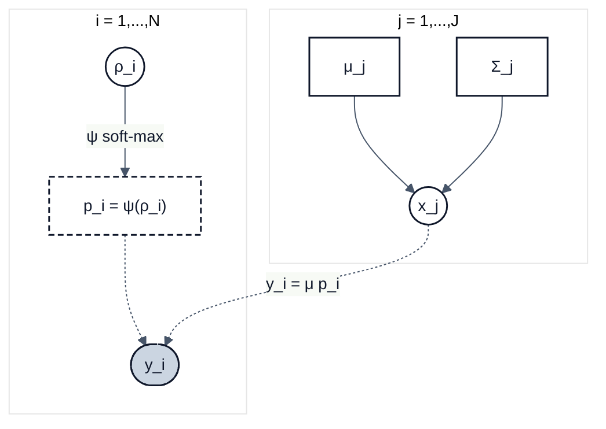

# DeCovarT

## Overview

**DeCovarT** is an R package for bulk transcriptomic deconvolution that
accounts for gene–gene covariance in purified reference populations.
Bulk observations are modelled as Gaussian convolutions of cell-type
means and covariances, with cellular proportions recovered on the open
simplex via an unconstrained (additive logistic) parametrisation.

The main entry point is
[`deconvolute_ratios()`](https://bastienchassagnol.github.io/DeCovarT/reference/deconvolute_ratios.md),
which runs one or more solvers in parallel and returns estimated
proportions plus optional benchmark metrics.

### Built-in deconvolution algorithms

| Algorithm | Interface | Notes / upstream |
|:---|:---|:---|
| **DeCovarT** (Marquardt–Levenberg) | `deconvolute_ratios_Marquardt_Levenberg` | Covariance-aware MLE [](https://github.com/bastienchassagnol/DeCovarT) |
| Ordinary least squares (`lsfit`) | `deconvolute_ratios_lsfit` | Abbas / TIMER-style OLS (base R [`stats::lsfit`](https://rdrr.io/r/stats/lsfit.html)) |
| Non-negative least squares | `deconvolute_ratios_nnls` | Lawson–Hanson NNLS [](https://github.com/cran/nnls) |
| DeconRNASeq-style QP | `deconvolute_ratios_deconrnaseq` | Simplex QP via {limSolve} [](https://github.com/cran/limSolve) |
| Robust linear model (`rlm`) | `deconvolute_ratios_rlm` | ABIS / Monaco-style RLR [](https://github.com/cran/MASS) |
| CIBERSORT-style \\\nu\\-SVR | `deconvolute_ratios_cibersort` | Linear-kernel SVR via {e1071} [](https://github.com/cran/e1071) |

All of the above ship with the package (no extra method packages
required).

### Links to the paper

- [Overleaf repository (shared with Anaïs
  Baudot)](https://www.overleaf.com/project/697398ed149e81845cb5208e)
- [HAL / arXiv archive](https://arxiv.org/pdf/2309.09557)

## Installation

Install the development version from GitHub with
[{pak}](https://pak.r-lib.org/):

``` r

if (!requireNamespace("pak", quietly = TRUE)) {
  install.packages(
    "pak",
    repos = sprintf(
      "https://r-lib.github.io/p/pak/stable/%s/%s/%s",
      .Platform$pkgType,
      R.Version()$os,
      R.Version()$arch
    )
  )
}
pak::pkg_install("bastienchassagnol/DeCovarT")
```

Alternatively with [remotes](https://remotes.r-lib.org):

``` r

# install.packages("remotes")
remotes::install_github("bastienchassagnol/DeCovarT")
```

### Developer setup (pre-commit)

Contributors should install [pre-commit](https://pre-commit.com) hooks
(Air formatting, {lintr}, parsable R, README sync). From R:

``` r

# install.packages(c("precommit", "lintr"))
precommit::install_precommit()
precommit::use_precommit()
```

Or from the shell (after `pre-commit` is on `PATH`):

``` bash
pre-commit install
pre-commit run --all-files
```

See
[`.github/CONTRIBUTING.MD`](https://bastienchassagnol.github.io/DeCovarT/.github/CONTRIBUTING.MD)
for the full contributor guide.

### Continuous integration

GitHub Actions on this repository currently cover:

- **R-CMD-check** — `R CMD check` on push / pull requests
- **pre-commit** — the same local hooks on CI
- **test-coverage** — Codecov reporting
- **pkgdown** — documentation site on GitHub Pages
- **R-hub** — optional Ubuntu + Windows checks (`workflow_dispatch`)
- **version update** — optional DESCRIPTION bumps from commit messages
  or manual dispatch

## Documentation

Package website: <https://bastienchassagnol.github.io/DeCovarT/>

**Vignettes**

- [Simulating semi-synthetic pseudo-bulk
  mixtures](https://bastienchassagnol.github.io/DeCovarT/articles/synthetic-scenarios.html)
- [Deconvolution use cases with
  DeCovarT](https://bastienchassagnol.github.io/DeCovarT/articles/DeCoVart-use-cases.html)
- [Simplex coordinate maps (ALR / additive
  logistic)](https://bastienchassagnol.github.io/DeCovarT/articles/DeCovarT-numerical-derivatives.html)
- [Softmax and ALR
  derivatives](https://bastienchassagnol.github.io/DeCovarT/articles/softmax-alr-derivatives.html)

In an R session, use
[`?DeCovarT::deconvolute_ratios`](https://bastienchassagnol.github.io/DeCovarT/reference/deconvolute_ratios.md)
(or any other exported function) for help pages.

**Troubleshooting and issues**

- Contributor guidance and common development pitfalls:
  [`.github/CONTRIBUTING.MD`](https://bastienchassagnol.github.io/DeCovarT/.github/CONTRIBUTING.MD)
- Bug reports and feature requests: [GitHub
  issues](https://github.com/bastienchassagnol/DeCovarT/issues)

Pull requests are welcome.

## The generative model of DeCovarT

Constrained DeCovarT maps unconstrained coordinates
\\\boldsymbol{\rho}\_{i}\in\mathbb{R}^{J-1}\\ to cellular proportions
\\\boldsymbol{p}\_{i}\\ on the open simplex via a regularised soft-max
\\\boldsymbol{\psi}\\, then forms the bulk observation as a Gaussian
convolution of cell-type profiles
\\\boldsymbol{x}\_{j}\sim\mathcal{N}\_{G}(\boldsymbol{\mu}\_{j},\boldsymbol{\Sigma}\_{j})\\:

\\ \boldsymbol{y}\_{i}\\\|\\\cdot \sim\mathcal{N}\_{G}\\\Bigl(
\boldsymbol{\mu}\boldsymbol{p}\_{i},\\
\sum\_{j=1}^{J}p\_{ji}^{2}\boldsymbol{\Sigma}\_{j} \Bigr). \\



Forward map \\\boldsymbol{\psi}:\boldsymbol{\rho}\mapsto\boldsymbol{p}\\
(\\C^{2}\\-diffeomorphism):

\\ p\_{j}=\frac{e^{\rho\_{j}}}{\sum\_{k\<J}e^{\rho\_{k}}+1}\\
(j\<J),\qquad p\_{J}=\frac{1}{\sum\_{k\<J}e^{\rho\_{k}}+1},\qquad
\boldsymbol{\psi}^{-1}(\boldsymbol{p})=\bigl(\ln(p\_{j}/p\_{J})\bigr)\_{j\<J}.
\\

## Compiling the LaTeX article

Source file: `article/main.tex` (bibliography:
`article/decovart_library.bib`). DAG panels in Fig.~DAG-model are drawn
with [`tikz-bayesnet`](https://ctan.org/pkg/tikz-bayesnet).

From the repository root, generate `article/main.pdf` with:

``` sh
cd article
latexmk -pdf -interaction=nonstopmode -file-line-error -synctex=1 main.tex
```

In Cursor / VS Code with **LaTeX Workshop**, use the default recipe
**latexmk** (configured in `.vscode/settings.json`), or run **“LaTeX
Workshop: Build with recipe”**.

Auxiliaries are removed automatically after a successful build
(`latex-workshop.latex.autoClean.run`: `onSucceeded`). Manual clean:
Command Palette → **“LaTeX Workshop: Clean up auxiliary files”**.

## Regenerating this README

Edit `README.qmd` (and optionally
`man/figures/decovart_constrained_dag.mmd`), then run:

``` sh
quarto render README.qmd
./scripts/fix_readme_fences.sh README.md
```

This overwrites `README.md` (GitHub Flavoured Markdown). The fence-fix
script removes the space Pandoc inserts after code-fence language tags
(needed for GitHub Mermaid rendering).

## Project structure

Package function call graph (DeCovarT → DeCovarT edges only):

``` html
<iframe
  src="output/package_network/decovart_function_network.html"
  title="DeCovarT function call graph"
  width="100%"
  height="720"
  style="border: none;"
></iframe>
```
