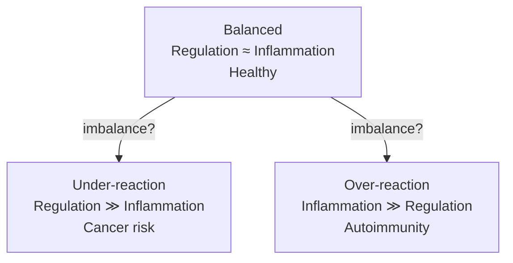
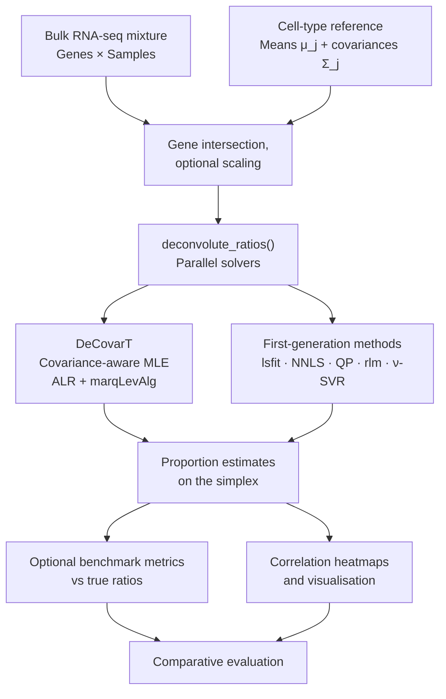
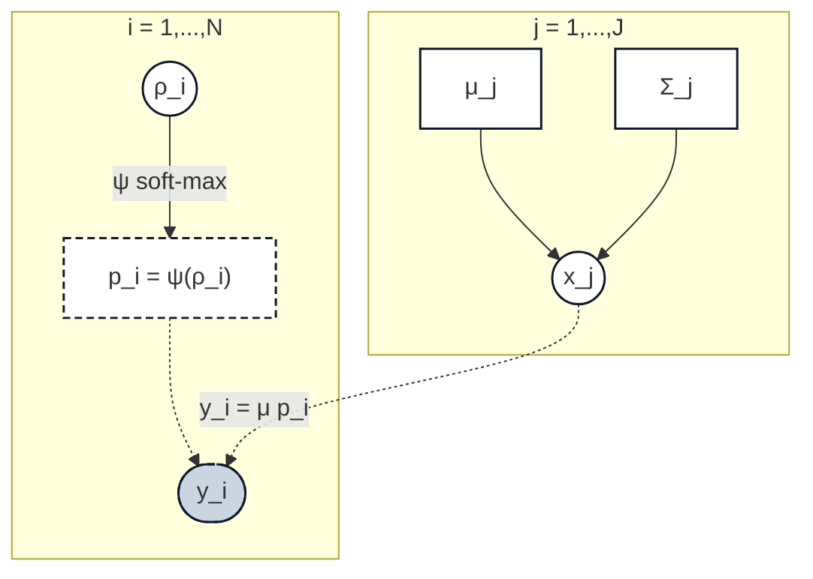

# DeCovarT

- [DeCovarT](#decovart-) [](https://bastienchassagnol.github.io/DeCovarT/)
  - [Overview](#overview)
    - [Seminar slides (iframe)](#seminar-slides-iframe)
  - [Pipeline Architecture](#pipeline-architecture)
    - [Interactive package structure](#interactive-package-structure)
    - [Built-in deconvolution
      algorithms](#built-in-deconvolution-algorithms)
    - [Links to the paper](#links-to-the-paper)
  - [Installation](#installation)
    - [Developer setup (pre-commit)](#developer-setup-pre-commit)
    - [Continuous integration](#continuous-integration)
  - [Documentation](#documentation)
  - [The generative model of
    DeCovarT](#the-generative-model-of-decovart)
  - [Compiling the LaTeX article](#compiling-the-latex-article)


## Overview

**DeCovarT** is an R package for bulk transcriptomic deconvolution that
accounts for gene–gene covariance in purified reference populations.
Bulk observations are modelled as Gaussian convolutions of cell-type
means and covariances, with cellular proportions recovered on the open
simplex via an unconstrained (additive logistic) parametrisation.

The main entry point is
[`deconvolute_ratios()`](https://bastienchassagnol.github.io/DeCovarT/reference/deconvolute_ratios.md),
which runs one or more solvers in parallel and returns estimated
proportions plus optional benchmark metrics.

### Seminar slides (iframe)

Doctorants seminar overview (Quarto reveal.js). Prefer [full
screen](https://bastienchassagnol.github.io/DeCovarT/slides/index.html)
when presenting.

# Cellular deconvolution with DeCovarT

A network-centric view of bulk mixtures

Bastien Chassagnol

MMG / LPSM / INSERM

Gregory Nuel

Etienne Becht

Anaïs Baudot

2026-08-27

## 

Cellular deconvolution

DeCovarT: a network-centric approach to bulk mixtures

------------------------------------------------------------------------

Bastien Chassagnol  
*MMG*

Gregory Nuel  
*LPSM*

Etienne Becht  
*INSERM*

Anaïs Baudot  
*MMG*

Slides:
[GitHub](https://github.com/bastienchassagnol/DeCovarT/tree/main/slides)
· Full screen after render: `slides/index.html`

## Outline

1.  Why deconvolution?
2.  A review of deconvolution techniques
3.  DeCovarT: a network-centric approach
4.  Biological applications and perspectives
5.  Quiz

# Why deconvolution?

## Quantify components of biological systems

Bulk tissues mix cell populations. Autoimmunity and cancer change both
**composition** and **state** of those populations ([Schnell et al.
2020](#/references)).

Figure 1: Immune balance as a seesaw between regulation and
inflammation.

Schnell et al. ([2020](#/references))

## Immune balance (schematic)

Complementary schematic of [Figure 1](#/fig-immune-balance):



Figure 2: Healthy balance vs under- and over-reaction.

Schnell et al. ([2020](#/references))

## Holistic complexity

Genes cooperate in pathways; metabolites and cell populations interact
in bio-molecular networks. Deconvolution alone is not enough — we need
**structure** on the gene side as well ([Schnell et al.
2020](#/references)).

Figure 3: Holistic view: transcriptome and cell populations feed immune
balance.

Schnell et al. ([2020](#/references))

## Why bulk is limited for biomarkers

Shoemaker et al. ([2012](#/references)): the same bulk fold-change can
come from

- **Scenario A** — activation within an existing cell type
  1.  
- **Scenario B** — arrival of a new cell population
  ([Figure 5](#/fig-bulk-b))

Figure 4: Scenario A: within-type activation.

Figure 5: Scenario B: new population.

Shoemaker et al. ([2012](#/references))

## Technical alternatives

Figure 6: Bulk versus single-cell trade-offs.

**Bulk RNA-seq**

- Cheaper, larger cohorts
- Longitudinal studies
- Aggregates heterogeneous signals

**Single-cell / spatial**

- Resolve rare types & lineages
- Costly, noisy, heavy compute
- Complements bulk rather than replaces it

Deconvolution recovers cell-type proportions from bulk when single-cell
is impractical at scale.

# Review of techniques

## The ecosystem of algorithms

Taxonomy after Shen-Orr & Gannett (2013) and reviews such as Avila Cobos
et al. ([2018](#/references)), Gaspard-Boulinc et al.
([2025](#/references)):

- **Partial deconvolution** — estimate proportions \\p\\ given signature
  \\X\\
- **Complete deconvolution** — jointly infer \\p\\ and \\X\\ (ill-posed
  without priors)

## Granularity

Deconvolution targets vary:

- Mixtures of **cell populations** (e.g. immune fractions)
- Mixtures of **tissues** (e.g. tumour purity)
- Mixtures of **cell-cycle phases**

## Reference-based principle

Figure 7: Signature \\X\\, bulk \\y\\, proportions \\p\\.

1.  Purified cellular profiles (signature matrix \\X\\)
2.  Bulk mixture \\y\\
3.  Estimate proportions \\p\\ (often with simplex constraints)

Classic tools include DeconRNASeq ([Gong and Szustakowski
2013](#/references)), CIBERSORT ([Newman et al. 2015](#/references)),
and EPIC ([Racle et al. 2017](#/references)).

Avila Cobos et al. ([2018](#/references))

## Signature-based families

Compact survey of common reference-based tools
([Table 1](#/tbl-methods)):

Table 1: Selected reference-based deconvolution methods.

**Regression**

- Quadratic programming (DeconRNASeq)
- Robust / SVR (CIBERSORT, FARDEEP)
- Weighted QP (EPIC, quanTIseq)

**Probabilistic**

- Continuous: DSection, DeMix
- Discrete: PERT, TEMT

# DeCovarT

## Global pipeline

Figure 8: From references to biological exploitation.

1.  Collect / curate cell-type datasets
2.  Learn features & GRN structure
3.  **DeCovarT** estimation of \\p\\
4.  Biological exploitation

Avila Cobos et al. ([2018](#/references))

## Multivariate Gaussian convolution

Cell type \\j\\: \\x_j \sim \mathcal{N}\_G(\mu_j, \Sigma_j)\\.

Bulk observation ([Equation 1](#/eq-bulk-gauss)):

\\ y \mid p \\\sim\\ \mathcal{N}\_G\\\Bigl( \mu p,\\ \sum_j
p_j^{2}\\\Sigma_j \Bigr). \tag{1}\\

- \\G\\: number of genes (dimension of \\y\\)
- \\J\\: number of cell types; \\p \in \Delta^{J-1}\\
- \\\mu\\: \\G \times J\\ mean signature; \\\Sigma_j\\: gene–gene
  covariance of type \\j\\

Covariance structure enters the likelihood — gene–gene dependence is
first-class, not noise.

Figure 9: Another view of the convolution principle.

## Unit-simplex constraint

Proportions live on \\\Delta^{J-1}\\. DeCovarT uses an unconstrained map
\\\rho \mapsto p\\ (additive logistic / soft-max) that is a
\\C^{2}\\-diffeomorphism, then optimises with Marquardt–Levenberg.

## Toy model (2 cells × 2 genes)

Bivariate convolutions make the geometry visible: entropy of \\p\\,
overlap of \\\Sigma_j\\, and solver behaviour (DeconRNASeq vs DeCovarT).
See [Figure 10](#/fig-toy-model) and [Figure 11](#/fig-toy-results).

Figure 10: Toy bivariate setup.

Figure 11: Toy estimation results.

Package vignettes: [synthetic
scenarios](../vignettes/synthetic-scenarios.qmd) and
[`benchmark_bivariate_gaussian_convolutions()`](https://bastienchassagnol.github.io/DeCovarT/reference/benchmark_bivariate_gaussian_convolutions.html).

# Applications & perspectives

## Sjögren’s disease

Transcriptomic patient clusters and IFN modules motivate
composition-aware analysis of immune infiltration ([Soret et al.
2021](#/references)).

Figure 12: Sjögren patient stratification motivating deconvolution.

Soret et al. ([2021](#/references))

## DTOO / gastruloid perspectives

Digital twins and multimodal gastruloid maps need deconvolution across
bulk, single-cell, and ATAC layers — composition + covariance again.

## Spatial deconvolution (outlook)

Emerging toolkits mix ([Gaspard-Boulinc et al. 2025](#/references)):

- Graph / optimal transport pairing of cells to spots
- Bayesian count models (NB, Poisson–gamma, topic models)
- Regression with simplex / robust / ensemble constraints

Gaspard-Boulinc et al. ([2025](#/references))

## Perspectives for DeCovarT

- Rare / unknown cell content and spillover
- Multi-omics and spatio-temporal resolution
- Hierarchical ontologies (coarse vs fine labels)
- Compositional statistics on \\p\\

# Quiz

## What does reference-based deconvolution estimate?

- Gene regulatory network topology only
- Cell-type proportions \\p\\ given a signature \\X\\
- Single-cell UMAP embeddings
- Batch-correction factors alone

## Which statement about DeCovarT is true?

- It ignores gene–gene covariance
- It models bulk as a Gaussian convolution with covariance \\\sum_j
  p_j^2\Sigma_j\\
- It only works on DNA methylation
- It requires spatial coordinates for every cell

## Scenario A vs B (Shoemaker 2012)

A bulk gene increases. Scenario B means:

- The same cell type up-regulates the gene
- A new cell population arrives in the mixture
- Sequencing depth doubled
- The gene was a spike-in control

# Acknowledgements

## Thanks

**Supervision & co-authors**

- Anaïs Baudot
- Gregory Nuel
- Etienne Becht
- Marielle Péré

**Collaborators**

- SysBioMed / MMG colleagues
- Doctorants seminar organisers

## Take-away messages

- Bulk mixes cell types; deconvolution recovers proportions \\p\\.
- Reference-based methods need a signature \\X\\; unsupervised methods
  need strong priors ([Table 1](#/tbl-methods)).
- DeCovarT models gene–gene covariance via multivariate Gaussian
  convolutions ([Equation 1](#/eq-bulk-gauss)).
- Always validate with aliquots (bulk + FACS / scRNA-seq) when possible.

## References

Avila Cobos, Francisco, Jo Vandesompele, Pieter Mestdagh, and Katleen De
Preter. 2018. ‘Computational Deconvolution of Transcriptomics Data from
Mixed Cell Populations’. *Bioinformatics (Oxford, England)* 34.
<https://doi.org/10.1093/bioinformatics/bty019>.

Gaspard-Boulinc, Lucie C., Luca Gortana, Thomas Walter, Emmanuel
Barillot, and Florence M. G. Cavalli. 2025. ‘Cell-Type Deconvolution
Methods for Spatial Transcriptomics’. *Nature Reviews Genetics* 26.
<https://doi.org/10.1038/s41576-025-00845-y>.

Gong, Ting, and Joseph D. Szustakowski. 2013. ‘DeconRNASeq: A
Statistical Framework for Deconvolution of Heterogeneous Tissue Samples
Based on mRNA-Seq Data’. *Bioinformatics (Oxford, England)* 29.
<https://doi.org/10.1093/bioinformatics/btt090>.

Newman, Aaron, Chih Liu, Michael Green, et al. 2015. ‘Robust Enumeration
of Cell Subsets from Tissue Expression Profiles’. *Nature Methods* 12.
<https://doi.org/10.1038/nmeth.3337>.

Racle, Julien, Kaat de Jonge, Petra Baumgaertner, Daniel E Speiser, and
David Gfeller. 2017. ‘Simultaneous Enumeration of Cancer and Immune Cell
Types from Bulk Tumor Gene Expression Data’. *eLife* 6.
<https://doi.org/10.7554/elife.26476>.

Schnell, Alexandra, Lloyd Bod, Asaf Madi, and Vijay K. Kuchroo. 2020.
‘The Yin and Yang of Co-Inhibitory Receptors: Toward Anti-Tumor Immunity
Without Autoimmunity’. *Cell Research* 30.
<https://doi.org/10.1038/s41422-020-0277-x>.

Shoemaker, Jason E., Tiago JS Lopes, Samik Ghosh, Yukiko Matsuoka,
Yoshihiro Kawaoka, and Hiroaki Kitano. 2012. ‘CTen: A Web-Based Platform
for Identifying Enriched Cell Types from Heterogeneous Microarray Data’.
*BMC Genomics* 13. <https://doi.org/10.1186/1471-2164-13-460>.

Soret, Perrine, Christelle Le Dantec, Emiko Desvaux, et al. 2021. ‘A New
Molecular Classification to Drive Precision Treatment Strategies in
Primary Sjögren’s Syndrome’. *Nature Communications* 12.
<https://doi.org/10.1038/s41467-021-23949-4>.

DeCovarT — doctorants seminar

## Pipeline Architecture



The diagram above summarises the end-to-end workflow.

> This package combines **Gaussian mixture convolution modelling,
> simplex reparametrisation (ALR / soft-max), analytic likelihood
> derivatives, and classical linear deconvolution baselines** on bulk
> transcriptomic mixtures. Solver outputs remain method-specific; shared
> evaluation uses standardised proportion tables and optional
> ground-truth ratios from simulations.

### Interactive package structure

Prefer the [full-screen
network](https://bastienchassagnol.github.io/DeCovarT/package_network/decovart_function_network.html)
when exploring call relationships. Regenerate locally with
`source("scripts/auxiliary/generate_package_network_functions.R")`.

### Built-in deconvolution algorithms

| Algorithm | Interface | Notes / upstream |
|:---|:---|:---|
| **DeCovarT** (Marquardt–Levenberg) | `deconvolute_ratios_Marquardt_Levenberg` | Covariance-aware MLE [](https://github.com/bastienchassagnol/DeCovarT) |
| Ordinary least squares (`lsfit`) | `deconvolute_ratios_lsfit` | Abbas / TIMER-style OLS (base R [`stats::lsfit`](https://rdrr.io/r/stats/lsfit.html)) |
| Non-negative least squares | `deconvolute_ratios_nnls` | Lawson–Hanson NNLS [](https://github.com/cran/nnls) |
| DeconRNASeq-style QP | `deconvolute_ratios_deconrnaseq` | Simplex QP via {limSolve} [](https://github.com/cran/limSolve) |
| Robust linear model (`rlm`) | `deconvolute_ratios_rlm` | ABIS / Monaco-style RLR [](https://github.com/cran/MASS) |
| CIBERSORT-style \nu-SVR | `deconvolute_ratios_cibersort` | Linear-kernel SVR via {e1071} [](https://github.com/cran/e1071) |

All of the above ship with the package (no extra method packages
required).

### Links to the paper

- [arXiv:2309.09557](https://arxiv.org/abs/2309.09557) (also on HAL)
- PDF: [arXiv PDF](https://arxiv.org/pdf/2309.09557)

## Installation

Install from CRAN:

``` r

install.packages("DeCovarT")
```

The development version from GitHub with
[{pak}](https://pak.r-lib.org/):

``` r

if (!requireNamespace("pak", quietly = TRUE)) {
  install.packages(
    "pak",
    repos = sprintf(
      "https://r-lib.github.io/p/pak/stable/%s/%s/%s",
      .Platform$pkgType,
      R.Version()$os,
      R.Version()$arch
    )
  )
}
pak::pkg_install("bastienchassagnol/DeCovarT")
```

Alternatively with [remotes](https://remotes.r-lib.org):

``` r

# install.packages("remotes")
remotes::install_github("bastienchassagnol/DeCovarT")
```

### Developer setup (pre-commit)

Contributors should install [pre-commit](https://pre-commit.com) hooks
(Air formatting, {lintr}, parsable R). From R:

``` r

# install.packages(c("precommit", "lintr"))
precommit::install_precommit()
precommit::use_precommit()
```

Or from the shell (after `pre-commit` is on `PATH`):

``` bash
pre-commit install
pre-commit run --all-files
```

Edit `README.qmd`, then regenerate GitHub Flavoured Markdown locally:

``` bash
quarto render README.qmd
git add README.qmd README.md
```

CI fails the pull request if committed `README.md` is stale relative to
`README.qmd` (see `.github/workflows/render-readme.yaml`). On `main`,
the same workflow can commit a fresh render when needed, following the
[quarto-ext
render-readme](https://github.com/quarto-ext/.github/blob/main/.github/workflows/render-readme.yaml)
pattern.

See the [contributor
guide](https://github.com/bastienchassagnol/DeCovarT/blob/main/.github/CONTRIBUTING.MD)
for the full contributor guide.

### Continuous integration

GitHub Actions on this repository currently cover:

- **R-CMD-check** — `R CMD check` on push / pull requests
- **pre-commit** — the same local hooks on CI
- **render-readme** — Quarto GFM render; verify on PRs, commit on `main`
- **test-coverage** — Codecov reporting (commit message contains
  `test coverage`)
- **pkgdown** — documentation site on GitHub Pages
- **article generation** — optional `latexmk` build of
  `article/main.tex` when the commit message contains
  `article generation` (PDF artefact + `docs/article/main.pdf` on Pages)
- **R-hub** — optional Ubuntu + Windows checks (`workflow_dispatch`)
- **version update** — optional DESCRIPTION bumps from commit messages
  or manual dispatch

## Documentation

Package website: <https://bastienchassagnol.github.io/DeCovarT/>

**Vignettes**

- [Simulating semi-synthetic pseudo-bulk
  mixtures](https://bastienchassagnol.github.io/DeCovarT/articles/synthetic-scenarios.html)
- [Manuscript synthetic simulation
  scenarios](https://bastienchassagnol.github.io/DeCovarT/articles/DeCovarT-manuscript-scenarios.html)
- [Derivatives under simplex
  transforms](https://bastienchassagnol.github.io/DeCovarT/articles/generative-model-derivatives.html)
- [MLE properties and asymptotic
  inference](https://bastienchassagnol.github.io/DeCovarT/articles/DeCovarT-MLE-properties.html)

In an R session, use
[`?DeCovarT::deconvolute_ratios`](https://bastienchassagnol.github.io/DeCovarT/reference/deconvolute_ratios.md)
(or any other exported function) for help pages.

**Troubleshooting and issues**

- Contributor guidance and common development pitfalls: [contributor
  guide](https://github.com/bastienchassagnol/DeCovarT/blob/main/.github/CONTRIBUTING.MD)
- Bug reports and feature requests: [GitHub
  issues](https://github.com/bastienchassagnol/DeCovarT/issues)

Pull requests are welcome.

## The generative model of DeCovarT

Constrained DeCovarT maps unconstrained coordinates
\boldsymbol{\rho}\_{i}\in\mathbb{R}^{J-1} to cellular proportions
\boldsymbol{p}\_{i} on the open simplex via a regularised soft-max
\boldsymbol{\psi}, then forms the bulk observation as a Gaussian
convolution of cell-type profiles
\boldsymbol{x}\_{j}\sim\mathcal{N}\_{G}(\boldsymbol{\mu}\_{j},\boldsymbol{\Sigma}\_{j}):

\boldsymbol{y}\_{i}\\\|\\\cdot \sim\mathcal{N}\_{G}\\\Bigl(
\boldsymbol{\mu}\boldsymbol{p}\_{i},\\
\sum\_{j=1}^{J}p\_{ji}^{2}\boldsymbol{\Sigma}\_{j} \Bigr).



The diagram above shows the constrained graphical model.

Forward map \boldsymbol{\psi}:\boldsymbol{\rho}\mapsto\boldsymbol{p}
(C^{2}-diffeomorphism):

p\_{j}=\frac{e^{\rho\_{j}}}{\sum\_{k\<J}e^{\rho\_{k}}+1}\\ (j\<J),\qquad
p\_{J}=\frac{1}{\sum\_{k\<J}e^{\rho\_{k}}+1},\qquad
\boldsymbol{\psi}^{-1}(\boldsymbol{p})=\bigl(\ln(p\_{j}/p\_{J})\bigr)\_{j\<J}.

## Compiling the LaTeX article

Source file: `article/main.tex` (bibliography:
`article/decovart_library.bib`). DAG panels in Fig.~DAG-model are drawn
with [`tikz-bayesnet`](https://ctan.org/pkg/tikz-bayesnet).

**Published PDF:** the peer-reviewed / preprint PDF is on
[arXiv:2309.09557](https://arxiv.org/pdf/2309.09557). When a `main`
commit message contains `article generation`, CI also builds
`article/main.tex` and may publish `docs/article/main.pdf` on the
pkgdown site.

From the repository root, generate `article/main.pdf` locally with:

``` sh
cd article
latexmk -pdf -interaction=nonstopmode -file-line-error -synctex=1 main.tex
```
