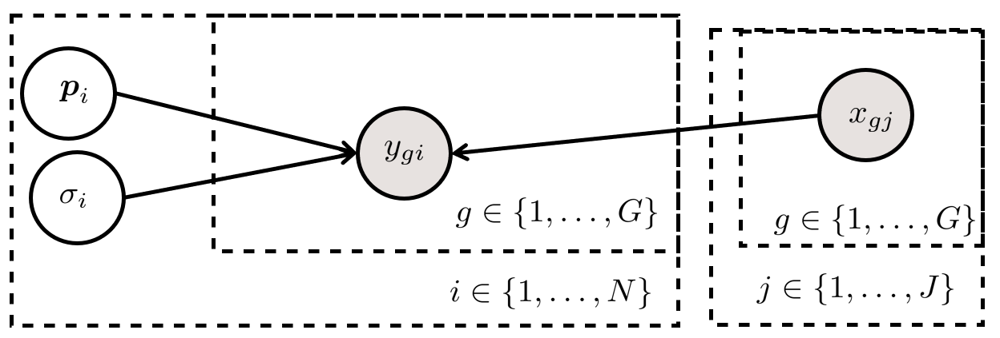
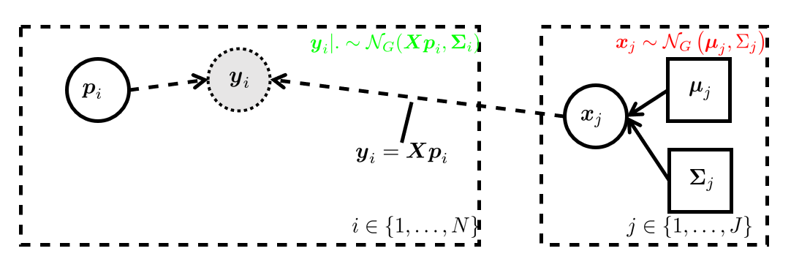
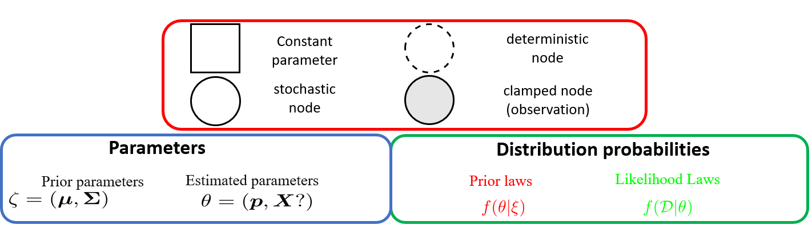
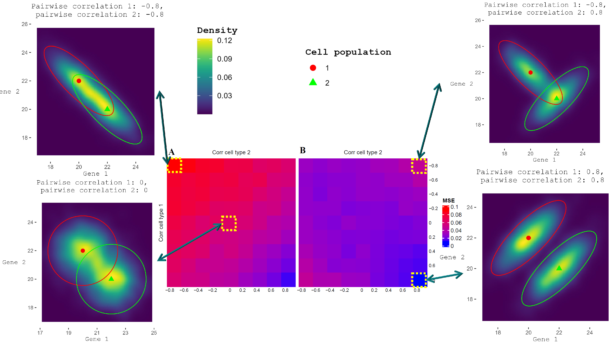

# Model


```{r html-output-config, include = FALSE, eval=knitr::is_html_output()}
knitr::opts_chunk$set(
  collapse = TRUE,
  comment = "#>",
  fig.align = "center",
  fig.fullwidth = TRUE,
  # We use the implementation available in the
  # message = FALSE,
  # warning = FALSE,
  cache = FALSE, lazy.cache = FALSE
)
options(rmarkdown.html_vignette.check_title = FALSE) # generate customised vignette title
# rmarkdown::render("DeCoVart-use-cases.Rmd", output_format = 'all')
```

```{r pdf-output-config, include = FALSE, eval=knitr::is_latex_output()}
knitr::opts_chunk$set(
  collapse = TRUE,
  comment = "#>",
  fig.align = "center",
  out.width = "90%",
  message = FALSE,
  warning = FALSE,
  echo = FALSE,
  cache = FALSE, lazy.cache = FALSE
)
```

```{r setup}
html_ouput <- knitr::is_html_output() # store which type is asked as an output
library(DeCovarT)
library(ggplot2)
library(dplyr)
library(pkgdown) # generate automated links to R packages and functions
library(kableExtra)
library(flextable)

# define function to automaticaly colour some sections, with respect to the output of the document
colorize <- function(x, color) {
  if (knitr::is_latex_output()) {
    sprintf("\\textcolor{%s}{%s}", color, x)
  } else {
    sprintf("<span style='color: %s;'>%s</span>", color, x)
  }
}
```


We introduce the following notations:

* $(\boldsymbol{y}=(y_{gi}) \in \mathbb{R}_+^{G\times N}$ is the global bulk transcriptomic expression, measured in $N$ individuals.
*  $\boldsymbol{X}=(x_{gj}) \in \mathcal{M}_{\RR^{G\times J}}$ the signature matrix of the mean expression of $G$ genes in $J$ purified cell populations.
* $\boldsymbol{p}=(p_{ji})\in ]0, 1[^{J \times N}$ the unknown relative proportions of cell populations in $N$ samples

As in most traditional deconvolution models, we assume that the total bulk expression can be reconstructed by summing the individual contributions of each cell population weighted by its frequency, as stated explicitly in the following linear matricial relationship (Eq.\@ref(eq:deconvolution-problem)):

```{=tex}
\begin{equation}
\boldsymbol{y}=\boldsymbol{X} \times \boldsymbol{p}
(\#eq:deconvolution-problem)
\end{equation} 
```

In addition, we consider the following unit simplex constraint on the cellular ratios (Eq.\@ref(eq:positive-ratios)):

```{=tex}
\begin{equation}
\begin{cases}
\sum_{j=1}^J p_{j}=1\\
\forall j \in \widetilde{J} \quad p_j\ge 0
\end{cases}
(\#eq:positive-ratios)
\end{equation} 
```

## Rationale of the new generative model

However, in real conditions with technical and environmental variability, the strict linearity of the deconvolution does not strictly hold. Thus, an additional error term is usually added, assumed to follow a *homoscedastic* zero-centred Gaussian distribution and with pairwise independent response measures while the exogenous variables (here, the purified expression profiles) are supposed determined: this set of conditions is referred to as the Gaussian-Markow assumptions. In that configuration, the MLE (maximum likelihood estimate) that bast describes this standard linear model is equal to the ordinary least squares (OLS) estimate. 


In contrast to this canonical approach, in DeCovarT, we relax the *exogeneity* property by treating exogenous variables $\boldsymbol{X}$ as random variables rather than determined measures, in a process close to the approach of the DSection algorithm [@erkkila_etal10]. However, to our knowledge, we are the first to weaken the independence assumption between observations by explicitly incorporating the intrinsic covariance structure of the transcriptome of each purified cell population.
To do so, we conjecture that the $G$-dimensional vector $\boldsymbol{x}_j$ characterising the transcriptomic expression of each cell population follows a multivariate Gaussian distribution: $\boldsymbol{x}_j \sim \mathcal{N}_G(\boldsymbol{\mu}_{.j}, \boldsymbol{\Sigma}_{j})$, with $\boldsymbol{\mu}_{.j}$ the mean purified transcriptomic expression and $\boldsymbol{\Sigma}_{j}$ the covariance matrix, that we constrain to be positive-definite and of full rank and that is inferred using the output of the gLasso algorithm [@mazumder_hastie11]. We display respectively the graphical models associated to the standard linear deconvolution model and our new innovative generative model used by the DeCovarT algorithm in subfigures a) and b), in Fig.`r knitr::asis_output(ifelse(knitr::is_html_output(), '\\@ref(fig:load-DAG-html)', '\\@ref(fig:load-DAG-pdf)'))`.

```{r load-DAG-html, echo = FALSE, fig.cap="We use the standard graphical convention of graphical models, as depicted in [RevBayes](https://revbayes.github.io/tutorials/intro/graph_models.html) webpage. For identifiability reasons, we conjecture that all variability arises from the stochastic nature of the covariates.", fig.show = "hold", eval=knitr::is_html_output(), out.width="45%"}



```


```{r load-DAG-pdf, echo = FALSE, fig.cap="We use the standard graphical convention of graphical models, as depicted in \\href{https://revbayes.github.io/tutorials/intro/graph_models.html}{RevBayes} webpage. For identifiability reasons, we conjecture that all variability arises from the stochastic nature of the covariates.", fig.subcap=c("Visual representation of the linear regression graphical model", "Visual representation of the graphical model underlying the DeCovarT generative model", "Legend displaying the main symbols and laws used in a graphical model."), out.width="40%", fig.ncol = 2, eval=knitr::is_latex_output()}


```

## Derivation of the log-likelihood

First, we *plugged-in* the mean and covariance parameters $\zeta_j=\left(\boldsymbol{\mu}_{.j}, \boldsymbol{\Sigma}_j\right)$ inferred in the previous step. 
Then, by letting $\boldsymbol{\zeta}=(\boldsymbol{\mu}, \boldsymbol{\Sigma}), \quad \boldsymbol{\mu}=(\boldsymbol{\mu}_{.j})_{j \in \widetilde{J}} \in \mathcal{M}_{G \times J}, \quad \boldsymbol{\Sigma} \in \mathcal{M}_{G \times G}$ the known parameters and $\boldsymbol{p}$ the unknown cellular ratios, the conditional distribution $\boldsymbol{y}|(\boldsymbol{\zeta}, \boldsymbol{p})$ is the convolution of pairwise independent multivariate Gaussian distributions, which is also a multivariate Gaussian distribution (Eq.\@ref(eq:conditional-multivariate-distribution)), deduced from the *affine invariant* property of Gaussian distributions.

```{=tex}
\begin{equation}
\boldsymbol{y}|(\boldsymbol{\zeta}, \boldsymbol{p}) \sim \mathcal{N}_G(\boldsymbol{\mu} \boldsymbol{p}, \boldsymbol{\Sigma}) \text{ with } \boldsymbol{\mu} = (\boldsymbol{\mu}_{.j})_{j \in \widetilde{J}}, \quad \boldsymbol {p}=(p_1, \ldots, p_J) \text{ and } \boldsymbol{\Sigma}=\sum_{j=1}^J p_{j}^2\boldsymbol{\Sigma}_{j}
(\#eq:conditional-multivariate-distribution)
\end{equation}
```

From Eq.\@ref(eq:conditional-multivariate-distribution), we readily compute the associated conditional log-likelihood (Eq.\@ref(eq:loglikelihood-multivariate-gaussian)):

```{=tex}
\begin{equation}
\ell_{\boldsymbol{y} | \boldsymbol{\zeta}}(\boldsymbol{p})=C + \log\left(\DET \left(\sum_{j=1}^J p_{j}^2\boldsymbol{\Sigma}_{j}\right)^{-1}\right) - \frac{1}{2} (\boldsymbol{y} - \boldsymbol{p} \boldsymbol{\mu})^\top \left(\sum_{j=1}^J p_{j}^2\boldsymbol{\Sigma}_{j}\right)^{-1} (\boldsymbol{y} - \boldsymbol{p}\boldsymbol{\mu})
(\#eq:loglikelihood-multivariate-gaussian)
\end{equation}
```

## First and second-order derivation of the unconstrained DeCovarT log-likelihood function

The stationary points of a function and notably maxima, are given by the roots (the values at which the function crosses the $x$-axis) of its gradient, in our context, the vector: $\nabla \ell: \RR^J \to \RR^J$ evaluated at point $\nabla \ell (\boldsymbol{p}): ]0, 1[^J \to \RR^J$. Since the computation is the same for any cell ratio $p_j$, we give an explicit formula for only one of them (Eq.\@ref(eq:derivative-log-likelihood-unconstrained)):

```{=tex}
\begin{equation}
\begin{split}
 \frac{\partial \ell_{\boldsymbol{y} | \boldsymbol{\zeta}}(\boldsymbol{p})}{\partial p_j} =& \scriptstyle \frac{\partial \log\left(\DET(\boldsymbol{\Theta})\right)}{\partial p_j} -\frac{1}{2} \left[\frac{\partial (\boldsymbol{y} - \boldsymbol{\mu} \boldsymbol{p})^\top}{\partial p_j}\boldsymbol{\Theta}(\boldsymbol{y} - \boldsymbol{\mu} \boldsymbol{p}) + (\boldsymbol{y} - \boldsymbol{\mu} \boldsymbol{p})^\top\frac{\partial\boldsymbol{\Theta}}{\partial p_j}(\boldsymbol{y} - \boldsymbol{\mu} \boldsymbol{p}) + (\boldsymbol{y} - \boldsymbol{\mu} \boldsymbol{p})^\top\boldsymbol{\Theta} \frac{\partial (\boldsymbol{y} - \boldsymbol{\mu} \boldsymbol{p})}{\partial p_j} \right]\\
=&  \scriptstyle -\Tr \left(\boldsymbol{\Theta} \frac{\partial \boldsymbol{\Sigma}}{\partial p_j} \right) - \frac{1}{2} \left[ - \boldsymbol{\mu}_{.j}^\top\boldsymbol{\Theta}(\boldsymbol{y} - \boldsymbol{\mu} \boldsymbol{p}) - (\boldsymbol{y} - \boldsymbol{\mu} \boldsymbol{p})^\top\Theta\frac{\partial \Sigma}{\partial p_j}\Theta(\boldsymbol{y} - \boldsymbol{\mu} \boldsymbol{p}) - (\boldsymbol{y} - \boldsymbol{\mu} \boldsymbol{p})^\top\boldsymbol{\Theta}  \boldsymbol{\mu}_{.j} \right] \\
=& -2p_j \Tr \left(\boldsymbol{\Theta}\boldsymbol{\Sigma}_j\right) +
(\boldsymbol{y} - \boldsymbol{\mu} \boldsymbol{p})^\top\boldsymbol{\Theta}  \boldsymbol{\mu}_{.j} \, +
p_j (\boldsymbol{y} - \boldsymbol{\mu} \boldsymbol{p})^\top\boldsymbol{\Theta} \Sigma_j \boldsymbol{\Theta} (\boldsymbol{y} - \boldsymbol{\mu} \boldsymbol{p})
\end{split}
(\#eq:derivative-log-likelihood-unconstrained)
\end{equation}
```


Since the solution to $\nabla \left( \ell_{\boldsymbol{y} | \boldsymbol{\zeta}}(\boldsymbol{p}) \right) =0$ is not closed, we had to approximate the MLE using iterated numerical optimisation methods. Some of them, such as the Levenberg–Marquardt algorithm, require a second-order approximation of the function, which needs the computation of the Hessian matrix. Deriving once more Eq.\@ref(eq:hessian-log-likelihood-unconstrained) yields the Hessian matrix,  $\mathbf{H} \in \mathcal{M}_{J \times J}$ is given by: 

```{=tex}
\begin{equation}
\begin{aligned}
\mathbf{H}_{i,i}& =
   \frac{\partial^2 \ell}{\partial^2 p_i} =
-2\Tr \left(\boldsymbol{\Theta}\boldsymbol{\Sigma}_i\right) + 4p_i^2 \Tr \left(\left(\boldsymbol{\Theta}\boldsymbol{\Sigma}_i\right)^2\right)
-2p_i(\boldsymbol{y} - \boldsymbol{\mu} \boldsymbol{p})^\top\boldsymbol{\Theta} \boldsymbol{\Sigma}_i \boldsymbol{\Theta} \boldsymbol{\mu_{.i}}\, - \boldsymbol{\mu}_{.i}^\top\boldsymbol{\Theta} \boldsymbol{\mu_{.i}} \, - \\
& 2p_i (\boldsymbol{y} - \boldsymbol{\mu} \boldsymbol{p})^\top \boldsymbol{\Theta}\boldsymbol{\Sigma}_i\boldsymbol{\Theta}\boldsymbol{\mu}_{.i \, -
(\boldsymbol{y} - \boldsymbol{\mu} \boldsymbol{p})^\top\boldsymbol{\Theta} \left(4p_i^2 \boldsymbol{\Sigma}_i \boldsymbol{\Theta} \boldsymbol{\Sigma}_i - \boldsymbol{\Sigma}_i \right)\boldsymbol{\Theta} (\boldsymbol{y} - \boldsymbol{\mu} \boldsymbol{p})}, \quad i \in \widetilde{J} \\
\mathbf{H}_{i,j} &=
   \frac{\partial^2 \ell}{\partial p_i \partial p_j} =
4p_j p_i \Tr \left(\boldsymbol{\Theta}\boldsymbol{\Sigma}_j \boldsymbol{\Theta}\boldsymbol{\Sigma}_i \right)
-2p_i(\boldsymbol{y} - \boldsymbol{\mu} \boldsymbol{p})^\top\boldsymbol{\Theta} \boldsymbol{\Sigma}_i \boldsymbol{\Theta} \boldsymbol{\mu_{.j}} - \boldsymbol{\mu}_{.i}^\top\boldsymbol{\Theta} \boldsymbol{\mu_{.j}} \, - \\
& 2p_j (\boldsymbol{y} - \boldsymbol{\mu} \boldsymbol{p})^\top \boldsymbol{\Theta}\boldsymbol{\Sigma}_j\boldsymbol{\Theta} \boldsymbol{\mu}_{.i\, -
4p_ip_j(\boldsymbol{y} - \boldsymbol{\mu} \boldsymbol{p})^\top\boldsymbol{\Theta}\boldsymbol{\Sigma}_i \boldsymbol{\Theta} \boldsymbol{\Sigma}_j \boldsymbol{\Theta} (\boldsymbol{y} - \boldsymbol{\mu} \boldsymbol{p})}, \quad (i,j) \in \widetilde{J}^2, i \neq j
  \end{aligned}
(\#eq:hessian-log-likelihood-unconstrained)
\end{equation}
```


in which the coloured sections pair one by one with the corresponding coloured sections of the gradient, given in Eq.\@ref(eq:derivative-log-likelihood-unconstrained). Matrix calculus can largely ease the derivation of complex algebraic expressions, thus we remind in Appendix [Matrix calculus](#matrix-calculus) relevant matrix properties and derivations ^[The numerical consistency of these derivatives was asserted with the `r knitr::asis_output(ifelse(knitr::is_html_output(), downlit::autolink("numDeriv::genD"),   '\\CRANpkg{numDeriv}'))` package, using the more stable Richardson’s extrapolation].

However, the explicit formulas for the gradient and the Hessian matrix of the log-likelihood function, given in Eq.\@ref(eq:derivative-log-likelihood-unconstrained) and Eq.\@ref(eq:hessian-log-likelihood-unconstrained) respectively, do not take into account the simplex constraint assigned to the ratios. While some optimisation methods use heuristic methods to solve this problem, we consider alternatively a reparametrised version of the problem, detailed comprehensively in Appendix [Reparametrised log-likelihood](#constrained-optimisation).

## Iterated optimisation

The MLE is traditionally retrieved from the roots of the gradient of the log-likelihood. However, in our generative framework, cancelling the gradient of Equation \@ref(eq:loglikelihood-multivariate-gaussian) reveals a non-closed form. Instead, iterated numerical optimisation algorithms can be used to proxy the roots, most of them considering first or second-order approximations of the function to optimise. 

The *Levenberg-Marquardt algorithm* bridges the gap between between the steepest descent method (first-order) and the Newton-Raphson method (second-order) by inflating the diagonal terms of the Hessian matrix. Away from the endpoint, a second-order descent is favoured for its faster convergence pace, while the steepest approach is privileged close to the extremum, as it allows careful refinement of the step size. We use function `r knitr::asis_output(ifelse(knitr::is_html_output(), downlit::autolink("marqLevAlg::marqLevAlg"),   '\\CRANpkg{marqLevAlg}'))`, since it notably introduces a stringent convergence criteria, the relative distance to the maximum (RDM), which sets apart extrema from spurious saddle points [@prague_etal13].


We provide additional theoretical results, such as analytical formulas for the Gradient and the Hessian in their constrained and unconstrained versions as well as simulation outputs in the vignette of the [DeCovarT](https://github.com/bastienchassagnol/DeCovarT) Github webpage.

# Simulations

## Simulation of a convolution of multivariate Gaussian mixtures

To assert numerically the relevance of accounting the correlation between expressed transcripts, we designed a simple toy example with two genes and two cell populations. Hence, using the simplex constraint (Eq.\@ref(eq:positive-ratios)), we only have to estimate one free unconstrained parameter, $\theta_1$, and then converts it back to the original ratio space using the mapping function (Eq.\@ref(eq:mapping-function)). 

We simulated "virtual" bulk mixture, $\boldsymbol{y} \in \mathcal{M}_{G \times N}$, for a set of artificial samples $N=500$, with the following generative model: 

* We tested two levels of cellular ratios, one with equi-balanced proportions ($\boldsymbol{p} = (p_1, p_2=1-p_1)=(\frac{1}{2}, \frac{1}{2})$ and one with highly unbalanced cell populations: $\boldsymbol{p} =(0.95, 0.05)$. 
    
* Then, each purified transcriptomic profile of the two cell populations is drawn from a bivariate Gaussian distribution. We compared two scenarios, playing on the mean distance of centroids, respectively $\mu_{.1}=(20, 22), \mu_{.2}=(22, 20)$ and $\mu_{.2}=(20, 40), \mu_{.2}=(40, 20)$) and building the covariance matrix,  $\mathbf{\Sigma} \in \mathcal{M}_{2 \times 2}$ by assuming equal individual variances for each gene  (the diagonal terms of the covariance matrix, $\diag(\boldsymbol{\Sigma_1})=\diag(\boldsymbol{\Sigma_1})=\boldsymbol{I}_2$) but varying the pairwise correlation between gene 1 and gene 2, $\CC{x_{1,2}}$, on the following set of values: $\{-0.8, -0.6, \ldots, 0.8\}$ for each of the cell population.

* As stated in Eq.\@ref(eq:deconvolution-problem), we assume that bulk mixture, $\mathbf{y}_{.i}$ could be directly reconstructed by summing up the individual cellular contributions weighted by their abundance, without additional noise.


Precisely, we tested the following general 8 parameters configurations listed in Table below (\@ref(tab:parameter-configuration-bivariate)) in this bivariate benchmark:


```{r parameter-configuration-bivariate, layout = "l-body-outset"}
reduced_bivariate_configuration <- DeCovarT::bivariate_configuration %>%
  mutate(ID = factor(ID, levels = unique(bivariate_configuration$ID))) %>%
  group_by(ID) %>%
  reframe(
    ID = stringr::str_replace_all(ID, "_", "-"), Entropy = mean(entropy),
    OVL = mean(signif(overlap, digits = 3)),
    Proportions = purrr::map_chr(true_parameters, ~ paste(.x$p, collapse = " / ")),
    Means = purrr::map_chr(true_parameters, ~ paste0("(", paste0(.x$mu[, 1], collapse = ","), ");(", paste0(.x$mu[, 2], collapse = ","), ")")),
    Variance = purrr::map_chr(true_parameters, ~ paste(c(.x$sigma[1, 1, 1], .x$sigma[2, 2, 1]), collapse = " / "))
  ) %>%
  dplyr::distinct()

reduced_bivariate_configuration %>%
  kbl(
    booktabs = T, caption = "The 8 general scenarios tested to compare the performance of DeCovarT
    vs standard linear deconvolution model", escape = F, align = "c"
  ) %>%
  kable_styling(latex_options = c("hold_position", "scale_down")) %>%
  row_spec(0, bold = T) %>%
  row_spec(1:8, hline_after = T) %>%
  kable_styling(bootstrap_options = c("hover", "condensed"))
```
## Practical implementation

In practice, to generate a sample with the probabilistic framework described in subfigure b) (Fig.`r knitr::asis_output(ifelse(knitr::is_html_output(), '\\@ref(fig:load-DAG-html)', '\\@ref(fig:load-DAG-pdf)'))`), 
you can take benefit from function you may use the natively
provided DeCovarT function `simulate_bulk_mixture()` (click-on link, to access automatically to its documentation).


To compare automatically the quality of the output and the performance 
of several deconvolution algorithms, you may directly use function `deconvolute_ratios()`, which, in addition to infer in a parallel fashion the individual cellular ratios of $n$ independent samples, performs the following normalisation and pre-processing tasks^[Note that Window users can not unfortunately perform parallel computation with a R interface, slowing considerably the operations compared to a Linux user. Additionally, with that function, we assume that the reference profile used is the same for all individuals.]:

1. Remove genes from both reference signature matrices and bulk profiles, 
presenting at least a missing value for respectively a cell population, 
or an individual biological sample. In the mean time, we control that the
provided transcriptomic expressions are in numeric format.

2. Ensure that at least $50\%$ of the provided genes are common between the 
purified reference profiles and bulk mixture^[For the moment, you may use any `rownames` argument,
however, in a near future, we plan to add automated control whether they are 
known and valid HGNC symbols]. We also check if valid `colnames` are provided for the
purified reference matrices (in a near time, we would control that they match ontology
terms, as the ones returned by R function `r knitr::asis_output(ifelse(knitr::is_html_output(), downlit::autolink("ontoProc::getCellOnto"),   '\\CRANpkg{ontoProc}'))`).

3. Ensure that both reference and bulk profiles are provided as raw counts (or possibly
non-logged TPMs), since the DeCovarT model and its variants assume a convolution of 
parametric distributions on the original parameter space.

Alternatively, you may directly use any of the implemented deconvolution functions, 
providing at least the two required parameters `y` (individual bulk profile) and `X` 
(individual or global purified reference profiles), but we do not perform again the regular pre-control
and processing steps described above. The main characteristics of some of the most relevant deconvolution algorithms implemented are reported in Table `r knitr::asis_output(ifelse(knitr::is_html_output(), '\\@ref(tab:deconvolution-decovart-html)', '\\@ref(tab:deconvolution-decovart-pdf)'))` below:

```{r deconvolution-decovart-pdf, eval = knitr::is_latex_output(), fig.pos="!ht"}
readr::read_delim("./tables/decovart_methods.csv", delim = ";", show_col_types = F) %>%
    mutate(`DeCovarT function`=paste0("\\Verb|", `DeCovarT function`,"|")) %>% 
  kbl(booktabs = T, caption = "Main characteristics of the benchmarked packages in our toy example. 
  \\textit{DeCovarT function} refers to the R function of our package, used to implement 
      the corresponding algorithm labelled in column 1. When different from the default values of the hyper-parameters,
      we detail their reviewed values in column \\textit{Hyper-parameters}",escape = F) %>% 
  row_spec(0, bold = T, align = "c", hline_after = T) %>%
  kable_styling(latex_options = c("hold_position", "scale_down")) %>%
  column_spec(column = 1:4, latex_valign = "m", width = c("4cm", "6cm", "6cm", "5cm")) %>%
  column_spec(column = 1, bold = T) %>% 
  add_footnote("Most optimisation methods implemented in R, by default, aim at minimising a given quantity/function,
               since, most of them were designed at first to minimise the squared error residuals. Howver, maximising a function
               is equivalent to minimise its negative counterpart, which can easily be done in optimisation algorithms,
               by assigning parameter `fnscale` to 1.")
```

```{r deconvolution-decovart-html, eval = knitr::is_html_output()}
readr::read_delim("./tables/decovart_methods.csv", delim = ";", show_col_types = F) %>% flextable() %>%
  set_caption(
    caption = "Main characteristics of the benchmarked packages in our toy example. 
  *DeCovarT function* refers to the R function of our package, used to implement 
      the corresponding algorithm labelled in column 1. When different from the default values of the hyper-parameters,
      we detail their reviewed values in column *Hyper-parameters*", html_escape = F ) %>%
  theme_vanilla() %>%
  align(align = "center", part = "header") %>% # centre align header
  bold(j = "Algorithm", bold = TRUE, part = "body") %>% 
  flextable::autofit() %>% 
  flextable::footnote(i = 6:10,
    j = 4,
    value= as_paragraph("Most optimisation methods implemented in R, by default, aim at minimising a given quantity/function, 
    since, most of them were designed at first to minimise the squared error residuals. Howver, maximising a function
    is equivalent to minimise its negative counterpart, which can easily be done in optimisation algorithms,
    by assigning parameter `fnscale` to 1."), ref_symbols = c("a"))

```


Finally, to reproduce the results of the benchmark, you can use the highly specific function `benchmark_deconvolution_algorithms_two_genes()`: 
a highly specific wrapper, used as a toy example to automatically benchmark 
for a given number of observations $n$ the performance 
of several deconvolution algorithms, as a function of the level of entropy (play on
the parameter `proportions`) and overlap (play on parameter `signature_matrices` 
to control the average proximity of *centroids*= the averaged expression profiles, and
parameters `diagonal_terms,corr_sequence` to control the topological configuration
of the bivariate Gaussian distribution, playing on the parametrisation of the covariance 
matrix.) and `plot_correlation_Heatmap()` to visualise in a row the performance of several deconvolution
algorithms (each Heatmap should be associated to one scenario of homoscedascity, entropy and average distance to centroids, then used to compare the performance, measured for a given metric, 
of a deconvolution algorithm). For instance, to reproduce the results provided 
in document [Heatmaps associated to bivariate scenario](https://github.com/bastienchassagnol/DeCovarT/blob/main/figs/bivariate_Heatmaps.pdf), we execute the following code snippet:

```{r scenario-bivariate, echo=TRUE, eval=FALSE}
library(DeCovarT)
library(dplyr)

##################################################################
##               execute the bivariate simulation               ##
##################################################################

RNGkind("L'Ecuyer-CMRG")
set.seed(3) # set an unique core (only for Linux users, to enable reproducible results)
deconvolution_functions <- list(
  "lm" = list(FUN = deconvolute_ratios_abbas),
  "nnls" = list(FUN = deconvolute_ratios_nnls),
  "lsei" = list(FUN = deconvolute_ratios_deconRNASeq),
  # with the new log-likelihood function and explicit gradient or Hessian
  "gradient" = list(
    FUN = deconvolute_ratios_first_order,
    additional_parameters = list(epsilon = 10^-3, itmax = 200)
  ),
  "hessian" = list(
    FUN = deconvolute_ratios_second_order,
    additional_parameters = list(epsilon = 10^-3, itmax = 200)
  ),
  "DeCoVarT" = list(
    FUN = deconvolute_ratios_DeCoVarT,
    additional_parameters = list(epsilon = 10^-3, itmax = 200)
  ),
  # with the new log-likelihood function, but stochastic estimation of the gradient
  "optim" = list(
    FUN = deconvolute_ratios_basic_optim,
    additional_parameters = list(epsilon = 10^-3, itmax = 200)
  ),
  "barrier" = list(
    FUN = deconvolute_ratios_constrOptim,
    additional_parameters = list(epsilon = 10^-3, itmax = 200)
  ),
  "SA" = list(
    FUN = deconvolute_ratios_simulated_annealing,
    additional_parameters = list(epsilon = 10^-3, itmax = 200)
  )
)
# retrieve the estimated, benchmarked parameters
bivariate_simulation <- benchmark_deconvolution_algorithms_two_genes(
  proportions = list(
    "balanced" = c(0.50, 0.50),
    "highly_unbalanced" = c(0.95, 0.05)
  ),
  signature_matrices = list(
    "small ICD" = matrix(c(20, 22, 22, 20), nrow = 2),
    "high ICD" = matrix(c(20, 40, 40, 20), nrow = 2)
  ),
  corr_sequence = seq(-0.75, 0.75, 0.25),
  diagonal_terms = list("homoscedastic" = c(1, 1), "heteroscedastic" = c(1, 2)),
  deconvolution_functions = deconvolution_functions, n = 2000, scaled = FALSE
) %>% magrittr::extract2("simulations")


##################################################################
##                 plot the associated Heatmaps                 ##
##################################################################
splitted_parameters <- split(x = bivariate_simulation, f = bivariate_simulation$ID)
bivariate_simulation_heatmap <- purrr::imap(splitted_parameters, function(.data, .name_scenario) {
  heatmap_per_scenario <- plot_correlation_Heatmap(.data) # actual call to the associated DeCovarT function
  heatmap_page <- purrr::imap(heatmap_per_scenario, ~ ComplexHeatmap::draw(.x,
    padding = unit(c(0, 0, 0, 0), "cm"),
    column_title = .y, column_title_gp = grid::gpar(fontsize = 12, fontface = "bold")
  ) %>%
    grid::grid.grabExpr())
  # general organisation: 3 deconvolution algorithms per column
  heatmap_page <- gridExtra::arrangeGrob(
    grobs = heatmap_page, ncol = 3, padding = unit(0.1, "line"),
    top = ggpubr::text_grob(.name_scenario, size = 18, face = "bold")
  )
  return(heatmap_page)
})

# save the actual output
ggsave("./figs/bivariate_Heatmaps.pdf",
  gridExtra::marrangeGrob(grobs = bivariate_simulation_heatmap, top = "", ncol = 1, nrow = 1),
  width = 12, height = 12, dpi = 300
)
```


## Results on toy example
We compared the performance of DeCovarT algorithm with the outcome of a quadratic algorithm that specifically addresses the unit simplex constraint: the negative least squares algorithm (NNLS, @haskell_hanson81). 

Even with a limited toy example including two cell populations characterised only by two genes, we observe that the overlap was a good proxy of the quality of the estimation: the less the two cell distributions overlap, the better the quality of the estimation is (Fig. \@ref(fig:mse-complex-heatmap)):

```{r prepare-legend-complex-heatmap, echo=FALSE}
complex_heatmap_legend_html <- "We used package [ComplexHeatmap](https://jokergoo.github.io/ComplexHeatmap-reference/book/) to display the mean square error (MSE) of the estimated cell ratios, comparing the output of the deconRNASEQ algorithm [@gong_szustakowski13], in Panel **A**, with our newly implemented DeCovarT algorithm, in Panel **B**. The lower the MSE, the least noisy and biased the estimates. In addition, we added two-dimensional density plots of the central scenario, parametrised by a diagonal covariance matrix, and most extreme scenarios, with the highest gene pairwise correlation. The ellipsoids represent for each cell population the 95 % confidence region and the red spherical and green triangular shapes represent respectively the centroids of cell population 1 and cell population 2."

complex_heatmap_legend_pdf <- "We used the package \\CRANpkg{ComplexHeatmap} to display the mean square error (MSE) of the estimated cell ratios, comparing the output of the deconRNASEQ algorithm (\\cite{gong_szustakowski13}), in Panel \\textbf{A}, with our newly implemented DeCovarT algorithm, in Panel \\textbf{B}. The lower the MSE, the least noisy and biased the estimates. n addition, we added two-dimensional density plots of the central scenario, parametrised by a diagonal covariance matrix, and most extreme scenarios, with the highest gene pairwise correlation. The ellipsoids represent for each cell population the $95\\%$ confidence region and the red spherical and green triangular shapes represent respectively the centroids of cell population 1 and cell population 2."
```


```{r mse-complex-heatmap, fig.cap=if (knitr::is_html_output()) complex_heatmap_legend_html else complex_heatmap_legend_pdf}

```


The package used to generate the simulations and infer ratios from virtual or real biological mixtures with the DeCovarT algorithm is implemented on personal Github account [DeCovarT](https://github.com/bastienchassagnol/DeCovarT).

## Results on real datasets

The whole list of benchmarked packages is described, with their main parameters and a summary of the method used, in Table `r knitr::asis_output(ifelse(knitr::is_html_output(), '\\@ref(tab:deconvolution-table-html)', '\\@ref(tab:deconvolution-table-pdf)'))` below:

```{r deconvolution-table-pdf, eval = knitr::is_latex_output(), fig.pos="!ht"}
readr::read_delim("./tables/deconvolution_methods.csv", delim = ";", show_col_types = F) %>%
  slice (1:14L) %>% select(-c("Online method")) %>% 
  mutate(# `DeCovarT function`=gsub("_", "\\_", `DeCovarT function`),
         `DeCovarT function`=dplyr::if_else(`DeCovarT function`=="redcross", "redcross", paste0("\\Verb|", `DeCovarT function`,"|")),
         dplyr::across(everything(), ~ gsub(pattern = "redcross", "\\\\redcross", .x)),
         # across(.cols = where(is.character), kableExtra::linebreak, linebreaker = "\\\\n")
         ) %>%
  kbl(
    booktabs = T, caption = "Features of some gold-standard deconvolution algorithms, benchmarked in this package.
               \\textit{Family} returns the general type of each deconvolution algorithm, among these three classes:
               \\textit{supervised} algorithms, which use either a reference profile or assume a marker-based approach, 
               in which genes are considered expressed only in one cell population. When avalaible, direct website link
               is indexed in \\textit{Online method}, and when implemented in our package, we give the name associated 
               to the closely avalaible implemented function, in column \\textit{DeCovarT function}", escape = F, ) %>% 
  row_spec(0, bold = T, align = "c", hline_after = T) %>%
  row_spec(1:14,  hline_after = T) %>%
  kable_styling(latex_options = c("hold_position", "scale_down")) %>% 
  column_spec(column = 1:5, latex_valign = "m", width = c("2cm", "3cm", "8cm", "3cm", "5cm")) %>%
  column_spec(column = 1, bold = T, border_right = T)
```

```{r deconvolution-table-html, eval = knitr::is_html_output()}
data <- readr::read_delim("./tables/deconvolution_methods.csv", delim = ";", show_col_types = F) %>%
  slice (1:14L) %>% 
  mutate(`DeCovarT function`=dplyr::if_else(`DeCovarT function`=="redcross", "redcross", paste0("`", `DeCovarT function`,"`")),
         dplyr::across(.cols = everything(), ~ gsub(pattern = "redcross", "./figs/red_cross.png", .x))) 

flex_data <- data %>% flextable()
for (i in 1:nrow(data)) {
  red_index <- grep("red_cross", data[i, ] %>% unlist())
  flex_data <- flex_data %>%
    flextable::mk_par(
      i = i, j = red_index,
      value = flextable::as_paragraph(flextable::as_image(
        src = "./figs/red_cross.png",
        width = 0.5, height = 0.5, unit = "cm"
      ))
    )
}

flex_data %>%
  set_caption(
    caption = "Features of some gold-standard deconvolution algorithms, benchmarked in this package.
               *Family* returns the general type of each deconvolution algorithm, among these three classes:
               *supervised* algorithms, which use either a reference profile or assume a marker-based approach, 
               in which genes are considered expressed only in one cell population. When avalaible, direct website link
               is indexed in  *Online method*, and when implemented in our package, we give the name associated 
               to the closely avalaible implemented function, in column *DeCovarT function*",
    html_escape = F
  ) %>%
  theme_vanilla() %>%
  align(align = "center", part = "header") %>% # centre align header
  bold(j = "Algorithm", bold = TRUE, part = "body") %>% 
  vline(j = "Algorithm",  part = "body") %>% 
  flextable::autofit() 

```

# References {.unnumbered}

<div id="refs"></div>

\appendix

# Appendix A: Theoretical details {.appendix}

## First and second-order derivation of the constrained DeCovarT log-likelihood function{.unnumbered #constrained-optimisation}

To reparametrise the log-likelihood function (Eq.\@ref(eq:loglikelihood-multivariate-gaussian)) in order to explicitly handling the unit simplex constraint (Eq.\@ref(eq:positive-ratios)), we consider the following mapping function: $\boldsymbol{\psi}:\boldsymbol{\theta}  \to  \boldsymbol{p} \, | \quad  \boldsymbol{\theta} \in \RR^{J-1} , \, \boldsymbol{p} \in ]0, 1[^{J}$ (Eq.\@ref(eq:mapping-function)):

```{=tex}
\begin{equation}
\begin{aligned}
\boldsymbol{p} = \boldsymbol{\psi} (\boldsymbol{\theta}) =
\begin{cases}
p_j =  \frac{e^{\theta_j}}{\sum_{k < J} e^{\theta_k} \, + \, 1}, \, j < J\\
p_J =  \frac{1}{\sum_{k < J} e^{\theta_j} + 1}
\end{cases} & \qquad
\boldsymbol{\theta} = \boldsymbol{\psi}^{-1} (\boldsymbol{p}) = \left(\ln{\left( \frac{p_j}{p_J}\right)} \right)_{j \in \{ 1, \ldots, J -1\}}
\end{aligned}
(\#eq:mapping-function) 
\end{equation}
```

that is a $C^2$-diffeomorphism, since $\boldsymbol{\psi}$ is a bijection between $\boldsymbol{p}$ and $\boldsymbol{\theta}$ twice differentiable. 

Its Jacobian, $\mathbf{J}_{\boldsymbol{\psi}} \in \mathcal{M}_{J \times (J-1)}$ is given by Eq.\@ref(eq:mapping-function-gradient): 

```{=tex}
\begin{equation}
\mathbf{J}_{i,j} =
   \frac{\partial p_i}{\partial \theta_{j}} =
\begin{cases}
\frac{e^{\theta_i}B_i}{A^2 },\quad i = j, \, i < J\\
\frac{-e^{\theta_j}e^{\theta_i}}{A^2 }, \quad i \neq j, \, i < J\\
\frac{-e^{\theta_j}}{A^2}, \quad i=J
\end{cases}
(\#eq:mapping-function-gradient) 
\end{equation}
```

with $i$ indexing vector-valued $\boldsymbol{p}$ and $j$ indexing the first-order order partial derivatives of the mapping function, $A=\sum_{j' < J} \,e^{\theta_{j'}} \, +  \, 1$ the sum over exponential (denominator of the mapping function) and $B=A - e^{\theta_{i}}$ the sum over ratios minus the exponential indexed with the currently considered index $i$. 

The Hessian (which fortunately is symmetric for each component $j$, as expected according to the Schwarz's theorem) of the vectorial mapping function $\boldsymbol{\psi (\theta)}$ is a third-order tensor of rank $(J-1)(J-1)J$, given by Eq.\@ref(eq:mapping-function-hessian):

```{=tex}
\begin{equation}
\begin{aligned}
\frac{\partial^2 p_i}{\partial k \partial j} &=
\begin{cases}
\frac{e^{\theta_i} e^{\theta_l} \left (-B_i + e^{\theta_i}\right)}{A^3},\, (i<J) \land \left((i\neq j) \oplus(i\neq k)\right) \quad (a)\\
\frac{2 e^{\theta_i} e^{\theta_j} e^{\theta_k} }{A^3}, \, (i<J) \land  (i \neq j \neq k)  \quad (b)\\
\frac{e^{\theta_i} e^{\theta_j} \left (-A + 2e^{\theta_j}\right)}{A^3}, \, (i<J) \land (j=k\neq i)  \quad (c)\\
\frac{B_i e^{\theta_i} \left( B_i -  e^{\theta_i}\right)}{A^3}, \, (i<J) \land (j = k = i)  \quad (d)\\
\frac{e^{\theta_j} \left( -A + 2 e^{\theta_j}\right)}{A^3}, \, (i=J) \land (j = k)  \quad (e)\\
\frac{2 e^{\theta_j} e^{\theta_k}}{A^3}, \, (i=J) \land (j \neq k)  \quad (f)
\end{cases}
\end{aligned}
(\#eq:mapping-function-hessian)
\end{equation}
```

with $i$ indexing $\boldsymbol{p}$, $j$ and $k$ respectively indexing the first-order and second-order partial derivatives of the mapping function with respect to $\boldsymbol{\theta}$. In line $(a)$, $\oplus$ refers to the Boolean XOR operator, $\land$ to the AND operator and $l=\{j,k\} \setminus i$.


To derive the log-likelihood function in Eq.\@ref(eq:derivative-log-likelihood-unconstrained), we reparametrise $\boldsymbol{p}$ to  $\boldsymbol{\theta}$, using a standard *chain rule formula*). Considering the original log-likelihood function, Eq.\@ref(eq:loglikelihood-multivariate-gaussian), and the mapping function, Eq.\@ref(eq:mapping-function), the differential at the first order and at the second order is given by Eq.\@ref(eq:chain-rule-first-order) and Eq.\@ref(eq:chain-rule-second-order), respectively defined in $\RR^{J-1}$ and $\mathcal{M}_{(J-1)\times(J-1)}$:

```{=tex}
\begin{equation}
\begin{bmatrix}
\frac{\partial \ell_{\boldsymbol{y} | \boldsymbol{\zeta}}}{\partial \theta_j}
\end{bmatrix}_{j < J}
  =  \sum_{i=1}^J \frac{\partial \ell_{\boldsymbol{y} | \boldsymbol{\zeta}}}{\partial p_i} \frac{\partial p_i}{\partial \theta_j} 
(\#eq:chain-rule-first-order)
\end{equation}
```

```{=tex}
\begin{equation}
\begin{bmatrix}   
\frac{\partial \ell_{\boldsymbol{y}|\boldsymbol{\zeta}}^2 }{\partial \theta_k \theta_j} 
\end{bmatrix}_{j < J, \, k < J}   = 
\sum_{i=1}^J \sum_{l=1}^J \left(  \frac{\partial p_i }{\partial \theta_j} \frac{\partial^2 \ell_{\boldsymbol{y}|\boldsymbol{\zeta}} }{\partial p_i \partial p_l} \frac{\partial p_l }{\partial \theta_k}\right)  \, + \,  \sum_{i=1}^J  \left( \frac{\partial \ell_{\boldsymbol{y}|\boldsymbol{\zeta}} }{\partial p_i} \frac{\partial^2 p_i }{\partial \theta_k \theta_j}\right) \quad (d) 
(\#eq:chain-rule-second-order)
\end{equation}
```
