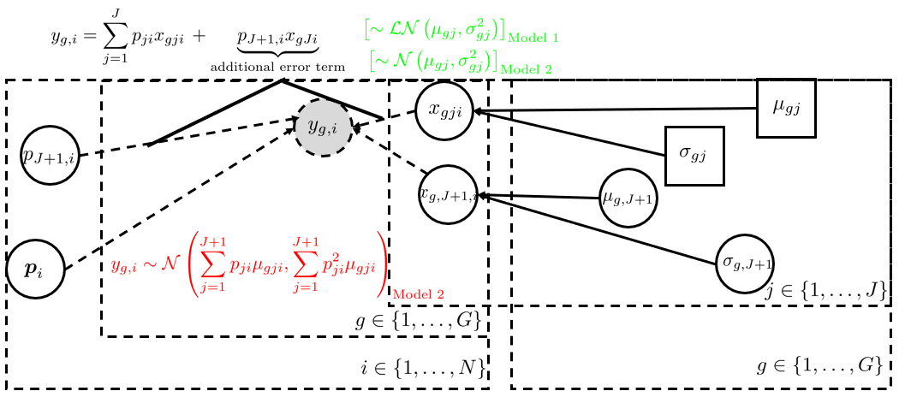
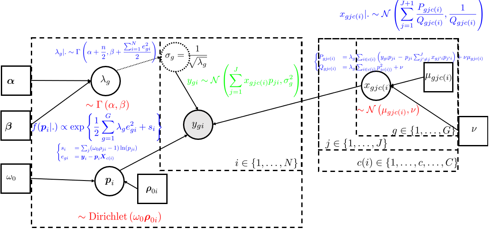
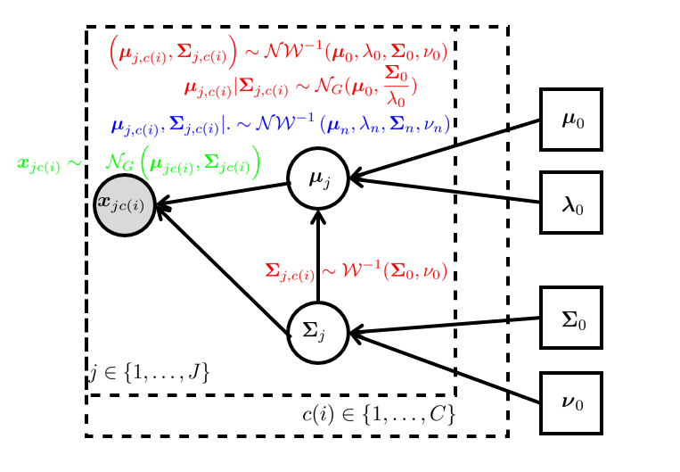
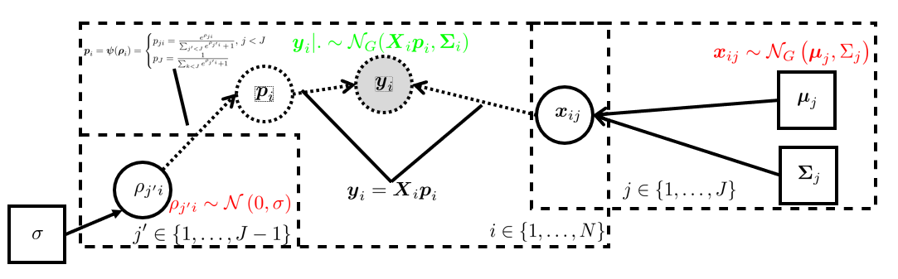

# Model

```{r html-output-config, include = FALSE, eval=knitr::is_html_output()}
# bibliography: "`r rbbt::bbt_write_bib('DeCovarT_vignette_bbt.bib', overwrite = TRUE)`
knitr::opts_chunk$set(
  collapse = TRUE,
  comment = "#>",
  fig.align = "center",
  fig.fullwidth = TRUE,
  # We use the implementation available in the
  # message = FALSE,
  # warning = FALSE,
  cache = FALSE, lazy.cache = FALSE
)
options(rmarkdown.html_vignette.check_title = FALSE) # generate customised vignette title
# rmarkdown::render("DeCoVart-use-cases.Rmd", output_format = 'all')
# extensions: ["color.js", "cancel.js", "AMSmath.js", "AMSsymbols.js"]
```

```{r pdf-output-config, include = FALSE, eval=knitr::is_latex_output()}
knitr::opts_chunk$set(
  collapse = TRUE,
  comment = "#>",
  fig.align = "center",
  out.width = "90%",
  message = FALSE,
  warning = FALSE,
  echo = FALSE,
  cache = FALSE, lazy.cache = FALSE,
  fig.pos = "H"
)
```

```{r setup}
html_ouput <- knitr::is_html_output() # store which type is asked as an output
library(DeCovarT)
library(ggplot2)
library(dplyr)
library(pkgdown) # generate automated links to R packages and functions
library(kableExtra)
library(flextable)

# define function to automaticaly colour some sections, with respect to the output of the document
colorize <- function(x, color) {
  if (knitr::is_latex_output()) {
    sprintf("\\textcolor{%s}{%s}", color, x)
  } else {
    sprintf("<span style='color: %s;'>%s</span>", color, x)
  }
}
```

```{css, echo=FALSE}
p.caption {
  font-size: 0.6em;
}

.blackbox {
  padding: 1em;
  background: #DBDBDB;
  color: black;
  border: 4px solid black;
  border-radius: 10px;
}
.center {
  text-align: center;
}

.cols {display: flex; }
```

We introduce the following notations:

* $(\boldsymbol{y}=(y_{gi}) \in \mathbb{R}_+^{G\times N}$ is the global bulk transcriptomic expression, measured in $N$ individuals.
*  $\boldsymbol{X}=(x_{gj}) \in \mathcal{M}_{\RR^{G\times J}}$ the signature matrix of the mean expression of $G$ genes in $J$ purified cell populations.
* $\boldsymbol{p}=(p_{ji})\in ]0, 1[^{J \times N}$ the unknown relative proportions of cell populations in $N$ samples

As in most traditional deconvolution models, we assume that the total bulk expression can be reconstructed by summing the individual contributions of each cell population weighted by its frequency, as stated explicitly in the following linear matricial relationship (Eq.\@ref(eq:deconvolution-problem)):

```{=tex}
\begin{equation}
\boldsymbol{y}=\boldsymbol{X} \times \boldsymbol{p}
(\#eq:deconvolution-problem)
\end{equation}
```

# Appendix B: Natural extension towards a truly Bayesian framework


(ref:erkkila) Graphical represention of the DSection generative model [@erkkila_etal10]

(ref:ahn) Graphical represention of the DemixT generative model [@ahn_etal13; @wang_etal18]

(ref:chion) Graphical represention of [@chion18] generative model


```{r bayesian-model-html, echo = FALSE, fig.cap="To compare the generative framework across several deconvolution algorithms, we homogenise indexes and parameters, and represent dependency links using the [RevBayes](https://revbayes.github.io/tutorials/intro/graph_models.html) convention. The density functions describing the distribution of the observations, conditioned on the estimated parameters, are written in green, the prior distributions of the parameters to estimate are written in red (themselves possibly conditioned on other unknown parameters, or constant, fixed-value priors), and finally, the resulting posterior distribution parameters, conditioned on both prior and likelihood functions, following the Bayes rules, are written in blue.", fig.show = "hold", eval=knitr::is_html_output(), out.width="45%"}




knitr::include_graphics("figs/DAG_legend_updated.png")
```


```{r bayesian-model-pdf, echo = FALSE, fig.cap="To compare the generative framework across several deconvolution algorithms, we homogenise indexes and parameters, and represent dependency links using the \\href{https://revbayes.github.io/tutorials/intro/graph_models.html}{RevBayes} convention. The density functions describing the distribution of the observations, conditioned on the estimated parameters, are written in green, the prior distributions of the parameters to estimate are written in red (themselves possibly conditioned on other unknown parameters, or constant, fixed-value priors), and finally, the resulting posterior distribution parameters, conditioned on both prior and likelihood functions, following the Bayes rules, are written in blue.", fig.subcap=c("(ref:ahn)", '(ref:erkkila)', "(ref:chion)", "Graphical representation of the DeCovarT generative model, in an extended Bayesian framework", "Legend used in the graphical model"), out.width="40%", fig.ncol = 2, eval=knitr::is_latex_output()}


knitr::include_graphics("figs/DAG_legend_updated.png")
```

