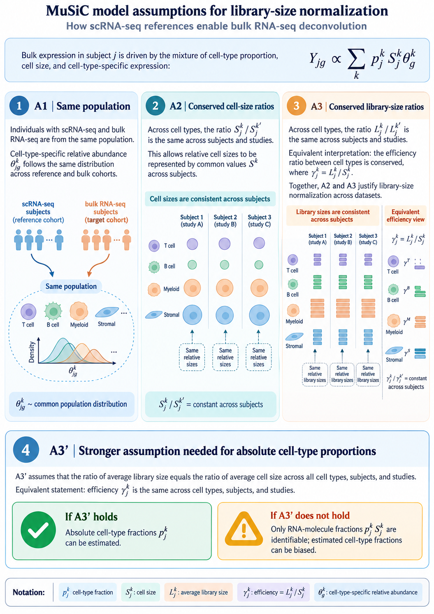

::: callout-note
## Scope

Outlook on extending DeCovarT beyond the closed-reference Gaussian convolution. @sec-notation fixes the index set. @sec-sc-moments derives the mean and the three covariance layers from single-cell replicates, then compares regression and probabilistic engines. Later sections cover Scheffé-type mixture structure, alternative observation laws and Bayesian CTS inference, sample-level covariates, incomplete references, isoforms, RNA–cell uncoupling, weighted / generalised least squares, Firth penalisation for few bulk samples, lineage and archetypes, time-resolved composition, ensembles, spatial transcriptomics, and multi-omics. Compositional reparametrisation is implemented in [`additive_logistic()`](../reference/additive_logistic.html) and documented numerically in the [derivatives under simplex transforms](theory-decovart-generative-model.html) vignette. The same catalogue is tracked in [GitHub issue 5](https://github.com/bastienchassagnol/DeCovarT/issues/5).
:::

# Notation {#sec-notation}

Indices and random objects below are fixed for the rest of this vignette, including the single-cell extension in @sec-sc-moments. They match the plate diagram in the package README.

| Symbol | Meaning |
|---|---|
| $g=1,\ldots,G$ | Gene |
| $j=1,\ldots,J$ | Cell type |
| $i=1,\ldots,N$ | Bulk sample |
| $r=1,\ldots,R$ | Independent biological replicate in the single-cell reference |
| $c=1,\ldots,C_{jr}$ | Cell of type $j$ in replicate $r$ |
| $\boldsymbol{y}_{\cdot i}\in\mathbb{R}^{G}$ | Bulk profile of sample $i$ |
| $\boldsymbol{p}_{\cdot i}\in\Delta^{J-1}$ | Cell-number fractions; $p_{ji}\ge 0$, $\sum_j p_{ji}=1$ |
| $\boldsymbol{q}_{\cdot i}$ | RNA-mass fractions (see @sec-uncoupling) |
| $\boldsymbol{\mu}_{\cdot j}\in\mathbb{R}^{G}$ | Cross-replicate mean expression of one cell of type $j$ |
| $\boldsymbol{X}_{jrc}$ | Expression of cell $c$ |
| $\boldsymbol{M}_{jr}$ | Replicate-specific population mean of type $j$ |
| $\boldsymbol{\Sigma}_{W,j}$ | Within-replicate cell-to-cell covariance |
| $\boldsymbol{\Sigma}_{B,j}$ | Between-replicate covariance of $\boldsymbol{M}_{jr}$ |
| $\boldsymbol{\Sigma}_{\mathrm{obs},i}$ | Residual bulk noise: diagonal, possibly heteroscedastic, no gene–gene correlation |
| $S_j$ | Mean transcriptome size (RNA content) of type $j$ |
| $\boldsymbol{\theta}_{\cdot j}$ | Relative abundance inside type $j$, $\sum_g\theta_{gj}=1$, so $\boldsymbol{\mu}_{\cdot j}=S_j\boldsymbol{\theta}_{\cdot j}$ |
| $a_i>0$ | Sample-wise scale (depth, tissue size). Shared by all genes |
| $\boldsymbol{d}\in\mathbb{R}^{G}_{+}$ | Optional gene-wise platform scale. Not free inside one bulk fit |

The current DeCovarT convolution (@eq-gaussian-convolution) is the special case in which each reference is one random population profile with covariance $\boldsymbol{\Sigma}_j=\boldsymbol{\Sigma}_{B,j}$, the sample scale is absorbed into $\boldsymbol{y}_{\cdot i}$, and both $\boldsymbol{\Sigma}_{W,j}$ and $\boldsymbol{\Sigma}_{\mathrm{obs},i}$ are omitted. $\boldsymbol{\rho}_i$ in the README diagram is the unconstrained coordinate with $\boldsymbol{p}_{\cdot i}=\psi(\boldsymbol{\rho}_i)$ the soft-max.

Bulk transcriptomic deconvolution is one instance of a **mixture inverse problem**: a composite signal (tissue expression, a spectrum, a chromatogram) is observed, and we seek the proportions $\boldsymbol{p}$ of underlying components. Because $\boldsymbol{p}$ is **compositional** (parts of a whole), estimates must lie on the simplex $\Delta^{J-1}=\{\boldsymbol{p}\in[0,1]^J:\sum_j p_j=1\}$. [@chassagnolDeCovarTMultidimensionalProbalistic2023] model each reference profile as multivariate Gaussian and recover $\boldsymbol{p}$ by constrained maximum likelihood; classical deconvolution tools such as `CIBERSORT` assume gene-wise independence instead [@newmanRobustEnumerationCell2015].

# Mixture design and first-order structure {#sec-mixture-design-structure}

::: {.callout-tip}
## Mixture experiments and compositional data {#sec-mixture-doe-context}

DeCovarT—and bulk deconvolution more generally—sits inside the wider class of **mixture inverse problems** in formulation science, spectroscopy, and designed experiments where component fractions are explicit regressors on the simplex. R offers only a handful of packages for **designed mixture points** (as opposed to random $\boldsymbol{p}$ on $\Delta^{J-1}$):

- **`AlgDesign`** [@R-AlgDesign] — lattice and simplex-centroid mixture designs via `genMixture()` / `gen.mixture()`, plus D-, A-, and I-optimal designs; the closest general substitute for classical mixture DOE.
- **`skpr`** [@R-skpr] — optimal mixture designs from a candidate set under $\sum_j p_j=1$; preferable when optimality criteria matter more than fixed simplex-centroid lattices.

A modular Scheffé-type benchmark would combine `AlgDesign` (or `skpr`) to propose $\boldsymbol{p}$, DeCovarT (or baselines) to invert the mixture, and compositional metrics from the simulation vignettes.
:::

In designed mixture experiments (chemistry, food science, formulation), component proportions are explicit regressors with no free intercept because $\sum_j p_j=1$. A Scheffé cubic model for three components reads

$$
y = \beta_1 p_1 + \beta_2 p_2 + \beta_3 p_3
  + \beta_{12} p_1 p_2 + \beta_{13} p_1 p_3 + \beta_{23} p_2 p_3
  + \beta_{123} p_1 p_2 p_3,
$$ {#eq-scheffe-cubic}

with every $p_j\in[0,1]$ and $\sum_j p_j=1$ [@brownGeneralBlendingModels2015; @aitchisonStatisticalAnalysisCompositional1982]. DeCovarT's current release implements only the **first-order** part of @eq-scheffe-cubic in a probabilistic setting: for cell type $j$, reference mean $\boldsymbol{\mu}_j$ and covariance $\boldsymbol{\Sigma}_j$ are given, and the bulk mixture satisfies

$$
\boldsymbol{Y}\mid\boldsymbol{p}
  \sim \mathcal{N}\!\left(
    \sum_{j=1}^{J} p_j\,\boldsymbol{\mu}_j,\;
    \sum_{j=1}^{J} p_j^{2}\,\boldsymbol{\Sigma}_j
  \right).
$$ {#eq-gaussian-convolution}

@eq-gaussian-convolution is the Gaussian-convolution likelihood optimised in [`deconvolute_ratios()`](../reference/deconvolute_ratios.html); it extends mean-only linear deconvolution by propagating gene–gene covariance, not by adding Scheffé interaction monomials.

## Interaction and synergy terms {#sec-interactions}

Synergy or antagonism between components corresponds to **second-order** terms in @eq-scheffe-cubic: a positive $\beta_{12}$ means the joint presence of components 1 and 2 raises the response above the additive prediction $\beta_1 p_1+\beta_2 p_2$. A natural generative extension would enrich the mean and, optionally, the covariance:

$$
\mathbb{E}[\boldsymbol{Y}]
  = \sum_j p_j\,\boldsymbol{\mu}_j
  + \sum_{j<k} f(p_j,p_k)\,\boldsymbol{\mu}_{jk} + \cdots,
$$ {#eq-interaction-mean}

$$
\boldsymbol{\Sigma}(\boldsymbol{p})
  = \sum_j p_j^{2}\,\boldsymbol{\Sigma}_j
  + \sum_{j<k} g(p_j,p_k)\,\boldsymbol{\Sigma}_{jk} + \cdots,
$$ {#eq-interaction-cov}

with $f,g$ often taken as $p_j p_k$. Allowing $\operatorname{Cov}(\boldsymbol
{X}_j,\boldsymbol{X}_k)\neq\boldsymbol{0}$ relaxes DeCovarT's independence assumption between components and captures non-additive mixing. Such a model remains compatible with the same simplex constraint on $\boldsymbol{p}$ and could still be fitted by constrained MLE, at the cost of many additional interaction parameters and careful guard against overfitting.

The present generative framework keeps a **linear** mean map
$\boldsymbol{y}=\boldsymbol{\mu}\boldsymbol{p}$. When the regression of a
compositional response on Euclidean predictors is itself nonlinear,
flexible simplicial nonparametric models
[@tsagrisFlexibleNonparametricRegression2023] and folded
$\alpha$-distributions on the simplex
[@tsagrisFoldedModelCompositional2020] are a natural outlook; they are
not used in the current convolution.

## Lineage-aware hierarchical deconvolution {#sec-hierarchical-deconvolution}

Flat deconvolution treats every cell type as a sibling on one simplex.
**Hierarchical** methods instead estimate proportions at several granularities
linked by a cell-type tree: broad compartments first, then closely related
subtypes whose mean signatures are collinear at the leaf level.

We reuse the DeCovarT set-up from the [article](../article/main.pdf): gene
$g=1,\ldots,G$; cell type or tree node $j$; sample $i=1,\ldots,N$
(independence across $i$). Slices follow the usual dot notation
($\boldsymbol{\mu}_{\cdot j}$, $\boldsymbol{y}_{\cdot i}$).

* $\boldsymbol{y}=(y_{gi})\in\mathbb{R}_{+}^{G\times N}$: bulk expression;
  $\boldsymbol{y}_{\cdot i}\in\mathbb{R}_{+}^{G}$ is sample $i$.
* $\boldsymbol{\mu}=(\mu_{gj})\in\mathbb{R}^{G\times J}$: mean signature;
  $\boldsymbol{\mu}_{\cdot j}\in\mathbb{R}^{G}$ is the cross-sample mean
  profile of type $j$ (as in `MuSiC` [@wangBulkTissueCell2019]).
* $\boldsymbol{p}=(p_{ji})\in\,]0,1[^{J\times N}$: unknown relative
  proportions; $\boldsymbol{p}_{\cdot i}\in\,]0,1[^{J}$ is the composition
  of sample $i$.

$$
\boldsymbol{y}_{\cdot i}=\boldsymbol{\mu}\,\boldsymbol{p}_{\cdot i},
$$ {#eq-hierarchical-linear}

$$
\sum_{j=1}^{J} p_{ji}=1,
\qquad p_{ji}\ge 0
\qquad (i=1,\ldots,N).
$$ {#eq-simplex-constraint}

$$
p_{j,i}=\sum_{c\in\mathcal{C}(j)} p_{c,i}
\qquad (i=1,\ldots,N).
$$ {#eq-parent-child}

At each tree level the bulk mixture satisfies @eq-hierarchical-linear with
each composition on the unit simplex (@eq-simplex-constraint). For a parent
node $j$ with child set $\mathcal{C}(j)$, coherent hierarchical estimates
require @eq-parent-child.

### Hard versus soft lineage constraints {#sec-hard-soft-constraints}

Despite diverse implementations, hierarchical bulk mRNA deconvolution
methods fall into **two constraint regimes**:

* **Hard constraints** — child lineage ratios are forced to sum exactly to
  the parent estimate (@eq-parent-child). `MuSiC` and `SCDC` (tree-guided
  mode) first fix a parent total $\hat{p}_{j,i}$, then fit children
  $q_{c,i}$ on the within-parent simplex so that
  $\hat{p}_{c,i}=q_{c,i}\,\hat{p}_{j,i}$
  [@wangBulkTissueCell2019; @dongSCDCBulkGene2021]. `HIDE` applies the same
  equality by renormalising child estimates after each top-down split
  [@voelklHIDEHierarchicalCelltype2025]; `Rectangle` propagates coarse
  cluster fractions as hard bounds on fine-grained estimates
  [@ederRectangleRobustScalable2026].
* **Soft constraints** — parent–child coherence is encouraged but not
  enforced exactly. `HiDecon` adds a squared mismatch penalty to the
  deconvolution loss [@huangAccurateEstimationRare2024]; `Kassandra` trains
  separate predictors at predefined hierarchy levels without an explicit
  parent–child equality [@zaitsevPreciseReconstructionTME2022].

Hard splitting after fixing the parent (@eq-hard-child-split):

$$
\hat{p}_{c,i}=q_{c,i}\,\hat{p}_{j,i},
\quad
q_{c,i}\ge 0,\;
\sum_{c\in\mathcal{C}(j)} q_{c,i}=1.
$$ {#eq-hard-child-split}

`HIDE` renormalisation (@eq-hide-renorm):

$$
\hat{p}_{c,i}\leftarrow
\hat{p}_{c,i}\,
\frac{\hat{p}_{j,i}}{\sum_{c'\in\mathcal{C}(j)}\hat{p}_{c',i}}.
$$ {#eq-hide-renorm}

`HiDecon` soft penalty (@eq-soft-penalty):

$$
\mathcal{L}_{\mathrm{tot}}
=
\mathcal{L}_{\mathrm{deconv}}
+
\lambda\sum_{j}\sum_{i=1}^{N}
\Bigl(
p_{j,i}-\sum_{c\in\mathcal{C}(j)} p_{c,i}
\Bigr)^{2}.
$$ {#eq-soft-penalty}

Within each regime, methods further differ by whether they reuse a **single
reference signature** at every granularity or **reselect / reweight genes**
locally at each internal node (@fig-hierarchical-taxonomy).

```{mermaid}
%%| label: fig-hierarchical-taxonomy
%%| fig-cap: "Taxonomy of lineage-aware bulk mRNA deconvolution: parent–child constraint (hard vs soft) and reference-gene strategy (fixed matrix vs node-local weights)."
%%{init: {"theme": "sandstone"}}%%
flowchart TD
  A["Lineage-aware bulk mRNA deconvolution"] --> B{"Parent–child linkage"}
  B -->|"Hard equality (Eq. parent–child)"| C["MuSiC, SCDC, HIDE, Rectangle"]
  B -->|"Soft / uncoupled levels"| D["HiDecon, Kassandra"]
  C --> E{"Genes at each node"}
  D --> F{"Genes at each node"}
  E -->|"Fixed reference matrix"| G["SCDC ensemble"]
  E -->|"Node-local reweighting"| H["MuSiC, HIDE, Rectangle"]
  F -->|"Shared matrix + penalty"| I["HiDecon"]
  F -->|"Level-specific signatures"| J["Kassandra"]
```

`xCell` 2.0 [@angelXCell20Robust2025] uses Cell Ontology ancestry to build
signatures and control spillover between related labels, but its outputs are
enrichment scores rather than a compositional tree; it sits outside the
hard/soft fraction taxonomy above.

```{r}
#| label: tbl-hierarchical-methods
#| tbl-cap: "Lineage-aware bulk mRNA deconvolution: constraint regime, enforcing equation, and gene strategy (2019–2026 census)."
#| echo: false
#| message: false
#| warning: false
hier_tbl <- data.frame(
  method = c(
    "MuSiC",
    "SCDC",
    "HIDE",
    "Rectangle",
    "HiDecon",
    "Kassandra",
    "xCell 2.0"
  ),
  constraint = c(
    "Hard",
    "Hard (tree-guided)",
    "Hard",
    "Hard (multiscale)",
    "Soft",
    "Soft / uncoupled",
    "None (scores)"
  ),
  `lineage constraint` = c(
    paste0(
      "Fix $\\hat{p}_{j,i}$; ",
      "$\\hat{p}_{c,i}=q_{c,i}\\hat{p}_{j,i}$, ",
      "$\\sum_c q_{c,i}=1$"
    ),
    paste0(
      "MuSiC step; ",
      "$\\hat{p}_{c,i}=q_{c,i}\\hat{p}_{j,i}$"
    ),
    paste0(
      "Fit then renormalise: ",
      "$\\hat{p}_{c,i}\\leftarrow",
      "\\hat{p}_{c,i}\\hat{p}_{j,i}/",
      "\\sum_{c'}\\hat{p}_{c',i}$"
    ),
    "Coarse $\\boldsymbol{p}^{(\\mathrm{coarse})}$ bounds fine estimates",
    paste0(
      "$\\mathcal{L}_{\\mathrm{tot}}=\\mathcal{L}_{\\mathrm{deconv}}+",
      "\\lambda\\sum_{j,i}(p_{j,i}-\\sum_c p_{c,i})^2$"
    ),
    "Separate models; no parent–child equality",
    "Ontology spillover control only"
  ),
  `gene strategy` = c(
    "Node-local consistent genes",
    "Full reference; optional node split",
    "Parent-specific learned weights",
    "Clustered + direct signatures",
    "Shared $\\boldsymbol{\\mu}$; joint penalised fit",
    "Level-specific trained signatures",
    "Ontology-aware signature generation"
  ),
  check.names = FALSE
)
tinytable::tt(hier_tbl) |>
  tinytable::style_tt(j = 2:4, align = "l") |>
  tinytable::format_tt(j = 3, markdown = TRUE)
```

@tbl-hierarchical-methods and @fig-hierarchical-taxonomy summarise the
landscape aligned with @eq-hierarchical-linear–@eq-parent-child. **Hard**
methods (`MuSiC`, `HIDE`, `Rectangle`) are easier to audit node by node but
inherit upstream bias; **soft** coupling (`HiDecon`) can stabilise rare
subtypes when the tree is credible. **Node-local gene reweighting** (`MuSiC`,
`HIDE`, `Rectangle`) targets collinear siblings; **fixed or level-specific
signatures** (`SCDC`, `Kassandra`) trade flexibility for simpler reference
construction.

A natural DeCovarT extension would combine @eq-gaussian-convolution with
either @eq-hard-child-split or @eq-soft-penalty, node-local marker panels,
and [ALR optimisation](theory-decovart-generative-model.html#sec-alr)
when a curated lineage tree is
supplied—benchmarked at broad, intermediate, and terminal resolutions against
`HiDecon`, `HIDE`, tree-guided `MuSiC`, and `Rectangle`. Spatial
`HIDF` applies the same tree idea to spots with an `RCTD` back-end
[@zouHidfIntegratingTreeStructured2026]; `scDETECT` uses a lineage prior
for differential expression rather than for $\boldsymbol{p}$
[@xuScdetectNovelStatisticalModel2025]. Archetypes and cell states
(type versus shared gene-expression programmes) are taken up in
@sec-archetypes.

# Single-cell moments and population alignment {#sec-sc-moments}

The signature that enters @eq-gaussian-convolution is a **population profile**: one mean vector and one covariance per cell type. Single-cell counts are not that object. This section states how to build the mean and how the covariance splits, then how to place the resulting profiles on the same scale as bulk sample $i$.

{#fig-three-variability fig-alt="Schematic of three covariance layers: linear within-cell variability, quadratic between-sample variability, and diagonal bulk measurement noise."}

{#fig-music-assumptions fig-alt="MuSiC model assumptions A1 same population, A2 conserved cell-size ratios, A3 conserved library-size ratios, and A3-prime for absolute cell-type proportions."}

@fig-three-variability is the target decomposition. Panel A is a purified population profile (quadratic in $p_{ji}$). Panel B is one single-cell reference (linear in $p_{ji}$). Panel C is the hierarchical model once $R$ independent replicates exist.

## Mean: average cells, then average replicates {#sec-mean-signature}

For a fixed type $j$, the per-cell mean does not depend on how many cells were captured. With raw counts on an additive scale,

$$
\bar{\boldsymbol{X}}_{jr}
=
\frac{1}{C_{jr}}\sum_{c=1}^{C_{jr}}\boldsymbol{X}_{jrc},
\qquad
\hat{\boldsymbol{\mu}}_{\cdot j}
=
\frac{1}{R}\sum_{r=1}^{R}\bar{\boldsymbol{X}}_{jr}.
$$ {#eq-mean-two-stage}

Divide by the **cell count** $C_{jr}$, not by the library size. Library-size weights $w_c=L_c/\sum_d L_d$ are functions of $\boldsymbol{X}_c$ itself. Their probability limit is $\boldsymbol{\mu}+\boldsymbol{\Sigma}\mathbf{1}/(\mathbf{1}^{\top}\boldsymbol{\mu})$, so they target an RNA-weighted cell and destroy the exact Gaussian scale that leaves the precision graph unchanged. Under i.i.d. cells the arithmetic mean also has the largest effective sample size among deterministic convex weights.

Pool cells across replicates only after the within-replicate mean. A replicate with $10\,000$ cells must not outweigh a replicate with $500$ cells. `MuSiC` is built on that multi-subject split: cross-subject means and variances, with genes weighted by cross-subject and cross-cell consistency [@wangBulkTissueCell2019].

When every cell is scaled to a common total, the product $S_j\boldsymbol{\theta}_{\cdot j}$ collapses to the arithmetic mean of the raw counts. `MuSiC` writes the signature as cell size times relative abundance and then recovers that same per-cell mean. Keep $S_j$ and $\boldsymbol{\theta}_{\cdot j}$ as separate factors (@sec-alignment). Do not library-weight the raw vectors and call the result $S_j$.

::: {#nte-sum-versus-mean .callout-warning}
## Summing cells is the wrong signature, and the right pseudobulk

Summing is the correct total for a physical pool of exactly $C_{jr}$ cells, $\boldsymbol{T}_{jr}=\sum_c\boldsymbol{X}_{jrc}$, with mean $C_{jr}\boldsymbol{\mu}_{\cdot j}$ and covariance $C_{jr}\boldsymbol{\Sigma}_{W,j}$. Using $\boldsymbol{T}_{jr}$ as a DeCovarT column inserts the arbitrary capture count into $\boldsymbol{p}$. A type with ten times more reference cells looks ten times more abundant.

The same sum is the right input for a different question. Differential expression of one cell type across donors needs one count vector per donor, then a bulk count model such as `DESeq2` [@loveModeratedEstimationFold2014a]. There the estimand is a relative fold change of averaged counts, and the donor is the independent unit. Cells from one donor are subsamples. Treating them as replicates inflates false discoveries [@squairConfrontingFalseDiscoveries2021]. That analysis does not estimate $\boldsymbol{p}_{\cdot i}$.
:::

## Three reference regimes {#sec-three-regimes}

Write the cell as a sum of a replicate effect and a cell effect,

$$
\boldsymbol{X}_{jrc}
=
\boldsymbol{\mu}_{\cdot j}+\boldsymbol{B}_{jr}+\boldsymbol{\varepsilon}_{jrc},
$$ {#eq-cell-hierarchy}

with $\boldsymbol{B}_{jr}\sim\mathcal{N}(\boldsymbol{0},\boldsymbol{\Sigma}_{B,j})$ and $\boldsymbol{\varepsilon}_{jrc}\sim\mathcal{N}(\boldsymbol{0},\boldsymbol{\Sigma}_{W,j})$, independent across $j$ given $\boldsymbol{p}_{\cdot i}$. The bulk average per cell in a tissue of $N_i$ cells is

$$
\boldsymbol{A}_i
=
\sum_j p_{ji}(\boldsymbol{\mu}_{\cdot j}+\boldsymbol{B}_{jr(i)})
+
\frac{1}{N_i}\sum_j\sum_{c=1}^{N_i p_{ji}}\boldsymbol{\varepsilon}_{ijc}.
$$ {#eq-bulk-average}

### FACS-sorted population profiles {#sec-facs}

Historically the reference was one bulk profile per purified population: surface-marker sorting, then a pooled microarray or RNA-seq library. The random object is the whole population vector $\boldsymbol{Z}_{ij}\sim\mathcal{N}(\boldsymbol{\mu}_{\cdot j},\boldsymbol{\Sigma}_{B,j})$, and the bulk is the convolution

$$
\boldsymbol{y}_{\cdot i}
=
\sum_j p_{ji}\boldsymbol{Z}_{ij},
\qquad
\operatorname{Cov}(\boldsymbol{y}_{\cdot i}\mid\boldsymbol{p}_{\cdot i})
=
\sum_j p_{ji}^{2}\,\boldsymbol{\Sigma}_{B,j}.
$$ {#eq-facs-quadratic}

The square appears because one random profile is multiplied by $p_{ji}$, not because $p_{ji}$ cells were added. This is the covariance in @eq-gaussian-convolution. If several types are sorted from the same donors, cross-type blocks $\boldsymbol{\Sigma}_{B,jk}$ add terms $p_{ji}p_{ki}$. Before droplet scRNA-seq, those population profiles came from FACS- or MACS-purified bulk libraries. Szaniszlo et al. showed that mixture expression reflects composition and that a minor subset is recovered only after physical sorting, while also stressing coexpression among genes inside a purified type [@szaniszloGettingRightCells]. Novershtern et al. profiled 38 marker-defined haematopoietic populations and used coexpression modules plus promoter *cis*-circuits as the gene–gene structure of each state [@novershternDenselyInterconnectedTranscriptional2011]. Those studies are the historical FACS reference that @eq-facs-quadratic still describes.

### One single-cell replicate ($R=1$) {#sec-one-replicate}

$R=1$ identifies $\boldsymbol{M}_{j1}$ and $\boldsymbol{\Sigma}_{W,j}$. It does not identify $\boldsymbol{\Sigma}_{B,j}$: extra cells shrink $\boldsymbol{\Sigma}_{W,j}/C_{j1}$ and leave the single draw $\boldsymbol{B}_{j1}$ untouched. The coherent bulk covariance is the **mixture / physical sum**, linear in $p_{ji}$:

$$
\operatorname{Cov}(\boldsymbol{A}_i\mid\boldsymbol{p}_{\cdot i})
=
\kappa_i\sum_j p_{ji}\,\boldsymbol{\Sigma}_{W,j}
+
\boldsymbol{\Sigma}_{\mathrm{obs},i}.
$$ {#eq-linear-within}

Here $\kappa_i$ is an effective cells-per-bulk scale. The ideal value is $1/N_i$. The number of reference cells $C_{j1}$ is not $N_i$. A finite-cell reference mean adds a separate quadratic term $\sum_j p_{ji}^{2}\boldsymbol{\Sigma}_{W,j}/C_{j1}$. That term is Monte Carlo error of $\hat{\boldsymbol{\mu}}_{\cdot j}$, not biological between-donor covariance. Do not drop $\boldsymbol{\Sigma}_{W,j}$ into the $p_{ji}^{2}$ slot of @eq-gaussian-convolution.

For a rare type, $p_{ji}=0.01$ makes $p_{ji}^{2}$ a hundred times smaller than $p_{ji}$. A within-cell covariance placed in the quadratic slot is almost silenced.

### Enough biological replicates {#sec-enough-replicates}

The smallest $R$ that identifies a variance component is $R\ge 2$. The replicate means satisfy

$$
\bar{\boldsymbol{X}}_{jr}
\sim
\mathcal{N}\!\left(
\boldsymbol{\mu}_{\cdot j},\;
\boldsymbol{\Sigma}_{B,j}+\frac{\boldsymbol{\Sigma}_{W,j}}{C_{jr}}
\right).
$$ {#eq-replicate-mean-law}

A method-of-moments contrast is then available. Let $\boldsymbol{S}_{B,j}$ be the sample covariance of $\{\bar{\boldsymbol{X}}_{jr}\}_{r=1}^{R}$ and $\bar{C}_j$ a typical cell count. Then

$$
\mathbb{E}[\boldsymbol{S}_{B,j}]
=
\boldsymbol{\Sigma}_{B,j}
+
\overline{\boldsymbol{\Sigma}_{W,j}/C_{jr}},
$$ {#eq-mom-between}

so $\hat{\boldsymbol{\Sigma}}_{B,j}=\boldsymbol{S}_{B,j}-\widehat{\boldsymbol{\Sigma}}_{W,j}/\bar{C}_j$, projected onto the positive semidefinite cone. An unstructured $G\times G$ covariance has $G(G+1)/2$ free entries. Transcriptome-scale $G$ makes that matrix unestimable for the $R$ of a normal single-cell study. What $R\ge 2$ buys is the **scalar separation** of the two layers, or a sparse precision for $\boldsymbol{\Sigma}_{B,j}$, not a dense $G\times G$ matrix. Reference cohorts in current single-cell deconvolution are small; `MEAD` states this explicitly [@xieRobustStatisticalInference2023]. Cells from one donor share genetic and environmental background, so they are subsamples rather than independent biological units. Zimmerman, Espeland and Langefeld document that dependence across cell types, and they treat donor as the random effect when contrasting conditions [@zimmermanPracticalSolutionPseudoreplication2021]. That within-versus-between split is the same hierarchy as $\boldsymbol{\Sigma}_{W,j}$ versus $\boldsymbol{\Sigma}_{B,j}$ when a single-cell reference is aligned with bulk.

With that split, the bulk law DeCovarT should use is

$$
\boldsymbol{y}_{\cdot i}\mid\boldsymbol{p}_{\cdot i}
\sim
\mathcal{N}\!\Big(
a_i\sum_j p_{ji}\boldsymbol{\mu}_{\cdot j},\;
\sum_j p_{ji}^{2}\,\boldsymbol{\Sigma}_{B,j}
+
\kappa_i\sum_j p_{ji}\,\boldsymbol{\Sigma}_{W,j}
+
\boldsymbol{\Sigma}_{\mathrm{obs},i}
\Big).
$$ {#eq-three-layer}

$\boldsymbol{\Sigma}_{\mathrm{obs},i}$ is diagonal. Gene–gene correlation is already inside $\boldsymbol{\Sigma}_{B,j}$ and $\boldsymbol{\Sigma}_{W,j}$. Heteroscedastic diagonal entries are allowed. Off-diagonal residual correlation would double-count the network.

```{mermaid}
%%| label: fig-three-regimes
%%| fig-cap: "Which covariance terms are identified from the reference design. FACS profiles supply only the quadratic layer. One single-cell replicate supplies only the linear layer. R at least 2 separates both, plus a diagonal bulk residual."
%%{init: {"theme": "sandstone", "flowchart": {"curve": "basis"}}}%%
flowchart TD
  ref["Reference used to build mu_j and Sigma_j"] --> facs["FACS-sorted population profiles"]
  ref --> r1["Single-cell reference, R = 1"]
  ref --> rR["Single-cell reference, R at least 2"]
  facs --> q["Quadratic convolution: sum p_ji squared Sigma_B,j"]
  r1 --> lin["Linear mixture: kappa_i sum p_ji Sigma_W,j"]
  rR --> both["Quadratic Sigma_B plus linear Sigma_W plus diagonal Sigma_obs"]
  lin --> noise["Plus diagonal residual Sigma_obs,i"]
  q --> noise
```

## Aligning reference profiles with bulk sample $i$ {#sec-alignment}

@eq-mean-two-stage is a per-cell mean. Bulk sample $i$ is a library. Three scales sit between them. Only two belong inside the estimator.

**Sample scale $a_i$.** On an absolute molecule scale, $\boldsymbol{y}_{\cdot i}=a_i\boldsymbol{\mu}\boldsymbol{p}_{\cdot i}$ plus noise. $a_i$ absorbs cell number, sequencing depth, and capture. It is one positive number per bulk sample. Profile it out, or estimate it jointly with $\boldsymbol{p}_{\cdot i}$. It is not a biological composition parameter.

**Cell size $S_j$.** RNA content differs by cell type, so

$$
\boldsymbol{y}_{\cdot i}
=
a_i\sum_j p_{ji} S_j\boldsymbol{\theta}_{\cdot j}
+
\boldsymbol{\varepsilon}_i.
$$ {#eq-music-mean}

`MuSiC` states the same product: cell fraction, average cell size, relative abundance [@wangBulkTissueCell2019]. If $S_j$ is measured, insert it. Do not re-estimate it. Free $S_j$ and $\boldsymbol{p}_{\cdot i}$ are not separately identifiable from $\boldsymbol{y}_{\cdot i}$ alone, because only the products $p_{ji}S_j$ enter @eq-music-mean. The RNA fraction

$$
q_{ji}
=
\frac{p_{ji}S_j}{\sum_k p_{ki}S_k}
$$ {#eq-rna-fraction}

is what a normalised bulk identifies. $\boldsymbol{q}_{\cdot i}=\boldsymbol{p}_{\cdot i}$ when $S_j$ is constant across $j$. That constant-efficiency hypothesis is assumption A3$'$ of `MuSiC`: the ratio of average library size equals the ratio of average cell size, equivalently a common capture efficiency $\gamma_j=L_j/S_j$ (@fig-music-assumptions). Under A3$'$, the arithmetic mean across cells is the right signature and the fitted weights are cytometry fractions. If A3$'$ fails, the fitted weights are RNA fractions and a later division by $S_j$ (@eq-rna-to-cell) is required.

`EPIC` and `quanTIseq` apply that division **after** a linear fit, using an external RNA-content assay, so the optimiser itself returns transcriptomic ratios [@racleSimultaneousEnumerationCancer2017; @finotello_etal19]. `MMAD` estimates the extraction efficiencies inside a non-linear conjugate-gradient step [@liebnerMMADMicroarrayMicrodissection2014]. `ReDeconv` keeps transcriptome size in the reference by Count-based Linearised Transcriptome Size (CLTS) normalisation, instead of dividing every cell by its own total [@luTranscriptomeSizeMatters2025].

**Gene-wise scale $\boldsymbol{d}$.** A platform shift can be gene-specific, $y_{gi}\approx d_g a_i\sum_j p_{ji}\mu_{gj}$. `Bisque` learns such a map from paired bulk and single-cell measurements when technical variation between the two assays is large [@jewAccurateEstimationCell2020]. Fitting $\{d_g\}$ on the same bulk sample that is being deconvolved lets the scale absorb any residual, and $\boldsymbol{p}_{\cdot i}$ is then unidentified. Estimate $\boldsymbol{d}$ on an external paired cohort, or do not estimate it.

### Normalisation that preserves the linear mixture {#sec-norm-linear}

The moment identities above are for **raw counts on an additive scale**. They do not survive a logarithm: $\log\boldsymbol{y}_{\cdot i}$ is not $\sum_j p_{ji}\log\boldsymbol{\mu}_{\cdot j}$.

The comparison DeCovarT needs is the **same gene on two technologies**, not two genes inside one sample. Gene length is a property of the assay. It cancels for a within-gene contrast and should not be divided out of the reference unless the bulk was length-normalised in the same way. `ReDeconv` treats length as a bulk-only TPM/RPKM correction and leaves UMI single-cell counts uncorrected for length [@luTranscriptomeSizeMatters2025].

| Procedure | What it estimates | Use for $\boldsymbol{\mu}_{\cdot j}$ |
|---|---|---|
| Arithmetic mean of raw counts | Per-cell mean | Default signature |
| CPM / CP10K | Library-size relative profile | Erases $S_j$ |
| TPM / RPKM / FPKM | Length-adjusted composition | Breaks cross-platform per-gene alignment |
| TMM (`edgeR`) or median-of-ratios (`DESeq2`) | Effective library size for differential expression | Donor-level DE, not the signature [@robinsonEdgeRBioconductorPackage2010; @loveModeratedEstimationFold2014a] |
| `SCTransform` | Regularised negative-binomial residuals | Clustering and integration, not an additive mixture mean [@hafemeisterNormalizationVarianceStabilization2019] |
| CLTS (`ReDeconv`) | Counts rescaled by a linearised transcriptome size | Keeps $S_j$ for deconvolution [@luTranscriptomeSizeMatters2025] |

CPM and CP10K divide by the cell total. That is a relative profile $\boldsymbol{\theta}_{\cdot j}$ with $S_j$ discarded. TMM and the `DESeq2` size factor answer a different question: an effective depth for between-sample differential expression, under a hypothesis that most genes are stable [@robinsonEdgeRBioconductorPackage2010; @loveModeratedEstimationFold2014a]. `SCTransform` models depth inside a negative binomial; the residuals are not an additive convolution mean [@hafemeisterNormalizationVarianceStabilization2019].

## Tracks for a three-layer DeCovarT {#sec-tracks}

Released DeCovarT is the FACS convolution: quadratic $\boldsymbol{\Sigma}_{B,j}$, no $\boldsymbol{\Sigma}_{W,j}$, no $\boldsymbol{\Sigma}_{\mathrm{obs},i}$. The extension in @eq-three-layer adds the two missing layers and the scales $a_i$ and $S_j$. Second-generation methods already implement pieces of that programme. The same symbols are used below. $a_i$ is their sample scale, $S_j$ their cell size, $\boldsymbol{d}$ their gene-wise platform factor.

### Regression engines {#sec-regression-engines}

These methods treat $\boldsymbol{\mu}$ as fixed once it has been averaged, and solve a simplex-constrained linear regression. They do not put a sampling law on $\boldsymbol{y}_{\cdot i}$.

```{mermaid}
%%| label: fig-regression-tree
%%| fig-cap: "Regression-based single-cell deconvolution. All five methods share a linear mean and a simplex constraint. They split on how the reference is weighted and how the bulk is aligned."
%%{init: {"theme": "sandstone", "flowchart": {"curve": "basis"}}}%%
flowchart TD
  root["Regression: y_i = a_i mu p_i, p_i on the simplex"]
  root --> multi["Multi-subject reference"]
  root --> oneRef["One averaged signature"]
  multi --> music["MuSiC: weights by cross-subject and cross-cell consistency; keeps S_j"]
  multi --> music2["MuSiC2: same weights, iterative removal of condition-specific genes"]
  oneRef --> dwls["DWLS: dampened weighted least squares; average cells, sum to simulate bulk"]
  oneRef --> bisque["Bisque: gene-wise map d from paired bulk and single-cell"]
  oneRef --> tca["Wang 2022: matrix completion of the cell-type transcriptome"]
```

**Reference uncertainty.** `MuSiC` down-weights genes whose cross-subject variance is large relative to their cross-cell variance, which is an empirical stand-in for $\boldsymbol{\Sigma}_{B,j}$ versus $\boldsymbol{\Sigma}_{W,j}$ [@wangBulkTissueCell2019]. `MuSiC2` keeps that weighting and iteratively removes genes that are differentially expressed between the reference condition and the bulk condition [@fanMusic2CellTypeDeconvolution2022]. `DWLS` averages cells to form $\boldsymbol{\mu}_{\cdot j}$ and dampens high-leverage genes; the artificial bulk used for weighting is a **sum** of single-cell profiles, which matches @nte-sum-versus-mean [@tsoucasAccurateEstimationCelltype2019]. `Bisque` reduces single-cell noise by aggregating to a pseudobulk before learning $\boldsymbol{d}$ [@jewAccurateEstimationCell2020]. The 2022 matrix-completion preprint reconstructs the cell-type-resolution transcriptome rather than a single $\boldsymbol{\mu}_{\cdot j}$; it is a bulk completion method, not a covariance model [@wangAccurateEstimationCelltype2022]. None of these five returns $\boldsymbol{\Sigma}_{W,j}$ as a linear mixture weight. `RCTD` is the spatial analogue for reference uncertainty: it learns cell-type profiles from scRNA-seq, then decomposes spatial mixtures while correcting platform scale [@cableRobustDecompositionCell2022a].

**Alignment.** `MuSiC` and `MuSiC2` keep $S_j$ inside the design and use a sample-level normalisation so that $a_i$ does not have to be a free parameter [@wangBulkTissueCell2019; @fanMusic2CellTypeDeconvolution2022]. `Bisque` is the explicit $\boldsymbol{d}$ method, estimated from the pairing of assays, not from the bulk sample alone [@jewAccurateEstimationCell2020]. `DWLS` inherits whatever scale the averaged signature was built on [@tsoucasAccurateEstimationCelltype2019]. CLTS is the normalisation that matches @eq-music-mean; CPM does not [@luTranscriptomeSizeMatters2025].

**Generative model and estimation.** The observation equation is ordinary or weighted least squares,

$$
\hat{\boldsymbol{p}}_{\cdot i}
=
\arg\min_{\boldsymbol{p}\in\Delta^{J-1}}
\|\boldsymbol{y}_{\cdot i}-a_i\boldsymbol{\mu}\boldsymbol{p}\|^{2}_{W},
$$ {#eq-wls-simplex}

with $W$ a diagonal gene-weight matrix. There is no likelihood, so there is no Fisher information for $\boldsymbol{p}_{\cdot i}$. Interval estimates, where they exist, come from resampling subjects (`MuSiC`) or from the regression sandwich, not from a Gaussian convolution. Assumptions shared by the family: additive scale, fixed library size after normalisation, $\boldsymbol{\mu}$ independent of $\boldsymbol{p}_{\cdot i}$, and no residual gene–gene covariance inside the loss.

```{mermaid}
%%| label: fig-dag-regression
%%| fig-cap: "Plate diagram for a regression engine. Reference replicates are collapsed to a fixed signature before the bulk plate is fitted."
%%{init: {"theme": "sandstone", "flowchart": {"curve": "basis"}}}%%
flowchart TB
  subgraph plateR["r = 1 to R"]
    direction TB
    Xr["X_jr bar"]
  end
  mu["mu_j fixed"]
  Sj["S_j"]
  Xr --> mu
  subgraph plateI["i = 1 to N"]
    direction TB
    ai["a_i"]
    pi["p_i"]
    yi["y_i"]
    ai --> yi
    pi --> yi
  end
  mu --> yi
  Sj --> yi
```

### Probabilistic engines, set against DeCovarT {#sec-probabilistic-engines}

`RNA-Sieve` and `MEAD` are errors-in-variables models: the design $\boldsymbol{\mu}$ is observed with error, and a regression that ignores that error is attenuated [@erdmann-phamLikelihoodbasedDeconvolutionBulk2021; @xieRobustStatisticalInference2023]. `DECALS` keeps a subject-specific covariance but estimates $\boldsymbol{p}_{\cdot i}$ by constrained least squares, with an asymptotic covariance that does not require a Gaussian bulk [@caiStatisticalInferenceCelltype2024]. `ReDeconv` and DeCovarT both put a parametric law on the bulk pointwise, not only in the large-gene limit. They differ in the law and in the dependence on $\boldsymbol{p}_{\cdot i}$.

`DECALS` and `MEAD` are cited from the second-generation literature [@caiStatisticalInferenceCelltype2024; @xieRobustStatisticalInference2023], as are `RNA-Sieve` and `ReDeconv` [@erdmann-phamLikelihoodbasedDeconvolutionBulk2021; @luTranscriptomeSizeMatters2025].

```{mermaid}
%%| label: fig-prob-tree
%%| fig-cap: "Probabilistic deconvolution split by how the bulk law depends on p. RNA-Sieve and MEAD share an errors-in-variables design. DECALS uses constrained least squares. ReDeconv and DeCovarT are parametric, univariate mixture versus sparse multivariate convolution."
%%{init: {"theme": "sandstone", "flowchart": {"curve": "basis"}}}%%
flowchart TD
  root["Probabilistic deconvolution of y_i"]
  root --> eiv["Errors in variables: mu observed with error"]
  root --> cls["Constrained least squares, free of a bulk law"]
  root --> par["Parametric bulk law, pointwise"]
  eiv --> sieve["RNA-Sieve: gene-wise CLT, mean and variance"]
  eiv --> mead["MEAD: multivariate extension, gene-gene correlation, scales a_i and d"]
  cls --> decals["DECALS: subject-specific Sigma_i of p, constrained LS, asymptotic covariance"]
  par --> rede["ReDeconv: univariate variances, linear in p, CLTS scale S_j"]
  par --> deco["DeCovarT: sparse multivariate Gaussian, quadratic in p"]
```

**Reference uncertainty.** `RNA-Sieve` estimates a per-gene mean and variance from the reference cells and treats both the reference moments and the bulk as noisy. The marginal law of a random cell is a mixture; the bulk, as a sum of many cells, is handled by a central-limit normal likelihood. Dependence across genes is not a full $\boldsymbol{\Sigma}_{W,j}$ [@erdmann-phamLikelihoodbasedDeconvolutionBulk2021]. `MEAD` is the multivariate extension: the reference enters as a noisy design, gene–gene correlation is retained, and the model allows a sample scale and a gene-wise scale [@xieRobustStatisticalInference2023]. `DECALS` estimates cell-type-specific covariances from the bulk residuals themselves, because $\operatorname{Cov}(\boldsymbol{y}_{\cdot i})$ depends on $\boldsymbol{p}_{\cdot i}$, and then builds a subject-specific $\boldsymbol{\Sigma}_i$ [@caiStatisticalInferenceCelltype2024]. It argues that the sandwich covariance used for `MEAD` does not consistently estimate that subject-specific matrix. `ReDeconv` uses a per-gene, per-type variance with linear weight $p_{ji}$, which is the diagonal of @eq-linear-within, together with CLTS so that $S_j$ is not normalised away [@luTranscriptomeSizeMatters2025]. DeCovarT estimates a sparse precision per type and inserts it only as $\boldsymbol{\Sigma}_{B,j}$.

**Alignment.** `RNA-Sieve` rescales genes so that reference and bulk live on a comparable relative scale; the scale is not a free $\boldsymbol{d}$ inside the simplex fit. `MEAD` writes $\boldsymbol{y}_{\cdot i}=a_i\operatorname{diag}(\boldsymbol{d})\boldsymbol{X}_i\boldsymbol{p}_{\cdot i}+\boldsymbol{\varepsilon}_i$ and gives identifiability conditions under which $\boldsymbol{p}_{\cdot i}$ survives an arbitrary $\boldsymbol{d}$. Those conditions are structural constraints on the signature, not "more bulk samples". This matches the warning in @sec-alignment. `ReDeconv` is the method that refuses CP10K precisely because it erases $S_j$ [@luTranscriptomeSizeMatters2025].

**Generative model.**

```{mermaid}
%%| label: fig-dag-three-layer
%%| fig-cap: "Plate diagram for the three-layer extension of DeCovarT. Replicate plate r supplies Sigma_B and Sigma_W. Bulk plate i carries a_i, p_i, and a diagonal residual."
%%{init: {"theme": "sandstone", "flowchart": {"curve": "basis"}}}%%
flowchart TB
  subgraph plateR["r = 1 to R"]
    direction TB
    Bjr["B_jr"]
    Xbar["X_jr bar"]
    Bjr --> Xbar
  end
  mu["mu_j"]
  SB["Sigma_B,j"]
  SW["Sigma_W,j"]
  SB --> Bjr
  mu --> Xbar
  SW --> Xbar
  subgraph plateI["i = 1 to N"]
    direction TB
    ai["a_i"]
    pi["p_i"]
    eps["epsilon_i diagonal"]
    yi["y_i"]
    ai --> yi
    pi --> yi
    eps --> yi
  end
  mu --> yi
  SB -.->|"p_ji squared"| yi
  SW -.->|"kappa_i p_ji"| yi
```

| | Design error | Bulk law | Weight of type covariance | Scale | Estimator |
|---|---|---|---|---|---|
| `RNA-Sieve` | Yes, gene-wise | Asymptotic normal, genes separate | Variance, not a precision matrix | Relative rescaling | Maximum likelihood, asymptotic regions |
| `MEAD` | Yes, multivariate | Moment conditions, not a full density | Gene–gene correlation retained | $a_i$ and $\boldsymbol{d}$, with identifiability conditions | Errors-in-variables estimator, delta-method intervals |
| `DECALS` | Through $\boldsymbol{\Sigma}_i(\boldsymbol{p})$ | None | Subject-specific $\boldsymbol{\Sigma}_i$ built from cell-type blocks | Absorbed before regression | Constrained least squares, asymptotic covariance |
| `ReDeconv` | No | Univariate parametric, pointwise | Linear in $p_{ji}$ | CLTS keeps $S_j$ | Variance-aware regression |
| DeCovarT now | No | Sparse multivariate normal, pointwise | Quadratic in $p_{ji}$ | $a_i$ profiled, $S_j$ not in the likelihood | Constrained maximum likelihood |
| DeCovarT in @eq-three-layer | Only via $\boldsymbol{\Sigma}_{W,j}/C_{jr}$ | Same normal family | Quadratic $\boldsymbol{\Sigma}_{B,j}$ plus linear $\boldsymbol{\Sigma}_{W,j}$ plus diagonal $\boldsymbol{\Sigma}_{\mathrm{obs},i}$ | $a_i$ outside, $S_j$ in the mean | Constrained maximum likelihood |

`RNA-Sieve` and DeCovarT both obtain a normal bulk from a sum of random contributions. `RNA-Sieve` sums **cells** (linear variances, central limit, gene by gene). DeCovarT convolves **population profiles** (quadratic covariances, exact Gaussian, sparse precision). `MEAD` keeps the multivariate second-moment structure that `RNA-Sieve` drops, and adds the platform scales. `DECALS` wants the same subject-specific covariance but will not commit to a density; the price is a least-squares point estimate whose efficiency depends on how well $\boldsymbol{\Sigma}_i$ is estimated. `ReDeconv` is the univariate, mixture-weighted cousin of the linear term in @eq-three-layer.

The practical fork is the reference design, not a choice of optimiser.

- **$R=1$.** Fit @eq-linear-within. Report $\boldsymbol{q}_{\cdot i}$ unless $S_j$ is known, in which case apply @eq-rna-to-cell or insert $S_j$ in @eq-music-mean. Do not publish $\boldsymbol{\Sigma}_{W,j}$ as a DeCovarT $\boldsymbol{\Sigma}_j$.
- **$R\ge 2$ with a sparse or low-rank between-replicate precision.** Fit @eq-three-layer. The original quadratic term is then $\boldsymbol{\Sigma}_{B,j}$ and has a sampling interpretation. $\boldsymbol{\Sigma}_{\mathrm{obs},i}$ stays diagonal.

# Statistical perspectives {#sec-statistical-perspectives}

The present estimator is a **closed-reference, continuous, frequentist**
convolution: $\boldsymbol{\mu}_{\cdot j}$ and $\boldsymbol{\Sigma}_{j}$ are
plug-in moments, and only $\boldsymbol{p}_{\cdot i}$ is unknown. The
subsections below change the observation law, the reference, or the
loss, while keeping the simplex constraint (@eq-simplex-constraint).

## Alternative distributions {#sec-alternative-laws}

Split first by the **support of $\boldsymbol{y}$** (integer counts versus
continuous intensities), then by **frequentist plug-in versus Bayesian
joint inference** of $\boldsymbol{p}_{\cdot i}$ and sample-level
cell-type-specific (CTS) profiles $\boldsymbol{x}_{\cdot j,i}$.

```{mermaid}
%%| label: fig-observation-taxonomy
%%| eval: true
%%| fig-cap: "Taxonomy of observation models for bulk deconvolution, relative to DeCovarT's multivariate Gaussian convolution."
%%{init: {"theme": "sandstone"}}%%
flowchart TD
  A["Bulk observation law"] --> B["Discrete counts"]
  A --> C["Continuous intensities"]
  B --> D["Multinomial / Dirichlet: ISOpureR, BayesPrism"]
  B --> LN["Multinomial logit-normal + gLasso"]
  B --> E["Poisson / PLN / ZIPLN: DeconV, Chiquet"]
  C --> F["Univariate Gaussian: DSection, DeMix, BayICE"]
  C --> G["Multivariate Gaussian convolution: DeCovarT"]
  C --> RS["CLT Gaussian + noisy M: RNA-Sieve"]
  C --> H["Log-normal convolution: BLADE"]
  D --> I["Bayesian joint p and CTS"]
  G --> J["Frequentist plug-in mu, Sigma"]
  H --> I
```

### Discrete counts

A multinomial (or Dirichlet–multinomial) model treats
$\boldsymbol{y}_{\cdot i}$ as integer reads that sum to a library size.
`ISOpureR` implements a hierarchical multinomial–Dirichlet purification
of mixed tumour profiles [@anghelISOpureRImplementationComputational2015].
`BayesPrism` places a multinomial likelihood on bulk counts with a
patient-derived scRNA-seq prior and jointly infers $\boldsymbol{p}_{\cdot i}$
and sample-level CTS expression [@chuCellTypeGeneExpression2022].
`DeconV` instead uses Poisson aggregation from single-cell to bulk
(sums of independent Poissons remain Poisson) and returns interval
estimates of $\boldsymbol{p}_{\cdot i}$
[@gynterDeconvProbabilisticCellType2023].

Over-dispersed, correlated counts are the domain of the multivariate
**Poisson–log-normal (PLN)** family: a latent Gaussian vector induces
dependence, and a Poisson observation layer yields integer reads
[@chiquetPoissonLognormalModelVersatile2021; @chiquetVariationalInferenceSparse2018].
**ZIPLN** adds a Bernoulli zero-inflation layer for dropout
[@batardiereZeroInflationMultivariatePoisson2025]. A DeCovarT-style
extension would replace @eq-gaussian-convolution by a PLN (or ZIPLN)
convolution on the latent log-abundance scale, keeping the ALR map on
$\boldsymbol{p}$. A multinomial **logit-normal** on the *gene* simplex
is a different discrete model: it is compositional association, not a
cell-type convolution (@sec-logit-normal-compositional).

### Continuous intensities: frequentist versus Bayesian CTS

DeMixT (and DeMix) is the closest published **convolution** to DeCovarT:
a frequentist Gaussian mixture of observed and latent components, but
with **independent genes** and an unknown tumour or stromal profile
[@wangTranscriptomeDeconvolutionHeterogeneous2018; @ahnDeMixDeconvolutionMixed2013].
DSection is a **Bayesian** univariate convolution (Normal / Gamma /
Dirichlet priors and a Gibbs--Metropolis sampler)
[@erkkilaProbabilisticAnalysisGene2010]. DeCovarT is frequentist,
closed-reference, and **multivariate**: plug-in
$(\boldsymbol{\mu},\{\boldsymbol{\Sigma}_{j}\})$, no unknown extra
component, and a gene--gene residual network inside each
$\boldsymbol{\Sigma}_{j}$.

`RNA-Sieve` is a supervised likelihood, but not that convolution
[@erdmann-phamLikelihoodbasedDeconvolutionBulk2021]. Their $M$,
$\alpha$ and $b$ are DeCovarT's $\boldsymbol{\mu}$, $\boldsymbol{p}$ and
$\boldsymbol{y}$. The bulk is modelled as the sum of $n$ cells with a
*gene-wise* central-limit Gaussian, plus measurement error in $M$
(errors-in-variables). Genes are independent. Wald regions use the
inverse Fisher information, or the Godambe sandwich under protocol
shift. DeCovarT instead uses a full $\boldsymbol{\Sigma}(\boldsymbol{p})$ and
plug-in moments; the resampling counterpart of noisy $M$ is
[`reference_bootstrap_decovart()`](../reference/reference_bootstrap_decovart.html).
A side-by-side comparison is in the
[MLE properties vignette](theory-DeCovarT-MLE-properties.html#sec-rna-sieve).

`BLADE` replaces the Gaussian with a **gene-wise log-normal**
convolution, jointly purifying CTS profiles by variational inference
[@andrade-barbosaBayesianLogNormalDeconvolution2021]. `bMIND` estimates
sample-level CTS with an scRNA-seq-derived prior
[@wangBayesianEstimationCelltypespecific2020]. The experimental MAP path
in `R/03_04_DeCovarT_estimate_CTS_MAP_Bayesian.R` is the corresponding
DeCovarT starting point: recover $\boldsymbol{x}_{\cdot j,i}$ given
$\boldsymbol{y}_{\cdot i}$ and $\boldsymbol{p}_{\cdot i}$ under
@eq-gaussian-convolution rather than under independent genes.

Zhang et al. benchmark joint $\boldsymbol{p}$ + CTS engines and report
**BayesPrism with DWLS gene weights** as the strongest combination on
pseudobulk and real bulk data
[@zhangIntegratedInferenceCellularCompositions2026]. That is a
weighted-likelihood analogue of @sec-robust-gls.

### Two simplices without convolution {#sec-logit-normal-compositional}

McGregor et al. model a count vector of $D$ features as
**compositional**, not as a mixture of cell-type Gaussians
[@mcgregorProportionalitybasedAssociationMetrics2026]. In DeCovarT
notation the features are the $G$ genes. Sample $i$ has library size
$n_i$ and gene composition $\boldsymbol{\pi}_i\in\Delta^{G-1}$. The
observation is multinomial,

$$
\boldsymbol{y}_{\cdot i}\mid n_i,\boldsymbol{\pi}_i
\sim\mathrm{Multinomial}(n_i,\boldsymbol{\pi}_i),
\qquad
n_i\sim\mathrm{LogNormal}(\mu_n,\sigma_n^2),
$$ {#eq-mln-multinomial}

with $n_i\perp\boldsymbol{\pi}_i$ (read depth is treated as a technical
scale). The composition is logit-normal on the ALR chart that uses gene
$G$ as the reference,

$$
\boldsymbol{w}_i
=\mathrm{alr}(\boldsymbol{\pi}_i)
=\log(\pi_{1,i}/\pi_{G,i},\ldots,\pi_{G-1,i}/\pi_{G,i}),
\qquad
\boldsymbol{w}_i\sim\mathcal{N}_{G-1}(\boldsymbol{\mu}_w,\boldsymbol{\Sigma}_w),
\qquad
\boldsymbol{\pi}_i=\psi(\boldsymbol{w}_i),
$$ {#eq-mln-alr}

where $\psi$ is the additive logistic map already used for cell-type
ratios ([`additive_logistic()`](../reference/additive_logistic.html)).
When $G$ is large relative to the number of bulk samples, McGregor et
al. penalise the Gaussian log-likelihood of the $\boldsymbol{w}_i$ with a
graphical lasso on the ALR precision
$\boldsymbol{\Omega}_w=\boldsymbol{\Sigma}_w^{-1}$
[@friedmanSparseInverseCovariance2008], or the same $\ell_1$ penalty
on the CLR precision
$(\mathbf{G}^{\mathsf{T}}\boldsymbol{\Sigma}_w\mathbf{G})^{-1}$. That
shrinks spurious gene–gene partial correlations. Their target is
proportionality ($\phi$, $\rho$, log-ratio variances) on the latent
$\boldsymbol{\pi}_i$, because empirical log-ratios of raw counts are
biased by variation in $n_i$.

This is **not** DeCovarT's convolution (@eq-gaussian-convolution). There
is no mixing $\sum_j p_j\boldsymbol{\mu}_j$ of purified profiles, and no
$\boldsymbol{\Sigma}(\boldsymbol{p})=\sum_j p_j^2\boldsymbol{\Sigma}_j$. Current
DeCovarT treats $\boldsymbol{y}_{\cdot i}$ as an unbounded continuous
intensity. Library size is omitted: the counts are not constrained to
sum to $n_i$.

A fully compositional deconvolution would keep **two** simplices. Cell
ratios $\boldsymbol{p}_i\in\Delta^{J-1}$ stay on the existing ALR chart
$\boldsymbol{\rho}_i=\mathrm{alr}(\boldsymbol{p}_i)$. Gene composition stays
on @eq-mln-alr. The two can be coupled by a regression of the gene-ALR
mean on $\boldsymbol{p}_i$, for example
$\boldsymbol{\mu}_w(\boldsymbol{p}_i)=\mathbf{B}\boldsymbol{p}_i$, still without
forming a Gaussian convolution of cell-type covariances. @fig-mln-dag
is that joint directed graph: grey circles are observed, white circles
are latent, squares are parameters.

```{mermaid}
%%| label: fig-mln-dag
%%| eval: true
%%| fig-cap: "Directed graph for a logit-normal multinomial gene composition (McGregor et al.) extended with a second simplex for cell-type ratios. Grey circles are observed. White circles are latent. Squares are parameters. The dashed arrow from p_i into mu_w is the optional deconvolution link; it is not a Gaussian convolution of Sigma_j."
---
config:
  theme: sandstone
---
flowchart TB
  n(("$$n_i$$"))
  y(("$$\boldsymbol{y}_{\cdot i}$$"))
  pi(("$$\boldsymbol{\pi}_i$$"))
  w(("$$\boldsymbol{w}_i$$"))
  p(("$$\boldsymbol{p}_i$$"))
  rho(("$$\boldsymbol{\rho}_i$$"))
  mun["$$\mu_n,\sigma_n^2$$"]
  muw["$$\boldsymbol{\mu}_w(\boldsymbol{p}_i)$$"]
  Omegaw["$$\boldsymbol{\Omega}_w$$"]
  mur["$$\boldsymbol{\mu}_{\rho}$$"]
  Omegar["$$\boldsymbol{\Omega}_{\rho}$$"]

  mun --> n
  mur --> rho
  Omegar --> rho
  rho --> p
  p -.-> muw
  Omegaw --> w
  muw --> w
  w --> pi
  n --> y
  pi --> y

  classDef observed fill:#c8c8c8,stroke:#333,color:#111
  classDef latent fill:#ffffff,stroke:#333,color:#111
  classDef param fill:#f4f1ea,stroke:#333,color:#111
  class n,y observed
  class pi,w,p,rho latent
  class mun,muw,Omegaw,mur,Omegar param
```

## Sample-level covariates {#sec-covariates}

A condition, tissue, batch, sex or age vector $\boldsymbol{z}_{i}$ is indexed
by sample $i$, whereas $\boldsymbol{\mu}$ has genes in rows and cell types in
columns. Covariates therefore cannot be appended as extra columns of the
signature. Two generative extensions are distinct
[@fanMusic2CellTypeDeconvolution2022].

**State model.** Condition alters the reference distribution,

$$
\boldsymbol{x}_{\cdot j,i}\mid\boldsymbol{z}_{i}
\sim\mathcal{N}_G
\bigl(\boldsymbol{\mu}_{j}(\boldsymbol{z}_{i}),\boldsymbol{\Sigma}_{j}(\boldsymbol{z}_{i})\bigr),
$$ {#eq-covariate-state}

for example $\boldsymbol{\mu}_{j}(\boldsymbol{z}_{i})=\boldsymbol{\mu}_{j}+B_{j}\boldsymbol{z}_{i}$.
The bulk law is then @eq-gaussian-convolution with those
condition-dependent moments. `MuSiC2` addresses the same mismatch by
iteratively dropping cell-type-specific DE genes between the bulk
condition and the scRNA-seq reference; it remains closed-reference and
cannot invent novel types [@fanMusic2CellTypeDeconvolution2022].

**Composition model.** Condition alters $\boldsymbol{p}_{\cdot i}$ through the
existing ALR coordinates $\boldsymbol{\rho}_{i}$,

$$
\boldsymbol{\rho}_{i}=B\boldsymbol{z}_{i}+\boldsymbol{u}_{i},
\qquad
\boldsymbol{p}_{\cdot i}=\psi(\boldsymbol{\rho}_{i}),
$$ {#eq-covariate-composition}

with $\psi$ the
[additive logistic map](theory-decovart-generative-model.html#eq-alr-maps).
This is the
setting in which a future `predict()` method on new $\boldsymbol{z}$ would be
meaningful.

A known sequencing exposure $s_{i}$ is a **multiplicative** scale,
$\boldsymbol{y}_{\cdot i}\sim\mathcal{N}_G(s_{i}\boldsymbol{\mu}\boldsymbol{p}_{\cdot i},s_{i}^{2}\Sigma(\boldsymbol{p}_{\cdot i}))$,
not an additive `lm` offset. Cell-type transcriptome size $r_{j}$ is a
different parameter (@sec-uncoupling). A gene-wise affine
standardisation applied identically to $\boldsymbol{y}$, $\boldsymbol{\mu}$ and every
$\boldsymbol{\Sigma}_{j}$ leaves $\hat{\boldsymbol{p}}$ unchanged in exact
arithmetic; column-wise `scale()` on $\boldsymbol{\mu}$ does not.

## Incomplete references {#sec-semi-reference}

Closed-reference DeCovarT assumes every abundant type appears as a
column of $\boldsymbol{\mu}$. An unrepresented population contributes a
structured gene vector $\boldsymbol{u}_{i}$, not a scalar intercept:

$$
\boldsymbol{y}_{\cdot i}
=\boldsymbol{\mu}\,\boldsymbol{p}_{\cdot i}^{\mathrm{known}}
+p_{u,i}\boldsymbol{u}_{i}+\boldsymbol{\varepsilon}_{i},
\qquad
\sum_{j}p_{ji}+p_{u,i}=1.
$$ {#eq-unknown-component}

`DICEPro` shows that supervised engines remain stable while most types
are present and then collapse as $\boldsymbol{\mu}$ becomes incomplete,
especially when the missing type is abundant; it wraps existing methods
by adjusting reference signatures
[@baWhenLessNot2026]. `BayICE` is a univariate-Gaussian Bayesian
semi-reference model that estimates known types **and one unknown
type**, with spike-and-slab selection of genes and columns of
$\boldsymbol{\mu}$ [@taiBayiceBayesianHierarchicalModel2021]. Montierth et al.
convolve negative binomials for known components plus an unknown tumour
component, assuming proportions shift means but not dispersions
[@montierthDeconvolutionSparsecountRNA2025]. `CDState` reconstructs
malignant **states** rather than a single tumour column
[@kraftCdstateResolvesMalignantCell2026]. `EPIC` already includes an
uncharacterised compartment in its signature
[@racleSimultaneousEnumerationCancer2017]. Semi-CAM uses partial marker
information [@dongSemiCAMSemisupervisedDeconvolution2020]; `BLEND`
automates reference-panel selection
[@huangBLENDProbabilisticCellular2024].

## Isoform-level observations {#sec-isoforms}

Gene-level $\boldsymbol{y}\in\mathbb{R}_{+}^{G}$ discards differential isoform
usage. Expanding the observation to transcripts
$t=1,\ldots,T$ (short-read quantification or long-read) yields a taller
signature $\boldsymbol{\mu}^{\mathrm{iso}}\in\mathbb{R}^{T\times J}$.
`IsoDeconvMM` estimates $\boldsymbol{p}$ from isoform-level expression, even
from a single gene, by exploiting differential isoform usage rather than
gene-level DE; full-length long-read or spatial RNA-seq are the natural
sources of cell-type- and isoform-specific references when droplet
scRNA-seq misses isoforms [@heilingEstimatingCellTypeComposition2023].

## RNA fraction versus cell fraction {#sec-uncoupling}

DeCovarT, like most linear engines, estimates the **RNA mass fraction**
$\boldsymbol{q}_{\cdot i}$ of type $j$, not the cytometric cell fraction
$\boldsymbol{p}_{\cdot i}$, unless transcriptome sizes $S_j$ (mean
transcripts per cell; @sec-notation) are homogeneous. With $\hat q_{j}$
the RNA-scale estimate,

$$
\hat p_{j}
=\frac{\hat q_{j}/S_{j}}{\sum_{k=1}^{J}\hat q_{k}/S_{k}}.
$$ {#eq-rna-to-cell}

**Post-correction** treats $S_j$ as measured (or proxied). `EPIC` and
`quanTIseq` rescale $\hat{\boldsymbol{q}}$ using kit-based mRNA content or
housekeeping-gene / proteasome-subunit surrogates
[@racleSimultaneousEnumerationCancer2017; @finotello_etal19]. `MuSiC`
uses average cell-type library size as a size proxy and warns that TPM
can discard the information needed to recover cell fractions
[@wangBulkTissueCell2019]. `ReDeconv` separates global library-size
normalisation from cell-type transcriptome size
[@luTranscriptomeSizeMatters2025].

**Joint estimation** treats $S_j$ as unknown. `MMAD` estimates
extraction efficiencies by non-linear conjugate gradients, so the
mixture is no longer linear
[@liebnerMMADMicroarrayMicrodissection2014]. A DeCovarT analogue would
introduce $S_j$ inside the mean
$\sum_{j}p_{ji}S_{j}\boldsymbol{\theta}_{\cdot j}$ (with a product-simplex
constraint on $(p_{j}S_{j})$), rather than assuming $S_j$ known.
If $S_j$ is observed, plug it in. Do not estimate a free gene-wise
platform vector $\boldsymbol{d}$ in the same fit (@sec-alignment).

## Robust regression, GLS, and gene weights {#sec-robust-gls}

Let $W=\mathrm{diag}(w_{1},\ldots,w_{G})$ be gene-specific precision
weights (DWLS dampening, voom mean–variance weights, or inverse
leverage). Weighted least squares minimises
$(\boldsymbol{y}_{\cdot i}-\boldsymbol{\mu}\boldsymbol{p}_{\cdot i})^{\top}
W(\boldsymbol{y}_{\cdot i}-\boldsymbol{\mu}\boldsymbol{p}_{\cdot i})$
[@tsoucasAccurateEstimationCelltype2019; @lawVoomPrecisionWeights2014].
CIBERSORT's $\nu$-SVR replaces squared error by a robust hinge
[@newmanRobustEnumerationCell2015].

**Generalised least squares** uses a single residual covariance
$W$ that does **not** depend on $\boldsymbol{p}$. With $\boldsymbol{\Sigma}_j$
known, the gold-standard competitor is [`deconvolute_ratios_gls()`](../reference/deconvolute_ratios_gls.html)
(`MASS::lm.gls`, `inverse = TRUE`): $W$ is a $G\times G$ covariance,
typically
[`fixed_gls_covariance()`](../reference/fixed_gls_covariance.html)
$\operatorname{diag}\{\sum_j \bar p_j^2\boldsymbol{\Sigma}_j\}$ at
$\bar p_j=1/J$ (or at a known design $p^{\star}$). Then

$$
\hat{\boldsymbol{p}}^{\mathrm{GLS}}
=(\boldsymbol{\mu}^{\top}W^{-1}\boldsymbol{\mu})^{-1}\boldsymbol{\mu}^{\top}W^{-1}\boldsymbol{y}_{\cdot i},
$$ {#eq-gls}

after which the simplex is imposed by projection. Do **not** copy $W$
into every DeCovarT tensor slice:
$\sum_j p_j^2 W=\|p\|_2^2 W$ still depends on $p$. WLS is the
diagonal special case. DeCovarT is strictly richer:
$\Sigma(\boldsymbol{p})=\sum_{j}p_{ji}^{2}\boldsymbol{\Sigma}_{j}$ depends on the
unknown coefficients. `nlme::gls()` is for *estimating* a structured
$\Sigma$ (AR(1), compound symmetry); it is the wrong tool when $W$ is
already known.

A direct extension, following the BayesPrism–DWLS construction
[@zhangIntegratedInferenceCellularCompositions2026], is to ingest $W$
into the convolution: transform
$\boldsymbol{y}^{\star}=W^{1/2}\boldsymbol{y}_{\cdot i}$,
$\boldsymbol{\mu}^{\star}=W^{1/2}\boldsymbol{\mu}$,
$\boldsymbol{\Sigma}_{j}^{\star}=W^{1/2}\boldsymbol{\Sigma}_{j}W^{1/2}$
and run the existing solver — weighted GLS with cell-type-specific
networks retained.

`cellGeometry` estimates uncertainty from gene-wise heteroscedasticity
and the cross-sample variance of each gene, i.e. a **global**
gene/sample covariance rather than $\boldsymbol{\Sigma}_{j}$
[@lauCellGeometryUltrafastSinglecell2026]. `Unico` deconvolves a 2-D
bulk matrix into a 3-D sample $\times$ feature $\times$ cell-type tensor
and explicitly models cell-type-level covariances, including on
methylation [@chenUnicoUnifiedModelCell2025]. Interaction monomials
$p_{j}p_{k}$ in the mean (@eq-interaction-mean) are the Scheffé /
general-linear-model route; `DecOT` instead changes the discrepancy to
an optimal-transport loss [@liuDecotBulkDeconvolutionOptimal2022].

## Firth penalisation for few bulk samples {#sec-firth}

Firth penalisation is a third route when only a few bulk columns share
one composition [@firthBiasReductionMaximum1993]. Ordinary MLE bias is
$O(N^{-1})$
([finite-sample section of the MLE vignette](theory-DeCovarT-MLE-properties.html#sec-finite-sample)).
The Jeffreys-invariant adjustment maximises

$$
\ell_{\mathrm{F}}(\boldsymbol{p})
=
\ell_{\boldsymbol{y}}(\boldsymbol{p})
+\tfrac12\log\det I(\boldsymbol{p}),
$$ {#eq-firth}

where $I(\boldsymbol{p})$ is the expected Fisher information of the
convolution in the working chart (ILR, or the unconstrained $p$-block
returned by
[`expected_fisher_unconstrained()`](../reference/expected_fisher_unconstrained.html)).
There is no extra tuning parameter: the penalty is the log-volume of
the local information ellipsoid, equivalently a MAP under Jeffreys'
prior $\pi(\boldsymbol{p})\propto\sqrt{\det I(\boldsymbol{p})}$. In
exponential families the construction removes the $O(N^{-1})$ term and
leaves an $O(N^{-2})$ remainder; it is the standard cure for logistic
separation. For DeCovarT the same geometry is attractive for a
different reason. $\det I(\boldsymbol{p})$ collapses when cell types are
near-collinear or when $\boldsymbol{p}$ approaches a simplex face, whereas
the GLS competitor of @eq-gls uses a *fixed* $W$. Adding
$\tfrac12\log\det I(\boldsymbol{p})$ therefore *discourages* plateaux and
boundary pile-up rather than shrinking coefficients toward zero as ridge
or lasso would. It is not implemented: `fit_decovart()` maximises the
convolution likelihood of @eq-gaussian-convolution, not @eq-firth. A
prototype would add the log-determinant of the ILR information to
[`loglik_multivariate_constrained()`](../reference/loglik_multivariate_constrained.html)
and reuse the existing Marquardt / Newton solvers.

## Time-resolved composition {#sec-dynamics}

When $J>G$ the linear map is under-determined. Elastic-net methods such
as `DCQ` (`glmnet`) select the **support of cell types that change**
between biological states, rather than recovering a full simplex
snapshot [@altboumDigitalCellQuantification2014; @R-glmnet]. Static
benchmarks that score these methods as poor deconvolution miss that
target [@jinBenchmarkRNAseqDeconvolution2021]. `DCQ` tracked 213 immune
subtypes across ten influenza time points and reported changes in about
70 types; `ImmQuant` packages a similar pipeline
[@frishbergImmQuantUserfriendlyTool2016].

A DeCovarT trajectory would put a temporal prior on ALR coordinates,
e.g. $\boldsymbol{\rho}_{i}(t)=\boldsymbol{\rho}_{i}(t-1)+\boldsymbol{\eta}_{t}$, as in
`ChronoStrain`'s Bayesian strain trajectories
[@kimLongitudinalProfilingLowAbundance2025]. `scTREND` supplies an
annotation-free single-cell hazard clock for organoid / gastruloid time
courses [@yukiSctrendAnnotationFreeSingle2026]. `SpaDecoder` adds
space–time kernels on spots
[@loboSpatiotemporalCellTypeDeconvolution2026].

## Ensembles {#sec-ensembles}

Two operations are easily confused. **Several references, one
algorithm:** `MuSiC` weights subjects and `SCDC` weights scRNA-seq
studies [@wangBulkTissueCell2019; @dongSCDCBulkGene2021]. **Several
algorithms, one consensus $\hat{\boldsymbol{p}}$:** `EnsDeconv` fuses 11 bulk
engines plus variation in references, markers and normalisation by
cell-type-specific robust regression, on 4,937 samples with measured
fractions [@caiRobustAccurateEstimation2022]. `EnDecon` runs 14 spatial
(and bulk) methods and forms a weighted-median consensus, down-weighting
discordant engines [@tuEndeconCellTypeDeconvolution2023]. The DREAM
community assessment found that a mean-rank ensemble beat every
individual method [@whiteCommunityAssessmentMethodsDeconvolve2024].

# Spatial transcriptomics {#sec-spatial}

Each spot (or pixel) $s$ is a local mixture $\boldsymbol{y}(s)$ with its own
$\boldsymbol{p}(s)\in\Delta^{J-1}$. The Gaussian convolution still applies
per location; space enters as dependence among neighbouring
$\boldsymbol{p}(s)$. Sequencing-based surveys classify probabilistic
assumptions and provide practical benchmarks
[@saqibPixelsCellTypes2025; @gaspard-boulincCelltypeDeconvolutionMethods2025; @liComprehensiveBenchmarkingPractical2023].
Imaging-based reconstruction goes the other way: `HistoMap` generates
single-cell-like profiles from bulk with a variational autoencoder and
maps them onto histological coordinates with an H-ViT
[@heHistomapReconstructingSpatiallyResolved2026]; `HEDeST` pairs H&E
with spot-level $\hat{\boldsymbol{p}}(s)$
[@gortanaHedestIntegrativeApproachEnhance2026]. `SpaDecoder` aligns
slices, infers neighbourhoods, and uses 3-D Gaussian kernels, with an
explicit simplex constraint and a penalty on the number of types per
spot [@loboSpatiotemporalCellTypeDeconvolution2026]. Under **cell-type
mismatch**, missing types are mostly absorbed by the most similar
column of $\boldsymbol{\mu}$
[@mahamuneSystematicEvaluationRobustnessDeconvolution2025] — the spatial
counterpart of @sec-semi-reference.

# Multi-modal and multi-omics {#sec-multiomics}

Bulk deconvolution is one arm of a multi-scale tumour-immune map that
also includes scRNA-seq and spatial assays
[@sunMultiScaleTranscriptomicsRedefining2026]. `DECODE` trains a shared
deconvolution architecture across omics
[@zhaoDecodeDeepLearningBased2026]. Yao et al. reconstruct
cell-type-specific regulatory processes from paired ATAC-seq and bulk
RNA-seq, benchmarking against CIBERSORTx
[@yaoHighResolutionReconstructionCell2026]. Proteomics-constrained
deconvolution uses protein abundance as a regulariser on transcriptomic
$\boldsymbol{p}$ / CTS
[@isikProteomicsConstrainedDeconvolutionReveals2026]. `Unico` already
treats expression and DNA methylation under one tensor model
[@chenUnicoUnifiedModelCell2025]. The HADACA3 community benchmark
stresses the limits of naive multimodal concatenation
[@barbotPromisesLimitsMultimodal2026].

## Archetypes, states, and potency {#sec-archetypes}

A finite $J$-column signature is a piecewise approximation of within-type
continua. **Archetypal analysis** places cells on a simplicial polytope
whose vertices are extreme programmes, avoiding NMF/ICA rotational
ambiguity [@hartInferringBiologicalTasks2015; @crowleyParetoOptimalityRevealsAtlas2026].
`ACTION` separates transcriptional identity (cell type) from activity
states (shared gene-expression programmes) and chooses $k$
automatically [@mohammadiAMultiresolutionFrameworkCharacterize2020];
`scAAnet` extends that construction with a VAE and a zero-inflated
negative-binomial reconstruction
[@wangNonLinearArchetypalAnalysis2022]. `tissueResolver` builds a
virtual tissue without predefined labels, aiming at fine states within
types [@simethVirtualTissueExpressionAnalysis2024]. Potency and
differentiation scores, as in hypothalamic–pituitary organoids, replace
discrete labels by a continuous axis
[@asanoADeepLearningApproach2024]. Macrophage M1/M2 polarisation is the
standard biological example of a microenvironment-dependent continuum
rather than two extra columns of $\boldsymbol{\mu}$.

# Beyond first-order asymptotics {#sec-beyond-asymptotics}

::: {#nte-perspectives .callout-tip}
## Uncertainty quantification beyond Wald

Directions that would strengthen DeCovarT intervals, in rough order of
implementation cost.

- **Godambe sandwich for a misspecified convolution.** `RNA-Sieve`
  replaces Fisher by the Godambe information when the CLT model is
  wrong [@erdmann-phamLikelihoodbasedDeconvolutionBulk2021]
  ([MLE properties](theory-DeCovarT-MLE-properties.html#sec-rna-sieve)).
  The same sandwich on DeCovarT's score would widen Wald intervals
  under protocol shift without discarding the multivariate covariance.
  It remains a first-order *interior* device: faces still need the
  chi-bar-square LRT or a restricted bootstrap.
- **Sandwich for a variational estimator is a different object.**
  Westling and McCormick give the profile M-estimation sandwich for
  variational approximations in mixture models
  [@westlingPredictionFrameworkInference2019]. Batardière, Chiquet and
  Mariadassou specialise that construction to Poisson-log-normal
  *variational* parameters
  [@batardiereEvaluatingParameterUncertainty2024]. That estimator is
  not a maximum-likelihood estimator and does not inherit the usual
  MLE consistency / $\sqrt{n}$ theory; the sandwich is an
  M-estimation correction for a surrogate ELBO. DeCovarT's
  $\hat{\boldsymbol{p}}$ *is* the MLE of the Gaussian convolution on one
  bulk column (when the solver reaches a local maximum), so expected
  Fisher at $p^{\star}$ is the regular-case asymptotic variance. Do
  not paste their coverage plots onto DeCovarT Wald intervals.
- **Score-test inversion.** Inverting a one-sided score test avoids
  refitting under every candidate value, so it is cheaper than the
  profile scan of `confint_profile_decovart()` while keeping the
  one-sided boundary geometry.
- **Higher-order likelihood corrections.** Bartlett-type adjustments of
  the likelihood-ratio statistic, or modified profile likelihoods,
  improve the $\chi^{2}$ approximation in the small-replication
  regime described in the
  [MLE properties](theory-DeCovarT-MLE-properties.html#nte-replication)
  vignette — precisely DeCovarT's regime.
- **Bayesian compositional models.** A logistic-normal or Dirichlet
  prior on $\boldsymbol{p}$ regularises the boundary: the posterior stays
  proper where the ILR Wald interval degenerates, and credible
  intervals are usually more stable near a face. A credible interval
  is not an exact frequentist interval, and the prior must be
  defensible scientifically.
- **Information geometry of the composition.** Treating
  $\Delta^{J-1}$ with the Fisher--Rao metric of the
  [MLE properties](theory-DeCovarT-MLE-properties.html#eq-fisher-metric)
  vignette rather than as a subset of $\mathbb{R}^{J}$ would give
  natural-gradient updates and reparametrisation-invariant confidence
  regions
  [@malagoInformationGeometryGaussian2015;
  @aitchisonStatisticalAnalysisCompositional1982].
:::
